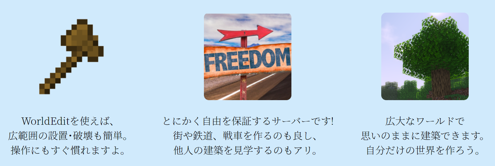

  

  

### Infomation

**祝8周年！これからもよろしくお願いします！**  
バージョンアップに伴う問題点を見つけた際は運営までご連絡ください。

#### 初めての方へ

**サーバーに参加する前に、[ルール](../01_Guide/%E3%83%AB%E3%83%BC%E3%83%AB.md)をお読みください。**  
知らずにルールに違反してBANされることがあります。  
  
また、[TOROServerを10倍楽しむ4つの事](../01_Guide/TOROServer%E3%82%9210%E5%80%8D%E6%A5%BD%E3%81%97%E3%82%804%E3%81%A4%E3%81%AE%E4%BA%8B.md)では、さらにこのサーバーで楽しむ方法が書いてあります。

#### これからの予定

サーバーバージョンのアップデート

#### 既知の不具合

特になし

#### サーバー稼働状況

  
※サーバーダウン時は「This server is offline...」と表示されます

#### サーバーリストへ1日1票投票をお願いします！

[Japan Minecraft Servers](https://minecraft.jp/servers/5bd3caeaa9b0bd41d200834f/vote)  
[MinePortal](https://mineportal.jp/servers/clrf23ltf0000iqnmhv3grfj3)

### サーバー更新履歴

* [25/11/07] TsukaKaju がModeratorに就任しました。
* [25/09/21] bagirukiがModeratorに就任しました。
* [25/04/21] MilkywayMCとベータ版提携開始。
* [25/04/01] エイプリルフール企画でDORO Serverへ1日限定アップデート。
* [24/10/20] 旧ワールドの公開を終了。
* [24/07/21] LhcrizmがModeratorに就任しました。
* [24/04/19] pizzaharumakiがModeratorに就任しました。
* [24/03/21] 第二フリー建築エリア「乾燥街」を開放。
* [24/01/16] MinePortalに登録。
* [24/01/07] サーバーのバージョンを1.20.4にアップデート。
* [24/01/07] Miclub、sakoppiがModeratorに就任しました。
* [23/09/16] 統合版に対応。
* [23/09/14] メインワールドを拡張。

* [23/05/13] サーバーのバージョンを1.19.4にアップデート。

* [22/10/24] サーバーのバージョンを1.19.2にアップデート。メインワールド変更。
* [22/02/12] 荒らし対策の強化、オリジナルカスタムサウンドパックを導入。
* [21/10/15] サーバーのバージョンを1.16.5にアップデート。
* [21/03/15] 大幅な運営体制の見直しを行いました。
* [21/02/19] 1.16.5のテストサーバーα版を公開しました。1.9以降のバージョンで接続できます。
* [21/01/30] Mainの編集履歴をリセットしました。
* [20/10/07] President\_EnderがSupporterに就任しました。
* [20/08/30] X6ZがSupporterからModeratorに昇格しました。
* [20/05/26] monocraftに登録
* [20/01/13] X6ZがSupporterに就任しました。
* [19/11/29] musashi299、yamazaki4321がSupporterに就任しました。
* [19/07/12] tokyock1522、hirotoooonがSupporterに就任しました。
* [19/06/25] barusuganがSupporterからModeratorに昇格しました。
* [19/06/04] mla26164がSupporterに就任しました。
* [19/06/01] Chiya\_RabbitがSupporterに就任しました。
* [19/03/20] Seibu\_YellowがSupporterからModeratorに昇格しました。barusuganがSupporterに就任しました。
* [19/02/19] メインワールドを18km四方に拡張。
* [19/02/03] メインサーバーが一日一回自動再起動するようになりました。
* [19/01/22] Spalits00がSupporterに就任しました。
* [19/01/05] 戦サーバーを試験開放
* [18/12/26] フラットでログが記録されない問題を修正
* [18/10/27] Japan Minecraft Serversに登録
* [18/10/20] PermissionsExを廃止し、LuckPermsを導入（メインサーバー）
* [18/10/18] #/spawnなどの入力でコマンドが実行される不具合を修正・Multiworldを廃止し、Multicerse-Coreを導入（メインサーバー）
* [18/10/06] sakoppi、Nitori\_ChocoがModeratorに就任しました。
* [18/05/21] サーバーのSSDを500GBに変更
* [18/03/11] Spigot1.12.2に更新（メイン・試験サーバー）
* [18/03/02] JukeBox・Image on Mapを導入しました（メインサーバー）
* [18/02/12] DiscordにMusicBOTを追加しました。
* [18/01/25] スポーン地点に各サーバーへのワープポータルが出来ました。
* [17/12/11] TORO ServerのYouTubeチャンネルとTwitterアカウントを公開しました。
* [17/12/09] サーバー機のメモリが32GBに増加しました。
* [17/12/03] 軍事サーバーのメインワールドを再生成しました（Largebiome→Normal）。
* [17/11/16] メインワールドの範囲を9km四方に拡張、ならびに軍事サーバーにWorldBorderを設定しました。
* [17/11/14] すべてのサーバーとDiscordの間でチャットの同期がされるようになりました。
* [17/11/09] サーバー間でチャットの同期がされるようになりました。
* [17/11/01] 軍事サーバーのDynmap（平面図のみ）を公開しました。
* [17/10/27] 軍事サーバー(ver1.10.2)を公開しました。
* [17/10/01] ⑨ワールドを廃止しました。
* [17/09/18] MCBansを導入しました。サーバーに入るための最低評価値は5です。
* [17/09/17] Dynmapにおいてtoro\_serverワールドのcaveマップを廃止しました。
* [17/09/17] toro\_serverワールドの範囲を6km四方に拡張し、ワールド移動限界を可視化しました。
* [17/09/17] Dynmapの保護範囲がデフォルトで表示されないよう変更しました。
* [17/09/16] ⑨ワールドのDynmapを平面図のみ復活させました。
* [17/09/14] サーバー機を変更しました。メモリ割り当てが14GBへ増加。
* [17/09/08] ルール・規約[?](https://seesaawiki.jp/toro_server/e/add?pagename=%a5%eb%a1%bc%a5%eb%a1%a6%b5%ac%cc%f3)ページを公開しました。
* [17/09/04] サーバーをHDDからSSDに移行しました。
* [17/08/30] Dynmapに保護の範囲が表示されるようになりました。
* [17/08/23] TORO Serverワールドにおいて、WEによる編集の履歴が残るようになりました。
* [17/08/14] DynmapをTORO Serverワールドにおいてのみ再稼働させました。⑨ワールドの再稼働は現在未定です。
* [17/08/13] [さばみそサーバー](http://seesaawiki.jp/sabamiso-craft/)と提携　TORO Serverと相互接続

* [17/07/26] 公式Wikiを開設
* [17/07/22] サーバーdiscord誕生
* [17/07/??] TORO Serverが自然発生的に誕生

### 人事異動

* [24/04/19] pizzaharumakiがModeratorに就任。
* [24/01/07] Miclub、sakoppiがModeratorに就任。
* [23/03/21] Micni43とAKAGI185をAdminへ昇格。
* [23/02/01] Shiro11\_とMidori\_1205をSupporterへ昇格。
* [23/01/16] sapporo\_salmonをSupporterからModeratorへ昇格。