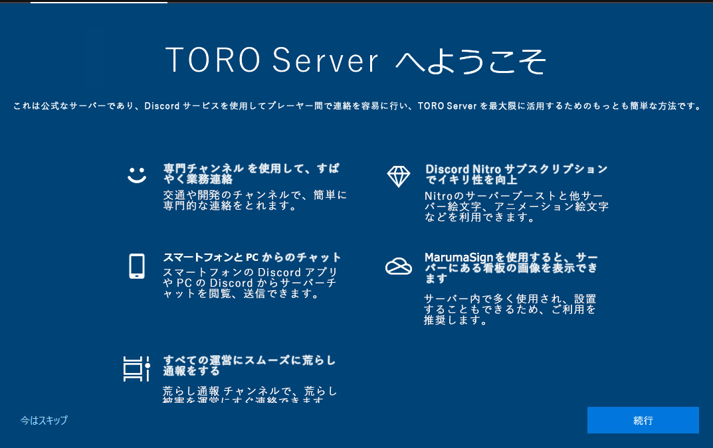

DiscordとはSkypeなどに代わるゲーマー向けチャットアプリです。  
テキストチャットだけでなくボイスチャットや音楽を聴くと言った事も可能です。  
  
TORO Serverでは公式のDiscordを開設しています。  
  
  
**13歳未満の人は保護者の同意があってもDiscordへの参加をお断りしています。大変申し訳ございません。**  
  
参加は[こちら](https://discord.gg/j7qKSPgSSt)  
  

#### 機能

##### リアクション

各書込毎に絵文字を通して反応を示せる。鯖内限定のオリジナル絵文字もあり、Discord Nitro(月額会員)になればアニメ絵文字や他鯖の絵文字も使えるようになる。ブロックされている人の書込には付けられない。

##### メンション

@[ID]を書込内に付けると、該当ID相手に通知が行く書込に出来る。やりすぎると大迷惑である。

##### ダイレクトメッセージ

非公開の会話を相手とできる。ブロックされていると出来ない。

##### ピン留め

書き込みを固定し、隔離された一覧から確認できる。Supporter以下は出来ない。重要事項から特殊発言までがピン留め一覧には並んでいる。  
~~サーバーチャットのピン留めはやべーやつらの迷言傑作選となっているので不用意に電車内などで見てはいけない。~~

### 各チャネル

#### 主要チャネル

##### サーバーニュース

鯖運営について広報があるときに書き込まれる。重大情報も此処。

##### 広告

鯖に関しての宣伝ができる。イベント開催、鉄道開通など。

##### 一般①

なんでもあり。他鯖でのgeneralに相当する。

##### 一般②

なんでもあり。話題の混線を防ぐために一般チャネルは2つ設けられている。

##### 無法地帯

初期状態では閲覧不能。申請などを行うことで閲覧・投稿が可能になる。  
表に出せないようなやべー話をする場所。

##### 画像

画像投稿スレッド。サーバー内で建築したものや風景などを気軽に共有できます。

##### メインサーバー

鯖チャットが覗ける。連携しているため、Discordからの書込も可能。

#### 分野別チャネル

話題の隔離ではなく交渉・披露の隔離である。趣味の話は一般でも良いとされる。

##### 交通

##### 都市開発

##### 研究室

##### To\_Do

自分のこれからの予定を書く。タスクの溜まりすぎには注意。

##### 軍事

軍事関係の交渉をする。

#### 運営への連絡

##### 荒らし通報

破壊行為の連絡は**特に**此処で行うこと。

##### 報告・通報

その他の違反疑い行動の連絡は此処で行う。

##### リクエスト

違反系以外で、運営にしてほしいことがあればここに書く。

##### 質問

何かを訊くと、運営が答えてくれる。時々運営以外が答えるときがある。