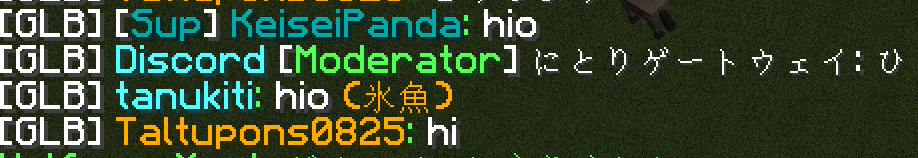

このページではTOROServerをさらに楽しむ方法を載せていきたいと思います。

### あいさつをしよう

あいさつは実はすごく大切です。
あいさつをすることで不審に思われないだけでなくその人の印象もたぶん良くなります。
「hio」(この鯖の独自のあいさつ)でなくても「hi」や「こん」でも全然オーケー！

### MarumaSignを導入してみよう

このサーバーでは[MarumaSign](https://github.com/TORO-Server/MarumaSign)と呼ばれるMODが良く使用されています。
このMODは看板を使用して画像を表示させることができるMODです。サーバー内にある町や道路に使用されています。
詳しくは[Mod：MarumaSign](../02_Plugins/Mod%EF%BC%9AMarumaSign.md)をご覧ください。

### WorldEditを使ってみよう

このサーバーには[WorldEdit](../02_Plugins/WorldEdit.md)が導入されています。
このプラグインは大規模建築を補助するもので簡単に大規模なブロック設置ができます。
詳しくは解説ページをご覧ください。

### Discordに参加してみよう

このサーバーには公式のDiscordサーバーがあります。
[Discord](./Discordについて.md)とはゲーマー向きに開発されたチャットアプリで、テキストチャットだけでなくボイスチャット、さらにはBotを利用して音楽を聴くこともできます。
Minecraftサーバーに参加していない状態でもこのDiscordを介せば話をすることもできます。
