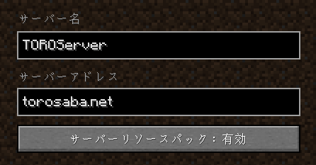
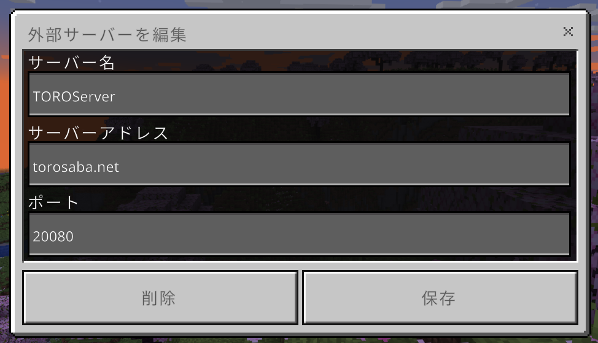

ルールを守らないとサーバーに参加できなくなります！必ず読んでください。  
  
サーバーアドレスはこのページのいちばん下にあります。  
  

### 勝手にこわさない

ほかの誰かが作ったものを勝手にこわしてはいけません。もしまちがえてこわしてしまった時はこっそり直すか、直せない場合はすぐに誰かに伝えて直してもらいましょう。  
また、誰かが作ったものに勝手に付け足すこともしてはいけません。

### 誰かが使っている土地に勝手に作らない

ワールドの中には誰かがこれから使うために整地している場所や町などがありますが、このような場所に勝手に作るのはやめましょう。ただしスポーン地点の周辺は空いているところであれば作ってもかまいません。

### チャットでけんかをしない

このサーバーは平和なサーバーを目指しているので、チャットで言い合いをしたり、いやな気持ちにさせる発言をするのはやめましょう。

### クロック回路をONのまま放置しない

このサーバーではレッドストーン回路も自由に作ることができますが、クロック回路を動かしたまま放置するとサーバーに負担がかかり、ほかの人に迷惑がかかるのでやめましょう。

### MOBをたくさん出したまま放置しない

MOB（ゾンビ・エンダードラゴン・ウィザーなど）をたくさん出したままにするのはやめましょう。必ずさいごに倒すか消してください。

### ほかのマインクラフトサーバーを宣伝・紹介しない

サーバーの宣伝や紹介を許してしまうとキリがなくなるので禁止しています。また、ほかのマインクラフトサーバーでTORO SERVERの名前を出したり、宣伝をすることも基本的には禁止しています。

### その他詳しいルール

* [利用規約](%E5%88%A9%E7%94%A8%E8%A6%8F%E7%B4%84.md)
* [空港・道路・鉄道を作る方へ](../03_Transportation/%E7%A9%BA%E6%B8%AF%E3%83%BB%E9%81%93%E8%B7%AF%E3%83%BB%E9%89%84%E9%81%93%E3%82%92%E4%BD%9C%E3%82%8B%E6%96%B9%E3%81%B8.md)

### バージョン

1.20.4  
1.20.x以外でも接続できますが、不具合が起こる可能性があります。

### サーバーアドレス

torosaba.net  
  

### 統合版で接続するときのポート番号

20080  
  

### はじめての人は

こちらも読んでね →　**[よくある質問](%E3%82%88%E3%81%8F%E3%81%82%E3%82%8B%E8%B3%AA%E5%95%8F.md)**