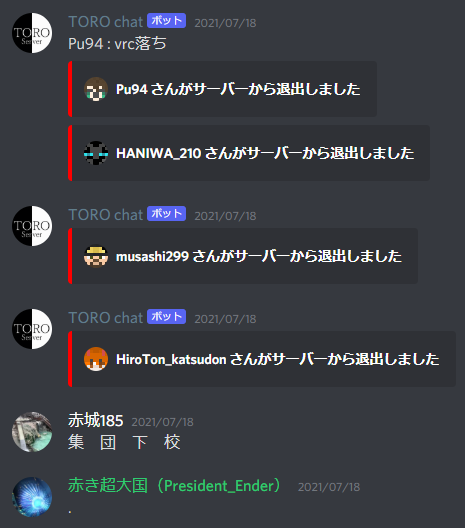
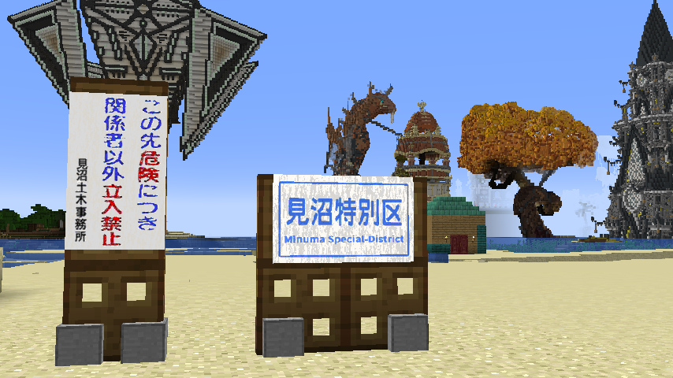
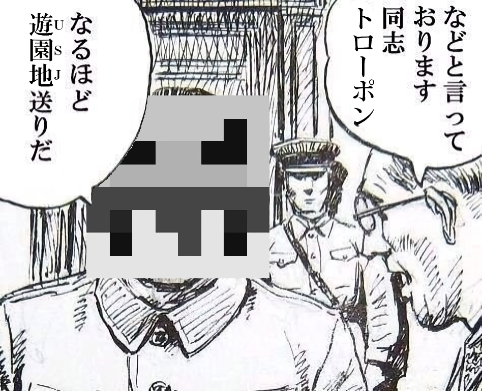

当頁ではこの鯖でよく使われている用語を解説していきたいと思います。  
  

目次

* [用語](#content_1)
  + [hio/ひお](#content_1_1)
    - [派生形](#content_1_1_1)
  + [じゃいる、jail](#content_1_2)
    - [USJ](#content_1_2_2)
    - [KKJ](#content_1_2_3)
  + [ウーパールーパー](#content_1_3)
    - [ハムスター](#content_1_3_4)
  + [Crime (クライム)、栗目 (くりめ)](#content_1_4)
    - [使用例](#content_1_4_5)
  + [.](#content_1_5)
  + [自決](#content_1_6)
  + [タスク](#content_1_7)
  + [試乗会](#content_1_8)
  + [WE事故](#content_1_9)
  + [カーブ](#content_1_10)
    - [直角カーブ](#content_1_10_6)
  + [キュートグリル/Cute gril](#content_1_11)
  + [集団下校](#content_1_12)
  + [世界政府](#content_1_13)
  + [匠簡易爆弾(別名:お掃除ボム)](#content_1_14)
  + [水草事件](#content_1_15)
    - [水草（スラング）](#content_1_15_7)
  + [ミヌマー](#content_1_16)
  + [食券](#content_1_17)
  + [トロコースト](#content_1_18)
* [人物](#content_2)
  + [トローポン](#content_2_19)
  + [夜の帝王](#content_2_20)
  + [ひで](#content_2_21)
  + [すし](#content_2_22)
  + [たぬきち](#content_2_23)
  + [ときょっく](#content_2_24)
  + [しゃけ](#content_2_25)
  + [木花エル/みくに](#content_2_26)
  + [埼玉県人/見沼](#content_2_27)
  + [まるまさ](#content_2_28)
  + [エメ](#content_2_29)
  + [水草](#content_2_30)

### 用語

#### hio/ひお

このサーバーで入室時によく使われる挨拶。  
派生にrehioがある。こちらはただいまと言う意味を持つ。

##### 派生形

rehio/rehi -> ただいま/おかえり  
hip -> やあ  
jop -> やあ  
tr -> 行ってらっしゃい  
bio -> じゃあの  
ビェ -> bye  
他にもpoやepoなどが存在する。これはもはや何から派生したのか見当もつかない。

#### じゃいる、jail

1. 監獄に収容されること
2. 監獄自体のこと

何かにつけてじゃいると言われる。基本的に「鯖では許されるが娑婆では許されない」ことが発動条件とみてよい。  
~~jailは本当はジェイルと発音するのは秘密~~

##### USJ

ウーパールーパーサクサクじゃいるの略。現在、メインで使用されているJailを指す。表向きでは鯖営の遊園地である。  
みんなは迷惑な行為をしてここに入るようなことはしないようにね！ｗ

##### KKJ

初出はSpalits00。([chat](https://discordapp.com/channels/337838758441517057/379321024598114314/535048169390735370))  
Nitori (だったアカウント)によると、「きたない・くさい・じゃいる」の略とのこと。  
現在では:kkj:として:poop:が:jail:されるアニメーション絵文字がdiscord鯖に用意されている。  
(川越観光自動車は関係ないし北九州空港も関係ない。)

#### ウーパールーパー

tokyock1522が提携鯖SabaMisoCraftで「ウーパールーパーって食べれるっけ」と発言したのが始まり。  
これのせいでTOROのjailはウーパールーパーのから揚げを模したデザインになってしまったし、ウーパールーパーも食材扱いされるようになってしまった。栗目。

##### ハムスター

ウーパールーパーの発言の後にMiclub(埼玉県人，見沼)が「ハムスターが美味しそうなのは分かるけどウーパールーパーは理解できない」という発言もしたためハムスターも食材となってしまった。~~ゲテモノ食いしかいねえなこの鯖。~~  
なおサーバーリソースパックによりTORO鯖でのエンダーマイトはハムスターになっている。

#### Crime (クライム)、栗目 (くりめ)

英語で犯罪という意味。栗目はそれをそのままローマ字読みしたものである。  
「栗目」になると汎用性が非常に上昇し、なんでもかんでも栗目栗目と言うようになってしまう。

##### 使用例

* 栗目する

そのまんま。罪的な行為をするという意味になる。

* 栗目だ

これはひどいという意味になる。

* 栗目な〇〇

おかしな、許されざるみたいな感じの意味になる。

* 〇〇は栗目?

○○をするのはヤバい?や○○をしても大丈夫ですか?といった感じの意味になる。

* 大栗目、激栗目、SuperCrimeなど

ものすごく栗目なので、なんか修飾子付けて大規模にしてみました。みたいな安直な栗目。

#### .

意味深なことを言った時に使う。　例：「熱いカルピスが飲みたい。」 → 「.」  
また返答し難い発言への返答としても使われる。　例：「鯖主さんってダイオウグソクムシじゃないんですか？」 → 「.」  
ニュアンスとしては「……」のごく一瞬、カジュアルにしたもの。  
多用すると語彙力が無くなってしまうので注意。  
連投しすぎにも注意。

#### 自決

自殺のこと...ではなく自己解決の略である。決して自殺のことではない。

#### タスク

やらなければいけないこと、こなさなければいけないこと。  
山のように溜まっていく…  
タスクの作り過ぎには注意

#### 試乗会

1. 鉄道マンが新路線を開通させた際に人を呼び集めて突発的に開催する合同乗車会のこと
2. 既存の路線を乗り回ること。

人の多い時間帯では10両以上になることも多く、その際は路線内の停止機構が意味をなさなくなる。

#### WE事故

[WorldEdit](../02_Plugins/WorldEdit.md)を使って行われた意図しない大規模な地形改変に対して使われる言葉。やりすぎると[レベル](%E5%95%8F%E9%A1%8C%E8%A1%8C%E5%8B%95%E3%82%92%E8%B5%B7%E3%81%93%E3%81%97%E3%81%9F%E3%83%97%E3%83%AC%E3%82%A4%E3%83%A4%E3%83%BC.md)が貯まる。

#### カーブ

曲線の事。鯖では道路・鉄道の曲線に対し充てられる。カーブのクオリティが高いことを「カーブがエロい」と言う。  
これまで技術者以外はhcyl(円生成)を使用していたが、最近になって木の斧や数学を用いてカーブを描く人が現れだした。  
⇒とろぽん、すし

##### 直角カーブ

鉄道などで曲がるときに直角に曲がる。前身鯖である⑨鯖の名物だったらしい。  
現実なら脱線寸前で、インフラを極めたければまず避けるべき陋習である。

#### キュートグリル/Cute gril

キュートなグリルである。元はt0206が「cute girl」と打とうとしたところ「gril」と[誤字](https://discord.com/channels/337838758441517057/379321024598114314/864889466212450355)をしてなったもの。  
グリルの正しい綴りは「grill」であるが気にしてはいけない。  

#### 集団下校

誰か一人が落ちると続けて全員が一気に落ちること。もちろん事前の打ち合わせはない。彼らは集団生活を好むようだ。  
ちなみに「集団下校」の初出は[ここ](https://discord.com/channels/337838758441517057/379321024598114314/860520669816160286)  

#### 世界政府

スポーンに首都を置く組織。独自の軍事組織を持ち世界の均衡を保っている？都道府県及び国と地域が参加する事が出来、代表都市に支部が置かれ、その地域に世界政府軍を駐留させる事が出来る。都道府県と同様に特に権限は持っていない。  
現在の加盟地域は桔梗国、骨董品帝国、東麗県、武蔵県となっている。詳しくは[世界政府（WFG）](../04_World_and_Cities/%E4%B8%96%E7%95%8C%E6%94%BF%E5%BA%9C%EF%BC%88WFG%EF%BC%89.md)へ  

#### 匠簡易爆弾(別名:お掃除ボム)

人体感知ボムの開発中に作られた爆発威力127のクリーパーのスポーンエッグ  
もともと匠簡易爆弾はディスペンサーの中に入れて地雷のように使う予定だったが  
軍事勢以外にも MarumasaUSB が匠簡易爆弾を配布した結果  
いまでは建築中に邪魔なmobや アイテムを消去するのに使われている  
HAL重工業で初めての戦争以外に使われるようになった兵器  
いまでも現役で匠簡易爆弾は使われている  
いつのまにか お掃除ボム と呼ばれるようになった

#### 水草事件

2023年6月18日に起こったWE事故。  
**//rep seagrass 0**に0を付け忘れ、**//rep seagrass**を実行してしまったのが要因。  
広範囲が水草に置き換えられたとされ、33分に渡ってサーバーが停止した。  
また、調査が行われたが水草は発見されず、結局undoを実行したために何とかなったという結論に至った。  
この事件の後に、この事件を忘れず今後の教訓とするため、被害地には**「水草記念公園」**が作られたり、**「水草祭り」**が行われるなど各地で活気を増している。  
一連の騒動による経済効果は、3兆円から10兆円にまで及ぶとされている。  
> ただし一応WE事故であるため、必要以上にいじったり掘り返したりはしないようにしましょう。

##### 水草（スラング）

この事件の後に使用されるようになった、ネットスラングの**「草」**を水草になぞらえてできた言葉。  
discordでの使用率が高く、基本的には**:seagrass:**という絵文字が使われる。  
また、そのまま「水草」と入力するもの、「草」を言い直す形（「草...いや水草だった」）のような発言も確認されている。  
  
⇒水草

#### ミヌマー

もしかしなくても: 埼玉県人 or [見沼](https://seesaawiki.jp/toro_server/d/%bc%ab%bc%a3%c2%ce%b0%ec%cd%f7#見沼)  
  
鯖内のどこかにあると言われている秘境とその住民たち。   
その生態は謎に包まれており、「成人式ではバンジージャンプが行われている」「たった2人のミヌマー兵に軽傷を負わせるのに、7000余の兵器が破壊された」といった噂が絶えない。

#### 食券

AdminやModeratorによって行われる謎の行為。その全容は謎に包まれており、無実の運営ユーザーなどをJailしたり一時BANしたりといった噂が絶えない。  
由来はsapporo\_salmonによる誤字「食券乱用」から。

#### トロコースト

2025年7月に発生した同時多発Discordアカウント停止騒動のこと。  
TORO鯖の常連メンバーの数人が何度もDiscordからアカウントのBANがされた。

### 人物

#### トローポン

我らがトロサーバを生み出した創造神であり、偉大なる同志。  
~~逆らうと遊園地(USJ)送りの憂き目に~~  
ダイオウグソクムシと餃子の王将をこよなく愛する一般建築勢。最近は競馬で爆死する様子も度々見られる。  
→toropon  

#### 夜の帝王

( ◠‿◠ )  
あるAdminを指す。彼がサーバーに来ると深夜を実感するという人もいる。  
性別、年齢、出身地など多くが謎に包まれている存在であり、そのためロシア出身だとか在住だとか、はたまた女の子だとかというような説が提唱されている。  
午前2時にDiscordのチャットに入っているとクソデカ音量で「蛍の光」を流して去っていくなど、行動面でも謎が多い。  
→barusugan

#### ひで

英蔵、HIDE、hidezoh。  
TOROのプロヒカマー。建築力が高く、鉄道での覇権を狙っている。八王子市民。  
2023年5月5日付で引退。その後、2023年7月9日に復帰している。  
→Hidezou\_mania

#### すし

某マイクラサーバーから流れ着いた渡来人。  
非常にクオリティの高い鉄道建築が持ち味で、TORO SERVERの鉄道建築に大きな変革をもたらした存在。  
→X6Z

#### たぬきち

たぬきち、たぬき、相模人，紗さん(うすぎぬさん)。  
鯖の混乱の中でAdminにまで上り詰めたやり手。旧鯖でのtokyockとの制作都市「燕谷」は完成度が高く、多くの観光客を呼び寄せた。  
金を賭けずに馬を当てる脱法競馬の第一人者でもある。また「FRIDAY-NIGHT NEW」の司会をしている。  
→tanuck1522

#### ときょっく

ときょ。たぬきちと燕谷を共作していた。現在は受験の為Discordにしか来ない。ウーパールーパーが主食。  
→tokyock1522

#### しゃけ

さっぽろ、高槻の星、業務スーパー親善大使。永年Supporterとかネタにされていたが最近になってModeratorになった。  
よくイジられて可哀そうなことになっているが、サーバーの紹介動画を作ってくれるなど、TOROサーバーへの貢献度はかなり高い。  
→sapporo\_salmon

#### 木花エル/みくに

成田の酒カス。自称永遠の16歳の美少女のようだが中身はきっとおっさんである。  
かつて提携鯖のSabaMisoCraftを運営していたほか、他鯖との人材交流を取り持ったりして、なんだかんだ貢献しているAdminである。  
→Kibana262

#### 埼玉県人/見沼

見沼のやべーやつ。ハムスターをはじめとするゲテモノを食べる。  
建築力はピカイチであり、鯖内に変態装飾建築を見かけたら此奴作を疑うべし。旧名義がある。  
このサーバーのハムスター(エンダーマイト)の声は彼の声に差し替えられている。最早TORO鯖内において彼はフリー素材となっている。  
→Miclub、鶏ササミガム

#### まるまさ

TOROの開発担当。USBが好き過ぎてUSBになってしまった。  
彼ほどの技術力と行動力を持つ者がいないので、プラグイン等のサーバー業務の大半を請け負っている。過労。  
☆開発協力者募集中☆  
→MarumasaUSB

#### エメ

八王子で一番優れたマインクラフター。天才。奇才。18才。  
現在は行方不明になっていない。  
→\_EME\_Tech @風吹けばエメ

#### 水草

旧PVC\_tube。上記の水草事件を起こしたためこう呼ばれるようになった。  
本人もこの事実を受け入れ、discordの名前やMCIDまで変更して楽しんでいる様子。  
また、優れた鉄道建設の技術を持ち、燕谷高速鉄道を保有している。  
→Mizukusa\_PVCtube @水草(PVC\_tube)