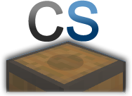

   
当サーバーでは経済プラグインが導入されており、   
住民の皆様が簡単にお店を出店できるようになっております。   
ですが、『作り方が分からない』といった声が聞こえてきましたので、   
作り方を少しだけですが紹介させていただきます。   

### お店の作り方(準備)

お店を作るには複数のアイテムを準備する必要があります。   
とはいいましても、対したものではありません。   
最低限必要な物は・・・・   
チェスト+看板+売りたいアイテムです。

|  |  |
| --- | --- |
| アイテム | 売りたい理由 |
| チェスト | 売りたい物・買い取ったものを収納するために必要です。 |
| 看板 | 看板に必要事項を記入してお店を開くシステムのため |
| 売りたいアイテム | 売りたいアイテムが入っていない状態ですと、売り切れといわれてしまいます。 |
|  | なお、買取ショップでしたら必要ありません。 |

なお、上の場合は販売をするのに最低限な例です。   
  
買取を受け付けるお店の場合は、   
チェスト+看板+ある程度のお金です。   
  
なお販売と買取を同じ看板で行うこともできます。

### お店の作り方(設置・設定)

続きましては、実際にチェストショップを設置・設定していきたいとおもいます。   
ここからは手順を簡単に説明します。

1. アイテムのIDを調べます。
2. チェストを設置します。
3. チェストの前に看板を貼り付けます。
4. 看板に必要事項を記入します。

#### 必要事項

お店を作るには以下の必要事項が必要です。

1. アイテムIDまたはアイテム名(英語)
2. 売りたい・買い取りたい価格
3. 一度に取引する数

#### アイテムIDの調べ方

アイテムIDを調べたいアイテムを持った状態で、コマンド**/iinfo**を実行します。   
実行しましたら、アイテムIDとアイテム名（英語）が出てきますので、控えておいてください。(**F3+H**でも確認できます)

#### 看板に実際に記入してみよう

|  |  |
| --- | --- |
| 看板１行目 | 何も書かない |
| 看板２行目 | １度に取引する数 |
| 看板３行目 | (下を参照) |
| 看板４行目 | 売買するアイテムID |

##### 看板3行目について解説

* 3行目の書き方で3つのスタイルが存在します

|  |  |
| --- | --- |
| 形式 | 書き方 |
| 販売だけ形式 | B <金額> |
| 買取だけ形式 | S <金額> |
| 販売と買取 | B <買取価格>:<販売価格> S |

と看板に入力しただくとお店が完成します   
看板への記載例として、一例を紹介します。

|  |
| --- |
| 空白 |
| 1 |
| B 10 |
| Brick |

  
なお、わからないことがございましたらお近くの運営関係者や他の住民の方へお聞きいただけると幸いです。