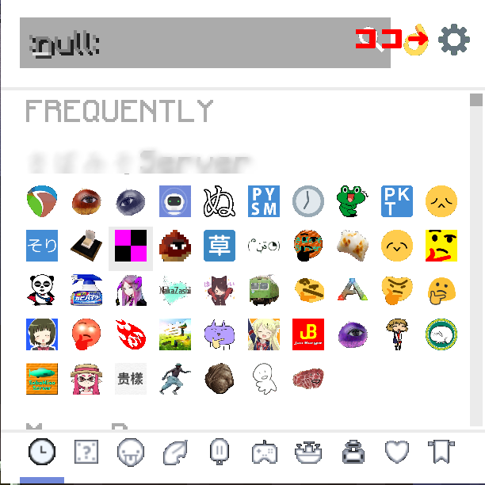
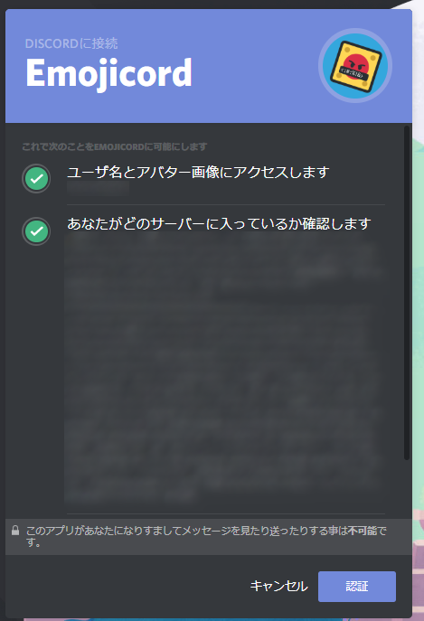
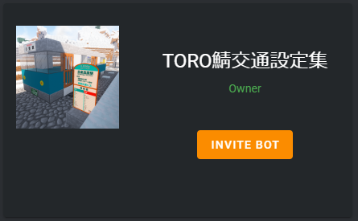
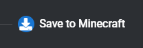

当MODのサポート、配布は終了した模様です。(一応解説は残しておきます)  
Emojicordは、Discordの絵文字をMinecraftのチャット上に表示するModです  
IntelInputとの併用はできません。ご注意ください。  
(現在リリースされたばかりなので不安定です)  
最近サイトのUIが変更となった模様です。情報反映はしばらくお待ちください。  
  

---

* 使い方

チャットを開いて右端に表示されてる絵文字をクリックすると絵文字一覧が出ます。  
そこから選択するとチャットに入力されます。  
  

---

* 絵文字の追加方法

絵文字一覧の歯車マークを押します  
  
  
Discordのアカウントに紐づけします。  
  
  
INVITE BOTをクリックし、Botをサーバーに呼びます。(自分が管理者じゃない場合は管理者に入れてもらいましょう)  
  
  
招待後はサーバー一覧の上にあるChoose Emojiをクリックしてください、ここから使わない絵文字の無効化等できます。  
  
  
最後にその右側のSave to Minecraftを選んでください。  
  
  
そしてここをクリックしましょう。  
  
  
Minecraftに戻りこのような画面が出ていれば追加成功です。  
  
  
**↓配布先はこちら↓**  
[https://www.curseforge.com/minecraft/mc-mods/emoji...](https://www.curseforge.com/minecraft/mc-mods/emojicord)