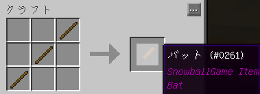
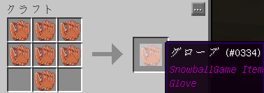

[野球プラグインに対応したリソースパック](https://nanjminecraft.wiki.fc2.com/jump/https/www.dropbox.com%2Fs%2Ffydlbtpfunqnzhr%2FSnowballGame_Resourcepacks_1.0.zip%3Fdl%3D1)  
[プラグイン公式フォーラム(日本語)](https://nanjminecraft.wiki.fc2.com/jump/http/forum.minecraftuser.jp%2Fviewtopic.php%3Ff%3D38%26t%3D33777)  
[プラグイン公式ページ（英語)](https://nanjminecraft.wiki.fc2.com/jump/https/www.spigotmc.org%2Fresources%2Fsnowballgame.35339%2F)  
  

### バット

  
  
/sbg get batにより入手可能。投げられたボールを狙って放つとボールを打ち返すことができる。打球の方向や強さは、ボールとミートカーソルの位置関係で決定される  
また、打球の強さは弓（バット）の引き絞り具合によっても変わる。ほんの少しだけ引いて上手く打てば、バントをすることも可能。

#### スイング軌道の変更

バットの名前を変えることによってスイングの軌道を変更できる

|  |  |  |  |
| --- | --- | --- | --- |
| UPPER | 高め(+0.3) | 普通より高く打球が上がる | (バットを持って)/rename UPPER |
| DOWN | 低め(-0.3) | 打球が上がりにくい | (バットを持って)/rename UPPER |

### グローブ

  
  
/sbg get gloveにより入手可能。捕球、投球動作の変更が可能

#### 捕球

アイテム化していないボールを近くで右クリックすることにより捕球できる。遠ければ遠いほど捕球を失敗する可能性が高い。

#### 投球動作の変更

グローブの名前を変えることで投球動作を変更できる

|  |  |  |  |
| --- | --- | --- | --- |
| SIDE | サイドスロー | プレイヤの腰辺りからの投球が可能になる。ボールの出所はデフォルトよりも利き手寄りとなる。 | (グローブを持って)/rename SIDE |
| SUBMARINE | アンダースロー | プレイヤの足元辺りからの投球が可能になる。 | (グローブを持って)/rename SUBMARINE |

### ボール

/sbg get ballにより入手可能。反発係数を変更できるほか、変化球が7種類ある。

#### 反発係数

/sbg get ball 〇〇 の〇〇部分によって反発係数が決まる。未記入の場合は標準の反発係数となる  

|  |  |
| --- | --- |
| highest | とても飛ぶ |
| higher | 飛びやすい |
| -- | 標準 |
| lower | 飛びにくい |
| lowest | とても飛びにくい |

#### 球種

ボールを持った状態で /rename <球種>というコマンドを実行することで球種を変更できる（<>は不要）  

|  |  |  |
| --- | --- | --- |
| 付ける名前 | 変化球 | 解説 |
| Fast | 速球 | まっすぐ飛ぶ速い（1.1倍速）球（たまに）バットを押し込む |
| Slider | スライダー | オフハンド側に曲がる球 |
| Curve | カーブ | オフハンド側に曲がりつつ落ちる球すこしおそい |
| Folk | フォーク | 下に落ちる球 |
| Shuuto | シュート | メインハンド側に曲がる球 |
| Sinker | シンカー | メインハンド側に曲がりつつ落ちる球すこしおそい |