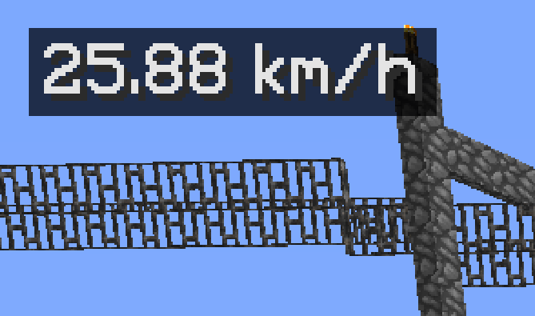

当MODはVer1.13以降に対応していません。そのため今後TORO Serverでの利用は非推奨です。  
SqueedometerMODは、Minecraft内での移動速度を表示することができるMODです。  
鉄道や自動車などを使う際に速度が気になる！って時に便利です。  
  
対応バージョンは1.6〜1.12まであります。  

* 使い方

入れれば勝手にスピードメーターが表示されます。  

* 設定

Pキーを押すと設定画面が出せます。  
  
  
この緑の□マークが現在スピードメーターが表示されている位置です。灰色の□マークをクリックすることで変更できます。  
  
  
このUnitsをクリックすると速度の単位が変えれます。  
ブロック/毎秒、メートル/毎秒、キロメートル/毎時、マイル/毎時、ブロック/毎tickから選択できます。  
  

* ダウンロード

[https://www.curseforge.com/minecraft/mc-mods/squee...](https://www.curseforge.com/minecraft/mc-mods/squeedometer)