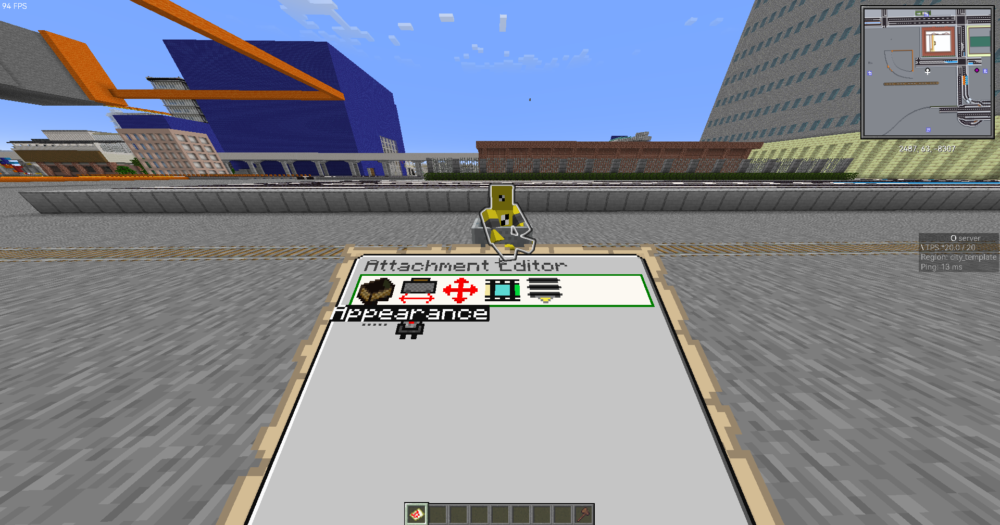
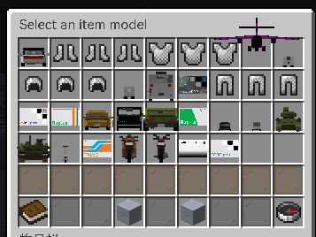

TrainCarts、それは~~鉄道業界の革命児~~トロッコの振る舞いを変更し、便利なユーティリティーを提供するプラグインである。  
  

### 概要

早い話、線路の下に  
[+train]  
property  
speedlimit  
数字  
と書いた看板を置けば数字分トロッコの速度を調整できます。0.5が通常速度です。

### 目次

* [概要](#content_1)
* [目次](#content_2)
* [特殊な物理法則](#content_3)
* [看板による制御](#content_4)
  + [看板の種類](#content_4_1)
  + [命令](#content_4_2)
    - [announce](#content_4_2_1)
    - [property](#content_4_2_2)
    - [launcher [数字:任意]](#content_4_2_3)
    - [skip](#content_4_2_4)
    - [station](#content_4_2_5)
    - [switcher](#content_4_2_6)
  + [条件分岐](#content_4_3)
    - [条件文](#content_4_3_7)
    - [応用](#content_4_3_8)
  + [方向一覧](#content_4_4)
* [Attachment](#content_5)
  + [使いたい！](#content_5_5)
  + [運営向けガイド](#content_5_6)
    - [0.はじめに](#content_5_6_9)
    - [1-1.マイクラ内の建築物を使う](#content_5_6_10)
    - [1-2.CustomModelDataを使う](#content_5_6_11)
    - [2.トロッコに見た目を設定](#content_5_6_12)
    - [3-1.先程1-1を行った場合](#content_5_6_13)
    - [3-2.先程1-2を行った場合](#content_5_6_14)
    - [4.当たり判定と向き/位置の調整](#content_5_6_15)
    - [5.テンプレート化](#content_5_6_16)
* [コマンド](#content_6)

### 特殊な物理法則

* ハシゴがレールと同じように扱えます。
* 感圧板が平面交差になります。

### 看板による制御

TrainCartsでは、看板によりトロッコを制御することが可能です。  
レールの下のブロックに向けて看板が設置してあるか、レールの下のブロックの下に看板があればOKです。  
基本的な構文は以下の通りです。  

```
看板の種類
命令
引数1
引数2
```

#### 看板の種類

* [+train]：常に有効です。
* [train]：レッドストーン信号が供給されている時に有効です。
* [!train]：レッドストーン信号が供給されている時に無効です。

詳しくは[こちら](https://wiki.traincarts.net/p/TrainCarts/Signs)をご確認ください（英語）

#### 命令

##### announce

annouceは、乗客のチャットにメッセージを送ります。

| 名前 | 構文 | 内容 |
| --- | --- | --- |
| 引数1 | [メッセージ] | アナウンス内容 |
| 引数2 | [メッセージ] | 任意、アナウンス内容(引数1に結合される) |

##### property

トロッコのプロパティを設定します

| プロパティ名 | 設定可能な値 | 説明 |
| --- | --- | --- |
| maxspeed | 速度(kmh, mph等) | トロッコの最高速度を設定します。 |
| speedlimit |
| slowdown | true(はい) 又は false(いいえ) | トロッコは減速するか |
| addtag | [タグ名] | トロッコにタグを追加します（条件分岐については後述） |
| remtag | [タグ名] | トロッコからタグを削除します（条件分岐については後述） |

詳しくは[こちら](https://wiki.traincarts.net/p/TrainCarts/Signs/Property)をご確認ください（英語）

| 名前 | 構文 | 内容 |
| --- | --- | --- |
| 引数1 | <プロパティ名> |  |
| 引数2 | <設定する値> |  |

##### launcher [数字:任意]

トロッコの速度を変更します  
launcher 50のように任意の数字を追加すると50mかけて徐々に指定の速度まで加速します。

| 名前 | 構文 | 内容 |
| --- | --- | --- |
| 引数1 | <数字kmh or 数字mph or 数字> | 速度をnキロメートル毎時、nマイル毎時、nブロック毎ティックとして指定します |
| 引数2 | [continue or north or south or west or east or その他] | 任意、発射方向を設定します |

##### skip

看板をスキップします。構文は「skip (<数字A> <数字B>) 又は <数字B>」です。例：skip 7、skip 33 4  
Bが7だとすると、この先の看板7個をスキップします。Aが33、Bが4だとするとこの先看板33個を実行した後、4個の看板をスキップします。  
数字Aは正常に実行する看板の数、Bはその後スキップする看板の数です。

| 名前 | 構文 | 内容 |
| --- | --- | --- |
| 引数1 | [条件分岐] | 任意、条件分岐については後述 |
| 引数2 | [条件分岐] | 任意、条件分岐については後述。指定された場合、引数1「なおかつ」引数2 といった条件になる |

##### station

駅を設定します。トロッコは指定秒、駅に停車します。

| 名前 | 構文 | 内容 |
| --- | --- | --- |
| 引数1 | <数字> | 数字秒、駅に停車します。 |
| 引数2 | [continue or north or south or west or east or その他] | 任意、発射方向を設定します |

##### switcher

レールやレバーを操ります。  
引数は方向と条件文を書くことができ、例えば  

```
[+train]
switcher
f:t@local
r:default
```

なら、localという名前のタグを持ったトロッコが来た時は直進し、そうでなければ右に曲がります。  
(詳しくは「方向一覧」を参照)  
注意点は、看板の方向にのみ作用することです。  
  
3方向以上を設定したい？ご安心ください、方向:条件文の形式で書けばメインの看板の下に続けて記述できます。

#### 条件分岐

skipなどの命令では、条件分岐が使用できます。  
これにより、各駅停車・快速 の列車種別などを実現できます。

##### 条件文

| 条件文 | 内容 |
| --- | --- |
| 「passenger」 | 乗客が乗っている時に有効 |
| 「random」 | 50%の確率で有効 |
| 「rand@数字」 | 数字の確率で有効。例:数字が0.78なら、78%の確率で有効 |
| 「ph@アイテム名」 | 乗客の誰かがアイテム名のアイテムを持っているなら有効 |
|  |  |
| 「!条件文」 | 「条件文」が無効なら有効 |
| 「条件文A;条件文B」 | 条件文Aと条件文Bが有効なら有効 |
|  |  |
| 「t@タグ名」 | トロッコにタグ名のタグが付いていたら有効 |
| 「\*」 | 何かしらのタグを持っていれば有効になります |
| 「!タグ名」 | タグ名のタグを持っていない場合に有効になります |
| 「\*文字列」 | 持っているタグ名が文字列で終わる場合に有効になります |
| 「文字列\*」 | 持っているタグ名が文字列で始まる場合に有効になります |
| 「\*文字列\*」 | 持っているタグ名が文字列を含む場合に有効になります |

詳しくは[こちら](https://wiki.traincarts.net/p/TrainCarts/Signs/Statements)をご確認ください（英語版）  
補足：当てはまらない場合、普通の文字列もタグのセレクタとして扱えます

##### 応用

```
- !ph@dirt;*sapporo*salmon*：トロッコに乗っている人の誰かが土を持っていて、トロッコが文字列"sapporo"と文字列"salmon"を含むタグを持っている時に有効
- shinkaisoku;fortakatsuki：shinkaisokuタグが付いていてなおかつfortakatsukiタグが付いている時に有効
```

#### 方向一覧

F3のデバッグ画面と照らし合わせると分かりやすい。

| 4方位 | 省略形 | 意味 |
| --- | --- | --- |
| south | s | 南 |
| north | n | 北 |
| east | e | 東 |
| west | w | 西 |
| 相対方位 | 省略形 | 意味 |
| forward | f | 前 |
| back | b | 後ろ |
| left | l | 左 |
| right | r | 右 |

### Attachment

Attachment機能はトロッコ以外の乗り物で線路上を走行できる機能です。  
レール上で動くのでバスや飛行機等でも動きます。

|  |  |
| --- | --- |
|  |  |

#### 使いたい！

Discordの[#交通](https://discord.com/channels/337838758441517057/374173231797501952)チャンネルで質問してみるか、[#リクエスト](https://discord.com/channels/337838758441517057/1054828312024846486)チャンネルに投げてみてください。

#### 運営向けガイド

マイクラ内の建築物からの場合はしゃけさんが作った動画が参考になります。

##### 0.はじめに

偶にブロックエンティティがバグで残ることがあります。落ち着いて//cut -eを実行してください。  
ここからは マイクラ内の建築物を使う(1-1)とCustomModelDataを使う(1-2) で分岐します。

##### 1-1.マイクラ内の建築物を使う

まずは動かす対象の制作物をWorldEditで選択してコピーしてください。  
その後に以下のコマンドで構造物データをサーバー側に保存してください。  

```
//schematic save ここに半角英数字で簡単な名称※メモして！
```

これでモデルは確定です。2番に合流してください。

##### 1-2.CustomModelDataを使う

TORO Serverのサーバーリソースパックに含まれている場合はそのまま、含まれていない場合はユーザーにBlockbenchやらでモデリングしてもらって受け取ったbbmodelとjsonをリソパのレポにプッシュしてタグ切ってください。  
これで準備できました。2番に合流してください。

##### 2.トロッコに見た目を設定

以下のコマンドでattachmentエディタを入手  

```
/train attachment
```

レールにトロッコを配置してattachmentエディタを持った状態で視点を合わせる。  
視点を下げるとGUIが出てくるはずです。（ホイールを回せば解除できます）  
  
まずはApearanceという文字が出た状態でスペースキーを押します。この状態でAキーとDキーを押せば種類が変更できます。

##### 3-1.先程1-1を行った場合

1. 先程の手段でSCHEMATICに種類を合わせます。
2. Sキーで<No Schematic>となっているところにカーソルを合わせてスペースキーを押す。
3. 金床のGUIが出てくるのでschematicを保存するときにメモした文字を入力して改名。

これでモデルは設定できました。SHIFTキーで戻りましょう。

##### 3-2.先程1-2を行った場合

1. 先程の手段でITEMに種類を合わせます。
2. Sキーでカボチャのアイコンになっているところでスペースキーを押す。
3. あとは好きなモデルを選んでクリックする。

  
これでモデルは設定できました。SHIFTキーで戻りましょう。

##### 4.当たり判定と向き/位置の調整

DキーでPysicalにカーソルを合わせる。スペースで入る。  
ここは制作者の裁量なので、Wikiでは名前・意味・おすすめの値を解説しておく。

| ラベル | 意味 | 値 |
| --- | --- | --- |
| Cart Length | 1両の長さ、他のトロッコとの接続位置を意味する。 | 動かすとガイドが出てくるので車両の長さに合うように設定しておけばOK。 |
| Wheel Distance |  | カーブ時の傾き。1両の長さと同じくらいで自然に曲がれる。 |
| WHeel Offset | Wheel Distanceが車両の中央からどれだけズレているか。通常使わない。 | 先頭車両などで、余計な部分がある時にズラす。 |

SHIFTキーで戻り、DキーでPositionにカーソルを合わせスペースで入る。

| ラベル | 意味 | 値 |
| --- | --- | --- |
| Pos.X | X軸の移動 |  |
| Pos.Y | Y軸〃 | 飛行機やバス、モノレール等でズラしたい時 |
| Pos.Z | Z軸〃 |  |
| Pitch | 前のめり/後ろのめり |  |
| Yaw | 左右で回す |  |
| Roll | 左右で倒す |  |
| Size X/Y/Z | 大きさ ※Schematic限定！ | 比率を変える時 |

##### 5.テンプレート化

最後に、トロッコにカーソルを合わせて以下のコマンドで保存。  

```
/train save 半角英数字の識別名
```

*The train was saved as 半角英数字の識別名.*と出てくればOK。  
スポーンさせるときは以下のTrainCarts看板を使う。これで完了です。お疲れ様でした。

|  |
| --- |
| [train] |
| spawn |
| 半角英数字の識別名 |

### コマンド

/train 又は /cart が使用できます  

| 構文 | 内容 |
| --- | --- |
| /train i | トロッコの情報を表示します |
| /train info |
| /train maxspeed | トロッコの最高速度を設定します |
| /train tags add <タグ名> | トロッコにタグを追加します |