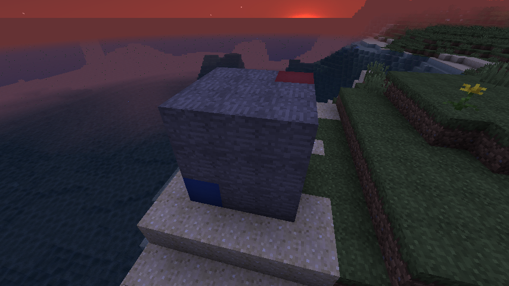

  
  
TORO Serverでは保護プラグインが導入されており、  
住民の皆様が、簡単に建造物を保護して、他人のブロック編集から  
守ったりできるようになっています。  
  
## 使用方法

### 保護する範囲の指定

まず、最初に保護する範囲を指定しましょう。  
範囲を指定する方法はいくつかありますが、ここでは最も一般的な方法を紹介します。  
  
範囲を決めるには、[WorldEdit](WorldEdit.md)と同じように--木の斧(オノ)--で対角線上の頂点と頂点を指定することで可能です。  
つまり立体の四角形を作る感じです。  
  
下の画像で言うと、赤ブロックを左クリック、青ブロックを右クリック(逆でも可)することで、範囲を指定することができます。  
  
  
> //pos1 //pos2 で自分が立っている場所を地点1,2として指定することもできます。

--！注意！--  
指定した範囲内に他人の作ったものがないか、しっかり確認しましょう。

### 保護を設定

範囲指定が終わったら、コマンドで

- /rg claim 保護名

を入力することで保護完了です。

### 保護にメンバーを追加する

他の人と一緒に建築したりしたい時は、

- /rg am 保護名 相手の名前

で、可能になります。

### 保護のフラグの設定

保護したエリアに、『フラグ(flag)』という追加機能を設定できます。  
フラグを設定することで、モブが湧かないようにしたり、雪が積もらないようにしたり等、色々設定することができます。  
フラグの追加方法はコマンドで、

- /rg flag 保護名 フラグ名 フラグの設定内容

とすると、保護にフラグをかけることができます。  
> 例：/rg flag house1 mob-spawning deny

『deny』の部分を『allow』にすると、許可する効果を持ちます。

#### 設定したほうが良いフラグ一覧

| フラグ名 設定内容 | 説明 |
| --- | --- |
| mob-spawning deny | モブが一切湧かないしないようにします。 もとからいたモブは消えません（デスポーンを除く）。 |
| vehicle-place allow | メンバー以外も乗り物を設置できるようにします。 |
| vehicle-destroy allow | メンバー以外も乗り物を破壊できるようにします。 |
| ride allow | メンバー以外も乗り物に乗れるようにします。 |
| use allow | メンバー以外もドア、ボタン、レバー、感圧版を使用できるようにします。 |

他のフラグは下記の[フラグ一覧](#フラグ一覧)をご覧ください。

## コマンド一覧

### 管理系

| コマンド | 説明 | 短縮形 |
| --- | --- | --- |
| /rg claim \<保護名\> | 指定したエリアを保護します。 | /hogo |
| /rg update \<保護名\> | 指定したエリアで保護範囲を再設定します。（フラグ等は引き継がれます。） |  |
| /rg remove \<保護名\> | 保護エリアを削除します。 | /rg rem |
| /rg info \<保護名\> | 保護の情報が表示されます。 | /rg i |
| /rg list | 自身が設定した保護の一覧が表示されます。 |  |

### メンバー系

| コマンド | 説明 | 短縮形 |
| --- | --- | --- |
| /rg addmember \<保護名\> \<プレイヤー名\>... | 保護エリアにメンバーを追加します。 | /rg am |
| /rg addowner \<保護名\> \<プレイヤー名\>... | 保護エリアの管理者を追加します。 | /rg ao |
| /rg remmember \<保護名\> \<プレイヤー名\>... | 追加したメンバーを削除します。 | /rg rm |
| /rg remowner \<保護名\> \<プレイヤー名\>... | 追加したオーナーを削除します。~~*自身をOwnerから外さないように注意してください！*~~ オーナーを消す際はMod以上の人に依頼してください。 | /rg ro |

### 設定系

| コマンド | 説明 | 短縮形 |
| --- | --- | --- |
| /rg flag \<保護名\> \<フラグ名\> (-g \<グループ名\>) \<フラグの設定内容\> | 保護にフラグを設定します。 | /rg f |
| /rg setparent \<子の保護名\> \<親の保護名\> | 保護に親子関係を設定します。子は親のフラグやメンバーを引き継ぎます（継承）。 親と子で保護内容が矛盾している場合は子の内容が優先されます。 | /rg par |

#### フラグ一覧

| フラグ名 設定内容 | 説明 |
| --- | --- |
| chest-access deny | チェストをメンバー以外が開けないようにします。 |
| mob-spawning deny | モブが一切湧かないしないようにします。 もとからいたモブは消えません（デスポーンを除く）。 |
| entry deny | メンバー以外が立ち入りできないようにします。 |
| ride deny | メンバー以外が乗り物に乗れないようにします。 |
| vehicle-place deny | メンバー以外が乗り物を設置できないようにします。（デフォルト） |
| vehicle-destroy deny | メンバー以外が乗り物を破壊できないようにします。（デフォルト） |
| snow-fall deny | 雪が積もらないようにします。 |
| snow-melt deny | 雪が溶けないようにします。 |
| water-flow deny | 水が流れないようにします。 |
| lava-flow deny | 溶岩が流れないようにします。 |
| tnt deny | オーナー以外がTNTを設置できないようにします。 |
| pvp deny | メンバー以外がプレイヤーに対して攻撃できないようにします。（デフォルト） |
| use deny | メンバー以外がドア、ボタン、レバー、感圧版を使用できないようにします。（デフォルト） |
| deny-spawn \<モブの名前(英語)\> | 指定したモブをスポーンしないようにします。 |
| other-explosion deny | 爆発による被害を一切受けないようにします。 |
| game-mode \<ゲームモード\> | ゲームモードを自動で変更します。指定するゲームモードは英語で記入してください。 |
| greeting \<内容\> | 保護エリアに入った時にメッセージを表示します。(例:[○○放送]ここは○○町の役場です。) |
| farewell \<内容\> | 保護エリアから出た時にメッセージを表示します。(例:[○○放送]ご利用ありがとうございました。) |
| give-effects \<エフェクト名(英語)\> | 保護の範囲内に入ったらエフェクトを付ける |
| time-lock \<時間(数字)\> | 保護内を指定した時間に固定する |
| weather-lock \<天気\> | 保護内を指定した天気に固定する \<天気\>にCLEARと入力すると晴れ 今のところCLEARしか入力できない |

※全ての記載はしていません。

#### グループ一覧

グループを指定するとそのグループに属している人だけにフラグが適用されます。  
省略した場合はnonmembersとなります。  

| グループ名 | 範囲 |
| --- | --- |
| owners | **オーナー**の人のみ |
| nonowners | **オーナーではない**人のみ |
| members | **メンバー**の人と**オーナー**の人のみ |
| nonmembers | **メンバーでもオーナーでもない**人のみ |

---

公式コマンド一覧（英語）はこちら [WorldGuard Documentation](https://worldguard.readthedocs.io/en/latest/regions/)  
  
わからないことがございましたら運営や他の住民の方へお聞きいただけると幸いです。
