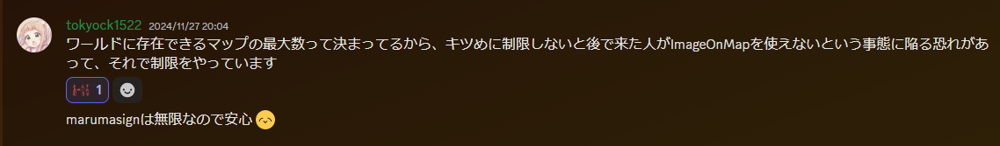
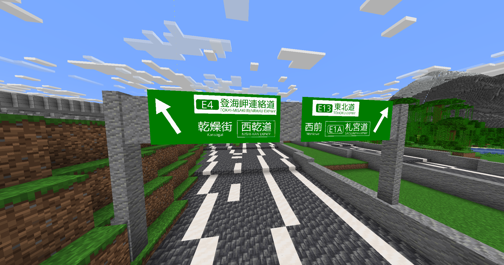

### 注意事項

  
ImageOnMapは、諸事情により60枚までとなっております。  
制限なく画像をマイクラ内で使いたい場合は→[MarumaSign](Mod%EF%BC%9AMarumaSign.md)

### 概要

ImageOnMapは、画像を地図に変換するプラグインです。  
高速道路の看板や、鉄道駅の電光掲示板等にご利用いただけます。  

### 目次

* [注意事項](#content_1)
* [概要](#content_2)
* [目次](#content_3)
* [画像を変換してみよう！](#content_4)
  * [1.ダイレクトリンクを取得する](#content_4_1)
  * [2.変換する](#content_4_2)
* [コマンド一覧](#content_5)

### 画像を変換してみよう

#### 1.ダイレクトリンクを取得する

※  
画像のサイズは128x128で1枚、サイズが大きいと地図も増えます。  
事前に調節しておきましょう。  
まず画像をURLとして利用できるようにアップロードしよう。ここではImgBBというサービスを使う。**アップローダーはお好みでどうぞ。**  
[https://ja.imgbb.com/](https://ja.imgbb.com/)  
まずは、アカウントを作成する。そしてアップロードする、するとダイレクトリンクがコピーできるので、コピーしてこの工程は完了。

#### 2.変換する

**/tomap [先程のダイレクトリンク]** で変換完了。  
128x128以下ならインベントリに、でなければ/mapsを用いて地図を手に入れることができる。

### コマンド一覧

| 構文 | 効果 | 権限 | 備考 |
| --- | --- | --- | --- |
| /tomap \<URL\> | 画像リンクを地図に変換します | 誰でも | (なし) |
| /maps | 今まで変換した画像の一覧を表示します | 誰でも | (なし) |
