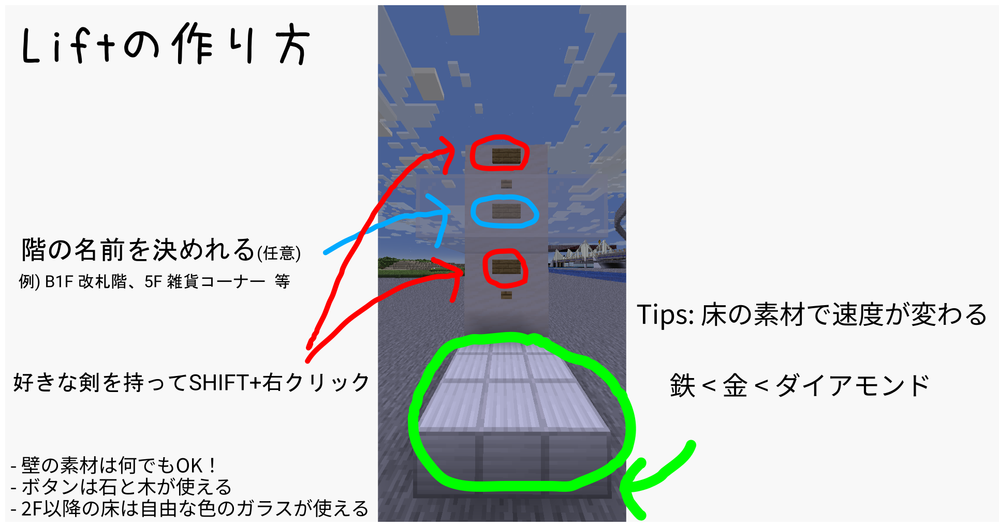

機能的なエレベーターを作れるプラグイン。必要な権限は特にありません。  

### 目次

* [目次](#content_1)
* [使い方](#content_2)
  + [乗り方](#content_2_1)
  + [作り方](#content_2_2)
    - [最下階の作り方](#content_2_2_1)
    - [階の増やし方](#content_2_2_2)

### 使い方

#### 乗り方

好きな剣を持って上の看板に対してシフト+右クリックで行き先が変えられ、決まったらその下のボタンを押して移動できます。

#### 作り方

文章で説明するのはなかなか難しいので、画像を先に載せておきます。  

##### 最下階の作り方

1. 床にブロック(鉄か金かダイアモンド)を置きます。なお、ブロックの種類はエレベーターの速度に影響します。(鉄,金,ダイアモンドの順に速くなる)
2. お好きな壁ブロックを設置してください。
3. 壁に向かって下から看板・ボタン・看板の順で設置してください。
4. すべての階を設定し終えたら好きな剣を持って上の看板に対してシフト+右クリック。

##### 階の増やし方

1. 下の階から最低3マス空けて好きな透過ブロック(色付きガラスやハーフブロック等)を置く
2. 壁に向かって下から看板・ボタン・看板の順で設置してください。
3. 好きな剣を持って上の看板に対してシフト+右クリック。

以降繰り返し