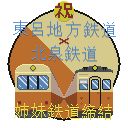

### 注意

この記事はこえきしの妄想が全開です。御了承下さい。

### 北泉鉄道株式会社

  
北泉鉄道(きたいずみてつどう)は、武蔵県松牛市に於いて鉄道路線を運営している  
鉄道事業者で有る。  
本稿では、主に路線・歴史・車両に附いて記述する。

### 概要

設立は1970(史歴2020)年。松の牛島〜泉本町間で営業運転を開始。設立時の社名は泉本町観光鉄道だったが、  
観光要素が0だった為翌年に現社名に改名された。現社名の由来は泉地区の北側に向かう会社、と云う事から。  
1975(史歴2020)年には中環みなと~松の牛島間に中環みなと線を建設・開業。中環みなと線はその後港の軍事転用に伴い2022年に廃止された。  
1983(史歴2022)年には松の牛島から大塚方面に松塚大橋が出来、そこに通る形で北泉西大塚まで延伸された。  
同年に全線の高規格化工事も実施。最高速度の引き上げと競合他社への勝利に成功した。  
1990(史歴2024)年には即席ゲートウェイ駅の新設と、そこから帝政まで伸びる帝政線が開業。  
帝政線はその後1993(史歴2025)年に巖辻󠄀温泉駅まで延伸され、路線名も巖辻󠄀線に改められた。  
2024年には故・MaeDaIKI28氏の保有する路線を全面買収。亜破壊根ノ-征伐間を廃線、それ以外を高規格化して運転開始した。  
2025年1月1日、東呂地方鉄道との姉妹鉄道提携を正式に締結。以後全保有車に専用ステッカーを掲出している。↓  
  

### 保有路線

#### 松の牛島本線

##### 路線データ

起点:夏バナナ海岸駅  
終点:北泉西大塚駅  
営業最高速度:105km/h  
軌間:1067mm

##### 駅

| 駅名 | えきめい | Station Name | 所在地 | 接続路線 | 備考 |
| --- | --- | --- | --- | --- | --- |
| 夏バナナ海岸 | なつばななかいがん | Natsubanana-Kaigan | 武蔵県松牛市夏バナナ特別区夏バナナ1-1-2 | 北泉鉄道株式会社松の牛島本線 | 松牛市営夏バナナ海水浴場の最寄駅。夏季限定。松の牛島本線の起点駅だが、先述の通り夏季限定なので松の牛島本線は起点駅に数か月列車が来ない路線になってしまった。 |
| 泉本町 | いずみほんまち | Izumi-Honmachi | 武蔵県松牛市泉区境町7-6-9 | 北泉鉄道株式会社松の牛島本線 | 軍事境界線の目の前にある駅。ここが起点駅に見えるが...? |
| 泉 | いずみ | Izumi | 武蔵県松牛市泉区泉中央3-2-2 | 北泉鉄道株式会社松の牛島本線 | 北泉鉄道本社の最寄駅。駅から船で約5分の所に本社がある。 |
| 即席ゲートウェイ | そくせきげーとうぇい | Sokuseki-Gateway | 武蔵県松牛市中央区下環町3-1-3 | 北泉鉄道株式会社松の牛島本線・巖辻󠄀線 | 本線と巖辻󠄀線の接続駅。即席で建設されたためこの名が付いた。1番乗り場にホテルCHININNがある。 |
| 松の牛島 | まつのうしじま | Matsuno-Ushijima | 武蔵県松牛市中央区松の牛島1-1-2 | 北泉鉄道株式会社松の牛島本線 | 松牛市最大のターミナル駅。未使用のホームがある。 |
| 北泉西大塚 | きたいずみにしおおつか | Kitaizumi-NishiŌtsuka | 大塚市 | なめ急西鯖南北線（巴里環状線）、トロ標準鉄道寒州線、TR線 | 西大塚駅だが、北泉だけ名称が違う。 |

#### 巖辻󠄀線

##### 路線データ

起点:即席ゲートウェイ駅  
終点:巖辻󠄀温泉駅  
営業最高速度:105km/h  
軌間:1067mm

##### 駅

| 駅名 | えきめい | Station Name | 所在地 | 接続路線 | 備考 |
| --- | --- | --- | --- | --- | --- |
| 即席ゲートウェイ | そくせきげーとうぇい | Sokuseki-Gateway | 武蔵県松牛市中央区下環町3-1-3 | 北泉鉄道株式会社松の牛島本線・巖辻󠄀線 | 本線と巖辻󠄀線の接続駅。即席で建設されたためこの名が付いた。1番乗り場にホテルCHININNがある。 |
| AkaneJPN記念公園 | あかねじゃぱんきねんこうえん | AkaneJPN-Memorial-Park | 国境審議中に附き後日記載 | 北泉鉄道株式会社巖辻󠄀線 | AkaneJPN記念公園の最寄り駅。 |
| 青木谷戸 | あおきやと | Aoki-yato | 武蔵県松牛市端区青木谷戸3-1-2 | 北泉鉄道株式会社巖辻󠄀線 | 駅周辺には美しい樹氷が広がる。松牛屈指の観光地。 |
| 帝政 | みかどがまさ | Mikadogamasa | 武蔵県松牛市端区帝政2-5-4 | 北泉鉄道株式会社巖辻󠄀線 | 周囲に家しかない。観光に来るのはお勧めしない。 |
| 蛙 | あ | A | 武蔵県松牛市端区蛙2-5-1 | 北泉鉄道株式会社巖辻󠄀線 | 一見おふざけにしか見えないが、ちゃんと地名。付近に蛙が多く生息している事から。 |
| 北泉世端 | きたいずみせはた | Kitaizumi-Sehata | 北泉鉄道株式会社巖辻󠄀線 | 世端共和国内 | 世端共和国の内部にある駅。 |
| 巖辻󠄀温泉 | いわつじおんせん | Iwatsuji-Onsen | 武蔵県松牛市端区巖辻󠄀島町1-2-1 | 北泉鉄道株式会社巖辻󠄀線 | 巖辻󠄀線の終着駅。駅名及び地名の辻󠄀の字は辻の異体字である。 |

#### 鹿御釜・松島線

##### 路線データ

起点:下巴里駅  
終点:成中駅  
営業最高速度:65km/h  
軌間:1067mm

|  |  |  |  |  |  |
| --- | --- | --- | --- | --- | --- |
| 下巴里 | しもぱり | Shimopari | paris | 北泉鉄道株式会社鹿御釜・松島線 | 巴里市街地が程近い、砂浜の駅。夏バナナよりビーチしてる。 |
| 松牛市松島区庁舎・森林管理組合松島事業所前 | まつうししまつしまくちょうしゃ・しんりんかんりくみあいまつしまじぎょうしょまえ | Matsuushi-city-Matshushima-wordoffice-and-Shinrin-Kanri-Kumiai-Mathushima-Jigyosho-Mae | 武蔵県松牛市松島区松島中央1-1-9 | 北泉鉄道株式会社鹿御釜・松島線 | 松島区役所の最寄駅。森林開発の拠点でもあり、留置線跡に資材が山積み。 |
| はたん | はたん | Hatan | 武蔵県松牛市松島区下松島2-1-2 | 北泉鉄道株式会社鹿御釜・松島線・松島原始線 | MaeDaIKI28氏からの継承区間。松島原始線との乗換駅。 |
| 成中 | なりなか | Narinaka | 武蔵県松牛市松島区下松島2-3-8 | 北泉鉄道株式会社鹿御釜・松島線 | MaeDaIKI28氏からの継承区間。松島の最南端にある駅。 |

#### 松島原始線

##### 路線データ

起点:はたん駅  
終点:亜破壊根ノ駅  
営業最高速度:40km/h  
軌間:1067mm

##### 駅

| 駅名 | えきめい | Station Name | 所在地 | 接続路線 | 備考 |
| --- | --- | --- | --- | --- | --- |
| はたん | はたん | Hatan | 武蔵県松牛市松島区下松島2-1-2 | 北泉鉄道株式会社鹿御釜・松島線・松島原始線 | MaeDaIKI28氏からの継承区間。松島原始線との乗換駅。 |
| 亜破壊根ノ | あはかいねの | A-Hakaineno | 武蔵県松牛市松島区松島9-3-5 | 北泉鉄道株式会社松島原始線 | MaeDaIKI28氏からの継承区間。正式な読み方不明。 |

### かつて運行していた区間

#### 征伐線

##### 路線データ

起点:征伐駅  
終点:亜破壊根ノ駅  
営業最高速度:50km/h  
軌間:1067mm

##### 駅

|  |  |  |  |  |  |
| --- | --- | --- | --- | --- | --- |
| 亜破壊根ノ | あはかいねの | A-Hakaineno | 武蔵県松牛市松島区松島9-3-5 | 北泉鉄道株式会社征伐線 | 洞窟を入ったところにホームがある。危険。 |
| 征伐 | せいばつ | Seibatsu | 武蔵県松牛市松島区松島11-3-9 | 北泉鉄道株式会社征伐線 | 駅前に禍々しい広場が広がっている。 |

### 種別

##### 松牛エリアでは

各駅停車と特急の二種別が存在。  
特急は途中駅を総て通過し終点に向かう。  
定期は朝夕に巖辻󠄀温泉-泉本町が1往復ずつ、夕に北泉西大塚-泉本町が2往復運行。  
その他夏季限定で各主要駅から夏バナナ海岸行きとその往復便が運行される。

##### 松島エリアでは

各停しかない。どんまい★

### 保有車両

[ここをクリック](%E5%8C%97%E6%B3%89%E9%89%84%E9%81%93%E3%81%AE%E8%BB%8A%E4%B8%A1.md)

### 方向幕一覧

暇な時に

### 鉄道以外の事業

#### ホテル事業

即席ゲートウェイ駅のHotel CHININN、市役所前の旅館旭日荘等、松牛市内で複数の宿泊施設を経営している。

#### バス事業

貸し切りバスを運行している。

#### 航空事業

松牛市空軍の施設を使用し、旅客便を少数運行している。