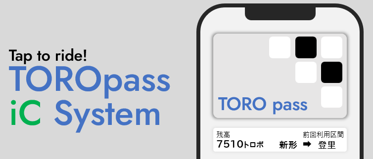

### TOROpassICsystem プラグインの使い方ガイド\*

よお！ \*TOROpassICsystem\* は、TORO SERVERでICカード使って電車に乗ったり、買い物ができるようになるプラグインだぜ！ 「トロポ」っていう通貨を使って、駅の改札通ったり、お店でピッてしたり、定期券で賢く移動したりできるんだ。初心者でもサクッと使えるように、超わかりやすく説明するから、ついてきてな！

### 1. TOROpassICsystemってなに？\*

このプラグイン、Minecraftでこんなことできるよ：

* ICカードで駅の\*入場\*・\*出場\*や運賃の支払い。
* \*定期券\*や\*1日乗車券\*でオトクに移動。
* お店での\*買い物\*をICカードでピッて決済。
* \*オートチャージ\*で残高ピンチを自動カバー。
* \*移動量ランキング\*で鯖民とバチバチ競争。

要するに、ICカード（TOROpassとか）持って、トロポをチャージして、看板クリックで色々楽しむって感じ！

### 2. まずはICカードゲットだ！\*

ICカードがないと何も始まらん！ さっそく手に入れようぜ！

### 2.1 TOROpass販売所にワープ

/warp EKISTA\_SAPPOROを打ち込んでワープしよう。そこで全種類のTOROpassが販売中だ！

### 2.2 それかTOROpass販売看板で\*

駅で[TOROpass販売]って書かれた看板があればそこでも入手できるぜ！

* 例えば、：

|  |
| --- |
| [TOROpass販売] |
| 3 |
| 3 diamond |

って書いてあれば、ダイヤ３つでゲットできるよ。  
  
買い方は、

* 必要な素材（例：ダイヤ3個）をインベントリに準備。
* 看板を\*右クリック\*（スニークはナシで！）。
* 素材が消えて、ICカード（紙アイテム）がインベントリにポン！
* カードの種類は2行目の番号で決まる（5=Rupica、7=TOHOCAとか）。

### 2.3 チェック\*

* インベントリでICカード確認。名前（例：TORO CARD）とかカスタムデータがついてるよ。
* \*注意\*：普通の紙じゃダメ！ ちゃんと購入したカードな！

### 3. トロポをチャージしよう\*

カード手に入れた？ じゃあ、トロポ（お金）をチャージして使えるようにすっぞ！

### 3.1 方法1：コマンドでチャージ\*

1. チャットでコマンドぶち込む：

> /charge \<金額\>
>
> * 例：/charge 1000 → 1000トロポチャージ！

1. 成功したら残高見れるよ（例：「1000トロポチャージした！ 残高: 1000トロポ」）。  
2. \*制限\*：
>
> * 残高は20,000トロポまで。
> * マイナスはNG！

### 3.2 方法2：チャージ看板\*

1. 「[チャージ]」って看板探して。

|  |
| --- |
| [チャージ] |
| 1000 |

> * 2行目に金額（例：1000）書いてある。

1. ICカード持って看板を右クリック。  
2. 金額がチャージされて残高アップ！

### 3.3 オートチャージ設定（オマケ）\*

残高ヤバい時に自動でチャージしてくれる便利機能！  

1. コマンド：

> /autocharge \<閾値\> \<チャージ金額\>
>
> * 例：/autocharge 500 1000
> * 残高500トロポ以下になったら、1000トロポ自動チャージ！

1. 停止したい時：

> /autocharge stop

1. \*制限\*：
>
> * 閾値もチャージ金額も10,000トロポ以下。

これで改札を通ったときにオートチャージがされるようになるよ

### 4. 電車に乗っちゃおう！\*

ICカードで駅の改札通って、電車に乗るぜ！

### 4.1 入場\*

1. 「[入場]」か「[入出場]」の看板探す。  
2. ICカード持って看板右クリック。  
3. 「入場: 〇〇駅」「残高: 1000トロポ」って出て、ピッて音が鳴る。  
4. フェンスゲートが開いて駅に入れる（座標設定あれば）。

### 4.2 出場\*

1. 「[出場]」か「[入出場]」の看板探す。  
2. ICカード持って右クリック。  
3. 移動距離で運賃（トロポ）が引かれる。
>
> * 例：「出場: XX駅 引去: 200トロポ」「残高: 800トロポ」。

1. ゲート開いて駅出れる！  
2. \*注意\*：
>
> * 同じ駅で入出場したら100トロポ引かれる（入場サービス）。
> * 残高足りないと出られないよ。（エラー出る）

### 4.3 運賃どうやって決まる？\*

* 移動距離で計算（1ブロック＝0.2トロポ）。
* トロッコとか車両で移動すると距離カウント。
* 定期券あれば無料になることも（後で説明）！

### 5. 定期券で賢く移動\*

定期券や1日乗車券をICカードに書き込んで、運賃節約だ！

### 5.1 定期券買う（書き込み）\*

1. TOROpassの発売機で購入
>
> * [このサイト](https://toropass.s-salmon.net/greatvalue/greatvalue)で1日定期券を販売中！乗車したい事業者を選んで、出てきたコマンドをコピー！

1. ICカード持ってコマンド実行。  
2. 購入金額が残高から引かれて、カードに定期券データ書き込み。  
3. \*注意\*：
>
> * 有効期限は「yyyyMMdd」（例：20251231）。
> * 残高足りないとエラー。

### 5.2 定期券使う\*

* 例えば、しゃけでんの1日定期券を使う場合、しゃけでんの事業者コードは「00」だ。入場と出場の看板の4行目に「00」が入ってれば、その区間はタダで乗れるぜ！ でも、どっちかの看板に「00」が書いてないと、残高からトロポが引かれちまうから、ちゃんとチェックしてくれよな！
* 期限切れだとタダにならん（エラー出る）。

### 5.3 定期券チェック\*

1. 「[定期券情報照会]」看板探す。  
2. ICカード持って右クリック。  
3. 券種、事業者コード、金額、期限、区間（通勤・通学の場合）が見れる。

### 5.4 定期券消す\*

1. 「[定期券情報削除]」看板探す。  
2. ICカード持って右クリック。  
3. 定期券データがカードから消える。

### 6. お店でピッて買い物\*

ICカードでお店で買い物、めっちゃスマート！  
  
1. 「[物販]」看板探す。
>
> * 2行目に店名（例：Cafe）、3行目に金額（例：500）。
> * 裏面に「[IC]」「ここにタッチ」って書いてある。

1. ICカード持って看板裏を右クリック。  
2. 金額が残高から引かれて買い物完了！
>
> * 例：「店舗: Cafe」「支払額: 500トロポ」「残高: 500トロポ」。

1. 残高足りないとエラー。

### 7. 移動量ランキングで競え！\*

電車乗りまくって、鯖民とどっちがすごいかバトル！  
  
1. コマンド：

> /toropassrank

1. トップ10のプレイヤーの移動量（トロポと距離）が見れる。
>
> * 例：「1位 Steve 1000トロポ 5km」。

1. 自分の順位も出る（トップ10じゃなくても）。  
2. 全ユーザーの合計移動量もチェックできる。  
3. \*計算\*：
>
> * 1ブロック＝0.2トロポ。
> * 1トロポ＝5mで距離換算。

### 8. 便利な機能いろいろ\*

### 8.1 残高チェック\*

1. 「[残高確認]」看板探す。  
2. ICカード持って右クリック。  
3. 残高見れる（例：「残高: 1000トロポ」）。

### 8.2 強制出場\*

改札バグった時に使う！  

1. 「[強制出場]」看板探す。  
2. ICカード持って右クリック。  
3. 入場状態解除（運賃なし）。

### 8.3 残額調整（管理者向け）\*

1. 「[残額調整]」看板探す。  
2. 2行目に残高（例：1000）書く。  
3. ICカード持って右クリック。  
4. 残高が指定値になる。

### 8.4 乗換\*

路線乗り換えの時に！  

1. 「[乗換]」看板探す。
>
> * 2行目に出場駅、3行目に再入場駅、4行目に事業者コードや座標。

1. ICカード持って右クリック。  
2. 今の区間の運賃精算して、すぐ次駅から入場。
>
> * 例：「出場: ○○駅 引去: 200トロポ」「入場: 地下鉄○○駅」。

### 9. 看板設置（管理者向け）\*

サーバー管理者は看板置いて機能をONにすっぞ。1行目にタグ、後は必要情報書く。

### 9.1 看板の書き方\*

1. \*入場・出場\*：

|  |  |  |  |  |
| --- | --- | --- | --- | --- |
| [入場] |  | [出場] |  | 入出場 |
| 高槻駅 |  | 札幌駅 |  | 坂町駅 |
|  |  |  |  |  |
| 00 |  | 05 01 |  | 04 (2,0,-1,2) |

3行目は空白でも文字を入れても問題ない！  
  
4行目には事業者コードとフェンスゲート情報を書くんだ。事業者コードはスペースで区切って、最大5社くらいまで改札を共有できるぜ！
例えば「00 01 02」みたいに書けば、しゃけでん（00）とか他の2社（01、02）もOK。フェンスゲート情報は、看板からの相対位置で「(X,Y,Z,S)」って書く。  
X,Y,Zはフェンスの位置、Sは開ける秒数だ。例：(1,0,0,4)なら、看板の右1ブロックのフェンスが4秒開くってわけ！  
  
4行目は書かなくても動くぞ！  
  
1. \*チャージ\*：

|  |
| --- |
| [チャージ] |
| [500] |
|  |
|  |

2行目は好きな数字を決められるぞ！  
  
1. \*物販\*：

|  |
| --- |
| [物販] |
| 札幌税務署 |
| 6700 |
|  |

> * 設置したら裏に「[IC]」「ここにタッチ」が自動で入る。
> * 設置して1回目はタッチが反応しないから、一度素手で看板の編集画面を開いて、そのまま閉じれば動くようになる。

1. \*定期券情報照会\*：

|  |
| --- |
| [定期券情報照会] |
|  |
|  |
|  |

1. \*定期券情報削除\*：

|  |
| --- |
| [定期券情報削除] |
|  |
|  |
|  |

1. \*残高確認\*：

|  |
| --- |
| [残高確認] |
|  |
|  |
|  |

1. \*強制出場\*：

|  |
| --- |
| [強制出場] |
|  |
|  |
|  |

1. \*残額調整\*：

|  |
| --- |
| [残額調整] |
| 30 |
|  |
|  |

看板をクリックすると残高を30にすることができる  
  
1. \*乗換\*：

|  |
| --- |
| [乗換] |
| ○○駅 |
| 地下鉄○○駅 |
| 00 05(-1,0,2,2 |

2行目に降りる駅、3行目に乗り換える駅の名前をかけばOK。  
4行目はさっき説明したからそっちを見てくれよな！  
  
1. \*TOROpass販売\*：

|  |
| --- |
| TOROpass販売] |
| 4 |
| 2 gold |
|  |

2行目にはICカードの番号、3行目には要求数とそのアイテムの名前を書こう。

* 1=TOROCARD, 3=Minupass, 4=KOUDANpass, 5=Rupica, 6=ShakechanRupica, 7=TOHOCA

### 9.2 注意\*

* 設置したら「設定OK！」ってメッセージ出る。
* フォーマットミスるとエラーで設置キャンセル。
* フェンスゲート座標入れると、クリックでゲートが開くよ。

### 10. 外部API\*

HTTPサーバーで残高や履歴を外からチェック（ポート5744）。  

* \*残高\*：

> GET /api/balance/\<プレイヤー名\>
>
> * 例：[http://サーバーIP:5744/api/balance/Steve](http://サーバーIP:5744/api/balance/Steve)
> * 返事：`{"balance": 1000}`

* \*履歴（最新100件）\*：

> GET /api/history/\<プレイヤー名\>
>
> * 返事：履歴のJSON（最大100件）。

* \*全履歴\*：

> GET /api/fullhistory/\<プレイヤー名\>
>
> * 返事：全履歴のJSON。

### 注意\*：プレイヤーがいなかったら404エラー

### 11. よくある質問\*

### Q：残高足りねえって？\*

* /chargeコマンドかチャージ看板でトロポ入れろ！
* オートチャージ設定してれば自動で入るかも。

### Q：定期券使えねえぞ？\*

* 期限切れかも。「[定期券情報照会]」看板でチェック、/writecardで更新。
* 事業者コードや区間合ってないとダメ。

### Q：入場したまま出れねえ！\*

* 「[強制出場]」看板で解除して。

### Q：看板反応しねえよ？\*

* ICカードちゃんと持ってる？ 看板の設定、運営に聞いてみ。

### 12. バッチリ楽しめ！\*

TOROpassICsystemで、Minecraftがリアルな鉄道ワールドに！ 鯖民とランキングバトルしたり、定期券で賢く移動したり、楽しすぎるぜ！ 運営は看板や事業者コードでカッコいい路線作っちゃおう！  
  
困ったら運営かこのガイド見てな。トロポライフ、楽しんでけよ！ 🚉
