鯖内の電車や機関車などの細かい設定とかなんかを載せていくページです。  

### 電車

**ミドルトランス868系「ダブルライナー」**

2019年より登場した中指重工による鯖内初の二階建て電車。ライナーや指定席快速などの運用に就く。  
**編成**  
クハ869-モハ868-モハ869-クハ869  
**各車両の画像**  
クハ869(Tc)  
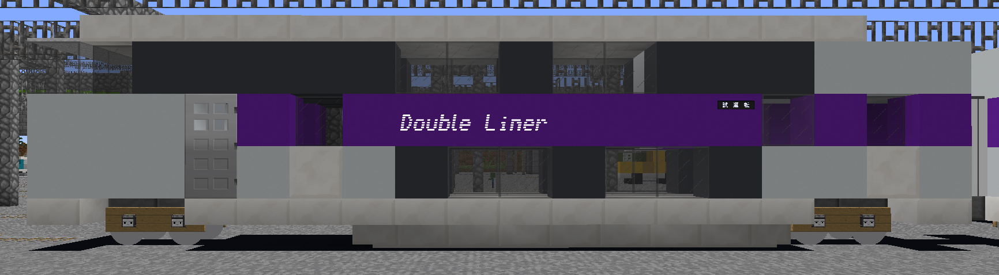  
モハ868(M')  
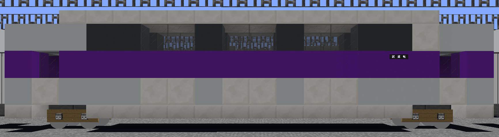  
モハ869(M)  
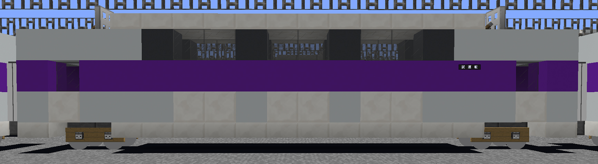

  

**ミドルトランス860系**

2019年より登場した中指重工による特急型電車。夜行快速ムーンライトながしま号用に登場したものの半年でライナー用に改造された。  
**編成**  
クモハ860-クモハ861  
**各車両の画像**  
クモハ860(M'c)  
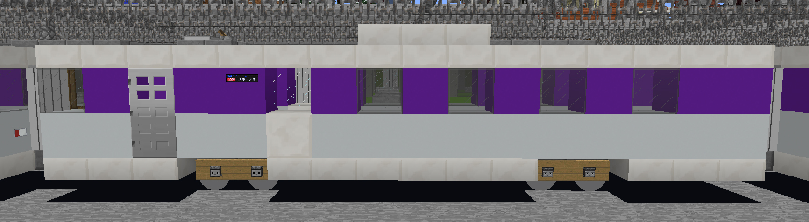  
クモハ861(Mc)  
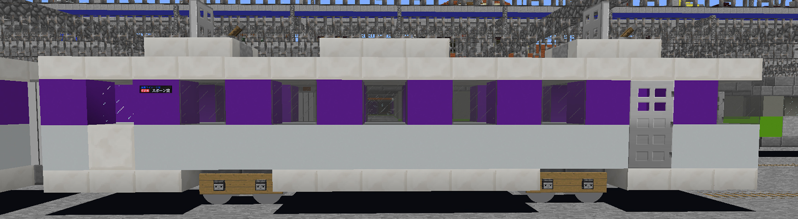

  

**ミドルトランス860系「ツベリア食紀行」**

860系を2020年に改造し車内がレストランになっている列車。百舌桑エリアでのみ運行されている。  
**編成**  
クモハ860-クモハ861  
**各車両の画像**  
クモハ860(M'c)  
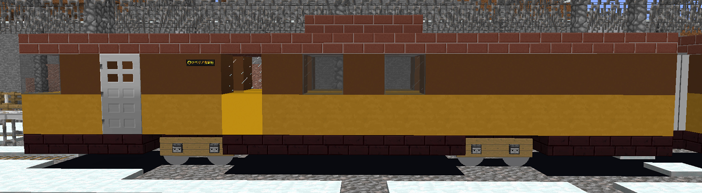  
クモハ861(Mc)  
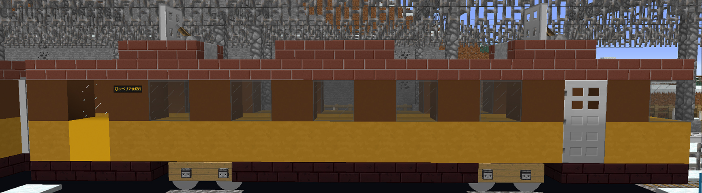

  

**ミドルトランス860系検測車「YAMABUK-I」**

2020年に登場した中指重工による検測車両。中間にオヤ5001を連結する場合もある。  
**編成**  
クヤ860-(オヤ5001)-モヤ860-クモヤ861  
**各車両の画像**  
クヤ860(Tc)  
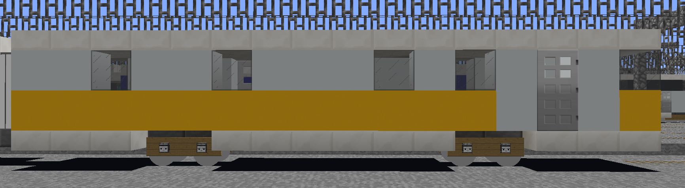  
モヤ860(M)  
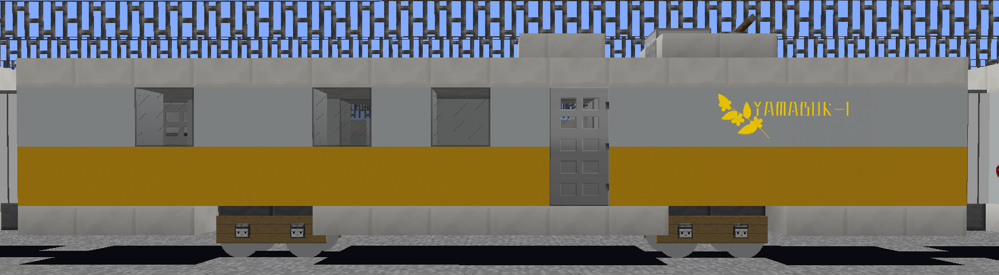  
クモヤ861(Mc)  
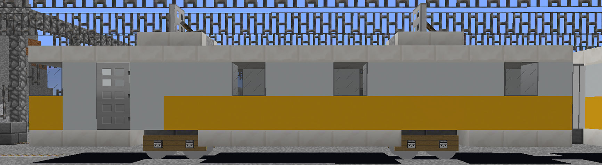

### 気動車

### 客車

**5000形**

2019年に登場した中指重工による客車。  
**各車両の画像・詳細**  
オヤ5001　2020年に登場した光オイラン車。  
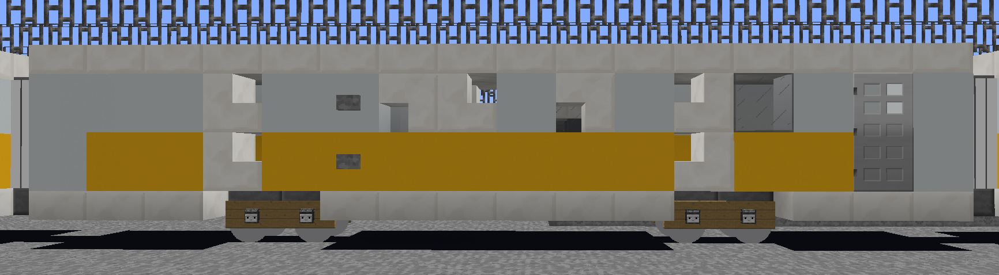  
マニ5001 2020年に登場した電源車。  
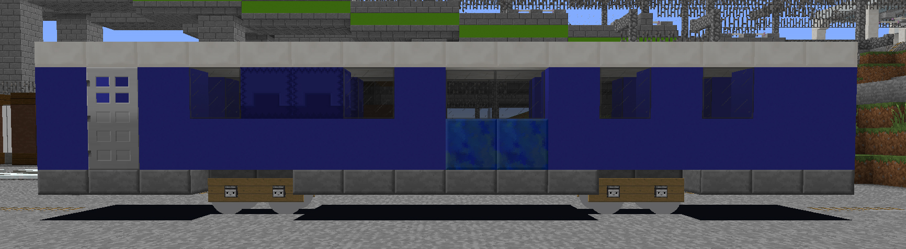  
スニ5901 2019年に登場した荷物車。  
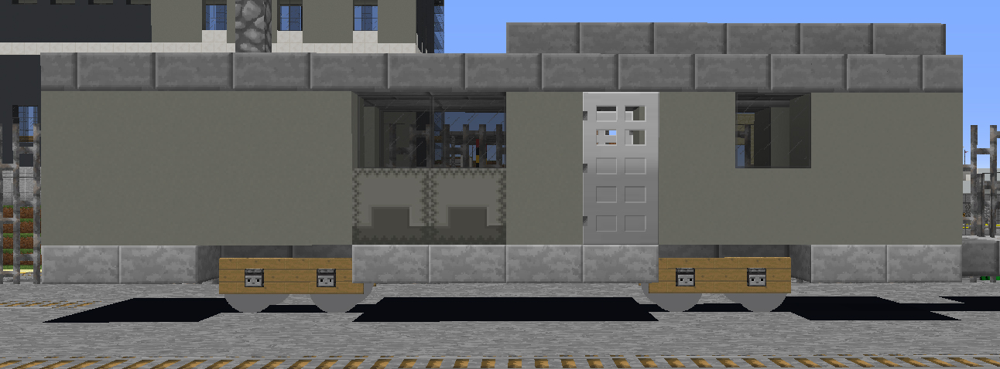

### 貨車

### 機関車

### その他