このページでは、東北鉄道について解説します。  
  

**目次**

* [運行情報](#content_1)
* [東北鉄道とは？](#content_2)
* [路線図](#content_3)
* [東北鉄道が保有する鉄道路線](#content_4)
  + [富山本線](#content_4_1)
    - [路線データ](#content_4_1_1)
    - [設備・停車場](#content_4_1_2)
    - [種別](#content_4_1_3)
    - [種別毎の停車駅](#content_4_1_4)
    - [路線概要](#content_4_1_5)
  + [富山環状線](#content_4_2)
    - [設備・停車場](#content_4_2_6)
    - [種別](#content_4_2_7)
    - [種別毎の停車駅](#content_4_2_8)
    - [路線概要](#content_4_2_9)
  + [津山線](#content_4_3)
    - [路線データ](#content_4_3_10)
    - [設備・停車場](#content_4_3_11)
    - [種別](#content_4_3_12)
    - [種別毎の停車駅](#content_4_3_13)
    - [路線概要](#content_4_3_14)
  + [雲丹津線](#content_4_4)
    - [路線データ](#content_4_4_15)
    - [設備・停車場](#content_4_4_16)
    - [種別](#content_4_4_17)
    - [種別毎の停車駅](#content_4_4_18)
    - [路線概要](#content_4_4_19)
  + [芝浦線](#content_4_5)
    - [路線データ](#content_4_5_20)
    - [設備・停車場](#content_4_5_21)
    - [種別](#content_4_5_22)
    - [種別毎の停車駅](#content_4_5_23)
    - [路線概要](#content_4_5_24)
  + [東北空港線](#content_4_6)
    - [路線データ](#content_4_6_25)
    - [設備・停車場](#content_4_6_26)
    - [種別](#content_4_6_27)
    - [種別毎の停車駅](#content_4_6_28)
    - [路線概要](#content_4_6_29)
  + [さいべりあ本線](#content_4_7)
    - [路線データ](#content_4_7_30)
    - [設備・停車場](#content_4_7_31)
    - [種別](#content_4_7_32)
    - [種別毎の停車駅](#content_4_7_33)
    - [路線概要](#content_4_7_34)
  + [松牛線](#content_4_8)
    - [路線データ](#content_4_8_35)
    - [設備・停車場](#content_4_8_36)
    - [種別](#content_4_8_37)
    - [路線概要](#content_4_8_38)
* [東北鉄道が保有する鉄道車両(運用中)](#content_5)
  + [T400系](#content_5_9)
    - [車両データ](#content_5_9_39)
    - [概要](#content_5_9_40)
  + [T120系](#content_5_10)
    - [車両データ](#content_5_10_41)
    - [概要](#content_5_10_42)
    - [車両の写真](#content_5_10_43)
    - [使用路線](#content_5_10_44)
  + [T130系](#content_5_11)
    - [車両データ](#content_5_11_45)
    - [車両の写真](#content_5_11_46)
    - [使用路線](#content_5_11_47)
  + [T110系](#content_5_12)
    - [車両データ設計](#content_5_12_48)
    - [概要](#content_5_12_49)
    - [車両の写真](#content_5_12_50)
    - [使用路線](#content_5_12_51)
  + [キハT10系](#content_5_13)
    - [車両データ](#content_5_13_52)
    - [車両の写真](#content_5_13_53)
    - [使用路線](#content_5_13_54)
  + [GV-T100系](#content_5_14)
    - [車両データ設計](#content_5_14_55)
    - [概要](#content_5_14_56)
    - [車両の写真](#content_5_14_57)
    - [使用路線](#content_5_14_58)
* [東北鉄道が保有する鉄道車両(廃車済)](#content_6)
  + [T100系](#content_6_15)
    - [車両データ](#content_6_15_59)
    - [概要](#content_6_15_60)
    - [車両の写真](#content_6_15_61)
    - [使用路線](#content_6_15_62)
  + [GV-T301系](#content_6_16)
    - [車両データ](#content_6_16_63)
    - [車両の写真](#content_6_16_64)
    - [使用路線](#content_6_16_65)
* [その他](#content_7)

  

### 運行情報

**現在、運転見合わせなどの情報は入っておりません。**

### 東北鉄道とは？

主に東北県各地域へのアクセスを向上するために建設された鉄道。  
富山本線、富山環状線、津山線、芝浦線、東北空港線、さいべりあ本線、雲丹津線、その他多くの路線があり、鯖最大級の路線数を誇る。  
最近では貨物輸送もしている。

### 路線図

準備中...

### 東北鉄道が保有する鉄道路線

#### 富山本線

##### 路線データ

起点:富山駅(TH-01)  
終点:旗須駅(TH-27)  
営業最高速度:130km/h  
軌間:1067mm  
路線カラー:オレンジ  
開業:2022年4月20日

##### 設備・停車場

| 施設名 | ナンバリング | 接続路線 | 備考 |
| --- | --- | --- | --- |
| 富山駅 | TH-01 | 東北鉄道津山線,芝浦線,富山環状線,なめ急麗谷線,小宮電鉄線 |  |
| 新富山駅[車両製作所前] | TH-02 |  |  |  |
| 新富山車両製作所 |  |  |  |
| 山間駅 | TH-03 |  |  |
| 磯原駅 | TH-04 | 富山環状線 |  |
| 竹林駅 | TH-05 |  |  |
| 豊平駅 | TH-06 | 地下鉄線 |  |
| 東鉄札幌駅 | TH-07 | しゃけでん線,平原鉄道森本線,赤城急行電鉄彩都本線,さこぴー鉄道線 |  |
| 青水巨大穴駅 | TH-08 |  |  |
| 石北駅(文化会館前) | TH-09 | 赤城急行電鉄 |  |
| 新岡町駅 | TH-10 | 南呂電鉄線 | 工事中... |
| 日吉町駅 | TH-11 | しゃけでん市内線 |  |
| スポーン南駅 | TH-12 | 寿司鉄道線,TR線,しゃけでん線 |  |
| 武蔵西大寺駅 | TH-13 | MR線,TR線 |  |
| 史の草駅 | TH-14 | TR線 |  |
| 籟流駅 | TH-15 | なめ急西鯖南北線(一部相互直通運転),松地端線,TNTN寒州線 |  |
| 北島内駅 | TH-16 |  |  |
| 水口駅 | TH-17 |  |  |
| 長浜駅 | TH-18 |  |  |
| 天王洲駅 | TH-19 |  |  |
| 新押上口駅 | TH-20 |  |  |
| 押上駅 | TH-21 | ずんだもち鉄道ずんだスカイツリーライン |  |
| 東鉄南千住駅 | TH-22 | ずんだもち鉄道ずんだスカイツリーライン |  |
| 筒川駅 |  |  |  |
| 田所神代駅 |  |  |  |
| 清水川駅 |  |  |  |
| 東旗須駅 |  |  |  |
| 旗須駅 | TH-27 | 磯崎電鉄大陸大橋線(特急列車のみ相互直通運転) |  |
| 水戸駅(臨) | TH-91 |  | 石北駅から分岐。TNTN直通路線のみ停車。 |
| 岡町駅 | TH-92 | TNTN,高槻電鉄,赤城急行電鉄 | **スポーン東方面のTNTN岡町線へ直通** |

##### 種別

* **普通**
* **快速**
* **快速つばめ**
* **快速みどりうみ**
* **富山快速**
* **特急おおわし**

##### 種別毎の停車駅

| 施設名 | **普通** | **快速** | **快速つばめ** | **快速みどりうみ** | **富山快速** | **特急おおわし** |
| --- | --- | --- | --- | --- | --- | --- |
| 富山駅 | ○ | ○ | ○ | ○ | ○ | ○ |
| 新富山駅 | ○ | ○ | ○ | ○ | ○ | △ |
| 山間駅 | ○ |  |  |  |  |  |
| 磯原駅 | ○ | ○ | ○ | ○ |  |  |
| 竹林駅 | ○ |  |  |  |  |  |
| 豊平駅 | ○ |  |  |  |  |  |
| 札幌駅 | ○ | ○ | ○ | ○ | ○ | △ |
| 青水巨大穴駅 | ○ |  |  |  |  |  |
| 石北文化会館前駅 | ○ | ○ | ○ | ○ | ○ | △ |
| 新岡町駅 | ○ |  |  |  |  |  |
| 日吉町駅 | ○ | ○ | ○ | ○ |  |  |
| スポーン南駅 | ○ | ○ | ○ | ○ | ○ | △ |
| 武蔵西大寺駅 | ○ | ○ | ○ | ○ |  |  |
| 史の草駅 | ○ | △ | △ |  |  |  |
| 籟流駅 | ○ | ○ | ○ | ○ | ○ | ○ |
| 北島内駅 | ○ | - | - | - | ○ |  |
| 水口駅 | ○ | - | - | - | ○ |  |
| 長浜駅 | ○ | - | - | - | ○ |  |
| 天王洲駅 | ○ | - | - | - | ○ |  |
| 新押上口駅 | ○ | - | - | - | ○ |  |
| 押上駅 | ○ | - | - | - | ○ | ○ |
| 東鉄南千住駅 | ○ | - | - | - | - |  |
| 筒川駅 | ○ | - | - | - | - |  |
| 田所神代駅 | ○ | - | - | - | - |  |
| 清水川駅 | ○ | - | - | - | - |  |
| 東旗須駅 | ○ | - | - | - | - |  |
| 旗須駅 | ○ | - | - | - | - | ○ |
| 水戸駅(臨) | ○ | ○ | - | - | - | - |
| 岡町駅 | ○ | ○ | - | - | - | - |

##### 路線概要

元々は札幌 石北 スポーン 籟流などの主要都市と富山のアクセスを良くするために建設された。  
今では旗須駅まで延伸されたり、さいべりあ線への直通運転が行われており、乾燥街やさいべりあなどへのアクセスもしやすい特急も走っている。  
基本的に6両編成で運行されているが、特急や籟流〜押上間は4両編成、TNTNへの直通と籟流〜旗須駅間のみ一部2両編成で運行されている。  
この路線だけで東北鉄道の運輸収入の5割を占めている。超重要路線。

#### 富山環状線

起点:富山  
終点:西富山  
営業最高速度:100km/h  
路線全長:計測中  
軌間:1067mm  
路線カラー:赤  
開業日:2024年04月20日

##### 設備・停車場

| 施設名 | ナンバリング | 接続路線 | 備考 |
| --- | --- | --- | --- |
| 富山駅 | TL-01 | 東北鉄道富山本線 津山線 芝浦線 なめ急麗谷線 小宮電鉄線 |  |
| 駐屯地前 | TL-02 |  | 芝浦線につながる短絡線がある。 |
| 府松温泉 | TL-03 |  |  |
| 北上川 | TL-04 |  |  |
| 磯原 | TL-05 | 富山本線 |  |
| 木ノ本 | TL-06 |  |  |
| 桜ヶ丘 | TL-07 |  |  |
| 西富山 | TL-08 |  | 津山線への短絡線が分岐している。 |

##### 種別

・**普通**

##### 種別毎の停車駅

**普通列車しかないので省略。**

##### 路線概要

富山の再開発、拡大した富山市各地へのアクセス向上を目的として貨物線を旅客線化して作られた。  
正式な起点は富山駅、終点は西富山駅となっているが、旅客運行をしている列車はほとんどが環状運転をしている。  
東北鉄道の各路線への短絡線が多くあり、臨時列車がたまに走ったりしている。  
基本、T130系0番代の車両が3両又は6両で走っている。  
富山本線に次ぐ、ドル箱路線である。

#### 津山線

##### 路線データ

起点:富山駅(TT-01)  
終点:津山駅(TT-09)  
営業最高速度:100km/h  
路線全長:計測中  
軌間:1067mm  
開業日:2023年06月24日  
路線カラー:黄緑

##### 設備・停車場

| 施設名 | ナンバリング | 接続路線 | 備考 |
| --- | --- | --- | --- |
| 富山駅 | TT-01 | 富山本線,芝浦線,富山環状線,なめ急麗谷線,小宮電鉄 |  |
| 土呂ノ谷駅 | TT-02 |  | 前一両のみドア開閉可　簡易改札機 |
| 下骨董駅 | TT-03 |  | 簡易改札機 |
| 北骨董駅 | TT-04 |  | 簡易改札機 |
| 草壁駅 | TT-05 | 輪山鉄道線 | 簡易改札機 |
| 川越駅 | TT-06 | 東北鉄道雲丹津線 |  |
| 東津山 | TT-07 |  | 前一両のみドア開閉可　簡易改札機 |
| 東鉄津山駅 | TT-08 | 平原鉄道森本線 |  |

##### 種別

* **普通**
* **津山快速**
* **区間快速**

##### 種別毎の停車駅

| 施設名 | ナンバリング | **普通** | 津山快速・区間快速 |
| --- | --- | --- | --- |
| 富山駅 | TT-01 | ○ | ○ |
| 土呂ノ谷駅 | TT-02 | ○ |  |
| 下骨董駅 | TT-03 | ○ | ○ |
| 北骨董駅 | TT-04 | ○ |  |
| 草壁駅 | TT-05 | ○ | ○ |
| 川越駅 | TT-06 | ○ | ○ |
| 東津山駅 | TT-07 | ○ |  |
| 津山駅 | TT-08 | ○ | ○ |

##### 路線概要

富山と津山のアクセスを良くするために建設された。  
建設前は富山→札幌→緑町と大回りをしないといけなかったが、建設後は1本で行けるようになった。  
朝と夕方には雲丹津線に直通する、区間快速および普通列車が運行される。

#### 雲丹津線

##### 路線データ

起点:川越  
終点:運湖  
営業最高速度:85km/h  
路線全長:計測中  
軌間:1067mm  
路線カラー黄色  
開業日:2024年04月20日

##### 設備・停車場

| 施設名 | ナンバリング | 接続路線 | 備考 |
| --- | --- | --- | --- |
| 川越駅 | TU-01 | 津山線 |  |
| 谷河原駅 | TU-02 |  | 東呂地方鉄道 |
| 雲丹津駅 | TU-03 | 小宮電鉄線,なめ急麗谷線 |  |
| 森ノ口駅 | TU-04 |  |  |
| 南小谷駅 | TU-05 |  |  |
| 大岩駅 |  |  |  |
| 中土駅 |  |  |  |
| 運湖駅 |  | RR秘境線(RR中海まで直通運転) |  |

##### 種別

・普通

##### 種別毎の停車駅

**普通列車しかないので省略。**

##### 路線概要

意外とアクセスの悪かった川越〜雲丹津の輸送を担っている。  
基本的に日中は1編成のみで全線を運用している。年中通してドアはボタン式。  
普通列車の全てがワンマン運転となっているが、朝夕の時間帯に運行される区間快速は全てツーマン運転になっている。  
カーブが多く、線形があまり良くないので、最高速度はあまり上げられていない。  
基本、川越〜南小谷ではT120系3000番台が、南小谷〜運湖はキハT10系が使われている。

#### 芝浦線

##### 路線データ

起点:富山  
終点:芝浦  
営業最高速度:100km/h  
路線全長:計測中  
軌間:1067mm  
路線カラー:スカイブルー  
2023年08月01日

##### 設備・停車場

| 施設名 | ナンバリング | 接続路線 | 備考 |
| --- | --- | --- | --- |
| 富山駅 | TS-01 | 東北鉄道富山本線,津山線,富山環状線,小宮電鉄,なめ急麗谷線 |
| 東富山駅 | TS-02 |  |  |
| 川村駅 | TS-03 |  | 小宮電鉄線への線路が分岐 |
| 坂上駅 | TS-04 |  |  |
| 杜の台駅 | TS-05 |  |  |
| 仁賀保駅 | TS-06 |  | 東北空港線につながる線路が分岐 |
| 芝浦港駅 | TS-07 | 東北空港線 |  |
| 芝浦貨物駅 |  |  | 旅客利用はされない。当駅から非電化。 |
| 芝浦駅 | TS-08 |  |  |
| 彼岸島駅 | TS-09 | NKRわんがん鉄道海岸線 |  |

##### 種別

* **普通(各駅停車)**
* **エアポート快速**

##### 種別毎の停車駅

| 施設名 | ナンバリング | **普通(各駅停車)** | **エアポート快速** |
| --- | --- | --- | --- |
| 富山駅 | TS-01 | ○ | ○ |
| 東富山駅 | TS-02 | ○ |  |
| 川村駅 | TS-03 | ○ |  |
| 坂上駅 | TS-04 | ○ |  |
| 杜の台駅 | TS-05 | ○ | ○ |
| 仁賀保駅 | TS-06 | ○ |  |
| 芝浦港駅 | TS-07 | ○ | - |
| 芝浦駅 | TS-08 | ○ | - |
| 彼岸島駅 | TS-09 | ○ | - |

##### 路線概要

新しい街(芝浦市)の建設、アクセスの向上のために作られた。  
全線電化されており、高岡の開発等により、近年需要が高まっている  
芝浦や、西前、東北空港などに物資を運ぶ貨物目的としても活躍しているため、貨物列車が多く見られる。  
2024年の6月30日までは杜の台信号所から山形支線が分岐していたが、(旅客案内上は坂上駅からの分岐)  
同年7月1日に廃線になった。なお、廃線になった線路は小宮電鉄に譲渡されている。

#### 東北空港線

##### 路線データ

起点:芝浦港  
終点:東北空港  
営業最高速度:80km/h  
路線全長:計測中  
軌間:1067mm  
路線カラー:黄色+スカイブルー  
開業日:2023年10月07日

##### 設備・停車場

| 施設名 | ナンバリング | 接続路線 | 備考 |
| --- | --- | --- | --- |
| 芝浦港駅 | TS-07 | 東北鉄道芝浦線 |
| 西前海岸駅 | TS-71 |  |  |
| 西前市駅 | TS-72 |  |  |
| 東北空港駅 | TS-73 |  | なめ急線との直通運転を予定 |

##### 種別

* **普通(各駅停車)**
* **エアポート快速**

##### 種別毎の停車駅

|  |  |  |  |
| --- | --- | --- | --- |
| 駅名 | ナンバリング | **普通(各駅停車)** | **エアポート快速** |
| 芝浦港 | TS-07 | ○ | ー |
| 西前海岸 | TS-71 | ○ |  |
| 西前市 | TS-72 | ○ | ○ |
| 東北空港 | TS-73 | ○ | ○ |

##### 路線概要

東北空港とのアクセスを良くするために建設された。西前の再開発に伴い、線路が地上に移される計画がある。

#### さいべりあ本線

##### 路線データ

起点:籟流  
終点:さいべりあ(延伸計画あり)  
営業最高速度:130km/h  
路線全長:計測中  
軌間:1067mm  
路線カラー:ブルー(さいべりあ地区色)  
開業日:2023年06月24日

##### 設備・停車場

| 施設名 | ナンバリング | 接続路線 | 備考 |
| --- | --- | --- | --- |
| 籟流駅 | TI-01 | 東北鉄道富山本線(相互直通運転),なめ急西鯖南北線(相互直通運転),TNTN寒州線 |  |
| 南籟流駅 | TI-02 |  |  |
| 雪の境駅 | TI-03 |  |  |
| 寒州駅 | TI-04 | TNTN線 |  |
| 寒海海底トンネル |  |  |  |
| 土樽 | TI-05 |  |  |
| 八日市 | TI-06 |  |  |
| 二日市 | TI-07 |  |  |
| さいべりあ | TI-08 | 東北鉄道松牛線,なめ急峡江線 | 暫定的な終着駅 |

##### 種別

・普通　・さいべりあ快速　・**特急おおわし・特急おおたか・特急南越**

##### 種別毎の停車駅

| 施設名 | ナンバリング | 普通 | さいべりあ快速 | **特急** |
| --- | --- | --- | --- | --- |
| 籟流駅 | TI-01 | ○ | ○ | ○ |
| 南籟流駅 | TI-02 | ○ |  |  |
| 雪の境駅 | TI-03 | ○ |  |  |
| 寒州駅 | TI-04 | ○ | ○ | ○ |
| 土樽 | TI-05 | ○ | ○ |  |
| 八日市 | TI-06 | ○ | ○ |  |
| 二日市 | TI-07 | ○ | ○ |  |
| さいべりあ | TI-08 | ○ | ○ | ○ |

##### 路線概要

T120系1000番台,T510系0番台を使用しており、基本4両、ラッシュ時などは6両に増やして運行している。寒州〜西比利亜間は2両編成または4両編成になり、寒州〜西比利亜間は多くワンマン運転をおこなっている。  
西比里亜のアクセスと周辺地域の活性化を目的に建設された。豪雪地域の為、工事が予定よりも遅れていた。  
駅数は少ないがその分、駅間の距離は離れている。

#### 松牛線

##### 路線データ

起点:西比利亜  
終点:松牛  
営業最高速度:70km/h  
路線全長:計測中  
軌間:1067mm  
路線カラー:ブルー(さいべりあ地区色)  
開業日:2024年10月13日

##### 設備・停車場

| 施設名 | 接続路線 | 説明 |
| --- | --- | --- |
| さいべりあ駅 | 東北鉄道さいべりあ本線,なめ急峡江線 |  |
| 横山駅 |  |  |
| 美川町駅 |  |  |
| 松牛駅 |  | 当駅よりTNTN巴里環状線に直通(北巴里駅まで) |

##### 種別

・普通

##### 路線概要

西比利亜〜松牛間の都市間輸送を目的として建設された。  
全線単線である。快速列車が運行される予定。

### 東北鉄道が保有する鉄道車両(運用中)

~~電車が好きで作ってるんでこんなの自己満だろ~~

#### T400系

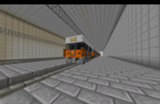

##### 車両データ

設計最高速度 150km/h  
営業最高速度 130km/h  
起動加速度 2.5km/h/s以上  
減速度(乗用)　4.5km/h/s  
減速度(非常)　5.3km/h/s  
制御方式　東鉄工業フルSic-VVVF

##### 概要

東北鉄道が独自に作成した近郊型の交直流車である。富山本線の延伸に合わせて作成された。制作においては、T100系の試験車、T120系より得られたデータを多く活用している。  
この車両から車番・編成番号を正式に割り振られている。  
座席は全てセミクロスシートになっており、トイレがついてあったり長距離利用に適した車内になっている。  
  
0番台:富山本線 さいべりあ線

#### T120系

##### 車両データ

設計最高速度 0番台150km/h　100番台以降130km/h  
起動加速度　2.5km/h/s  
減速度　5km/h/s　  
制御方式 T工IGBT-VVVF

##### 概要

東北鉄道が独自に作成した通勤型と近郊型を兼用した車両であり、直流型車両である。T100系では通勤時には不向きだったため、通勤時を想定して作成した車両である。  
  
0番台：主に4両編成(+2両編成)だが、2,4,6,8両の偶数両編成が可能。ドアは4ドアに変更。　車内にはLCDを各ドアの上に二つ設置。　  
一部編成には3号車に6ドア車を設置することで通勤ラッシュ時にも乗り降りをスムーズにできるようにした。  
基本、全てロングシートだが、1号車、4号車(運転台のある車両)、5号車、6号車はセミクロスシートである。　  
ドア横のボタンは使用できるときにボタンが光るようにすることで分かりやすくした。　  
長期移動に備えてトイレを設置。車椅子をご利用の方にも広々と使いやすくした。  
0番台の編成には全て転落防止幌が取り付けられている。   
クハT120-1、サハT120-9以外全車廃車済  
  
100番台：基本0番代と同じだが、20M車になり、ほとんどが6両固定の編成。  
  
200番台：20M車になり、全て2両固定の編成。3両編成にする計画がある。  
  
1000番台：全て4両固定の編成になっている。2両編成を連結して6両編成にすることもあるが、基本的に平日朝夕のラッシュ限定である。  
  
2000番台：主に2両編成。混雑時には連結して4両編成にすることもできる。2両編成の際はワンマン運転ができるように車外カメラが設置されている。  
　　　　　 全車廃車済  
  
3000番台：ドアが3ドアになり、オールロングシートになっている。　元々2両編成だったが、利用者の減少に伴い、1両編成に改造されている。  
　　　　　　  
1500番台：0番台の列車を改造して作られた車両で、主に芝浦線で運用されている。2両編成と3両編成固定の編成がある。芝浦線の需要が増えてきたので、ワンマン運転がされない編成が多い。  
　　　　　 全車廃車済

##### 車両の写真

富山本線で使われている0番台  
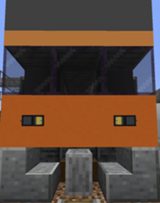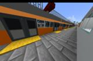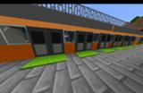

##### 使用路線

0番台 100番台:富山本線　1000番台:さいべりあ線　2000番台 200番台:津山線　3000番台:雲丹津線

#### T130系

##### 車両データ

設計最高速度 130km/h  
起動加速度 3km/h/s  
減速度 5km/h/s  
制御方式 フルSiC素子VVVFインバータ  
  
  
東北鉄道が独自に作成した通勤型車両。主に富山環状線で使われている。  
3,6,9両の編成が可能。ドアは3ドア。車内にはLCDを各ドアの上部に設置。  
通勤時を考慮して作られているので、ドアボタンはない。ただし、長時間の停車の時には車両の真ん中のドアのみ開くになっている。  
  
0番台:座席は全てロングシート。鯖で初めて車両の前面に転落防止幌を取り付けた。しかし、連結する運用がないため、撤去が進められている。  
　　 ワンマン運転に対応する改造工事が進んでいる。  
  
1000番台:座席は全てクロスシート。老朽化が進んでいたGV-T301系を置き換えた。空港アクセスに特化するため、座席定員が増えるクロスシートを採用。  
　　　　 また他の車両とは違い、特大荷物スペースを設置している。 落成時からワンマン運転に対応している。  
　　 　　芝浦線、富山環状線、東北空港線でのホームドア設置に合わせて0番台とほぼ同じ設計になっている。  
  
2000番台:座席は全てロングシート。芝浦線で使われていたT120系を置き換えた。  
　　　　　芝浦線、富山環状線、東北空港線でのホームドア設置に合わせて0番台とほぼ同じ設計になっている。  
　　　　　落成時からワンマン運転に対応。

##### 車両の写真

0番台  
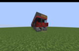　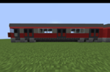

##### 使用路線

0番台:富山環状線  
1000番台:東北空港線 芝浦線  
2000番台:芝浦線

#### T110系

##### 車両データ設計

設計最高速度 150km/h  
起動加速度　2.5km/h/s  
減速度　5km/h/s　  
制御方式 界磁チョッパ制御、T工IGBT-VVVF、T工GTO-VVVF

##### 概要

東北鉄道が独自に作成したなめ急線直通用の車両。  
東北鉄道の多くの車両長が21M(東北鉄道規格)だが、なめ急線の規格に揃えるため、20Mで、3ドアになっている。  
座席は全てロングシート。　車内の快適な温度を保つためにドアボタンを設置。　LCDを千鳥配置に設置。

##### 車両の写真

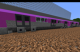

##### 使用路線

0番台:富山本線・なめ急線直通線

#### キハT10系

##### 車両データ

設計最高速度 130km/h   
営業最高速度 100km/h　  
平均起動加速度　2.3 km/h/s　  
減速度　3km/h/s　  
  
東北鉄道が初めて独自に作成した気動車。電線がない芝浦線での運用を目標に作成された。1,2,4両編成が可能。ドアは2ドア。各車両の後ろと前に運賃表を設置。  
座席はオールボックスシート。寒冷地などに備えてドアボタンを設置。　ワンマン運転が可能で、車内で運賃の精算などもできる。  
  
0番台：--主に芝浦線の芝浦港以北で運用されている。芝浦港以西は電化により、運用が減っている。--  
　　　 2両編成2編成が1000番台に改造され、それ以外の編成は廃車された。また、T120系に置き換えられ、芝浦線での運用から撤退。  
  
1000番台：雲丹津北線の開業より運行されている

##### 車両の写真

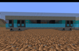

##### 使用路線

0番台:芝浦線  
1000番台：雲丹津線

#### GV-T100系

##### 車両データ設計

設計最高速度 100km/h  
起動加速度　2.3km/h/s  
減速度　3.5km/h/s　  
  
制御方式 コンバータ+IGBT-VVVFインバータ制御

##### 概要

東北鉄道が独自に作成したディーゼルエンジンの動力で発電した電力で主電動機を駆動する、いわゆるディーゼル・エレクトリック方式の電気式気動車。  
1両編成と2両編成があり、組み合わせて1~6両編成が組めるようになっている。座席はボックスシートとロングシートがある。  
寒冷地に備えてドアボタンを設置。ワンマン運転が可能で、車内で運賃の清算などができるようになっている。

##### 車両の写真

準備中

##### 使用路線

0番台:富山本線 外環状線(旗須 寒州間)

### 東北鉄道が保有する鉄道車両(廃車済)

#### T100系

**一部廃車済**

##### 車両データ

設計最高速度 130km/h   
営業最高速度 0,1000番台:100km/h   
起動加速度　2.5km/h/s　  
減速度　5km/h/s　  
制御方式 T工GTO-VVVF

##### 概要

東北鉄道が初めて独自に作成した近郊型車両。~~東北鉄道で一番使われている車両でもある。~~  
2,3,4両の編成が可能。ドアは3ドア。　車内には三色LEDを各ドアの上に一つ設置。　  
基本、ロングシートだが、一部車両にはボックスシートがついている。車内の快適な温度を維持するためにドアボタンを設置。500番台のみワンマン運転が可能。  
130km/hの運行が試験走行で可能とわかったが、不具合が多発したため、100km/hに固定されている。

##### 車両の写真

　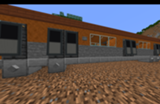

##### 使用路線

なし

#### GV-T301系

##### 車両データ

設計最高速度110km/h   
営業最高速度100km/h   
起動加速度2.5km/h/s   
減速度4.5km/h/s   
制御方式 T工IGBT-VVVF 近郊型  
  
0番台：東北鉄道が独自に作成した、**空港アクセスを目的**にできた近郊形車両であり、東鉄初の電気を溜めて走る車両である。試験運用も兼ねて比較的路線全長が短い西前線で運用されている。  
2,3,4両編成が可能。ドアは3ドア。通勤型の車両よりもドアの横幅を大きくすることで大きな荷物を持った方にも乗り降りがスムーズになるようにした。　車内には無料のフリーWi-Fiがついているほか、  
スーツケースなど大きな荷物をおけるスペースを全ての車両に設置し、空港アクセスに特化した車両になっている。  
最近は試験走行が終わったので電車に改造されて運行している。

##### 車両の写真

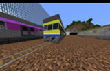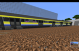

##### 使用路線

0番台:東北空港線 芝浦線(エアポート快速のみ)

### その他

こちらも併せてどうぞ。  
ここのページ書いてる人のブログ[T村駅長の独り言](../06_Community/T%E6%9D%91%E9%A7%85%E9%95%B7%E3%81%AE%E7%8B%AC%E3%82%8A%E8%A8%80.md)  
東北鉄道の裏設定があったりなかったりするドキュメント  
[東鉄裏設定](https://docs.google.com/document/d/1jdfjlALVemLgidQ3QtcrZbQ0tCoKM032Zc0702TBcfk/edit)