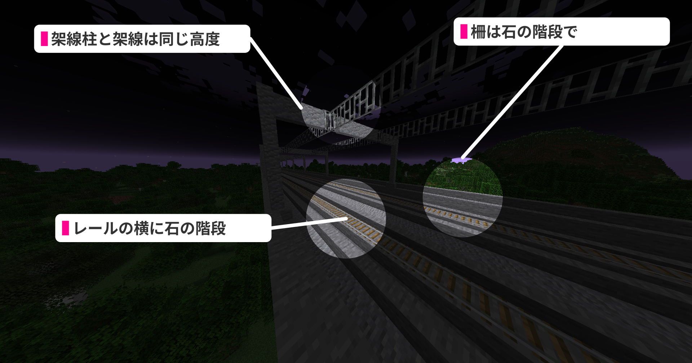

|  |  |  |
| --- | --- | --- |
| [さっぽくエクスプレスのロゴ](https://image01.seesaawiki.jp/t/r/toro_server/30fd5b9dc13f81c8.png) | さっぽくエクスプレス線 Sappoku Express | |
| 代表者 | fhrk\_ |
| 総延長 | 6.6km |
| 以下 架空の設定 | |
| 法人名 | 新中央高速鉄道株式会社 |
| 業種 | 陸運業 |
| 本社所在地 | 京名岡市中海区京城2丁目1 |
| 鉄道規格 | 独自規格(小宮電鉄規格ベース) |
| 開業状況 | 未開業 |
| 直通路線 | 小宮電鉄、北海鉄道線 |

### 目次

* [目次](#content_1)
* [建設進捗](#content_2)
* [路線のご案内](#content_3)
* [直通業者向け資料](#content_4)
  + [さっぽくエクスプレス規格仕様書](#content_4_1)
    - [基本構造](#content_4_1_1)
  + [TrainCartsダイヤ資料](#content_4_2)
  + [制限速度](#content_4_3)

### 建設進捗

| 札幌-和駒内 | 和駒内-赤羽骨董 | 赤羽骨董-横倉神月 |
| --- | --- | --- |
| O | Δ 現在工事中 | O |

### 路線のご案内

| 種別名 | | 各駅停車 | 快速 | 特快速 | 快速特急 |
| --- | --- | --- | --- | --- | --- |
| 設定: 基本の本数/h | | 6本 うち3本横倉神月止まり | 4本 うち2本横倉神月止まり | 2本 | 1本 |
| 停車駅 | | 下り/上り | | | | 乗換のご案内 | その他 |
| SX-01 | 札幌 Sapporo | 22番線 | 21番線 | 20番線 | 19番線 | 札幌市営地下鉄 南北線、鮭電線 札槻線・空港線、[東鉄 本線](Tvillagerailway.md)、東鯖リニア、燕谷高速鉄道線、[森鉄 森本線](../06_Community/Moritetsu.md)、[赤急 彩都快速線](%E8%B5%A4%E5%9F%8E%E6%80%A5%E8%A1%8C%E9%89%84%E9%81%93.md) |  |
| SX-02 | SX白沢 SX-Shirasawa | 1番線/2番線 | 1番線/2番線 | 1番線/2番線 | 通過 | 札幌市営地下鉄 東西線 |  |
| SX-03 | 和駒内 Wakomanai | ○ | 通過 | 通過 | 通過 | [地鉄 青宮線](%E6%9D%B1%E5%91%82%E5%9C%B0%E6%96%B9%E9%89%84%E9%81%93.md) | 建設中 |
| SX-04 | SX骨董下 SX-Kottoshita | ○ | ○ | ○ | 通過 | [東鉄 津山線](Tvillagerailway.md) |  |
| SX-05 | 赤羽骨董 Akabane-Kotto | ○ | 通過 | 小宮電鉄本線小宮方面直通 | 通過 |  | 建設中 |
| SX-06 | 蓑森大穴 Minomori-Ōana | ○ | ○ |  | ○ | [地鉄 青宮線](%E6%9D%B1%E5%91%82%E5%9C%B0%E6%96%B9%E9%89%84%E9%81%93.md)、[なめ急 東浜線](%E3%81%AA%E3%82%81%E6%80%A5%E9%9B%BB%E9%89%84.md) |  |
| SX-07 | 南西赤 Minami-Nishiaka | ○ | 通過 |  | 通過 |  |  |
| SX-08 | 西赤山 Nishiaka-Yama | ○ | 通過 |  | 通過 |  | 建設中 |
| SX-09 | ジャイルゲートウェイステーション Jail-Gateway-Station | ○ | ○ |  | 通過 |  |  |
|  | 香山車両センター | 保有数: 23両 6編成 | | | |  | |
| SX-10 | 香山 Kayama | ○ | 通過 |  | 通過 |  | 建設中 |
| SX-11 | 西香山 Nishi-Kayama | ○ | 通過 |  | 通過 |  | 建設中 |
| SX-12 | 東横倉大洲 Higashi-Yokokura Ohsu | ○ | 通過 |  | 通過 |  |  |
| SX-13 | 横倉神月 Yokokura-Kamitsuki | ○ | ○ |  | ○ | 小宮電鉄 北鯖新幹線、栄州鉄道線、北海鉄道線 | 建設中 |
|  | | 北海鉄道線直通 | | | |  | |

### 直通業者向け資料

#### さっぽくエクスプレス規格仕様書

**旧α規格と旧β規格の差異が吸収されたので統一されました。**

##### 基本構造

|  |  |
| --- | --- |
| 架線高 | (レール含め)5m |
| 路線幅 | 3m |

#### TrainCartsダイヤ資料

| タグ名 | 説明 |
| --- | --- |
| local | 各駅停車にのみ付与 |
| rapid | 各駅停車**以外**に付与 |
| pure | 快速にのみ付与・rapidと併用 |
| komiya | 特快速にのみ付与・rapidと併用 |
| express | 快速特急にのみ付与・rapidと併用 |

#### 制限速度

| 種別 | SX-01 札幌〜SX-02 白沢 | SX-02 白沢〜SX-05 赤羽骨董 | SX-06 赤羽骨董〜 |
| --- | --- | --- | --- |
| 各駅停車 | 70km/h | 70km/h | 90km/h |
| 快速 | 70km/h | 90km/h | 125km/h |
| 特快速 | 70km/h | 90km/h |
| 快速特急 | 90km/h | 90km/h | 125km/h |