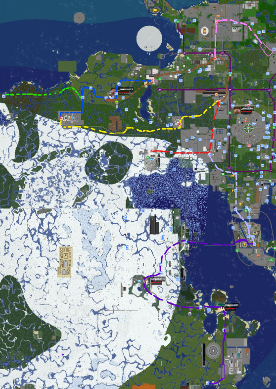

ずんだもち鉄道は、御門市や東京スカイツリー(業平橋)、押上や彩都などの西側の主要都市を結ぶ鉄道である。  
また、スポーンの西側を包み込むような壮大な延伸計画図があるが、zundamotch氏の計画性のなさと経由地目的地すべて同じな計画路線が存在することなどがネックになり、全く進んでいない。  
基本的に、ずん鉄と呼ばれている。  
また、標準規格である森鉄規格を「プラレールみたい」と批判し、ずん鉄独自の「26m n両」というリアリティを追求した規格に変更。  
これにより、ホームに必要な長さが83mから269mと3倍以上にアップし、工事が急がれている。  
追記：MR計画線が地下鉄半蔵門線と直通運転をするらしく、MRは森鉄規格なため、再び森鉄規格の20m3ドアに変更するかもしれない。めんどくさい。  

### ご案内

#### 運行情報

### 所属車両

### 東武100系(スペーシア)

### 東武100系(スペーシア日光詣)

### 東武100系(スペーシアみどり)

### 東武200型(りょうもう)

### 東武200型(りょうもうリバイバルカラー)

### 東武8000系

### 東武8000系リバイバルカラー

### 東武9050型

### 東武10030型

### 東武20000型

### 東武30000系

### 東武50000型

### 東武50090型

### 阪急2000系改

### 阪急8020系(中間車両のみ阪急8000系)

##### 延伸計画(合成した画像です)

##### 路線ご案内

##### ずんだスカイツリーライン

起点:彩都駅(保留)  
終点:御門市(建造中)

| 駅名 | ナンバリング | 接続路線 | 発車番線 | | 備考 | 所在地 |
| --- | --- | --- | --- | --- | --- | --- |
| 御門市方面 | 彩都方面 |
| 彩都 | ZS-01 |  | 3番線 | 4番線 |  | 武蔵県彩都市 |
| 平岡三郷 | ZS-02 | 彩都市営地下鉄平岡線 | 3番線 | 4番線 |  | 武蔵県彩都市 |
| 曳舟 | ZS-03 |  | 2番線 | 1番線 |  | すみだ押上市 |
| 業平橋 | ZS-04 |  | 2番線 | 1番線 |  | すみだ押上市 |
| 押上 | ZS-05 | 東北鉄道富山本線 | 2番線 | 1番線 |  | すみだ押上市 |
| 十郎潟模範農村 | ZS-06 |  | 1番線 |  | 単線の路面電車時代の名残でホームが1つ&20mという短さ | すみだ押上市十郎潟 |
| 北千住 | ZS-07 |  | 1番線 |  | 単線の路面電車時代の名残でホームが1つ&20mという短さ | すみだ押上市 |
| 南千住 | ZS-08 | 東北鉄道富山本線 | 2番線 | 1番線 |  | すみだ押上市 |
| 御門市 | ZS-09 | 不明(情報が判明次第書き込み) | 不明 | 不明 | 建造中につき、情報が確立されていない。 | 御門市 |

ずんだ伊勢崎線(仮)(計画線)

|  |  |  |  |  |  |  |
| --- | --- | --- | --- | --- | --- | --- |
| 南千住 | ZS-58 | 東北鉄道富山本線 | 2番線 | 1番線 |  | すみだ押上市 |
| (不明) | ZS-59 |  | 2番線 | 1番線 | 情報が何もない謎の都市 | 不明 |

##### ずんだ平原線(計画線)

起点:押上駅(ずんだスカイツリーラインと彩都駅まで線路を共有)  
終点:西京駅  

| 駅名 | ナンバリング | 接続路線 | 発車番線 | | 備考 | 所在地 |
| --- | --- | --- | --- | --- | --- | --- |
| 御門市方面 | 彩都方面 |
| 押上 | ZA-01 | ずんだスカイツリーライン、東北鉄道富山本線 | 1番線 | 2番線 |  | すみだ押上市 |
| 業平橋 | ZA-02 | ずんだスカイツリーライン | 1番線 | 2番線 |  | すみだ押上市 |
| 曳舟 | ZA-03 | ずんだスカイツリーライン | 1番線 | 2番線 |  | すみだ押上市 |
| 平岡三郷 | ZA-04 | ずんだスカイツリーライン、彩都市営地下鉄平岡線 | 未定 | 未定 |  | 武蔵県彩都市 |
| 彩都 | ZA-05 | ずんだスカイツリーライン、彩都市営地下鉄平岡線、赤城急行彩都本線、トロ標準鉄道会社彩都線 | 1番線 | 2番線 |  | 武蔵県彩都市 |
| 新彩都 | ZA-06 | 彩都市営地下鉄平岡線、滑路・登里電気鉄道西鯖南北線 | 番線 | 番線 |  | 武蔵県彩都市 |
| 五日市 | ZA-07 | 赤城急行鉄道彩都本線 | 番線 | 番線 |  | 武蔵県五日市市 |
| 平原 | ZA-08 | 平原鉄道森本線 | 番線 | 番線 |  | 武蔵県緑市平原区 |
| 森 | ZA-09 | 平原鉄道森本線 | 番線 | 番線 |  | 武蔵県緑市平原区 |
| 西京 | ZA-10 | 平原鉄道森本線など(不明) | 番線 | 番線 |  | 西京都 |