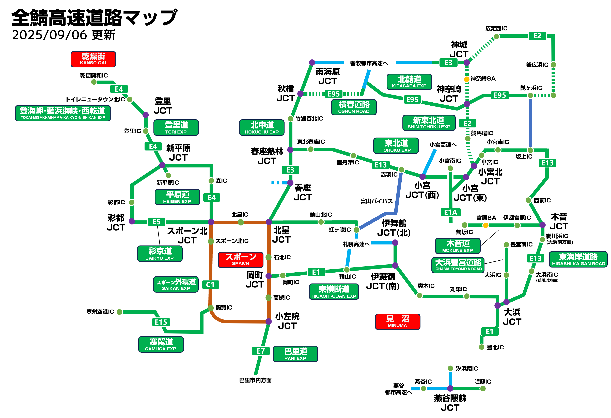

このページはこのサーバーにおける交通を紹介するページです。  
  
建設する方は[交通機関についてのルール](%E4%BA%A4%E9%80%9A%E6%A9%9F%E9%96%A2%E3%81%AB%E3%81%A4%E3%81%84%E3%81%A6%E3%81%AE%E3%83%AB%E3%83%BC%E3%83%AB.md)を確認してください。  
  
**目次**  

* [鉄道](#content_1)
* [道路](#content_2)
* [航空](#content_3)
* [1.19.2鯖アップデート以前のページ一覧(過去データ)](#content_4)

  
  

### 鉄道

#### 路線図

  
（更新予定）

#### 鉄道事業者

| 名称 | 所有者 | 概要 | 備考 |
| --- | --- | --- | --- |
| [TNTN（トロ標準鉄道会社）](../02_Plugins/TNTN.md) | Hidezou\_mania | サーバー初の鉄道。　巴里を中心に鉄道網を築いている。 |  |
| [平原鉄道(森鉄)](../06_Community/Moritetsu.md) | Heigen\_midori | 緑市を中心に燕谷・彩都を結び、サーバーの東西を大きく横断する鉄道。 森鉄や森林高速鉄道(旧名)と呼ばれることもある |  |
| しゃけでん(旧高槻電鉄) | sapporo\_salmon | 高槻と札幌を中心とした鉄道。 |  |
| 寿司鉄道 | X6Z | スポーンから丑寅・燕谷(予定)方面へ進む鉄道。クオリティが高い。 |  |
| [東北鉄道（東鉄）](Tvillagerailway.md) | toumorokoshi1222 | 東北県を中心とした鉄道であり、鯖最大級の路線数を保有する。 |  |
| [なめ急電鉄](%E3%81%AA%E3%82%81%E6%80%A5%E9%9B%BB%E9%89%84.md) | nm3r47 | 鯖郊外？を、スポーンを囲むようなかたちで結ぶ鉄道。多くの路線と直通を行う。 |  |
| [赤城急行鉄道](%E8%B5%A4%E5%9F%8E%E6%80%A5%E8%A1%8C%E9%89%84%E9%81%93.md) | AKAGI185 | 石北を中心として、ワールドを東西に貫く鉄道。サーバーで２番目に古い鉄道。 |  |
| [MR](https://seesaawiki.jp/mr-info/d/%A5%C8%A5%C3%A5%D7%A5%DA%A1%BC%A5%B8) | moyanomoyashi | スポーン中央から空港のある西京都・大塚市方面を結んでいる。　TRと業務提携をしている。 |  |
| TR | kashiwako0803(副社長moyanomoyashi) | 大塚を中心とする鉄道。MRと業務提携をしている。 | HPはMRのところから |
| 巴里環状鉄道 | Hidezou\_mania | 巴里市内の路面電車と巴里環状線を運行する会社。 |  |
| [輪山鉄道](%E8%BC%AA%E5%B1%B1%E9%89%84%E9%81%93.md) | lesssr | 輪山市に本社を置く鉄道会社。輪鉄本線を運行している。 |  |
| 丑寅市交通公社 | Kibana262 | 丑寅市内の路面電車・地下鉄を運行している公営事業者。 |  |
| 栄州鉄道 | Kibana262 | 丑寅市から小宮市、スポーン方面などを結ぶの事業者。 |  |
| 鯖北遊園モノレール | Kibana262 | USJと市街地を結ぶ予定のウーパーライナーを管理する事業者。 |  |
| RR | KENTO1121 | 新形から鯖北部を中心に路線を展開する鉄道。 |  |
| 小宮電鉄 | tetsuota221 | 小宮市内から、富山、雲丹津、鼬ヶ浜を結ぶ鉄道。現在、新幹線を建設中 元東呂地鉄青宮線を引き継いだ。 |  |
| 西邦鉄道 | fhrk\_ | 西邦鉄道（Seiho Railway）とは、名葉府を中心に鉄道を運営する事業者。 |  |
| NKRわんがん鉄道 | toumorokoshi1222,tetsuota221,lhci | 彼岸島〜小宮を結ぶ第三セクター鉄道。東北県が所有、管理、運行をしている。 |  |
| 東呂地方鉄道 | Mauski\_Ucola | スポーン東側を拠点とし、秋葉原から熱樹を結ぶ本線と島本から竹林を結ぶ竹島線を運行している小規模鉄道である。 |  |
| 磯崎電鉄 | Mauski\_Ucola | 主に乾燥大陸の西側に路線網を持ち、南は旗須、東は港町まで版図を広げた頭悪い鉄道。磯崎町に本社を置く。 |  |
| 南呂電鉄 | Mauski\_Ucola | スポーン南〜巴里までを南北に貫く鉄道。地鉄規格路線では最も綺麗であり、唯一駅ホームの長さが全体で統一されている。 |  |
| [北泉鉄道株式会社](KIR.md) | Kokeishi001 | 武蔵県松牛市に、多くの路線を所有する中小私鉄。車両がボロい。 |  |
| UZ\_TRANS. | cyatarow | ワールド全体を東西に貫く「東西大横断線」（案内名称・綺布良線）を建設中。 |  |
| [さっぽくエクスプレス(新中央高速鉄道)](%E3%81%95%E3%81%A3%E3%81%BD%E3%81%8F%E3%82%A8%E3%82%AF%E3%82%B9%E3%83%97%E3%83%AC%E3%82%B9%28%E6%96%B0%E4%B8%AD%E5%A4%AE%E9%AB%98%E9%80%9F%E9%89%84%E9%81%93%29.md) | fhrk\_ | 東麗県札幌市から北海県京名岡市横倉区までを結ぶ鉄道。小宮電鉄・北海鉄道と直通している。 |  |
| 氷魚LRT | yuma0214yuma | 中央連邦・氷魚市内を東西に横断する小さなLRT会社。 |  |
| 雪花モノレール | yuma0214yuma | 雪花市を中心としたモノレール会社。 |  |
| 山花モノレール | StudiedSign2230 | 山川市〜雪花市を結ぶモノレール会社。 |  |
| WR | Load\_000 | 正式名称West Railways 寒西を中心に西鯖の鉄道網を置く企業 |  |
| 南戸電鉄 | yuma0214yuma | 雪花県・南村〜戸鳴村、南村〜雪花大社神宮を結ぶ鉄道会社。線路状況がやばい。 |  |
| JPR | StudiedSign2230 | 山川県中心の鉄道。 |  |

#### 駅一覧

表記に関する注意事項（**追記する際は必ずお読みください**）  

* 駅一覧は上から日本語文字列照合順番に従って並んでいます。新たに追加する際も日本語文字列照合順番に従ってください。同音異義の場合はどっちが上でも下でも構いません。
* 同じ駅名だけど乗換に時間がかかる場合や、明らかに駅舎が違う場合は別で書いてください。
* 駅名、えきめい、Station Name、接続路線は必ず書いてください。
* えきめいは駅名の平仮名を書いてください。
* Station Nameは駅名の英語で書いてください。方角、空港などの名詞として英単語が存在する場合はローマ字でもどちらでも構いません。また、ローマ字は全てヘボン式で書いてください。
* 所在地はTORO Server WIKIの自治体一覧、もしくはDynmapのピンで登録している自治体のみ書いてください。どこにも所属していない場合は無記入で構いません。
* 接続路線は鉄道ごとに「、」、同じ鉄道内の路線ごとに「・」で区分してください。(ex:X電鉄A線とX電鉄B線とY電鉄C線の場合、「X電鉄A線・B線、Y電鉄C線」
* 備考には備考を書いてください。
* 適当に書かないでください。
* 荒らしたらjaoiumぶつけます。（真面目な話、共有の場なのでやめましょう。）

| 駅名 | えきめい | Station Name | 所在地 | 駅管理 | 接続路線 | 備考 | [編集](https://seesaawiki.jp/toro_server/e/edit?id=4761361&part=content_block_12&row=0&edit_id=table_edit_1&part_type=table) |
| --- | --- | --- | --- | --- | --- | --- | --- |
| **あ** | | | | | | | [編集](https://seesaawiki.jp/toro_server/e/edit?id=4761361&part=content_block_12&row=1&edit_id=table_edit_1&part_type=table) |
| 蛙 | あ | A | 武蔵県松牛市端区蛙2-5-1 | Kokeishi001 | 北泉鉄道株式会社巖辻󠄀線 | 一見おふざけにしか見えないが、ちゃんと地名。付近に蛙が多く生息している事から。 | [編集](https://seesaawiki.jp/toro_server/e/edit?id=4761361&part=content_block_12&row=2&edit_id=table_edit_1&part_type=table) |
| 青木谷戸 | あおきやと | Aoki-yato | 武蔵県松牛市端区青木谷戸3-1-2 | Kokeishi001 | 北泉鉄道株式会社巖辻󠄀線 | 駅周辺には美しい樹氷が広がる。松牛屈指の観光地。 | [編集](https://seesaawiki.jp/toro_server/e/edit?id=4761361&part=content_block_12&row=3&edit_id=table_edit_1&part_type=table) |
| AkaneJPN記念公園 | あかねじゃぱんきねんこうえん | AkaneJPN-Memorial-Park | 国境審議中に附き後日記載 | Kokeishi001 | 北泉鉄道株式会社巖辻󠄀線 | AkaneJPN記念公園の最寄り駅。 | [編集](https://seesaawiki.jp/toro_server/e/edit?id=4761361&part=content_block_12&row=4&edit_id=table_edit_1&part_type=table) |
| 赤花台 | あかはなだい | Akahana-dai |  | Sato\_Teito | 東呂地方鉄道本線 |  | [編集](https://seesaawiki.jp/toro_server/e/edit?id=4761361&part=content_block_12&row=5&edit_id=table_edit_1&part_type=table) |
| 赤羽骨董 | あかばねこっとう | Akabane Kotto |  | fhrk\_, tetsuota\_salmon | 小宮電鉄線, さっぽくエクスプレス線 |  | [編集](https://seesaawiki.jp/toro_server/e/edit?id=4761361&part=content_block_12&row=6&edit_id=table_edit_1&part_type=table) |
| 赤魔 | あかま | Akama | 武蔵県松牛市松島区下松島2-3-3 | Kokeishi001 | 北泉鉄道株式会社鹿御釜・松島線 | MaeDaIKI28氏からの継承区間。はたん駅との駅間が68m。 | [編集](https://seesaawiki.jp/toro_server/e/edit?id=4761361&part=content_block_12&row=7&edit_id=table_edit_1&part_type=table) |
| 阿島新田 | あじましんでん | Ajima-Shinden |  | Sato\_Teito | 東呂地方鉄道榊潮線 |  | [編集](https://seesaawiki.jp/toro_server/e/edit?id=4761361&part=content_block_12&row=8&edit_id=table_edit_1&part_type=table) |
| 明日原 | あすはら | Asuhara |  | Sato\_Teito | 東呂地方鉄道榊生線 |  | [編集](https://seesaawiki.jp/toro_server/e/edit?id=4761361&part=content_block_12&row=9&edit_id=table_edit_1&part_type=table) |
| 熱樹 | あたぎ | Atagi |  | Sato\_Teito | 東呂地方鉄道本線、東海鉄道りうら線 |  | [編集](https://seesaawiki.jp/toro_server/e/edit?id=4761361&part=content_block_12&row=10&edit_id=table_edit_1&part_type=table) |
| 穴倉町 | あなぐらちょう | Anagura-cho |  | Sato\_Teito | 東呂地方鉄道本線 |  | [編集](https://seesaawiki.jp/toro_server/e/edit?id=4761361&part=content_block_12&row=11&edit_id=table_edit_1&part_type=table) |
| 亜破壊根ノ | あはかいねの | A-Hakaineno | 武蔵県松牛市松島区松島9-3-5 | Kokeishi001 | 北泉鉄道株式会社松島原始線 | MaeDaIKI28氏からの継承区間。正式な読み方不明。 | [編集](https://seesaawiki.jp/toro_server/e/edit?id=4761361&part=content_block_12&row=12&edit_id=table_edit_1&part_type=table) |
| 安呑 | あんどん | Andon |  | Mauski\_Ucola | 磯崎電鉄西乾線・西邦鉄道安呑線 |  | [編集](https://seesaawiki.jp/toro_server/e/edit?id=4761361&part=content_block_12&row=13&edit_id=table_edit_1&part_type=table) |
| **い** | | | | | | | [編集](https://seesaawiki.jp/toro_server/e/edit?id=4761361&part=content_block_12&row=14&edit_id=table_edit_1&part_type=table) |
| 異界口 | いかいぐち | Ikai-guchi |  | Sato\_Teito | 東呂地方鉄道三音線 |  | [編集](https://seesaawiki.jp/toro_server/e/edit?id=4761361&part=content_block_12&row=15&edit_id=table_edit_1&part_type=table) |
| 石北文化会館前 | いしほくぶんかかいかんまえ | Ishihoku-bunkakaikan-mae | 石北市 | toumorokoshi1222 | 東北鉄道富山本線 |  | [編集](https://seesaawiki.jp/toro_server/e/edit?id=4761361&part=content_block_12&row=16&edit_id=table_edit_1&part_type=table) |
| 泉 | いずみ | Izumi | 武蔵県松牛市泉区泉中央3-2-2 | Kokeishi001 | 北泉鉄道株式会社松の牛島本線 | 北泉鉄道本社の最寄駅。駅から船で約5分の所に本社がある。 | [編集](https://seesaawiki.jp/toro_server/e/edit?id=4761361&part=content_block_12&row=17&edit_id=table_edit_1&part_type=table) |
| 泉本町 | いずみほんまち | Izumi-Honmachi | 武蔵県松牛市泉区境町7-6-9 | Kokeishi001 | 北泉鉄道株式会社松の牛島本線 | 軍事境界線の目の前にある駅。ここが起点駅に見えるが...? | [編集](https://seesaawiki.jp/toro_server/e/edit?id=4761361&part=content_block_12&row=18&edit_id=table_edit_1&part_type=table) |
| 磯崎町 | いそざきちょう | Isozaki-cho | 磯崎町 | Mauski\_Ucola | 磯崎電鉄西乾線・大橋線 |  | [編集](https://seesaawiki.jp/toro_server/e/edit?id=4761361&part=content_block_12&row=19&edit_id=table_edit_1&part_type=table) |
| 鼬ヶ浜 | いたちがはま | Itachigahama | - | tetsuota221, cyatarow | 小宮電鉄 東北線・いたちみや線、UZ\_TRANS. 東西大横断線（綺布良線） |  | [編集](https://seesaawiki.jp/toro_server/e/edit?id=4761361&part=content_block_12&row=20&edit_id=table_edit_1&part_type=table) |
| 稲御湖 | いなごこ | Inagoko |  | Sato\_Teito | 東呂地方鉄道本線 |  | [編集](https://seesaawiki.jp/toro_server/e/edit?id=4761361&part=content_block_12&row=21&edit_id=table_edit_1&part_type=table) |
| 伊山 | いやま | Iyama | - | tetsuota221, cyatarow | 小宮電鉄 東北線、UZ\_TRANS. 東西大横断線（綺布良線） |  | [編集](https://seesaawiki.jp/toro_server/e/edit?id=4761361&part=content_block_12&row=22&edit_id=table_edit_1&part_type=table) |
| 巖辻󠄀温泉 | いわつじおんせん | Iwatsuji-Onsen | 武蔵県松牛市端区巖辻󠄀島町1-2-1 | Kokeishi001 | 北泉鉄道株式会社巖辻󠄀線 | 巖辻󠄀線の終着駅。駅名及び地名の辻󠄀の字は辻の異体字である。 | [編集](https://seesaawiki.jp/toro_server/e/edit?id=4761361&part=content_block_12&row=23&edit_id=table_edit_1&part_type=table) |
| **う** | | | | | | | [編集](https://seesaawiki.jp/toro_server/e/edit?id=4761361&part=content_block_12&row=24&edit_id=table_edit_1&part_type=table) |
| 丑寅駅前 | うしとらえきまえ | Ushitora-ekimae | 丑寅県丑寅市錯葉区 | Kibana262 | 丑寅市電1系統 |  | [編集](https://seesaawiki.jp/toro_server/e/edit?id=4761361&part=content_block_12&row=25&edit_id=table_edit_1&part_type=table) |
| 丑ノ洲駅前 | うしのしまえきまえ | Ushinoshima-ekimae | 丑寅県丑寅市海南区 | Kibana262 | 丑寅市電2系統 |  | [編集](https://seesaawiki.jp/toro_server/e/edit?id=4761361&part=content_block_12&row=26&edit_id=table_edit_1&part_type=table) |
| 埋門 | うめかど | Umekado |  | Mauski\_Ucola | 磯崎電鉄乾燥高速線 |  | [編集](https://seesaawiki.jp/toro_server/e/edit?id=4761361&part=content_block_12&row=27&edit_id=table_edit_1&part_type=table) |
| 梅村 | うめむら | Umemura | 雪花県雪花市 | yuma0214yuma | 雪花モノレール線 |  | [編集](https://seesaawiki.jp/toro_server/e/edit?id=4761361&part=content_block_12&row=28&edit_id=table_edit_1&part_type=table) |
| **え** | | | | | | | [編集](https://seesaawiki.jp/toro_server/e/edit?id=4761361&part=content_block_12&row=29&edit_id=table_edit_1&part_type=table) |
| 笑片 | えみかた | Emikata |  | Sato\_Teito | 東呂地方鉄道空島線 |  | [編集](https://seesaawiki.jp/toro_server/e/edit?id=4761361&part=content_block_12&row=30&edit_id=table_edit_1&part_type=table) |
| **お** | | | | | | | [編集](https://seesaawiki.jp/toro_server/e/edit?id=4761361&part=content_block_12&row=31&edit_id=table_edit_1&part_type=table) |
| 桜後 | おうご | Ogo |  | Sato\_Teito | 東呂地方鉄道本線 |  | [編集](https://seesaawiki.jp/toro_server/e/edit?id=4761361&part=content_block_12&row=32&edit_id=table_edit_1&part_type=table) |
| 奥谷町 | おうやちょう | Ouya-cho | 磯崎町 | Mauski\_Ucola | 磯崎電鉄西乾線 |  | [編集](https://seesaawiki.jp/toro_server/e/edit?id=4761361&part=content_block_12&row=33&edit_id=table_edit_1&part_type=table) |
| 大塚 | おおつか | Ōtsuka | 大塚市 | moyanomoyashi、nm\_h4mq6e | TR線、MR線、、大塚メトロ線、なめ急西鯖南北線（巴里環状線） |  | [編集](https://seesaawiki.jp/toro_server/e/edit?id=4761361&part=content_block_12&row=34&edit_id=table_edit_1&part_type=table) |
| 大手町東浜 | おおてまちひがしはま | Otemachi-Higashihama | 丑寅県丑寅市海南区 | Kibana262 | 丑寅市電2系統 |  | [編集](https://seesaawiki.jp/toro_server/e/edit?id=4761361&part=content_block_12&row=35&edit_id=table_edit_1&part_type=table) |
| 押上 | おしあげ | Oshiage |  | zundamotch(zenkamotch) | ずんだもち鉄道ずんだスカイツリーライン、東北鉄道[編集者は知りません] |  | [編集](https://seesaawiki.jp/toro_server/e/edit?id=4761361&part=content_block_12&row=36&edit_id=table_edit_1&part_type=table) |
| 押野 | おしの | Oshino |  | Sato\_Teito | 東呂地方鉄道榊潮線 |  | [編集](https://seesaawiki.jp/toro_server/e/edit?id=4761361&part=content_block_12&row=37&edit_id=table_edit_1&part_type=table) |
| 音ノ崎 | おとのさき | Otonosaki |  | Sato\_Teito | 東呂地方鉄道本線・三音線 |  | [編集](https://seesaawiki.jp/toro_server/e/edit?id=4761361&part=content_block_12&row=38&edit_id=table_edit_1&part_type=table) |
| 凹凸道 | おとみち | Otomichi |  | Sato\_Teito | 榊原軌道西線 |  | [編集](https://seesaawiki.jp/toro_server/e/edit?id=4761361&part=content_block_12&row=39&edit_id=table_edit_1&part_type=table) |
| **か** | | | | | | | [編集](https://seesaawiki.jp/toro_server/e/edit?id=4761361&part=content_block_12&row=40&edit_id=table_edit_1&part_type=table) |
| 海岸公園 | かいがんこうえん | Kaigan-Park | 緑市新平原区 | nm\_h4mq6e、Heigen\_midori | 森鉄森本線 |  | [編集](https://seesaawiki.jp/toro_server/e/edit?id=4761361&part=content_block_12&row=41&edit_id=table_edit_1&part_type=table) |
| 賀東 | がとう | Gato | 賀東市 | pzh7 | KR賀東線 |  | [編集](https://seesaawiki.jp/toro_server/e/edit?id=4761361&part=content_block_12&row=42&edit_id=table_edit_1&part_type=table) |
| 金原町 | かねはらちょう | Kanehara-cho |  | Mauski\_Ucola | 磯崎電鉄乾燥高速線 |  | [編集](https://seesaawiki.jp/toro_server/e/edit?id=4761361&part=content_block_12&row=43&edit_id=table_edit_1&part_type=table) |
| 鎌久保 | かまくぼ | Kamakubo |  | Mauski\_Ucola | 磯崎電鉄乾燥高速線 |  | [編集](https://seesaawiki.jp/toro_server/e/edit?id=4761361&part=content_block_12&row=44&edit_id=table_edit_1&part_type=table) |
| 鴨谷 | かもや | Kamoya |  | Sato\_Teito | 東呂地方鉄道本線・青宮線 |  | [編集](https://seesaawiki.jp/toro_server/e/edit?id=4761361&part=content_block_12&row=45&edit_id=table_edit_1&part_type=table) |
| 香山 | かやま | Kayama |  | fhrk\_ | さっぽくエクスプレス線 |  | [編集](https://seesaawiki.jp/toro_server/e/edit?id=4761361&part=content_block_12&row=46&edit_id=table_edit_1&part_type=table) |
| 川越 | かわごえ | Kawagoe |  | toumorokoshi1222 | 東北鉄道津山線・雲丹津線 |  | [編集](https://seesaawiki.jp/toro_server/e/edit?id=4761361&part=content_block_12&row=47&edit_id=table_edit_1&part_type=table) |
| 環状交通前 | かんじょうこうつうまえ | Kanjokotsu-mae |  | Sato\_Teito | 東呂地方鉄道三音線 |  | [編集](https://seesaawiki.jp/toro_server/e/edit?id=4761361&part=content_block_12&row=48&edit_id=table_edit_1&part_type=table) |
| 乾燥街西口 | かんそうがいにしぐち | Kanso-gai-nishiguchi |  | Mauski\_Ucola | 磯崎電鉄乾燥高速線 |  | [編集](https://seesaawiki.jp/toro_server/e/edit?id=4761361&part=content_block_12&row=49&edit_id=table_edit_1&part_type=table) |
| 神部 | かんべ | Kanbe |  | Sato\_Teito | 東呂地方鉄道本線 |  | [編集](https://seesaawiki.jp/toro_server/e/edit?id=4761361&part=content_block_12&row=50&edit_id=table_edit_1&part_type=table) |
| **き** | | | | | | | [編集](https://seesaawiki.jp/toro_server/e/edit?id=4761361&part=content_block_12&row=51&edit_id=table_edit_1&part_type=table) |
| 北赤羽 | きたあかばね | Kita-Akabane |  | Sato\_Teito | 東呂地方鉄道青宮線 |  | [編集](https://seesaawiki.jp/toro_server/e/edit?id=4761361&part=content_block_12&row=52&edit_id=table_edit_1&part_type=table) |
| 北泉世端 | きたいずみせはた | Kitaizumi-Sehata | 世端共和国内 | Kokeishi001 | 北泉鉄道株式会社巖辻󠄀線 | 世端共和国の内部にある駅。 | [編集](https://seesaawiki.jp/toro_server/e/edit?id=4761361&part=content_block_12&row=53&edit_id=table_edit_1&part_type=table) |
| 北骨董 | きたこっとう | Kita-kotto |  | toumorokoshi1222 | 東北鉄道津山線 |  | [編集](https://seesaawiki.jp/toro_server/e/edit?id=4761361&part=content_block_12&row=54&edit_id=table_edit_1&part_type=table) |
| 北占守 | きたしむしゅ | Kita-Shimushu |  | Sato\_Teito | 東呂地方鉄道本線 |  | [編集](https://seesaawiki.jp/toro_server/e/edit?id=4761361&part=content_block_12&row=55&edit_id=table_edit_1&part_type=table) |
| 北千住 | きたせんじゅ | Kita-Senju |  | zundamotch(zenkamotch) | ずんだもち鉄道ずんだスカイツリーライン |  | [編集](https://seesaawiki.jp/toro_server/e/edit?id=4761361&part=content_block_12&row=56&edit_id=table_edit_1&part_type=table) |
| 北星春午 | きたぼしはるご | KitaboshiHarugo |  | pzh7 | 中部北海鉄道春石線 |  | [編集](https://seesaawiki.jp/toro_server/e/edit?id=4761361&part=content_block_12&row=57&edit_id=table_edit_1&part_type=table) |
| 綺布良 | きめら | Kimera | - | cyatarow | 東西大横断線（綺布良線） |  | [編集](https://seesaawiki.jp/toro_server/e/edit?id=4761361&part=content_block_12&row=58&edit_id=table_edit_1&part_type=table) |
| **く** | | | | | | | [編集](https://seesaawiki.jp/toro_server/e/edit?id=4761361&part=content_block_12&row=59&edit_id=table_edit_1&part_type=table) |
| 空中回路南 | くうちゅうかいろみなみ | Kuchu-kairo-minami |  | Sato\_Teito | 東呂地方鉄道空島線 |  | [編集](https://seesaawiki.jp/toro_server/e/edit?id=4761361&part=content_block_12&row=60&edit_id=table_edit_1&part_type=table) |
| 草壁 | くさかべ | Kusakabe |  | toumorokoshi1222、lesssr | 東北鉄道津山線、輪山鉄道輪鉄本線 |  | [編集](https://seesaawiki.jp/toro_server/e/edit?id=4761361&part=content_block_12&row=61&edit_id=table_edit_1&part_type=table) |
| 栗原駅前丑寅市立博物館(検車区入口) | くりはらえきまえうしとらしりつはくぶつかん(けんしゃくいりぐち) | Kurihara-ekimae-Ushitorashiritsu-Hakubutsukan(Kenshaku-iriguchi) | 丑寅県丑寅市栗原区 | Kibana262 | 丑寅市電1系統 |  | [編集](https://seesaawiki.jp/toro_server/e/edit?id=4761361&part=content_block_12&row=62&edit_id=table_edit_1&part_type=table) |
| **け** | | | | | | | [編集](https://seesaawiki.jp/toro_server/e/edit?id=4761361&part=content_block_12&row=63&edit_id=table_edit_1&part_type=table) |
| 月東 | げっとう | Getto |  | Sato\_Teito | 東呂地方鉄道札秋線 |  | [編集](https://seesaawiki.jp/toro_server/e/edit?id=4761361&part=content_block_12&row=64&edit_id=table_edit_1&part_type=table) |
| 検車区西 | けんしゃくにし | Kenshaku-Nishi | 丑寅県丑寅市錯葉区 | Kibana262 | 丑寅市電1系統 |  | [編集](https://seesaawiki.jp/toro_server/e/edit?id=4761361&part=content_block_12&row=65&edit_id=table_edit_1&part_type=table) |
| **こ** | | | | | | | [編集](https://seesaawiki.jp/toro_server/e/edit?id=4761361&part=content_block_12&row=66&edit_id=table_edit_1&part_type=table) |
| 恋崎 | こいさき | Koisaki |  | Mauski\_Ucola | 磯崎電鉄乾燥高速線 |  | [編集](https://seesaawiki.jp/toro_server/e/edit?id=4761361&part=content_block_12&row=67&edit_id=table_edit_1&part_type=table) |
| 紅落寺 | こうらくじ | Kourakuji |  | Mauski\_Ucola | 磯崎電鉄西乾線・乾燥高速線 |  | [編集](https://seesaawiki.jp/toro_server/e/edit?id=4761361&part=content_block_12&row=68&edit_id=table_edit_1&part_type=table) |
| 骨董下 | こっとうした | Kottoshita |  | toumorokoshi1222 | 東北鉄道津山線 |  | [編集](https://seesaawiki.jp/toro_server/e/edit?id=4761361&part=content_block_12&row=69&edit_id=table_edit_1&part_type=table) |
| 古墳島南 | こふんとうみなみ | Kofuntou-minami |  | Heigen\_midori | 森鉄森本線 |  | [編集](https://seesaawiki.jp/toro_server/e/edit?id=4761361&part=content_block_12&row=70&edit_id=table_edit_1&part_type=table) |
| **さ** | | | | | | | [編集](https://seesaawiki.jp/toro_server/e/edit?id=4761361&part=content_block_12&row=71&edit_id=table_edit_1&part_type=table) |
| 砂ヶ丘町 | さがおかちょう | Sagaoka-cho |  | Mauski\_Ucola | 磯崎電鉄西乾線 |  | [編集](https://seesaawiki.jp/toro_server/e/edit?id=4761361&part=content_block_12&row=72&edit_id=table_edit_1&part_type=table) |
| 榊原 | さかきばら | Sakakibara |  | Sato\_Teito | 東呂地方鉄道本線・榊潮線・榊生線 |  | [編集](https://seesaawiki.jp/toro_server/e/edit?id=4761361&part=content_block_12&row=73&edit_id=table_edit_1&part_type=table) |
| 榊原駅前 | さかきばらえきまえ | Sakakibara-ekimae |  | Sato\_Teito | 榊原軌道西線 |  | [編集](https://seesaawiki.jp/toro_server/e/edit?id=4761361&part=content_block_12&row=74&edit_id=table_edit_1&part_type=table) |
| 錯葉車庫前 | さくようしゃこまえ | Sakuyo-shakomae | 丑寅県丑寅市錯葉区 | Kibana262 | 丑寅市電1系統 |  | [編集](https://seesaawiki.jp/toro_server/e/edit?id=4761361&part=content_block_12&row=75&edit_id=table_edit_1&part_type=table) |
| 札幌 | さっぽろ | Sapporo | 東麗県札幌市 | rupirupi\_ | 札幌市営地下鉄 南北線 鮭電 札槻線 空港線 東北鉄道 富山本線 東鯖リニア線 森鉄 森本線 赤急 彩都快速線 燕谷高速鉄道線 さっぽくエクスプレス線 |  | [編集](https://seesaawiki.jp/toro_server/e/edit?id=4761361&part=content_block_12&row=76&edit_id=table_edit_1&part_type=table) |
| 山間 | さんかん | Sankan | 富山市 | toumorokoshi1222 | 東北鉄道富山本線 |  | [編集](https://seesaawiki.jp/toro_server/e/edit?id=4761361&part=content_block_12&row=77&edit_id=table_edit_1&part_type=table) |
| 珊瑚崎町 | さんござきちょう | Sangozaki-cho |  | Mauski\_Ucola | 磯崎電鉄西乾線 |  | [編集](https://seesaawiki.jp/toro_server/e/edit?id=4761361&part=content_block_12&row=78&edit_id=table_edit_1&part_type=table) |
| **し** | | | | | | | [編集](https://seesaawiki.jp/toro_server/e/edit?id=4761361&part=content_block_12&row=79&edit_id=table_edit_1&part_type=table) |
| 市駅前 | しえきまえ | Shi-ekimae | 丑寅県丑寅市海南区 | Kibana262 | 丑寅市電1系統・2系統 |  | [編集](https://seesaawiki.jp/toro_server/e/edit?id=4761361&part=content_block_12&row=80&edit_id=table_edit_1&part_type=table) |
| 潮浜 | しおはま | Shiohama |  | Sato\_Teito | 東呂地方鉄道榊潮線 |  | [編集](https://seesaawiki.jp/toro_server/e/edit?id=4761361&part=content_block_12&row=81&edit_id=table_edit_1&part_type=table) |
| 潮浜口 | しおはまぐち | Shiohama-guchi |  | Sato\_Teito | 東呂地方鉄道榊潮線 |  | [編集](https://seesaawiki.jp/toro_server/e/edit?id=4761361&part=content_block_12&row=82&edit_id=table_edit_1&part_type=table) |
| 占守町 | しむしゅちょう | Shimushu-cho |  | Sato\_Teito | 東呂地方鉄道本線 |  | [編集](https://seesaawiki.jp/toro_server/e/edit?id=4761361&part=content_block_12&row=83&edit_id=table_edit_1&part_type=table) |
| 下巴里 | しもぱり | Shimopari | paris | Kokeishi001 | 北泉鉄道株式会社鹿御釜・松島線 | 巴里市街地が程近い、砂浜の駅。夏バナナよりビーチしてる。 | [編集](https://seesaawiki.jp/toro_server/e/edit?id=4761361&part=content_block_12&row=84&edit_id=table_edit_1&part_type=table) |
| ジャイルゲートウェイステーション | じゃいるげーとうぇいすてーしょん | Jail Gateway Station |  | fhrk\_ | さっぽくエクスプレス |  | [編集](https://seesaawiki.jp/toro_server/e/edit?id=4761361&part=content_block_12&row=85&edit_id=table_edit_1&part_type=table) |
| 白沢 | しらさわ | Shirasawa | 東麗県札幌市 | rupirupi\_ | 札幌市営地下鉄 東西線 さっぽくエクスプレス線 |  | [編集](https://seesaawiki.jp/toro_server/e/edit?id=4761361&part=content_block_12&row=86&edit_id=table_edit_1&part_type=table) |
| 新岡町 | しんおかまち | Shin-Okamachi |  | Sato\_Teito | 東呂地方鉄道榊生線 |  | [編集](https://seesaawiki.jp/toro_server/e/edit?id=4761361&part=content_block_12&row=87&edit_id=table_edit_1&part_type=table) |
| 新彩都 | しんさいと | Shin-Saito | 彩都市 | Heigen\_midori、Nanashi2009、yhu84 | 森鉄森本線 |  | [編集](https://seesaawiki.jp/toro_server/e/edit?id=4761361&part=content_block_12&row=88&edit_id=table_edit_1&part_type=table) |
| 新富山 | しんとやま | Shin-Toyama | 富山市 | toumorokoshi1222 | 東北鉄道富山本線 |  | [編集](https://seesaawiki.jp/toro_server/e/edit?id=4761361&part=content_block_12&row=89&edit_id=table_edit_1&part_type=table) |
| 新晴牧 | しんはるまき | Shin-harumaki | 京名岡市 | Hegen\_midori、7haru | 平鉄晴牧線、KR海原本線 |  | [編集](https://seesaawiki.jp/toro_server/e/edit?id=4761361&part=content_block_12&row=90&edit_id=table_edit_1&part_type=table) |
| 新平原 | しんへいげん | Shinheigen | 緑市新平原区 | Heigen\_midori | 森鉄森本線 |  | [編集](https://seesaawiki.jp/toro_server/e/edit?id=4761361&part=content_block_12&row=91&edit_id=table_edit_1&part_type=table) |
| **す** | | | | | | | [編集](https://seesaawiki.jp/toro_server/e/edit?id=4761361&part=content_block_12&row=92&edit_id=table_edit_1&part_type=table) |
| スカイドーム前 | すかいどーむまえ | Skydome-mae |  | Sato\_Teito | 東呂地方鉄道本線・空島線 |  | [編集](https://seesaawiki.jp/toro_server/e/edit?id=4761361&part=content_block_12&row=93&edit_id=table_edit_1&part_type=table) |
| スポーン中央 | すぽーんちゅうおう | Spawn Central | スポーン特別区 | TORO Server |  |  | [編集](https://seesaawiki.jp/toro_server/e/edit?id=4761361&part=content_block_12&row=94&edit_id=table_edit_1&part_type=table) |
| **せ** | | | | | | | [編集](https://seesaawiki.jp/toro_server/e/edit?id=4761361&part=content_block_12&row=95&edit_id=table_edit_1&part_type=table) |
| 石北川 | せきほくがわ | Sekihoku-gawa |  | Sato\_Teito | 東呂地方鉄道榊生線 |  | [編集](https://seesaawiki.jp/toro_server/e/edit?id=4761361&part=content_block_12&row=96&edit_id=table_edit_1&part_type=table) |
| 切開 | せっかい | Sekkai |  | Sato\_Teito | 東呂地方鉄道三音線 |  | [編集](https://seesaawiki.jp/toro_server/e/edit?id=4761361&part=content_block_12&row=97&edit_id=table_edit_1&part_type=table) |
| **そ** | | | | | | | [編集](https://seesaawiki.jp/toro_server/e/edit?id=4761361&part=content_block_12&row=98&edit_id=table_edit_1&part_type=table) |
| 即席ゲートウェイ | そくせきげーとうぇい | Sokuseki-Gateway | 武蔵県松牛市中央区下環町3-1-3 | Kokeishi001 | 北泉鉄道株式会社松の牛島本線・巖辻󠄀線 | 本線と巖辻󠄀線の接続駅。即席で建設されたためこの名が付いた。1番乗り場にホテルCHININNがある。 | [編集](https://seesaawiki.jp/toro_server/e/edit?id=4761361&part=content_block_12&row=99&edit_id=table_edit_1&part_type=table) |
| **た** | | | | | | | [編集](https://seesaawiki.jp/toro_server/e/edit?id=4761361&part=content_block_12&row=100&edit_id=table_edit_1&part_type=table) |
| 竹林 | たけばやし | Takebayashi |  | toumorokoshi1222 | 東北鉄道富山本線 |  | [編集](https://seesaawiki.jp/toro_server/e/edit?id=4761361&part=content_block_12&row=101&edit_id=table_edit_1&part_type=table) |
| 段中 | だんなか | Dannaka | 磯崎町 | Mauski\_Ucola | 磯崎電鉄西乾線 |  | [編集](https://seesaawiki.jp/toro_server/e/edit?id=4761361&part=content_block_12&row=102&edit_id=table_edit_1&part_type=table) |
| **ち** | | | | | | | [編集](https://seesaawiki.jp/toro_server/e/edit?id=4761361&part=content_block_12&row=103&edit_id=table_edit_1&part_type=table) |
| 地下開発前 | ちかかいはつまえ | Chika-kaihatsu-mae |  | Mauski\_Ucola | 磯崎電鉄西乾線 |  | [編集](https://seesaawiki.jp/toro_server/e/edit?id=4761361&part=content_block_12&row=104&edit_id=table_edit_1&part_type=table) |
| 地鉄島本 | ちてつしまもと | Chitatsu-Shimamoto |  | Sato\_Teito | 東呂地方鉄道空島線 |  | [編集](https://seesaawiki.jp/toro_server/e/edit?id=4761361&part=content_block_12&row=105&edit_id=table_edit_1&part_type=table) |
| 茶芽 | ちゃめ | Chame | - | cyatarow | 東西大横断線（綺布良線） |  | [編集](https://seesaawiki.jp/toro_server/e/edit?id=4761361&part=content_block_12&row=106&edit_id=table_edit_1&part_type=table) |
| **つ** | | | | | | | [編集](https://seesaawiki.jp/toro_server/e/edit?id=4761361&part=content_block_12&row=107&edit_id=table_edit_1&part_type=table) |
| 月谷町 | つきやちょう | Tsukiya-cho |  | Mauski\_Ucola | 磯崎電鉄西乾線 |  | [編集](https://seesaawiki.jp/toro_server/e/edit?id=4761361&part=content_block_12&row=108&edit_id=table_edit_1&part_type=table) |
| 津山 | つやま | Tsuyama | 津山市 | Heigen\_midori | 森鉄森本線 |  | [編集](https://seesaawiki.jp/toro_server/e/edit?id=4761361&part=content_block_12&row=109&edit_id=table_edit_1&part_type=table) |
| **て** | | | | | | | [編集](https://seesaawiki.jp/toro_server/e/edit?id=4761361&part=content_block_12&row=110&edit_id=table_edit_1&part_type=table) |
| 手真利 | てまり | Temari | 雪花県手真利町 | yuma0214yuma | 雪花モノレール線 |  | [編集](https://seesaawiki.jp/toro_server/e/edit?id=4761361&part=content_block_12&row=111&edit_id=table_edit_1&part_type=table) |
| **と** | | | | | | | [編集](https://seesaawiki.jp/toro_server/e/edit?id=4761361&part=content_block_12&row=112&edit_id=table_edit_1&part_type=table) |
| 東鉄西大寺 | とうてつさいだいじ | Totetsu-saidaiji | 大塚市 | toumorokoshi1222 | 東北鉄道富山本線 |  | [編集](https://seesaawiki.jp/toro_server/e/edit?id=4761361&part=content_block_12&row=113&edit_id=table_edit_1&part_type=table) |
| 東鉄史の草 | とうてつしのくさ | Totetsu-shinokusa | 大塚市 | toumorokoshi1222 | 東北鉄道富山本線 |  | [編集](https://seesaawiki.jp/toro_server/e/edit?id=4761361&part=content_block_12&row=114&edit_id=table_edit_1&part_type=table) |
| 東鉄津山 | とうてつつやま | Totetsu-tsuyama | 津山市 | toumorokoshi1222 | 東北鉄道津山線 |  | [編集](https://seesaawiki.jp/toro_server/e/edit?id=4761361&part=content_block_12&row=115&edit_id=table_edit_1&part_type=table) |
| 東北小宮 | とうほくこみや | Tohoku-Komiya | 小宮市 | tetsuota221 | 小宮電鉄小宮本線・東北線 |  | [編集](https://seesaawiki.jp/toro_server/e/edit?id=4761361&part=content_block_12&row=116&edit_id=table_edit_1&part_type=table) |
| 戸鳴 | となり | Tonari | 雪花県戸鳴村 | yuma0214yuma | 雪花モノレール線 |  | [編集](https://seesaawiki.jp/toro_server/e/edit?id=4761361&part=content_block_12&row=117&edit_id=table_edit_1&part_type=table) |
| 富山 | とやま | Toyama | 富山市 | toumorokoshi1222 | 東北鉄道富山本線・津山線・芝浦線・富山環状線、なめ急電鉄、小宮電鉄 |  | [編集](https://seesaawiki.jp/toro_server/e/edit?id=4761361&part=content_block_12&row=118&edit_id=table_edit_1&part_type=table) |
| 豊平 | とよひら | Toyohira | 札幌市 | toumorokoshi1222 | 東北鉄道富山本線 |  | [編集](https://seesaawiki.jp/toro_server/e/edit?id=4761361&part=content_block_12&row=119&edit_id=table_edit_1&part_type=table) |
| 十郎潟模範農村 | とろうがたもはんのうそん | Torougata-mohan'nouson |  | zundamotch(zenkamotch) | ずんだもち鉄道ずんだスカイツリーライン |  | [編集](https://seesaawiki.jp/toro_server/e/edit?id=4761361&part=content_block_12&row=120&edit_id=table_edit_1&part_type=table) |
| 土呂ノ谷 | とろのたに | Toronotani |  | toumorokoshi1222 | 東北鉄道津山線 |  | [編集](https://seesaawiki.jp/toro_server/e/edit?id=4761361&part=content_block_12&row=121&edit_id=table_edit_1&part_type=table) |
| **な** | | | | | | | [編集](https://seesaawiki.jp/toro_server/e/edit?id=4761361&part=content_block_12&row=122&edit_id=table_edit_1&part_type=table) |
| 中橙 | なかだい | Nakadai |  | Mauski\_Ucola | 磯崎電鉄西乾線 |  | [編集](https://seesaawiki.jp/toro_server/e/edit?id=4761361&part=content_block_12&row=123&edit_id=table_edit_1&part_type=table) |
| 夏バナナ海岸 | なつばななかいがん | Natsubanana-Kaigan | 武蔵県松牛市夏バナナ特別区夏バナナ1-1-2 | Kokeishi001 | 北泉鉄道株式会社松の牛島本線 | 松牛市営夏バナナ海水浴場の最寄駅。夏季限定。松の牛島本線の起点駅だが、先述の通り夏季限定なので松の牛島本線は起点駅に数か月列車が来ない路線になってしまった。 | [編集](https://seesaawiki.jp/toro_server/e/edit?id=4761361&part=content_block_12&row=124&edit_id=table_edit_1&part_type=table) |
| 成中 | なりなか | Narinaka | 武蔵県松牛市松島区下松島2-3-8 | Kokeishi001 | 北泉鉄道株式会社鹿御釜・松島線 | MaeDaIKI28氏からの継承区間。松島の最南端にある駅。 | [編集](https://seesaawiki.jp/toro_server/e/edit?id=4761361&part=content_block_12&row=125&edit_id=table_edit_1&part_type=table) |
| **に** | | | | | | | [編集](https://seesaawiki.jp/toro_server/e/edit?id=4761361&part=content_block_12&row=126&edit_id=table_edit_1&part_type=table) |
| 西赤山 | にしあかやま | Nishiaka Yama | 西赤 | fhrk\_ | さっぽくエクスプレス |  | [編集](https://seesaawiki.jp/toro_server/e/edit?id=4761361&part=content_block_12&row=127&edit_id=table_edit_1&part_type=table) |
| 西大塚 | にしおおつか | Nishi-Ōtsuka | 大塚市 | nm\_h4mq6e、womenwoman、moyanomoyashi | なめ急西鯖南北線（巴里環状線）、トロ標準鉄道寒州線、TR線、北泉鉄道松の牛島本線 |  | [編集](https://seesaawiki.jp/toro_server/e/edit?id=4761361&part=content_block_12&row=128&edit_id=table_edit_1&part_type=table) |
| 西香山 | にしかやま | Nishi Kayama |  | fhrk\_ | さっぽくエクスプレス線 |  | [編集](https://seesaawiki.jp/toro_server/e/edit?id=4761361&part=content_block_12&row=129&edit_id=table_edit_1&part_type=table) |
| 西小宮 | にしこみや | Nishi-Komiya |  | Sato\_Teito | 東呂地方鉄道青宮線 |  | [編集](https://seesaawiki.jp/toro_server/e/edit?id=4761361&part=content_block_12&row=130&edit_id=table_edit_1&part_type=table) |
| 西中海 | にしちゅうかい | Nishi-chukai | 京名岡市 | Hegen\_midori、pzh7 | 平鉄晴牧線、KR海原本線・りうら線・賀東線 |  | [編集](https://seesaawiki.jp/toro_server/e/edit?id=4761361&part=content_block_12&row=131&edit_id=table_edit_1&part_type=table) |
| 西平原 | にしひらはら | Nishi-hirahara |  | Sato\_Teito | 東呂地方鉄道榊潮線 |  | [編集](https://seesaawiki.jp/toro_server/e/edit?id=4761361&part=content_block_12&row=132&edit_id=table_edit_1&part_type=table) |
| 二南島 | になんとう | Ninan-tō | 武蔵県松牛市松島区二南島町1-1-2 | Kokeishi001 | 北泉鉄道株式会社鹿御釜・松島線 | MaeDaIKI28氏からの継承区間。無人島に駅繋いでどーすんねん。 | [編集](https://seesaawiki.jp/toro_server/e/edit?id=4761361&part=content_block_12&row=133&edit_id=table_edit_1&part_type=table) |
| **ぬ** | | | | | | | [編集](https://seesaawiki.jp/toro_server/e/edit?id=4761361&part=content_block_12&row=134&edit_id=table_edit_1&part_type=table) |
| **ね** | | | | | | | [編集](https://seesaawiki.jp/toro_server/e/edit?id=4761361&part=content_block_12&row=135&edit_id=table_edit_1&part_type=table) |
| **の** | | | | | | | [編集](https://seesaawiki.jp/toro_server/e/edit?id=4761361&part=content_block_12&row=136&edit_id=table_edit_1&part_type=table) |
| 延岡 | のべおか | Nobeoka |  | Sato\_Teito | 東呂地方鉄道札秋線 |  | [編集](https://seesaawiki.jp/toro_server/e/edit?id=4761361&part=content_block_12&row=137&edit_id=table_edit_1&part_type=table) |
| **は** | | | | | | | [編集](https://seesaawiki.jp/toro_server/e/edit?id=4761361&part=content_block_12&row=138&edit_id=table_edit_1&part_type=table) |
| 白臺町 | はくだいちょう | Hakudai-cho |  | Mauski\_Ucola | 磯崎電鉄西乾線 |  | [編集](https://seesaawiki.jp/toro_server/e/edit?id=4761361&part=content_block_12&row=139&edit_id=table_edit_1&part_type=table) |
| 白明町 | はくめいちょう | Hakumei-cho |  | Sato\_Teito | 榊原軌道西線 |  | [編集](https://seesaawiki.jp/toro_server/e/edit?id=4761361&part=content_block_12&row=140&edit_id=table_edit_1&part_type=table) |
| 旗須 | はたす | Hatasu |  | Mauski\_Ucola | 磯崎電鉄大橋線 |  | [編集](https://seesaawiki.jp/toro_server/e/edit?id=4761361&part=content_block_12&row=141&edit_id=table_edit_1&part_type=table) |
| はたん | はたん | Hatan | 武蔵県松牛市松島区下松島2-1-2 | Kokeishi001 | 北泉鉄道株式会社鹿御釜・松島線・松島原始線 | MaeDaIKI28氏からの継承区間。松島原始線との乗換駅。 | [編集](https://seesaawiki.jp/toro_server/e/edit?id=4761361&part=content_block_12&row=142&edit_id=table_edit_1&part_type=table) |
| 廿津川団地前(駅) | はつかわだんちまえ | Hatsukawa-Danchimae | 丑寅県丑寅市廿津川区 | Kibana262 | 丑寅市電1系統 |  | [編集](https://seesaawiki.jp/toro_server/e/edit?id=4761361&part=content_block_12&row=143&edit_id=table_edit_1&part_type=table) |
| 廿津川団地前(停留所) | はつかわだんちまえ | Hatsukawa-Danchimae | 丑寅県丑寅市廿津川区 | Kibana262 | 丑寅市電1系統 |  | [編集](https://seesaawiki.jp/toro_server/e/edit?id=4761361&part=content_block_12&row=144&edit_id=table_edit_1&part_type=table) |
| 花海 | はなみ | Hanami | 雪花県雪花市 | yuma0214yuma | 雪花モノレール線 |  | [編集](https://seesaawiki.jp/toro_server/e/edit?id=4761361&part=content_block_12&row=145&edit_id=table_edit_1&part_type=table) |
| 花海山上 | はなみさんじょう | Hanami-Sanjo | 雪花県雪花市 | yuma0214yuma | 雪花モノレール線 |  | [編集](https://seesaawiki.jp/toro_server/e/edit?id=4761361&part=content_block_12&row=146&edit_id=table_edit_1&part_type=table) |
| 花海山 | はなみやま | Hanami-Yama | 雪花県雪花市 | yuma0214yuma | 雪花モノレール線 |  | [編集](https://seesaawiki.jp/toro_server/e/edit?id=4761361&part=content_block_12&row=147&edit_id=table_edit_1&part_type=table) |
| 春座南 | はるざみなみ | Haruza-minami | 春座市 | Heigen\_midori | 森鉄森本線 | 駅再築中(仮線・仮駅により乗り降り可) | [編集](https://seesaawiki.jp/toro_server/e/edit?id=4761361&part=content_block_12&row=148&edit_id=table_edit_1&part_type=table) |
| 針棘 | はりとげ | Haritoge |  | Mauski\_Ucola | 磯崎電鉄西乾線 |  | [編集](https://seesaawiki.jp/toro_server/e/edit?id=4761361&part=content_block_12&row=149&edit_id=table_edit_1&part_type=table) |
| 茨木(安呑乾大前) | ばらき | Baraki | 安呑葛飾市 | pzh7 | 西邦鉄道安呑線 |  | [編集](https://seesaawiki.jp/toro_server/e/edit?id=4761361&part=content_block_12&row=150&edit_id=table_edit_1&part_type=table) |
| バスセンター | ばすせんたー | Basu-Senta | 丑寅県丑寅市廿津川区 | Kibana262 | 丑寅市電1系統 |  | [編集](https://seesaawiki.jp/toro_server/e/edit?id=4761361&part=content_block_12&row=151&edit_id=table_edit_1&part_type=table) |
| **ひ** | | | | | | | [編集](https://seesaawiki.jp/toro_server/e/edit?id=4761361&part=content_block_12&row=152&edit_id=table_edit_1&part_type=table) |
| 東彼森 | ひがしかのもり | Higashi-Kanomori |  | yuma0214yuma | 雪花モノレール線 |  | [編集](https://seesaawiki.jp/toro_server/e/edit?id=4761361&part=content_block_12&row=153&edit_id=table_edit_1&part_type=table) |
| 東津山 | ひがしつやま | Higashi-tsuyama |  | toumorokoshi1222 | 東北鉄道津山線 |  | [編集](https://seesaawiki.jp/toro_server/e/edit?id=4761361&part=content_block_12&row=154&edit_id=table_edit_1&part_type=table) |
| 東横倉大洲 | ひがしよこくらおおす | Higashi Yokokura Ohsu |  | fhrk\_ | さっぽくエクスプレス |  | [編集](https://seesaawiki.jp/toro_server/e/edit?id=4761361&part=content_block_12&row=155&edit_id=table_edit_1&part_type=table) |
| 曳舟 | ひきふね | Hikifune |  | zundamotch(zenkamotch) | ずんだもち鉄道ずんだスカイツリーライン |  | [編集](https://seesaawiki.jp/toro_server/e/edit?id=4761361&part=content_block_12&row=156&edit_id=table_edit_1&part_type=table) |
| 日本野 | ひもとの | Himotono |  | Sato\_Teito | 東呂地方鉄道空島線 |  | [編集](https://seesaawiki.jp/toro_server/e/edit?id=4761361&part=content_block_12&row=157&edit_id=table_edit_1&part_type=table) |
| 日吉町 | ひよしちょう | Hiyoshicho | 高槻市 | toumorokoshi1222、sapporo\_salmon | 東北鉄道富山本線、鮭電市内線 |  | [編集](https://seesaawiki.jp/toro_server/e/edit?id=4761361&part=content_block_12&row=158&edit_id=table_edit_1&part_type=table) |
| **ふ** | | | | | | | [編集](https://seesaawiki.jp/toro_server/e/edit?id=4761361&part=content_block_12&row=159&edit_id=table_edit_1&part_type=table) |
| 深穴 | ふかあな | Fukana |  | Sato\_Teito | 東呂地方鉄道三音線 |  | [編集](https://seesaawiki.jp/toro_server/e/edit?id=4761361&part=content_block_12&row=160&edit_id=table_edit_1&part_type=table) |
| 双延 | ふたのべ | Futanobe | 雪花県雪花市 | yuma0214yuma | 雪花モノレール線 |  | [編集](https://seesaawiki.jp/toro_server/e/edit?id=4761361&part=content_block_12&row=161&edit_id=table_edit_1&part_type=table) |
| 青水巨大穴 | ぶるーほーる | Blue-hole |  | toumorokoshi1222 | 東北鉄道富山本線 |  | [編集](https://seesaawiki.jp/toro_server/e/edit?id=4761361&part=content_block_12&row=162&edit_id=table_edit_1&part_type=table) |
| **へ** | | | | | | | [編集](https://seesaawiki.jp/toro_server/e/edit?id=4761361&part=content_block_12&row=163&edit_id=table_edit_1&part_type=table) |
| 平原 | へいげん | Heigen | 緑市平原区 | Heigen\_midori、sapporo\_salmon、KENTO1121 | 森鉄森本線 |  | [編集](https://seesaawiki.jp/toro_server/e/edit?id=4761361&part=content_block_12&row=164&edit_id=table_edit_1&part_type=table) |
| **ほ** | | | | | | | [編集](https://seesaawiki.jp/toro_server/e/edit?id=4761361&part=content_block_12&row=165&edit_id=table_edit_1&part_type=table) |
| 蓬莱町 | ほうらいちょう | Hōraichō | 大塚市 | nm\_h4mq6e、womenwoman | なめ急西鯖南北線（巴里環状線）、トロ標準鉄道寒州線 |  | [編集](https://seesaawiki.jp/toro_server/e/edit?id=4761361&part=content_block_12&row=166&edit_id=table_edit_1&part_type=table) |
| 北極星入口 | ほっきょくせいいりぐち | Hokkyokusei-iriguchi |  | Sato\_Teito | 東呂地方鉄道本線 |  | [編集](https://seesaawiki.jp/toro_server/e/edit?id=4761361&part=content_block_12&row=167&edit_id=table_edit_1&part_type=table) |
| 本岡町 | ほんおかまち | Hon-Okamachi |  | Sato\_Teito | 東呂地方鉄道榊生線 |  | [編集](https://seesaawiki.jp/toro_server/e/edit?id=4761361&part=content_block_12&row=168&edit_id=table_edit_1&part_type=table) |
| **ま** | | | | | | | [編集](https://seesaawiki.jp/toro_server/e/edit?id=4761361&part=content_block_12&row=169&edit_id=table_edit_1&part_type=table) |
| 町野間 | まちのま | Machinoma |  | Sato\_Teito | 東呂地方鉄道榊潮線・札秋線 |  | [編集](https://seesaawiki.jp/toro_server/e/edit?id=4761361&part=content_block_12&row=170&edit_id=table_edit_1&part_type=table) |
| 松の牛島 | まつのうしじま | Matsuno-Ushijima | 武蔵県松牛市中央区松の牛島1-1-2 | Kokeishi001 | 北泉鉄道株式会社松の牛島本線 | 松牛市最大のターミナル駅。未使用のホームがある。 | [編集](https://seesaawiki.jp/toro_server/e/edit?id=4761361&part=content_block_12&row=171&edit_id=table_edit_1&part_type=table) |
| 松牛市松島区庁舎・森林管理組合松島事業所前 | まつうししまつしまくちょうしゃ・しんりんかんりくみあいまつしまじぎょうしょまえ | Matsuushi-city-Matshushima-wordoffice-and-Shinrin-Kanri-Kumiai-Mathushima-Jigyosho-Mae | 武蔵県松牛市松島区松島中央1-1-9 | Kokeishi001 | 北泉鉄道株式会社鹿御釜・松島線 | 松島区役所の最寄駅。森林開発の拠点でもあり、留置線跡に資材が山積み。 | [編集](https://seesaawiki.jp/toro_server/e/edit?id=4761361&part=content_block_12&row=172&edit_id=table_edit_1&part_type=table) |
| **み** | | | | | | | [編集](https://seesaawiki.jp/toro_server/e/edit?id=4761361&part=content_block_12&row=173&edit_id=table_edit_1&part_type=table) |
| 水回山 | みかいやま | Mikaiyama |  | Sato\_Teito | 東呂地方鉄道本線 |  | [編集](https://seesaawiki.jp/toro_server/e/edit?id=4761361&part=content_block_12&row=174&edit_id=table_edit_1&part_type=table) |
| 帝政 | みかどがまさ | Mikadogamasa | 武蔵県松牛市端区帝政2-5-4 | Kokeishi001 | 北泉鉄道株式会社巖辻󠄀線 | 周囲に家しかない。観光に来るのはお勧めしない。 | [編集](https://seesaawiki.jp/toro_server/e/edit?id=4761361&part=content_block_12&row=175&edit_id=table_edit_1&part_type=table) |
| 水足 | みたり | Mitari |  | Sato\_Teito | 榊原軌道西線 |  | [編集](https://seesaawiki.jp/toro_server/e/edit?id=4761361&part=content_block_12&row=176&edit_id=table_edit_1&part_type=table) |
| 水戸 | みと | Mito |  | toumorokoshi1222 | 東北鉄道富山本線 | 夏季のみ営業の臨時駅 | [編集](https://seesaawiki.jp/toro_server/e/edit?id=4761361&part=content_block_12&row=177&edit_id=table_edit_1&part_type=table) |
| 南大手町沖洲 | みなみおおてまちおきしま | Minamiotemachi-Okishima | 丑寅県丑寅市海南区 | Kibana262 | 丑寅市電2系統 |  | [編集](https://seesaawiki.jp/toro_server/e/edit?id=4761361&part=content_block_12&row=178&edit_id=table_edit_1&part_type=table) |
| 南千住 | みなみせんじゅ | Minami-Senju |  | zundamotch(zenkamotch) | ずんだもち鉄道ずんだスカイツリーライン |  | [編集](https://seesaawiki.jp/toro_server/e/edit?id=4761361&part=content_block_12&row=179&edit_id=table_edit_1&part_type=table) |
| 南西赤 | みなみにしあか | Minami Nishiaka | 西赤 | fhrk\_ | さっぽくエクスプレス |  | [編集](https://seesaawiki.jp/toro_server/e/edit?id=4761361&part=content_block_12&row=180&edit_id=table_edit_1&part_type=table) |
| 簑森 | みのもり | Minomori |  | Sato\_Teito | 東呂地方鉄道青宮線 |  | [編集](https://seesaawiki.jp/toro_server/e/edit?id=4761361&part=content_block_12&row=181&edit_id=table_edit_1&part_type=table) |
| 簑森大穴 | みのもりおおあな | Minomori Oana |  | fhrk\_ | さっぽくエクスプレス |  | [編集](https://seesaawiki.jp/toro_server/e/edit?id=4761361&part=content_block_12&row=182&edit_id=table_edit_1&part_type=table) |
| **む** | | | | | | | [編集](https://seesaawiki.jp/toro_server/e/edit?id=4761361&part=content_block_12&row=183&edit_id=table_edit_1&part_type=table) |
| **め** | | | | | | | [編集](https://seesaawiki.jp/toro_server/e/edit?id=4761361&part=content_block_12&row=184&edit_id=table_edit_1&part_type=table) |
| 明下峡温泉口 | めいかきょうおんせんぐち | Meikakyo-onsenguchi |  | Sato\_Teito | 東呂地方鉄道青宮線 |  | [編集](https://seesaawiki.jp/toro_server/e/edit?id=4761361&part=content_block_12&row=185&edit_id=table_edit_1&part_type=table) |
| **も** | | | | | | | [編集](https://seesaawiki.jp/toro_server/e/edit?id=4761361&part=content_block_12&row=186&edit_id=table_edit_1&part_type=table) |
| 森 | もり | Mori | 緑市森区 | Heigen\_midori | 森鉄森本線 |  | [編集](https://seesaawiki.jp/toro_server/e/edit?id=4761361&part=content_block_12&row=187&edit_id=table_edit_1&part_type=table) |
| **や** | | | | | | | [編集](https://seesaawiki.jp/toro_server/e/edit?id=4761361&part=content_block_12&row=188&edit_id=table_edit_1&part_type=table) |
| **ゆ** | | | | | | | [編集](https://seesaawiki.jp/toro_server/e/edit?id=4761361&part=content_block_12&row=189&edit_id=table_edit_1&part_type=table) |
| 友崎 | ゆうざき | Yuzaki |  | Mauski\_Ucola | 磯崎電鉄乾燥高速線 |  | [編集](https://seesaawiki.jp/toro_server/e/edit?id=4761361&part=content_block_12&row=190&edit_id=table_edit_1&part_type=table) |
| **よ** | | | | | | | [編集](https://seesaawiki.jp/toro_server/e/edit?id=4761361&part=content_block_12&row=191&edit_id=table_edit_1&part_type=table) |
| 横倉神月 | よこくらかみつき | Yokokura Kamitsuki | 北海県京名岡市横倉区 | fhrk\_ | 北海鉄道線 小宮電鉄 北鯖新幹線 栄州鉄道線 さっぽくエクスプレス線 |  | [編集](https://seesaawiki.jp/toro_server/e/edit?id=4761361&part=content_block_12&row=192&edit_id=table_edit_1&part_type=table) |
| 四ツ葉 | よつば | Yotsuba |  | Sato\_Teito | 東呂地方鉄道榊生線・空島線 |  | [編集](https://seesaawiki.jp/toro_server/e/edit?id=4761361&part=content_block_12&row=193&edit_id=table_edit_1&part_type=table) |
| **ら** | | | | | | | [編集](https://seesaawiki.jp/toro_server/e/edit?id=4761361&part=content_block_12&row=194&edit_id=table_edit_1&part_type=table) |
| 籟流 | らいりゅう | Rairyū | 籟流市 | SOM\_0527、toumorokoshi1222、nm\_h4mq6e、womenwoman、sapporo\_salmon | 島内電鉄線、なめ急西鯖南北線、トロ標準鉄道寒州線（・巴里環状線） |  | [編集](https://seesaawiki.jp/toro_server/e/edit?id=4761361&part=content_block_12&row=195&edit_id=table_edit_1&part_type=table) |
| 卵差 | らんざし | Ranzashi |  | Sato\_Teito | 東呂地方鉄道空島線 |  | [編集](https://seesaawiki.jp/toro_server/e/edit?id=4761361&part=content_block_12&row=196&edit_id=table_edit_1&part_type=table) |
| **り** | | | | | | | [編集](https://seesaawiki.jp/toro_server/e/edit?id=4761361&part=content_block_12&row=197&edit_id=table_edit_1&part_type=table) |
| 緑狭間町 | りょくはざまちょう | Ryokuhazama-cho |  | Mauski\_Ucola | 磯崎電鉄乾燥高速線 |  | [編集](https://seesaawiki.jp/toro_server/e/edit?id=4761361&part=content_block_12&row=198&edit_id=table_edit_1&part_type=table) |
| **る** | | | | | | | [編集](https://seesaawiki.jp/toro_server/e/edit?id=4761361&part=content_block_12&row=199&edit_id=table_edit_1&part_type=table) |
| **れ** | | | | | | | [編集](https://seesaawiki.jp/toro_server/e/edit?id=4761361&part=content_block_12&row=200&edit_id=table_edit_1&part_type=table) |
| **ろ** | | | | | | | [編集](https://seesaawiki.jp/toro_server/e/edit?id=4761361&part=content_block_12&row=201&edit_id=table_edit_1&part_type=table) |
| 陸芝 | ろくしば | Rokushiba |  | Sato\_Teito | 東呂地方鉄道陸阿線 |  | [編集](https://seesaawiki.jp/toro_server/e/edit?id=4761361&part=content_block_12&row=202&edit_id=table_edit_1&part_type=table) |
| **わ** | | | | | | | [編集](https://seesaawiki.jp/toro_server/e/edit?id=4761361&part=content_block_12&row=203&edit_id=table_edit_1&part_type=table) |
| 和駒内 | わこまない | Wakomanai | 東麗県札幌市 | Sato\_Teito | 東呂地方鉄道線 さっぽくエクスプレス線 |  | [編集](https://seesaawiki.jp/toro_server/e/edit?id=4761361&part=content_block_12&row=204&edit_id=table_edit_1&part_type=table) |

### 道路

#### 路線図

#### 道路事業者

##### 高速道路

高速道路ナンバリングは、協議の上で決定されます。付与希望の方はDiscord 交通チャンネルまで。

| ナンバリング番号 | 名称 | 所有者 | 概要 | 追加情報 |
| --- | --- | --- | --- | --- |
| C1 | スポーン外郭環状道 | sapporo\_salmon | スポーンを囲む環状道路 | 一部片側3車線 |
| E1 | 東横断道 | hentekoch | 岡町を始点とする輪山・札幌へと至る道路 | 片側2車線化工事中 |
| 燕谷道 | sakoppi | 札幌から南汐浜、南汐浜から燕谷へ至る各道路 |  |
| E1A | 札宮道 | henteko | 札幌から小宮へ至る道路 |  |
| E2 | 新東北道 | Seibu\_Yellow | 小宮JCTから北上し広足市方面へ至る道路 |  |
| E3 | 春座高速 | hosiharu |  |  |
| [北中道](https://seesaawiki.jp/toro_server/d/NOXCO%a1%a6%cb%cc%b3%a4%c5%d4%bb%d4%b9%e2%c2%ae#e3) | anthurum84,fhrk\_ | 春座熱林JCTから海原・晴牧方面へ至る有料道路。 | 正式名称:北東中央自動車道 |
| E4 | 平原道・登里道 | Heigen\_midori,nm\_h4mq6e | スポーンJCTから森・平原・登里へと至る道路 | 都市外の一部を除いて片側2車線 |
| 登海岬道・藍浜海峡道 | ~~fhrk\_~~,tetsuota\_salmon | 登里北JCTからトイレニュータウン北東部を経由して東海岬へ向かう道路・東海岬から藍浜を結ぶ吊橋 | 登里市内で4車線・暫定2車線 |
| 西乾道 | ~~fhrk\_~~,tetsuota\_salmon | 藍浜から珊瑚崎を結ぶ道路 | 暫定2車線 |
| E5 | 南雪道 | Heigen\_midori,sapporo\_salmon | さいべりあ〜松牛(現在は横山まで)を結ぶ道路。 | 完成2車線 |
| E7 | 巴里道 | sakoppi,womanwomen | スポーン外環道から巴里市内までを結ぶ道路 |  |
| E13 | 東北道 | tetsuota\_salmon,yhu84その他数名 | 登里から新形・春座を経由して小宮（〜西前）へ至る道路 | 正式名称:東北横断自動車道新形小宮線 |
| E15 | 寒駕自動車道 | Rhodesmk80 | 鶴駕・寒州・白路を結ぶ道路 |  |
| E95 | [北鯖道](https://seesaawiki.jp/toro_server/d/NOXCO%a1%a6%cb%cc%b3%a4%c5%d4%bb%d4%b9%e2%c2%ae#e95-1) | tetsuota\_salmon,fhrk\_ | 鼬ヶ浜から晴牧へ至る道路(リニューアル中) |  |
| [横春道路](https://seesaawiki.jp/toro_server/d/NOXCO%a1%a6%cb%cc%b3%a4%c5%d4%bb%d4%b9%e2%c2%ae#e95-2) | fhrk\_ | 春北から横倉を結ぶ自動車専用道路。 |  |
|  | 木音道 | sapporo\_salmon | 谷村鶴坂から木音・琴波島方面へ結ぶ道路 宮原JCTから東北道と分岐する |  |

##### 一般鯖道

詳しくは[鯖道](%E9%AF%96%E9%81%93.md)を参照  

| 号数 | 所有者 | 概要 | 追加情報 |
| --- | --- | --- | --- |
| 1号 | sapporo\_salmon | スポーン東から輪山・札幌へと至る | 都市外の一部を除いて片側2車線 |
| 2号 | sapporo\_salmon,Seibu\_Yellow | 札幌から富山、神奈崎を経由し広足市へ至る(計画段階) | 都市外は主に片側1車線 |
| 4号 | Heigen\_midori | スポーン西から西京・平原・登里へと至る | 都市外の一部を除いて片側2車線 |
|  |  |  |  |
| 41号 | Midori\_1205,Nanashi2009 | 御門から彩都・平原・春座へ至る | 都市外の一部を除いて片側2車線 |
| 95号 | fhrk\_ | 大洲周辺で鯖道2号線から分岐し横倉へ向かう(建設中) |  |
| 201号 | Seibu\_Yellow | 廣足湖南沿いを通るルート |  |
| 777号 | tetsuota221 | 旗須町から押上市を結ぶバイパス道路(別名:旗須押上道路) | 片側1車線 |

### 航空

#### 空港

| 名称 | 所有者 | 滑走路 | 滑走路中央座標(X,Y,Z) | 概要 |
| --- | --- | --- | --- | --- |
| TIA[Toro国際空港] | moyanomoyashi |  |  | 西京都に位置する国際空港。 西京都が管理を行う。[建築中] |
| HKT (新北東空港) | fhrk\_ | 12/30 450?x50?m | 2651,63,-10229 | [リニューアル中] 旧称: 晴牧空港/北東大島空港 |
| SPN［Spawn飛行場］ | naonaoki | 240×30m | 100,20,-1700 | Spawn北部に存在する小型機用の飛行場。第三セクターでの運用がされている。 |
| KBS (乾燥房総空港/埋門飛行場) | fhrk\_ | 17/35 125?x27m | -7131,73,-8540 | 乾燥房総空港は、乾燥街南西1.5kmに位置する地方空港。山がちで起伏が激しくアプローチが難しい。 |
| HTR(広足空港) | Seibu\_Yellow | 16/34 500×45 |  | 広足市東部、サーバー最東北端に位置する空港。東北地方のハブ空港であり、商業施設も充実している。駐車場3000台分を完備。 |

#### 航空事業者

| 名称 | 所有者 | 概要 |
| --- | --- | --- |
| HSA(北東スカイバート航空) | fhrk\_ | **H**okuto**S**kybird**A**riways - 新北東空港を拠点に北部の航空便を運航する企業 |
| KDA(北鯖デザートオーシャン航空) | fhrk\_ | **K**itasaba**D**esert-ocean**A**riways - 北海の島嶼部・乾燥大陸の地方空港を結ぶHSAの子会社 |
| 平原航空 | Heigen\_midori | 森鉄グループに属する航空事業者。平原鉄道の鉄道路線を補完するよう運航している。 |
| SAA(スカイエア航空) | moyanomoyashi | **S**ky**A**ir**A**irLines - Sky Airグループの国際/国内の主要幹線路線を運航する企業 |
| TDA(Toro国内航空) | moyanomoyashi | **T**oro**D**omestic**A**irLines - Sky Airグループの国内(主に地方路線)を運航する企業 |
| SCA(Toroコミュティー航空) | moyanomoyashi | **S**aikyo**C**ommunity**A**irLines - 西京都が運航する路線。低価格で近場に行けるのが売り |
| Central Commuter | naonaoki | ツインオッターが使用機材。旅客輸送のみならず貨物輸送から救助まで、どこへでも赴きます! |
| LSA(レイクサイド航空) | Seibu\_Yellow | 主に広足空港に就航。機体はA340、B737等を運用する他、レイクサイドホテルの運営も行う |
| 雪花航空 | yukihana\_yuma | 雪花市・雪花空港を拠点とする小型機がメインの航空会社。 |

### 1.19.2鯖アップデート以前のページ一覧(過去データ)

* [空港・道路・鉄道を作る方へ](%E7%A9%BA%E6%B8%AF%E3%83%BB%E9%81%93%E8%B7%AF%E3%83%BB%E9%89%84%E9%81%93%E3%82%92%E4%BD%9C%E3%82%8B%E6%96%B9%E3%81%B8.md)
* [道路・鉄道を作る方へ](%E9%81%93%E8%B7%AF%E3%83%BB%E9%89%84%E9%81%93%E3%82%92%E4%BD%9C%E3%82%8B%E6%96%B9%E3%81%B8.md)

  

#### 鉄道

* [TORO-Server 鉄道wiki](https://seesaawiki.jp/toro_r/)
* [鉄道事業者一覧](%E9%89%84%E9%81%93%E4%BA%8B%E6%A5%AD%E8%80%85%E4%B8%80%E8%A6%A7.md)
* [公認鉄道制度](%E5%85%AC%E8%AA%8D%E9%89%84%E9%81%93%E5%88%B6%E5%BA%A6.md)

#### 道路

* [鯖道](%E9%AF%96%E9%81%93.md)
* [鯖道路公団](%E9%AF%96%E9%81%93%E8%B7%AF%E5%85%AC%E5%9B%A3.md)
* [道路の一覧](%E9%81%93%E8%B7%AF%E3%81%AE%E4%B8%80%E8%A6%A7.md)
* [高速道路](%E9%AB%98%E9%80%9F%E9%81%93%E8%B7%AF.md)

#### 航空

* [空港一覧](%E7%A9%BA%E6%B8%AF%E4%B8%80%E8%A6%A7.md)
* [航空事業者一覧](%E8%88%AA%E7%A9%BA%E4%BA%8B%E6%A5%AD%E8%80%85%E4%B8%80%E8%A6%A7.md)

#### その他

* [TOROバス協会](TORO%E3%83%90%E3%82%B9%E5%8D%94%E4%BC%9A.md)