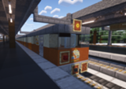

### 北泉鉄道の現有車両

ここでは、北泉鉄道で運用されている車両を全車掲載しています。

### 100系

  
提供:北泉鉄道  
**製造:松牛重工業**  
**設計最高速度:110km/h**  
**営業最高速度:100km/h**  
**起動加速度:2.0 km/h/s**  
**常用減速度:3.5km/h/s**  
**非常減速度:5.0km/h/s**  
抵抗制御、空気ばね台車とか云う爺装備だが、  
金がないので代替されることもなく全車現役。特にリニューアルもされていない。  
北鉄では現在  
大塚以北延伸が予定されているが、  
そこにも使用予定。床が焦げるかも。ごめんね。  
編成は2M2T4連が18本、2M1T3連が2本。  
1018FのみTc-T-M-Mc、その他はTc-M-M'-Tc'。  

編成表・各車詳細

### 101F

|  | ←巖辻󠄀温泉・北泉西大塚 | | | |
| --- | --- | --- | --- | --- |
| 画像 |  |  |  |  |
| 号車 | 1 | 2 | 3 | 4 |
| 車番 |  |  |  |  |
| 形式 | クハ100形 | モハ100形 | モハ110形 | クハ110形 |
| 搭載機器 | ATC・ATS制御装置 | 電動発電機 コンプレッサー | 主制御器 パンタ | ATC・ATS制御装置 |
| 備考 |  |  |  |  |
| 備考(編成全体) | 1970年、開業時に増備されたグループ。冷房化改造施工済。 | | | |

### 102F

|  | ←巖辻󠄀温泉・北泉西大塚 | | | |
| --- | --- | --- | --- | --- |
| 画像 |  |  |  |  |
| 号車 | 1 | 2 | 3 | 4 |
| 車番 |  |  |  |  |
| 形式 | クハ100形 | モハ100形 | モハ110形 | クハ110形 |
| 搭載機器 | ATC・ATS制御装置 | 電動発電機 コンプレッサー | 主制御器 パンタ | ATC・ATS制御装置 |
| 備考 | 左翼専用車試験導入当該 |  |  |  |
| 備考(編成全体) | 左翼専用車試験時の姿 100系開業時製造組の中で最も原型に近い編成。非冷房。 | | | |

### 103F

|  | ←巖辻󠄀温泉・北泉西大塚 | | | |
| --- | --- | --- | --- | --- |
| 画像 |  |  |  |  |
| 号車 | 1 | 2 | 3 | 4 |
| 車番 |  |  |  |  |
| 形式 | クハ100形 | モハ100形 | モハ110形 | クハ110形 |
| 搭載機器 | ATC・ATS制御装置 | 電動発電機 コンプレッサー | 主制御器 パンタ | ATC・ATS制御装置 |
| 備考 |  |  |  |  |
| 備考(編成全体) | 行き先はLED。初期組ラストナンバー。冷房化済。 | | | |

#### 104F

|  | ←巖辻󠄀温泉・北泉西大塚 | | | |
| --- | --- | --- | --- | --- |
| 画像 |  |  |  |  |
| 号車 | 1 | 2 | 3 | 4 |
| 車番 |  |  |  |  |
| 形式 | クハ100形 | モハ100形 | モハ110形 | クハ110形 |
| 搭載機器 | ATC・ATS制御装置 | 電動発電機 コンプレッサー | 主制御器 パンタ | ATC・ATS制御装置 |
| 備考 |  |  |  |  |
| 備考(編成全体) | 冷房化改造済。中環みなと延伸時に追加製造されたグループ。 | | | |

### 105F

|  | ←巖辻󠄀温泉・北泉西大塚 | | | |
| --- | --- | --- | --- | --- |
| 画像 |  |  |  |  |
| 号車 | 1 | 2 | 3 | 4 |
| 車番 |  |  |  |  |
| 形式 | クハ100形 | モハ100形 | モハ110形 | クハ110形 |
| 搭載機器 | ATC・ATS制御装置 | 電動発電機 コンプレッサー | 主制御器 パンタ | ATC・ATS制御装置 |
| 備考 |  |  |  |  |
| 備考(編成全体) | 側面方向幕のない最後の編成。中環増備組。非冷房。 | | | |

### 106F

|  | ←巖辻󠄀温泉・北泉西大塚 | | | |
| --- | --- | --- | --- | --- |
| 画像 |  |  |  |  |
| 号車 | 1 | 2 | 3 | 4 |
| 車番 |  |  |  |  |
| 形式 | クハ100形 | モハ100形 | モハ110形 | クハ110形 |
| 搭載機器 | ATC・ATS制御装置 | 電動発電機 コンプレッサー | 主制御器 パンタ | ATC・ATS制御装置 |
| 備考 |  |  |  |  |
| 備考(編成全体) | 中環増備組。初めて側面に方向幕を搭載したグループ。冷房化改造済。 | | | |

### 107F

|  | ←巖辻󠄀温泉・北泉西大塚 | | | |
| --- | --- | --- | --- | --- |
| 画像 |  |  |  |  |
| 号車 | 1 | 2 | 3 | 4 |
| 車番 |  |  |  |  |
| 形式 | クハ100形 | モハ100形 | モハ110形 | クハ110形 |
| 搭載機器 | ATC・ATS制御装置 | 電動発電機 コンプレッサー | 主制御器 パンタ | ATC・ATS制御装置 |
| 備考 |  |  |  |  |
| 備考(編成全体) | 中環増備組。冷房化済。 | | | |

### 108F

|  | ←巖辻󠄀温泉・北泉西大塚 | | | |
| --- | --- | --- | --- | --- |
| 画像 |  |  |  |  |
| 号車 | 1 | 2 | 3 | 4 |
| 車番 |  |  |  |  |
| 形式 | クハ100形 | モハ100形 | モハ110形 | クハ110形 |
| 搭載機器 | ATC・ATS制御装置 | 電動発電機 コンプレッサー | 主制御器 パンタ | ATC・ATS制御装置 |
| 備考 |  |  |  |  |
| 備考(編成全体) |  | | | |

### 109F

|  | ←巖辻󠄀温泉・北泉西大塚 | | | |
| --- | --- | --- | --- | --- |
| 画像 |  |  |  |  |
| 号車 | 1 | 2 | 3 | 4 |
| 車番 |  |  |  |  |
| 形式 | クハ100形 | モハ100形 | モハ110形 | クハ110形 |
| 搭載機器 | ATC・ATS制御装置 | 電動発電機 コンプレッサー | 主制御器 パンタ | ATC・ATS制御装置 |
| 備考 |  |  |  |  |
| 備考(編成全体) |  | | | |

### 1010F

|  | ←巖辻󠄀温泉・北泉西大塚 | | | |
| --- | --- | --- | --- | --- |
| 画像 |  |  |  |  |
| 号車 | 1 | 2 | 3 | 4 |
| 車番 |  |  |  |  |
| 形式 | クハ100形 | モハ100形 | モハ110形 | クハ110形 |
| 搭載機器 | ATC・ATS制御装置 | 電動発電機 コンプレッサー | 主制御器 パンタ | ATC・ATS制御装置 |
| 備考 |  |  |  |  |
| 備考(編成全体) |  | | | |

### 1011F

|  | ←巖辻󠄀温泉・北泉西大塚 | | | |
| --- | --- | --- | --- | --- |
| 画像 |  |  |  |  |
| 号車 | 1 | 2 | 3 | 4 |
| 車番 |  |  |  |  |
| 形式 | クハ100形 | モハ100形 | モハ110形 | クハ110形 |
| 搭載機器 | ATC・ATS制御装置 | 電動発電機 コンプレッサー | 主制御器 パンタ | ATC・ATS制御装置 |
| 備考 |  |  |  |  |
| 備考(編成全体) |  | | | |

### 1012F

|  | ←巖辻󠄀温泉・北泉西大塚 | | | |
| --- | --- | --- | --- | --- |
| 画像 |  |  |  |  |
| 号車 | 1 | 2 | 3 | 4 |
| 車番 |  |  |  |  |
| 形式 | クハ100形 | モハ100形 | モハ110形 | クハ110形 |
| 搭載機器 | ATC・ATS制御装置 | 電動発電機 コンプレッサー | 主制御器 パンタ | ATC・ATS制御装置 |
| 備考 |  |  |  |  |
| 備考(編成全体) |  | | | |

### 1013F

|  | ←巖辻󠄀温泉・北泉西大塚 | | | |
| --- | --- | --- | --- | --- |
| 画像 |  |  |  |  |
| 号車 | 1 | 2 | 3 | 4 |
| 車番 |  |  |  |  |
| 形式 | クハ100形 | モハ100形 | モハ110形 | クハ110形 |
| 搭載機器 | ATC・ATS制御装置 | 電動発電機 コンプレッサー | 主制御器 パンタ | ATC・ATS制御装置 |
| 備考 |  |  |  |  |
| 備考(編成全体) |  | | | |

### 1014F

|  | ←巖辻󠄀温泉・北泉西大塚 | | | |
| --- | --- | --- | --- | --- |
| 画像 |  |  |  |  |
| 号車 | 1 | 2 | 3 | 4 |
| 車番 |  |  |  |  |
| 形式 | クハ100形 | モハ100形 | モハ110形 | クハ110形 |
| 搭載機器 | ATC・ATS制御装置 | 電動発電機 コンプレッサー | 主制御器 パンタ | ATC・ATS制御装置 |
| 備考 |  |  |  |  |
| 備考(編成全体) |  | | | |

### 1015F

|  | ←巖辻󠄀温泉・北泉西大塚 | | | |
| --- | --- | --- | --- | --- |
| 画像 |  |  |  |  |
| 号車 | 1 | 2 | 3 | 4 |
| 車番 |  |  |  |  |
| 形式 | クハ100形 | モハ100形 | モハ110形 | クハ110形 |
| 搭載機器 | ATC・ATS制御装置 | 電動発電機 コンプレッサー | 主制御器 パンタ | ATC・ATS制御装置 |
| 備考 |  |  |  | 変則尾灯 |
| 備考(編成全体) |  | | | |

### 1016F

|  | ←巖辻󠄀温泉・北泉西大塚 | | | |
| --- | --- | --- | --- | --- |
| 画像 |  |  |  |  |
| 号車 | 1 | 2 | 3 | 4 |
| 車番 |  |  |  |  |
| 形式 | クハ100形 | モハ100形 | モハ110形 | クハ110形 |
| 搭載機器 | ATC・ATS制御装置 | 電動発電機 コンプレッサー | 主制御器 パンタ | ATC・ATS制御装置 |
| 備考 |  |  |  | 変則尾灯 |
| 備考(編成全体) |  | | | |

### 1017F

|  | ←巖辻󠄀温泉・北泉西大塚 | | | |
| --- | --- | --- | --- | --- |
| 画像 |  |  |  |  |
| 号車 | 1 | 2 | 3 | 4 |
| 車番 |  |  |  |  |
| 形式 | クハ100形 | モハ100形 | モハ110形 | クハ110形 |
| 搭載機器 | ATC・ATS制御装置 | 電動発電機 コンプレッサー | 主制御器 パンタ | ATC・ATS制御装置 |
| 備考 |  |  |  | 変則尾灯 |
| 備考(編成全体) |  | | | |

### 1018F

|  | ←巖辻󠄀温泉・北泉西大塚 | | | |
| --- | --- | --- | --- | --- |
| 画像 |  |  |  |  |
| 号車 | 1 | 2 | 3 | 4 |
| 車番 |  |  |  |  |
| 形式 | クハ100形 | サハ100形 | モハ110^形 | クモハ110形 |
| 搭載機器 | ATC・ATS制御装置 |  | 主制御器 | ATC・ATS制御装置 電動発電機 コンプレッサー パンタ |
| 備考 | 変則尾灯・大型LED | 唯一のサハ | パンタなしの派生系 | 大型LED |
| 備考(編成全体) | 非冷房、LED試験車、4連ラストナンバー。 | | | |