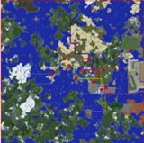

  
（2018年1月13日現在の路線図）

| 事業者名 | MCID | 創業日 |
| --- | --- | --- |
| nines南海鉄道 | ーーー | 2017/8月下旬ごろ |
| 武蔵電気鉄道 | musashi299 | yaba |
| [幸麓鉄道](https://seesaawiki.jp/toro_r/d/%b9%ac%cf%bc%c5%b4%c6%bb) | sakoppi | 2017/8月下旬ごろ |
| 寿司鉄道 | X6Z | 2019/10/23 |
| [毎王トロッコ鉄道](https://seesaawiki.jp/toro_r/d/%cb%e8%b2%a6%a5%c8%a5%ed%a5%c3%a5%b3%c5%b4%c6%bb) | tokyock1522 | 2015/冬頃(⑨) |
| [海色交通](https://seesaawiki.jp/toro_r/d/%b2%a6%c6%ee%c5%c5%b5%a4%c5%b4%c6%bb) | 2020/4/1 |
| [敷手鉄道](%E6%95%B7%E6%89%8B%E9%89%84%E9%81%93.md) | lolita\_is\_god | 20??/??/?? |
| 北陸旅客鉄道 / 北陸鉄建事業団(レイス連合総合交通局) | Laythe\_777 | 20??/??/?? |
| 盤津連邦旅客鉄道 | ikoko125 | 20??/??/?? |
| 北方鉄道ネットワーク（NTN）/ 北鯖鉄道 | 特別民間法人北方開発調整機構（代表：Spalits00, zeamichan）(この鉄道は公営です) | 2019/07/23 |
| [東占鉄道](%E6%9D%B1%E5%8D%A0%E9%89%84%E9%81%93.md)(とうせんてつどう) | Seibu\_Yellow | 2017/12/14 |
| 占都メトロ[?](https://seesaawiki.jp/toro_server/e/add?pagename=%c0%ea%c5%d4%a5%e1%a5%c8%a5%ed) | Seibu\_Yellow | 2018/3/25 |
| 都海鉄道(どはいてつどう) (Duhai Railway) | Spalits00 | 2018/07/28 |
| Airforce High Speed Rail(エアフォース高速鉄道) | Spalits00 | 2018/3/24 |
| [西鯖鉄道](%E8%A5%BF%E9%AF%96%E9%89%84%E9%81%93.md) | R18Crime | 2018/07/12 |
| [十呂市営地下鉄](https://seesaawiki.jp/toro_r/d/%bd%bd%cf%a4%bb%d4%b1%c4%c3%cf%b2%bc%c5%b4) | toropon | 2018/??/?? |
| 都市間高速鉄道[?](https://seesaawiki.jp/toro_server/e/add?pagename=%c5%d4%bb%d4%b4%d6%b9%e2%c2%ae%c5%b4%c6%bb)【新幹線】 | Nitori\_Choco,Seibu\_Yellow | 2018/10/19 |
| 南王鉄道[?](https://seesaawiki.jp/toro_server/e/add?pagename=%c6%ee%b2%a6%c5%b4%c6%bb)(なんおうてつどう) | kareraisu | 2019/3/2 |
| 斗蔭市営地下鉄[?](https://seesaawiki.jp/toro_server/e/add?pagename=%c5%cd%b0%fe%bb%d4%b1%c4%c3%cf%b2%bc%c5%b4) | Pemrt | 2019/7/1 |
| [大トロ電鉄](https://seesaawiki.jp/toro_r/d/%c2%e7%a5%c8%a5%ed%c5%c5%c5%b4) | keita\_yamatozi | 2019/9月頃 |
| [名頃鉄道](https://seesaawiki.jp/toro_r/d/%cc%be%ba%a2%c5%b4%c6%bb) | tanukiti | 2019/10/26 |
| [燕谷県交通局(燕谷県営地下鉄)](https://seesaawiki.jp/toro_r/d/%b1%ed%c3%ab%bb%d4%b1%c4%c3%cf%b2%bc%c5%b4) | tanukiti | 2019/09/01 |
| [中央鐡道](https://seesaawiki.jp/toro_r/d/%c3%e6%b1%fb%ef%c4%c6%bb) | Hidezou3 | 2019/12/?? |
| [海浜鉄道](https://seesaawiki.jp/toro_r/d/%b3%a4%c9%cd%c5%b4%c6%bb) | tanukiti | 2020/03/14 |
| 神埼鉄道[?](https://seesaawiki.jp/toro_server/e/add?pagename=%bf%c0%ba%eb%c5%b4%c6%bb) | Nameko\_2020 | 2020/3月頃 |
| [北海高速鉄道](https://seesaawiki.jp/toro_r/d/%cb%cc%b3%a4%b9%e2%c2%ae%c5%b4%c6%bb) | Hidezou3 | 2020/3/1? |
| [中央高速鉄道](https://seesaawiki.jp/toro_r/d/%c3%e6%b1%fb%b9%e2%c2%ae%c5%b4%c6%bb) | punipuni\_ | 2019/11/?? |
| 丑寅電鉄 | T5ukasah,KL\_LV280L1 | 2019/7/22 |
| 燕谷鉄道 | KL\_LV280L1 | 2019/11/2 |
| [赤城急行鉄道](https://seesaawiki.jp/toro_r/d/%c0%d6%be%eb%b5%de%b9%d4%c5%b4%c6%bb) | AKAGI185 | 2020/4/25 |
| [鵜の浜臨海鉄道](https://seesaawiki.jp/toro_r/e/add?pagename=%b1%ad%a4%ce%c9%cd%ce%d7%b3%a4%c5%b4%c6%bb) | AKAGI185 | 2022/4/3 |