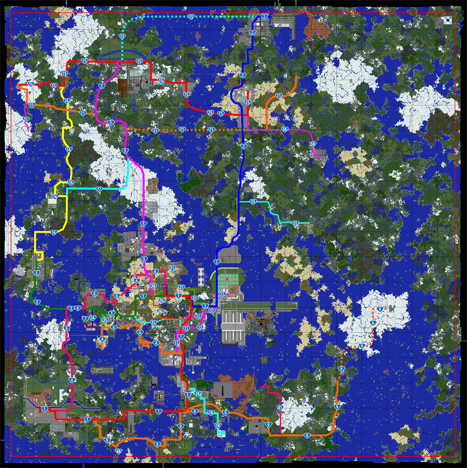

**目次**

* [路線一覧](#content_1)
  + [基幹鯖道](#content_1_1)
  + [補助鯖道](#content_1_2)

鯖道は協議の上で付番されます。付与希望の方はDiscord 交通チャンネルまで。  

### 路線一覧

#### 基幹鯖道

| 路線番号 | 起点 | 終点 | 所有者 | 備考 | 詳細情報 |
| --- | --- | --- | --- | --- | --- |
| 1号 | スポーン | 燕谷市 | sapporo\_salmon,hentekoch,sakoppi | 東横断道・燕谷道を含む |  |
| 2号 |  |  |  | 新東北道を含む |  |
| 3号 | スポーン |  | hosiharu,anthurum84,fhrk\_ | 春座高速・北中道を含む |  |
| 4号 | スポーン | 登里市 | Heigen\_midori,nm3r47,tetsuota\_salmon | 平原道・登里道・西乾道・登海岬連絡道を含む |  |
| 5号 | スポーン | さいべりあ市 | Heigen\_midori,sapporo\_salmon | 彩京道・松牛道・南雪道を含む |  |
| 6号 |  |  |  |  |  |
| 7号 | スポーン | 巴里市内 | sakoppi,womanwomen | 巴里道を含む |  |
| 8号 |  |  |  |  |  |
| 9号 |  |  |  |  |  |

#### 補助鯖道

準備中...  
  
  

**旧ワールド(1.19バージョンアップ前)**

|  |  |
| --- | --- |
|  |  |
| こんな道から（[高速道路](%E9%AB%98%E9%80%9F%E9%81%93%E8%B7%AF.md)） | こんな道まで（酷道） |

  

### 鯖道とは

鯖内の道路のうち、特に重要な路線を鯖道として指定し、鯖内の交通の円滑化を図ります。この鯖における現実世界の国道と同じ扱いです。詳細な規定はこちら-->[道路公団道路令](https://toro-road.game-info.wiki/d/%bb%aa%c6%bb%cf%a9%b8%f8%c3%c4)  

### 鯖道の一覧（2020年4月1日改正）

道路公団総裁は、[道路令](https://toro-trp.game-info.wiki/d/%c6%bb%cf%a9%ce%e1)（道路公団規則第四号）第五条及び第六条の規定に基づき、鯖道の路線一覧を公布する。  
  
**道路公団規則第二号**  
鯖道の路線番号、起点、終点、経由地は以下のとおりとする。

#### 幹線鯖道

| 路線番号 | 起点 | 終点 | 経由地 | 備考 |
| --- | --- | --- | --- | --- |
| 零号 | スポーン | スポーン | 環状 | スポーン堀外周道路 |
| 一号 | スポーン | 日尾市 | 幸麓県幸麓市、十呂市、南十県新蔵府戸市、宝徳市 | 十呂自動車道を含む。 十呂海東回り |
| 二号 | スポーン | 上都府斗蔭市 | 占都市、上都府高麗市 | スポーン〜幸麓県幸麓郡湖東村間は一号線と重複 東北自動車道を含む。 東ツベリア縦断道路（蘭州北JCT以北） |
| 三号 | スポーン | 燕谷県燕谷市 | 二取県二取市、同県志摩市、同県鹿島市 | 燕谷自動車道、燕谷都市高速道路を含む |
| 四号 | 十呂市 | 二取県帯広市 | 初島町、二取県二取市 | 十呂初島道路を含む |
| 五号 | スポーン | トロクワ市 | 創吠道牧港市、東京市、ソビエト市 | ツベリア縦断道路 |
| 六号 | スポーン | 日尾市 | 幸麓県空海郡稲垣町、創吠道阿佐ヶ谷市、二取県鹿島市、雪市 | 十呂海西回り |
| 七号 | スポーン | 二取県帯広市 | 創吠道阿佐ヶ谷市、同道松野宮市、二取県鹿島市、同県字島郡夕浜町 | スポーン〜二取県鹿島市間は六号線と重複 |
| 九号 | 宝徳市 | 丑寅市 | 南十県南陸市、西紗弥川郡東里村、紗弥川市、布賀市 | 南鯖横断道路 |
| 十号 | 十呂市 | 東紗弥川郡条河町 | 新蔵府戸市、紗弥川市、東紗弥川郡薫奈村 | 十呂市〜新蔵府戸市は一号線と重複 |
| 十一号 | 奥地県百舌桑市 | 肯市 | プププランド、ソビエト市、新富市、尾居ヶ浜市、高麗市 |  |
| 十二号 | 十呂市暁町 | 占都市 | 幸麓県幸麓市、占都市迎戸区 | 十呂都市圏縦断道路 |
| 十三号 | トロクワ市 | 上都府斗蔭市 | 上都湾 | 上都湾アクアライン（管理者：上都府） |
| 十五号 | 上都府高麗市 | 奥地県百舌桑市 | 北央県ゆきとみらい市、トロクワ市 | ツベリア中央横断道路 |
| 十六号 | 燕谷県燕谷市 | 奥地県百舌桑郡谷間町 | 南波市、セイブルグ市 | 西ツベリア縦断道路 |
| 十七号 | 創吠道城間市 | 南波市 | 創吠道具志川市、木音町 |  |

#### 補助鯖道

慣例として30番台を十呂大陸、40番台を南東大陸、南華大陸、50番台をツベリア大陸、60番台を燕谷大陸に割り当てます。  

| 路線番号 | 起点 | 終点 | 経由地 |
| --- | --- | --- | --- |
| 三十号 | 創吠道阿佐ヶ谷市 | 幸麓市本町 | スポーン特別区、二取県河夜 |
| 三十一号 | スポーン | 空海市 |  |
| 三十二号 | 幸麓県幸麓市 | 二取県二取市 |  |
| 三十三号 | 占都市 | 海鳴市 |  |
| 三十四号 | 二取県志摩市 | 二取県字島郡夕浜町大字上字 | 二取県字島郡夕浜町大字下字 |
| 三十五号 | 二取県帯広市 | 二取県志摩郡伏見村 （伏見動物公園第2牧場） |  |
| 三十六号 | スポーン | スポーン南駅 |  |
| 三十七号 | スポーン | 幸麓県川内市 | スポーン港 幸麓県七重浜市 |
| 四十号 | 南華岬灯台 | 日尾郡岬村 |  |
| 四十一号 | 十六夜県練馬市 | 梅美港 | 十六夜県十六夜市、十六夜県梅美町 |
| 五十号 | 上都府高麗市 | 宮崎市 | 肯市、強羅湖町、御河町、神埼市 |
| 五十一号 | 奥地県百舌桑市 | 奥地県大便市 |  |