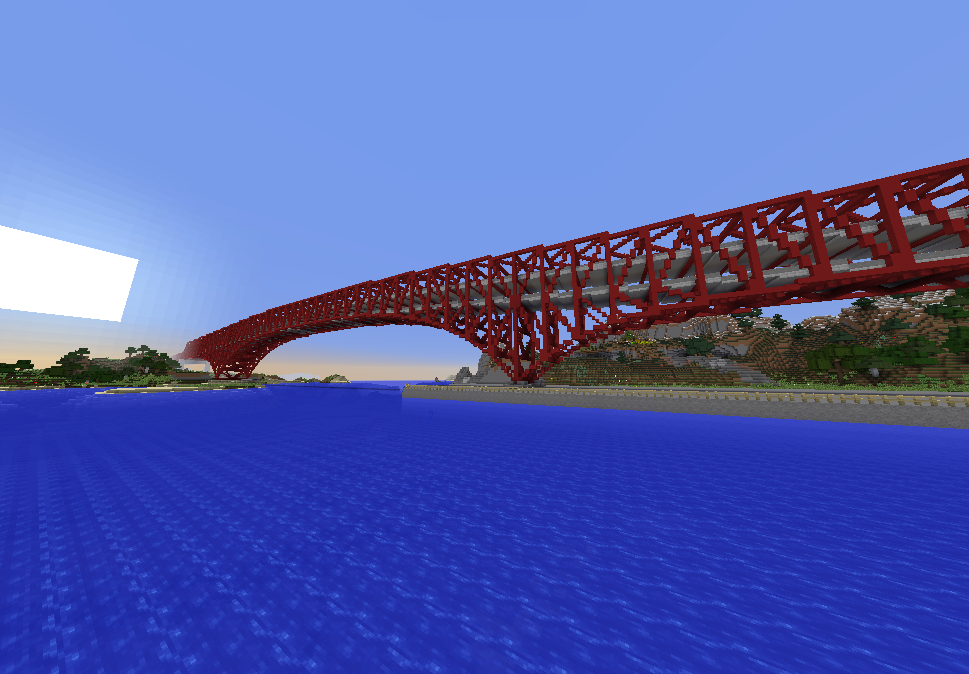
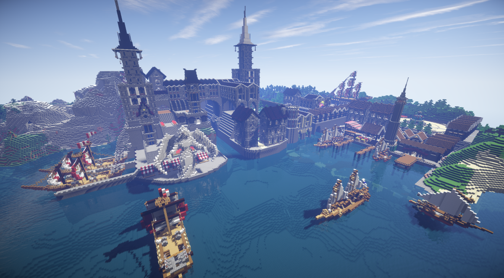
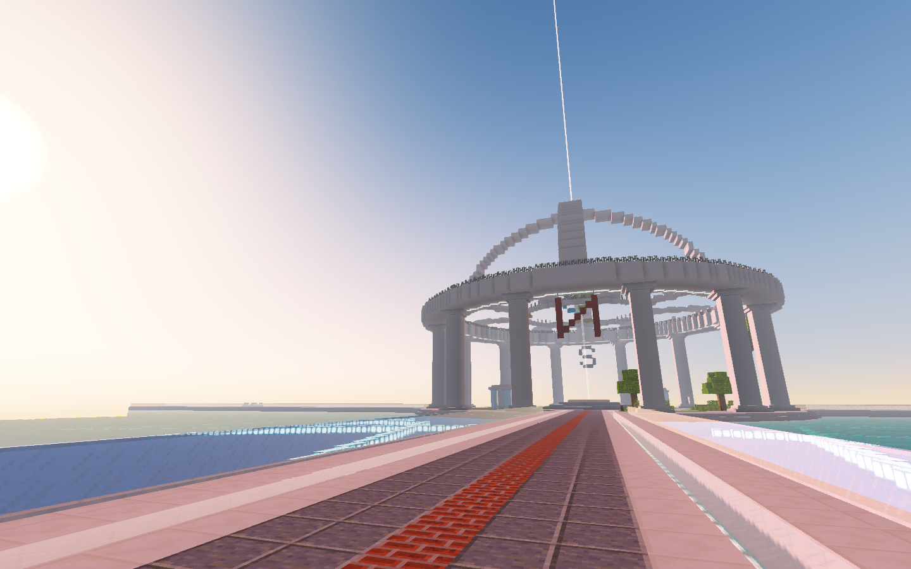
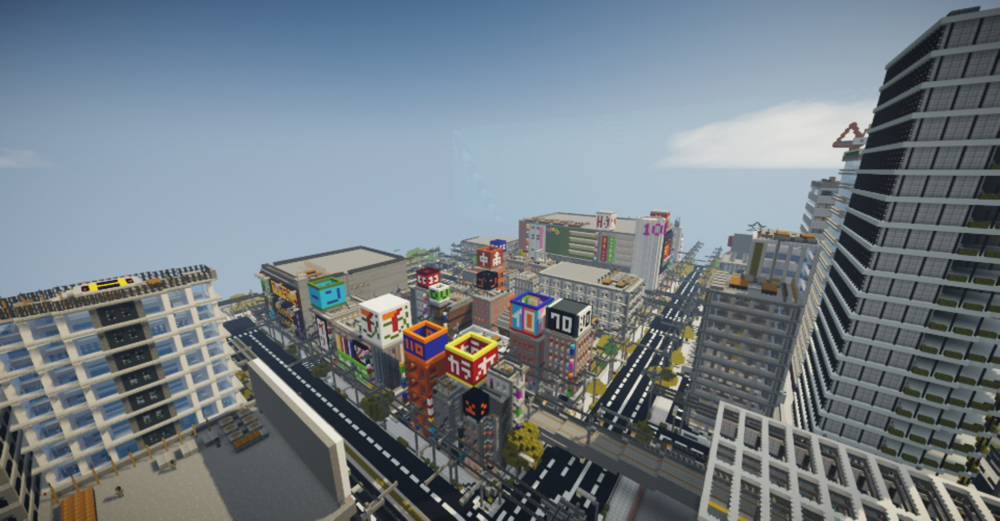
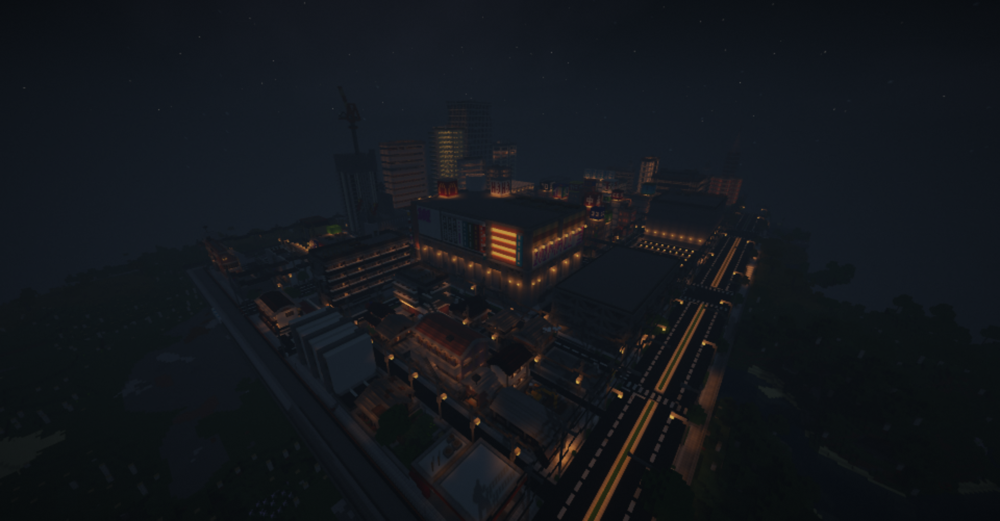
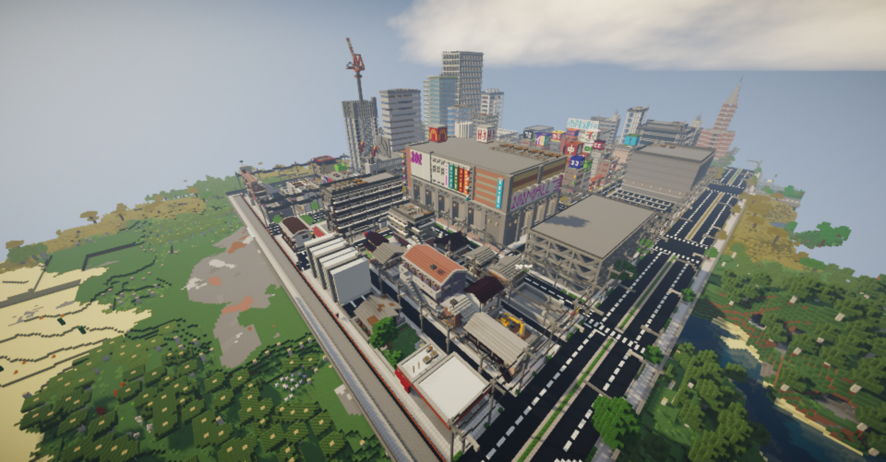
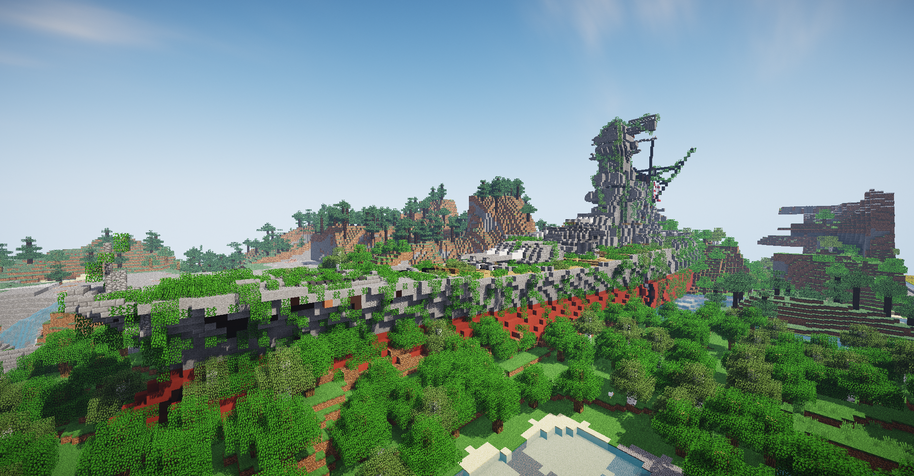
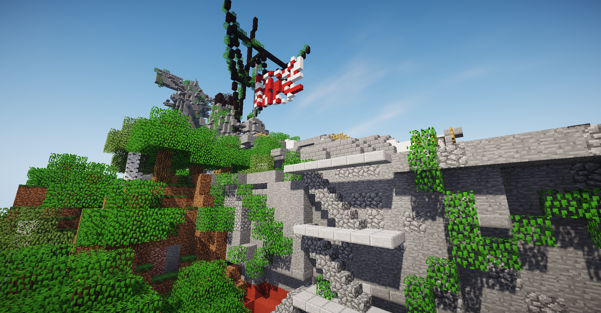
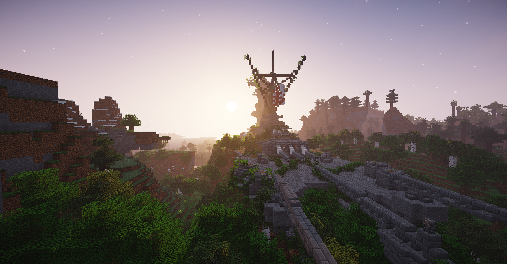

ここでは、TORO Serverに存在する建築物等の画像を掲載しています。  
  

**旧ワールド(1.19バージョンアップ前)**

### 初島大橋

  
初期スポーン地点の初島から大陸へTORO Server開発の大きな一歩を踏み出した橋。上層は道路、下層は鉄道のダブルデッキとなっている。中央支間長220m、最大桁下30m。大阪の港大橋がモデルです。

### レイス連合国第２都市「カオ・ノルド」

  
Laythe\_777が城塞都市製造機としての役目を開花させた最初の城塞都市。民間地区の造船所と城に直接組み込まれたドックが特徴で、造船が活発であると共に、巨大な港による海上輸送の要としての役割を果たしている、連合国の「海の玄関口」である。

### 新スポーン

  
2018年に作られた新しいスポーン地点。  
神聖な雰囲気を感じさせる。

### 南陸市

  

  

  
2019年3月〜2020年2月にかけて作られた南陸市。大きな商業都市であるが、治安は悪い。仮完成という形で完成したのでまだまだ町は作られていく予定だ。

### 要塞大和

  

  

  
別世界から来た沈没した大和を要塞に再利用したものだ。船体を調査したところ、現世の大和と全く同じであると同時に、ソビエト日本帝国海軍大和の船体に欠陥が見つかった。