### ソビエト日本帝国軍

ようこそ！我が「ソビエト日本帝国軍」へ！この軍はソビエト社会主義共和国連邦と大日本帝国が統合してできた軍隊で、祖国を防衛、監視し、敵国を攻撃、侵略、世界征服をするために作られた軍である。陸、海、空の軍隊の整備も整ってきたので、今回はそれを紹介しよう！  
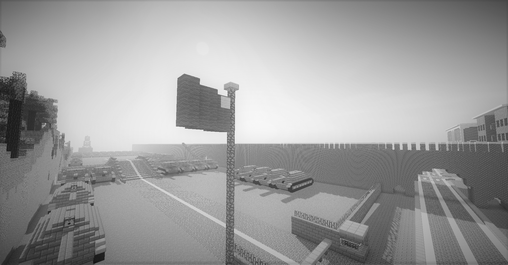

#### ソビエト議会員

最高指導者：President\_Ender  
副最高指導者：haruto\_wat  
軍事大臣：kareraisu  
ソ連作戦コード [https://d.kuku.lu/1492a7984a](https://d.kuku.lu/1492a7984a)  
  
2020年5月29日現在軍事力表 [https://d.kuku.lu/75ee89ce3b](https://d.kuku.lu/75ee89ce3b)

#### 軍事協力会社

陸軍：ティースリーフォー陸軍会社  
海軍：ソビエツキー造船会社  
空軍：スカイフォース空軍会社

#### 国歌

google ドライブ↓  
[https://drive.google.com/open?id=16E1jhdzyhmoD4HJ2...](https://drive.google.com/open?id=16E1jhdzyhmoD4HJ2-GrjOAV1SBusBVXA)

#### 基地・要塞一覧

### 国境第一防衛要塞

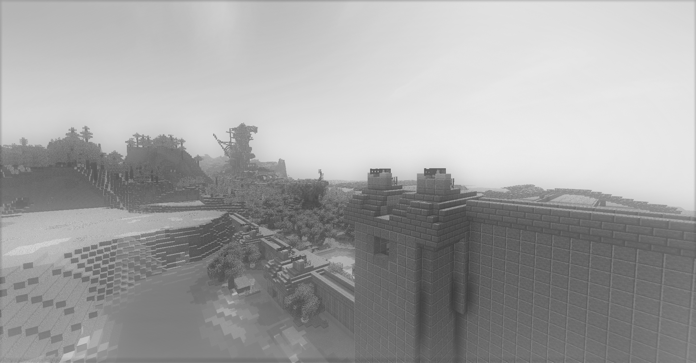

### ソ連陸軍基地

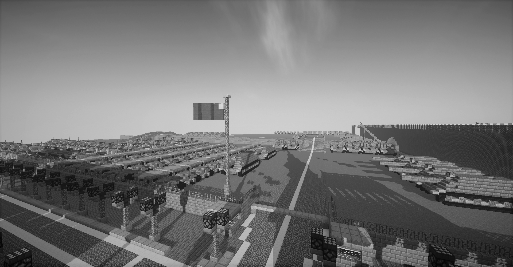

### ソ連第一軍事空港基地

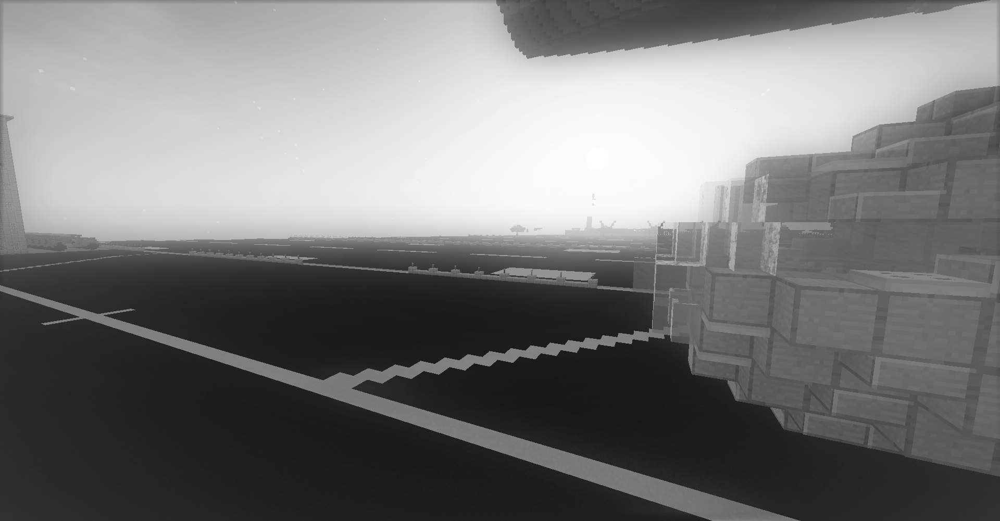

### 南条河基地

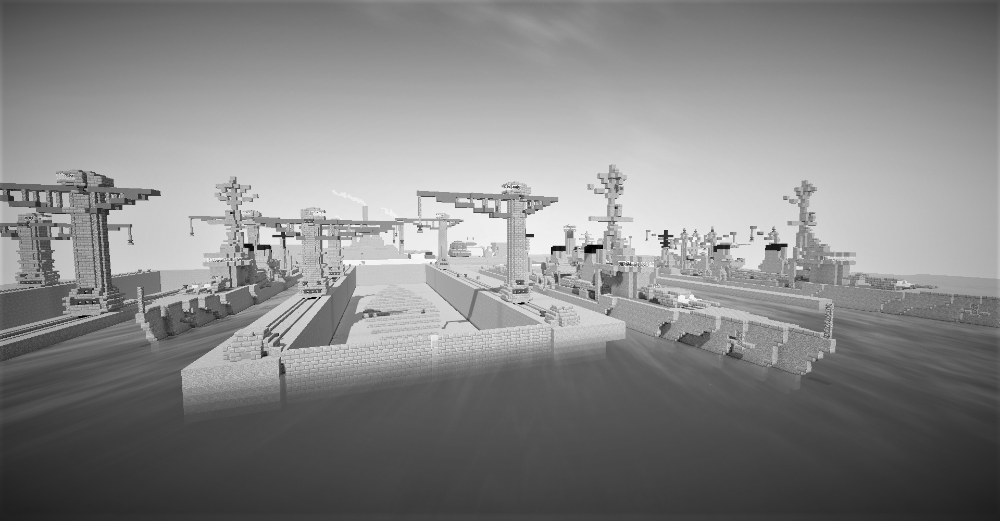

### 北条河基地

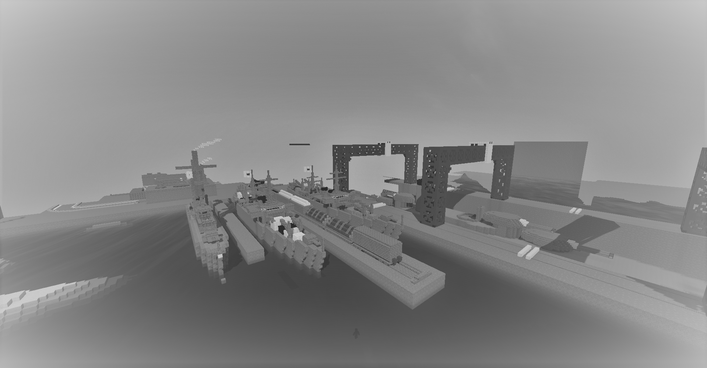

### 日尾基地

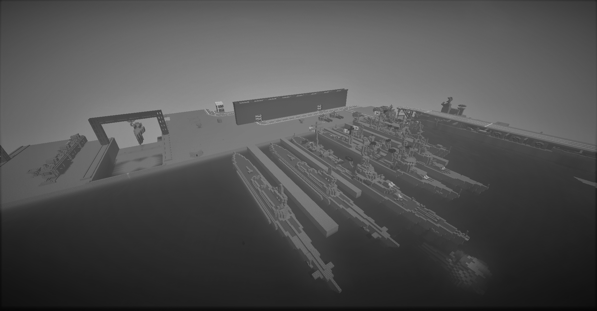

### 南陸基地

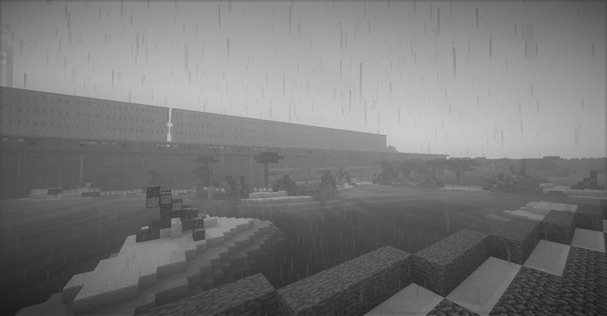

#### 「A」陸軍

主に陸上において軍事作戦を遂行する軍隊の一種である。ソ連は主に戦車の運用を進めており、すでに5種の戦車が製造されている  
陸軍軍歌 googleドライブ↓  
[https://drive.google.com/open?id=1rwHBeAWhTSQyYsGe...](https://drive.google.com/open?id=1rwHBeAWhTSQyYsGeI0P-tJLhhJ0W7DPu)

### 部隊編成

ここでは陸軍の兵の仕組みがどうばっているか説明しよう。

##### 部隊の分け方

部隊は兵舎1つに1大隊、その兵舎の中の部屋1つが1部隊となる。

##### 兵種

兵にも種類がある。それを紹介しよう。  
「A」一般兵　武器：AK-47 ナガンM1895 ナイフ　RGDS手榴弾2つ　普通の歩兵である。武器も基本的なものを持つ。彼らは「apyaaa」と叫びながらひたすら死にに行くのだ。  
「B」ドライバー　武器：ナガンM1895　シルバー階級以上であること、人員輸送者、戦車などのソ連のすべての軍事自動車を乗りこなせることを条件としては入れる。基本的には戦車や車を操作し、戦地へ向かう。  
「C」スナイパー　武器：モシン・ナガンM1892/30　ナガンM1895 ナイフ　アップ階級以上であることが条件となっており、基本的に遠方から敵を狙い撃ちするのが目的である。  
「D」爆弾設置・処理　武器：ナガンM1895　地雷　設置爆弾　補給路切断爆弾（作戦に応じて爆弾所持数、所持物が変わる）　ハイ階級以上であることを条件とされる。基本的に爆弾を設置もしくは取り外し、作戦の大きな役割を果たす。  
「E」指揮官　武器：ナガンM1895　エキスパート階級以上であることが条件とされる。部隊を指揮する、兵育成所のコーチをとる、後ろで後退する見方を打つなどのリーダー的行動をとる。また、指揮官になると上にいる兵種たちなどから別の路線へと移る。  
「F」特殊部隊　武器：APS PSS ナイフ　RGDS手榴弾　エリート階級以上であることが条件とされる。指揮官以外のすべての兵種の役割をこなす。まさに最強と言える部隊だ。  
また、各部隊にRPG-7が2つと10弾、ブローニングM2重機関銃が5つずつ毎戦配布される。

##### 階級

ソ日陸軍の階級は比較的単純なものだ。それを一つ一つ説明しよう。階級は6段階に分かれ、階級によってなれる兵種が違う。

#### 「N」ノーマル

ソ連陸軍に入って一番最初になる階級だ。まだ未熟なため、その階級は一般兵しか選択できない。

#### 「S」シルバー

ノーマルの階級の一つ上だ。ここでドライバーの兵種になることができる。

#### 「U」アップ

さらに上を行ったアップはスナイパーになることができ、そろそろなるのが難しくなってくる階級だ。

#### 「H」ハイ

さらにさらに上の階級のハイは爆弾設置・処理という兵種ができるようになる。特殊な兵種と階級なのでなるのも難しい。

#### 「E」エキスパート

一部の人しか入れないこの階級は、指揮官になることができる素晴らしい階級だ。ここから提督や陸軍長の道が開く。

#### 「EL」エリート

一番上の階級だ。ごくごく一部の人しかなることができない。特殊部隊になることができるが、その道は過酷で途中でギブアップする人も少なくはない。

##### 指揮官階級

もし君が指揮官になるのならば、それはほかの兵種の仲間と離れることを宣言するだろう。なぜなら指揮官になるとさらに上の道が開くからだ。

#### 部隊指揮官

指揮官になって一番最初になる階級だ。これは1つの部隊のリーダーを務め、命令したり、コーチをしたり、後退する味方兵を撃つなどのことをする。後退する人が親友でないことを願いたいな。

#### 大隊指揮官

大隊全体の指揮を執り部隊指揮官に命令をする。兵舎の管理もしなければならないため少し大変になる。しかし戦地に行くようなことがあまりないためその点では楽なほうだ。

#### 作戦長

現地での作戦指揮、大隊指揮官へ命令などをする。勝つか負けるかはこの人の指示にかかっている。負けた場合は粛清されるので、命懸けだ。

#### 提督補佐官

提督の補佐をとる。提督議会会議での手助けなどもする。ここで評価を上げれば提督に上りソ連議会から陸軍長へスカウトが来る可能性が高まる。

#### 提督

提督は提督議会での作戦考案、またそれをソ連議会に提出、そして遠方で作戦の指揮を執る仕事だ。基本的に作戦長に命令をする。

#### 大提督

提督議会の議会長をつとめ、作戦案決定権を握っている。定員は提督議会の議会数で変わる。

#### 陸軍大臣

陸軍の中でトップの人だ。これは大提督の中からソ連議会が指名をする。戦いの功績、今までの行動、忠誠心、賢さが選ばれるカギとなる。陸軍長になれば、ソ連議会に入りともに国づくりを進められるようになる。任期は最大8年だ。

##### 兵番号・呼び名

兵にもコードがある。それの仕組みを説明しよう。  
例えば、「陸軍121大隊ドライバー07部隊階級アップ03」という人がいる。これを応答時にいちいち言うのは大変だ。そこでコードができた。この場合「A121B07U03」となる。「A」は陸軍を表し、「121」は大隊番号、「B」は兵種、「07」は部隊番号、「U」は階級、「03」は出席番号となる。こうすればそこそこは言いやすくなる。  
指揮官の場合は例外とし、そのまま苗字となる。本名が「カレーン・ライス」の場合は「ライス」が苗字なので「ライス部隊指揮官」となる。また戦時ではない場合、指揮官に対してではない場合は自由な呼び名でよい。

##### 人員

陸軍前大隊300、1部隊18名、1大隊846名、250大隊分合計211.500、部隊指揮官大隊合計47名、部隊指揮官合計人数11750名、部隊指揮官合計大隊数250、ソ連陸軍合計大隊数500

### 駆逐戦車　SS-5

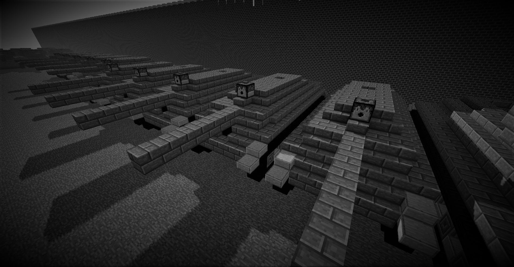  
この戦車は、ソ連で初めてできた三大戦車の一つで、陸軍の主力戦車の一つである。威力は低く、耐久性も引くい、しかし見つかりにくく速さも十分だ。よく敵の裏を突くために使われる。  
全長23m 全高6m 全幅7m

### 中戦車　IS-5

  
この戦車は、ソ連で初めてできた三大戦車の一つで、陸軍の主力戦車の一つである。駆逐戦車よりも威力は強くなっている。速さもそこそこで前線での活躍は大きい。バランスのいい戦車だ。  
全長21m 全幅7m 全高6m

### 超重戦車　SS-5

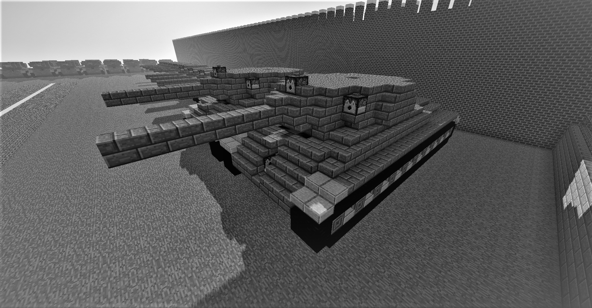  
この戦車は、ソ連で初めてできた三大戦車の一つで、陸軍の主力戦車の一つである。ソ連戦車の中ではトップの威力を誇り、攻撃力、耐久力の面ではかなり強い。しかしスピードは遅く、大きいため狭い道は通れないし、見つかりやすい。しかしその威力で前線を一気に突破し、戦いの大逆転を起こせる大切な戦車だ。  
全長28m 全幅11m 全高8m

### 撃プププ戦車

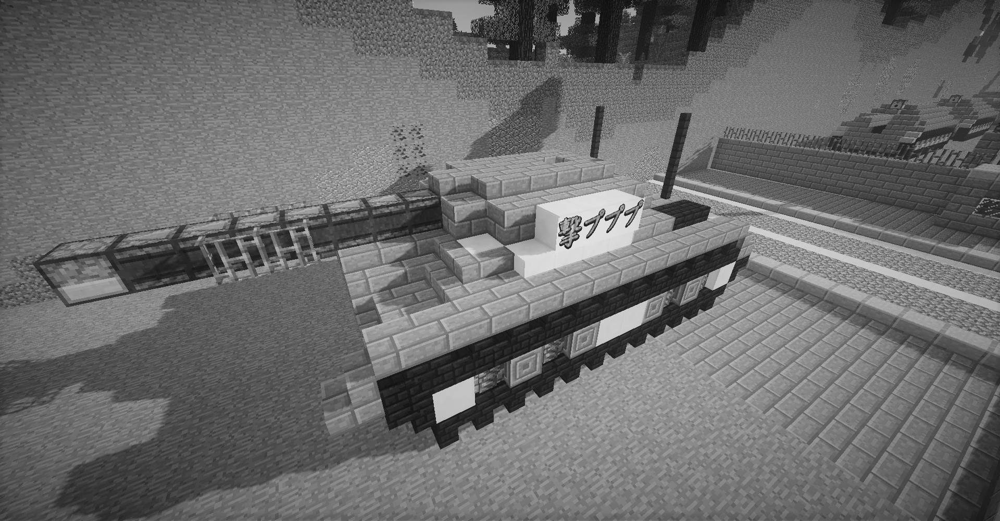  
名の通りプププランド侵攻のために作られた戦車である。皮肉なことにこの戦車を作った人はプププランド最高指導者である。そのためなのかよくわからないが、大量生産は禁止となっている。  
全長19m 全幅9m 全高7m

### 2連式超重戦車改良型戦車　2SS-5X

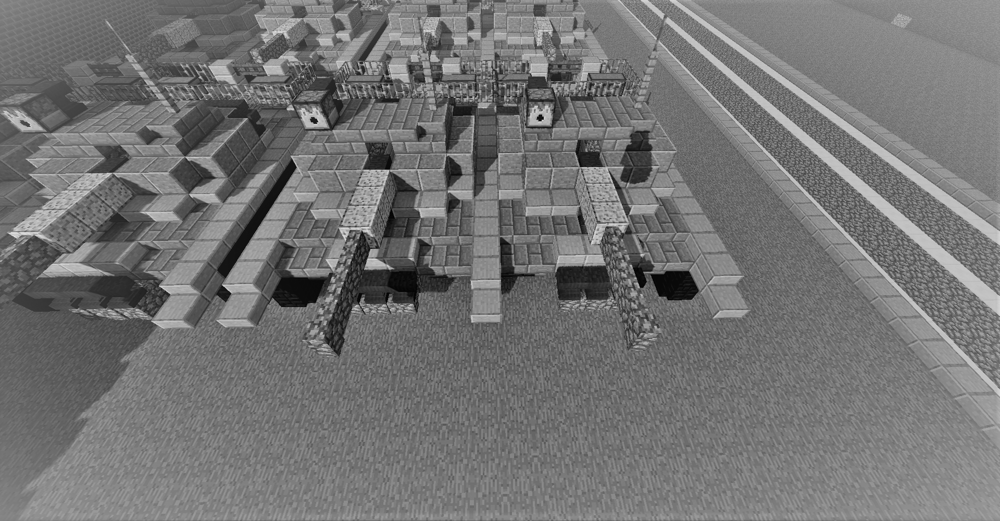  
この戦車はなんと2つの戦車が合体したものである。もともと、超重戦車の改良型のを作る計画が行われていたが中止になり、代わりにどっかの誰かさんがバカみたいな2つの戦車をくっつけた戦車を作ろうという計画を立て、これができた。威力はそこそこで速度はとても遅いし、見つかりやすく大きすぎて的になる、2人の連携が必要で、デメリットしかない戦車かと思われた。しかしこの戦車にもメリットがあった。それなりの人員輸送ができることだ。そして今では戦闘用ではなく歩兵を運ぶのによく使われている。  
全長18m 全幅17m 全高9m

### 超重戦車改良型戦車 SS-5X

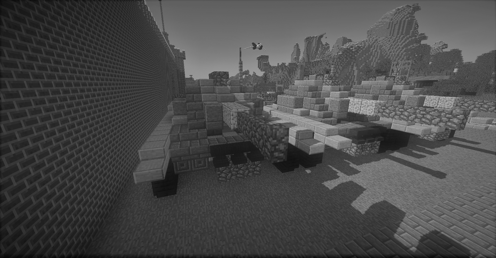  
設計ミスが原因で超重戦車改良型が作れなかった。しかし、ついに設計図が完成。審査が通り、この戦車が作られた。2SS-5Xより威力は弱いが超重戦車よりも威力は強く（設定）、速さもばっちりだ。デメリットしかない上の気持ち悪い戦車よりも100％良い出来となった。

### 小型戦車　E-1

ソビエト連邦は当時、大型の戦車しかなく、狭いみちっを通ることはできなかった。しかし、極力小型化された戦車が誕生した。通常の戦車よりも威力、耐久性は劣るが、速力、隠密性などの性能は格段に上がっている。海軍で言うくちくかんのような存在だ。  
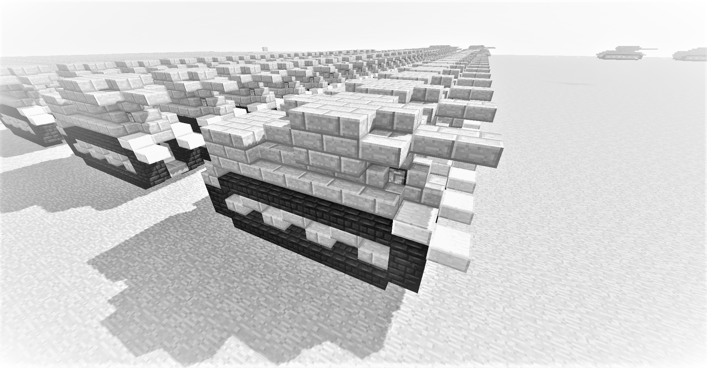

### 小型戦車　E-2

従来の小型戦車には問題があった。弾の威力と耐久性だ。そこで、改良型を作る計画が始まった。速力はE-1より劣るが、装甲、弾の威力に関しては上がったといえよう。従来戦車の威力、小型戦車の速力がバランスよく混ざった感じだ。  
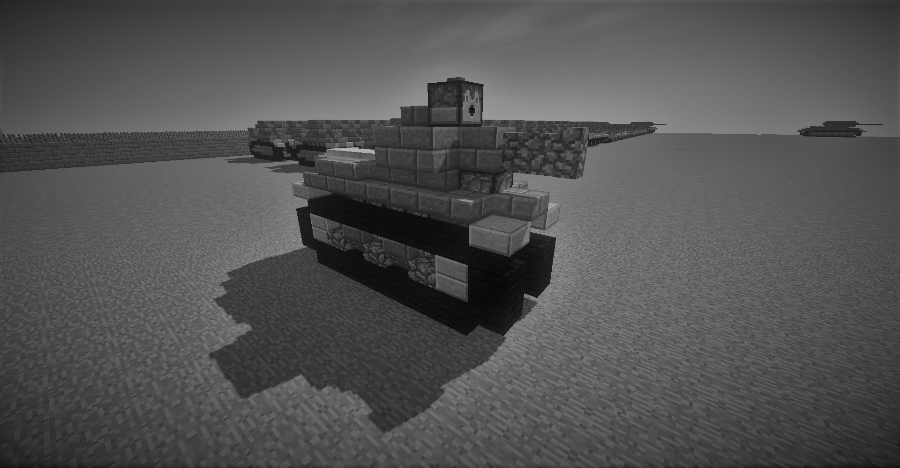  
  
道路制圧式軽戦車 K-5  
世界の発展とともにたくさんの道ができた。それは様々だ。そしてソビエト戦車の弱点、小さい道は通れないというのが浮いてきた。そこで道路先頭を専門とした戦車ができた。戦車の小ささはもちろん、早急に占領できるような設計になっており、弾の飛力、威力はまあまああるといったところだ。  
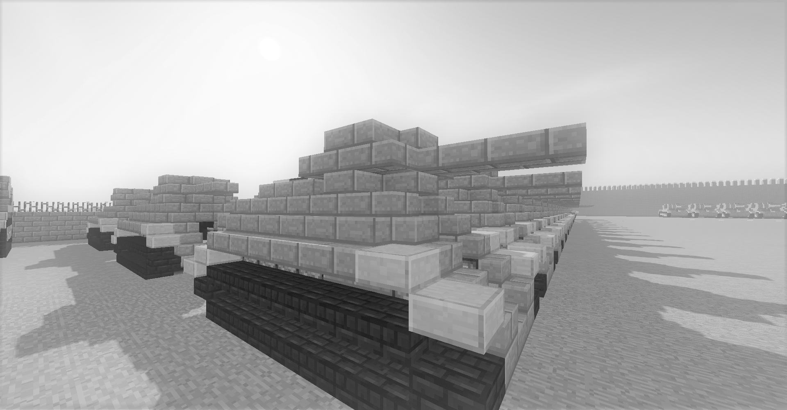  
  
IS-5改良型戦車 IS-5-2  
  
IS-5の改良型であるこの戦車は、弾の飛距離は伸びないものの、機銃を付けより対人用に近づいた設計となっている。三つの地域に対応した明細がついており、戦車の中での隠蔽性能はトップクラスだ。

### ソ連一般人員輸送車　5-G

  
一回目の戦闘で歩兵は大量にいるものの、輸送車がなくなかなか人をくれなかった。そこで次の戦闘に備え、早急に人員輸送者の設計を求められた。速さ、小ささ、輸送人数をバランスよく兼ね備えた車が完成した。（5-Gとはwi=fiのやつとは別です）

### 大型人員輸送車「5-T」

  
大規模な戦闘があった際、5-Gでちまちま人員を送るのは無理があった。そこで、数多くの人員をのせられ、山岳地帯を乗り越えられ、隠蔽性の高い人員輸送車の開発が始まった。見た目はまるで森のようで、下にある車輪がほぼすべての地形に有効であり、中には100名ほどの人が入れ、車を防衛するための機銃もついており、この上ない人員輸送車が完成した  
  
歩兵用救急車　5-S  
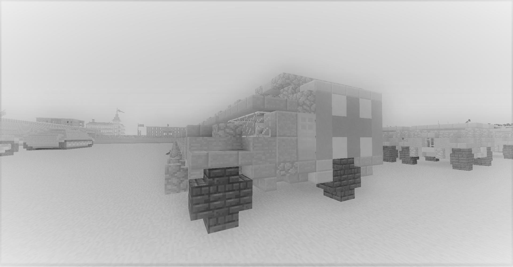  
5-Gを改装して作られた歩兵用の救急車は、救える数は一人に限られるがスピード、耐久性は十分にあるといえよう。

### ソ連水陸両用歩兵輸送車　5-T

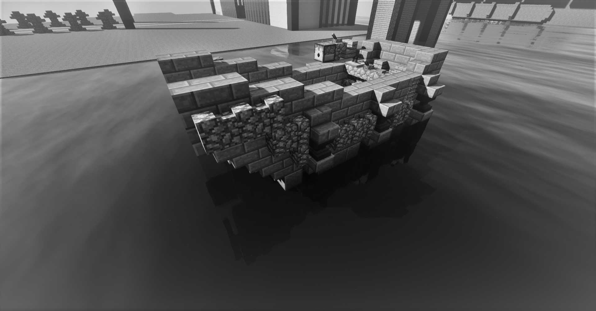  
大型人員輸送艦が完成しようとしている今、実際に歩兵が陸地に上陸するための車が完成した。パイロット3名含む21名が輸送可能。機銃も防衛威力を十分に発揮し、スピードもなかなかの速さだ。5-Tは長期運用がされるだろう。

### ソ連対地上爆弾炸裂砲

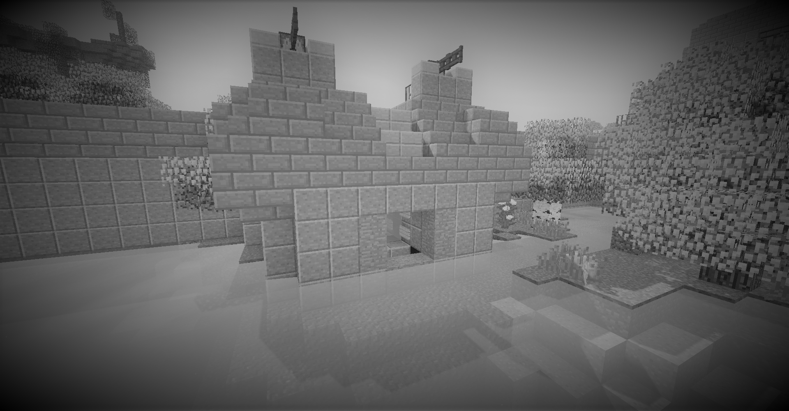  
ソ連国境第一防衛要塞にて初運用されたこの砲、地上にいる敵に対して広範囲に爆撃をする。モードを変えれば空中爆撃も威力は弱いができる。上には二つのm-1機銃がついている。

### 対歩兵用1連式機銃m-1

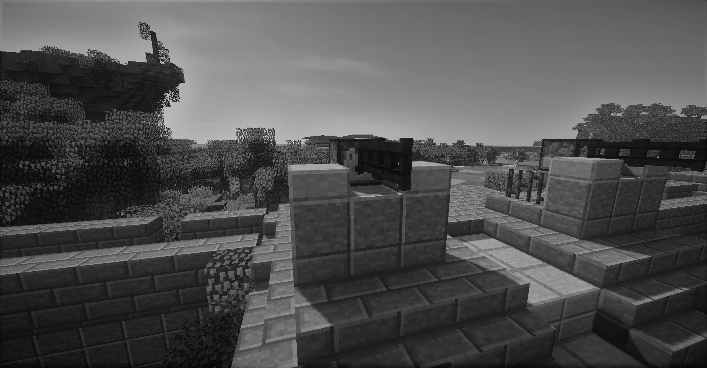  
ソ連国境第一防衛要塞にて初運用されたこの機銃、突撃してくる敵に対して最強に等しい連射力で攻撃する。よくソ連対地上爆弾炸裂砲の上部に搭載される。

### 対空爆撃炸裂砲

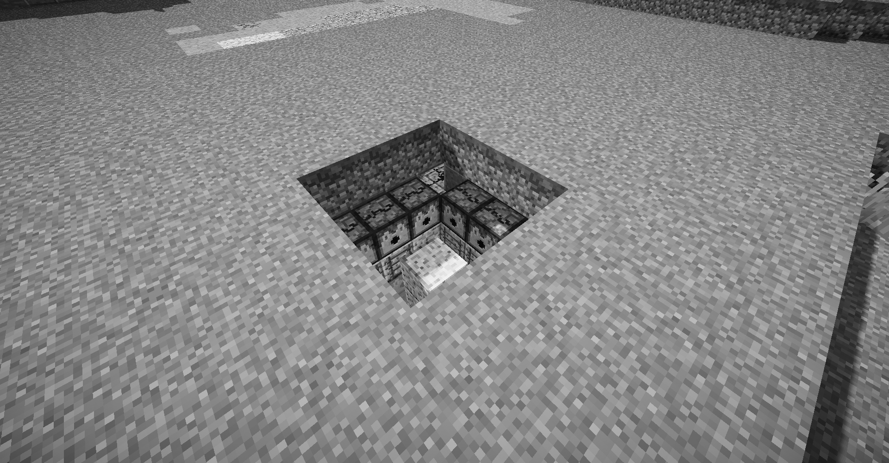  
ソ連国境第一防衛要塞にて初運用されたこの砲、対空用につくられており、一見ただのくぼみのように見えるがその威力は絶大で、拡散力も素晴らしい。ちなみに、くぼみのようになっているのは、カモフラージュのためだ。

### 長距離爆弾砲　TNT-TANK

これは祖国の存亡にかかわることなので紹介はできない。

### 近距離爆弾砲　TNT-STANK

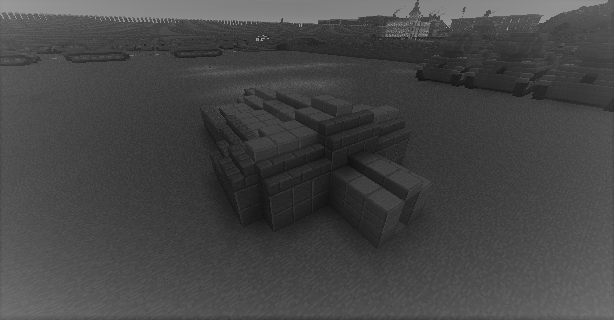  
ナメクジのような見た目と大きさが特徴だ。これは炸裂砲ではないが一定の方角のみに爆弾を飛ばすものだ。要塞防衛にもってこいだ。

### 防衛用対地拡散砲

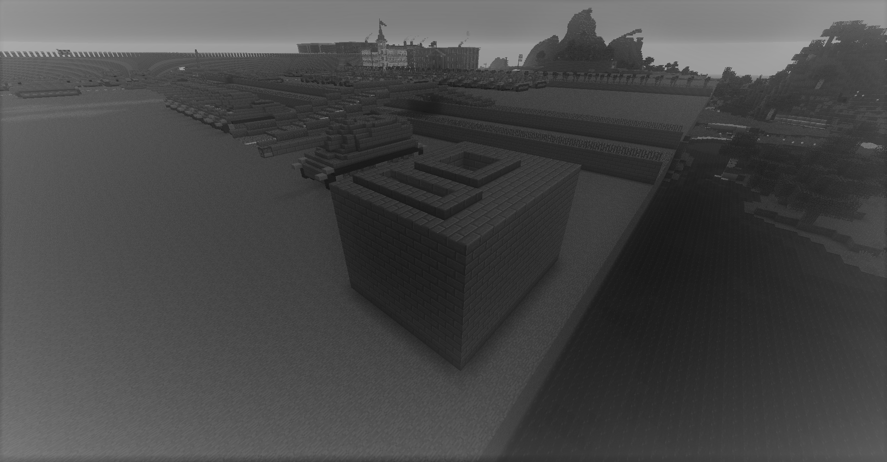  
四角く、コンパクトになったこの拡散砲、上の砲よりもずっと射程は安定しており、中距離の敵に均等にダメージを与えられる。攻撃力もあり、tntキャノン砲の中でも上位にたつほどのバランス性がある

### SM-1長距離弾道ミサイル

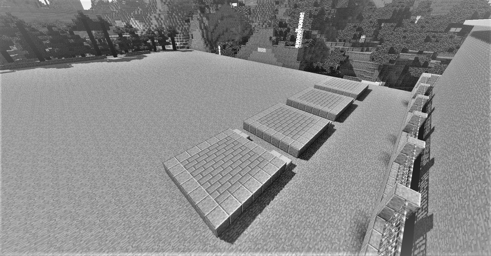  
一見ただのふただがその中には最低1000メートル、最高20000mまで飛ぶミサイルが搭載してある。その威力は一発で都市が吹き飛ぶというものだ（設定）。しかし、これほどのものは国連の許可がなければ発射ができず、敵の報復攻撃、違反した基地の破壊などに使われる。

#### 「B」海軍

軍事作戦のために主に艦艇を使用する軍事組織を言う。ソ連は海に力を入れ大艦隊を建造中だ。また、日本帝国海軍とソ連海軍の統合で、さらに力を増した。  
まず、海軍はどのような兵器を持ち、どのような段階があるのか説明しよう。  
海軍軍歌　googleドライブ↓  
[https://drive.google.com/open?id=1wUUpBhzP4JdnDegC...](https://drive.google.com/open?id=1wUUpBhzP4JdnDegCtW4fQFfhT_UF7Iak)

### 部隊編成

ここでは海軍部隊の編成制を説明しよう。

#### 部隊の分け方

1艦隊で1大隊　1隻で1部隊となっている。

#### 階級

ソ連海軍は陸軍のような「シルバー」「エキスパート」という階級はなく、すべて兵種のような名前で決まってくる。上からその段階が上がっていく

### 機銃操作員

艦の機銃などを操作し、敵航空機を撃墜させるのが役目だ。

### 副砲操作員

名の通り副砲を操作し、一斉射撃で敵を一掃する。

### 主砲操作員

艦の命である主砲を操作し敵艦撃沈に大きな役割を果たす。

### 異武装操作員

ミサイル、魚雷などの上3つに該当しない武装を操作する。

### 機銃操作長

各機銃に配備され、機銃操作員にどこを狙うかをその場で指示する。

### 副砲操作長

各副砲に配備され、副砲操作員にどこを狙うかその場で指示する。

### 主砲操作長

各主砲に配備され、主砲操作員にどこを狙うかその場で指示する。  
艦操作員  
艦橋などに配備され、主に艦の操作などを行う。

### 伝達官

戦況、外の状況などを艦長、武装官などに伝達する。

### 武装官

艦のすべての武装を管理、命令する。一斉射撃令を行うことも可能。

### 副艦長

副艦橋もしくは艦橋にて艦長の補助もしくは艦長がいないとき、いなくなった時の艦長を行う。

### 艦長

部隊指揮、艦指揮を艦隊長の命令にもとずいて行う。作戦を艦隊長とともに会議する。

### 副艦隊長

艦隊長の補助もしくは艦隊長がいないとき、いなくなった時の艦長を行う。

### 艦隊長

大隊、艦隊の指揮を主にステルス巡洋艦、空母、大和などで執る。

### 作戦員

艦隊で作戦会議を行わない場合にざっくりとした作戦を会議する。

### 作戦長

作戦員会議の長であり、作戦員会議時点での決定権はこの人にある。

### 海軍作戦大臣

海軍の作戦のすべてに決定権があり、勝敗は彼にかかっている。

### 海軍大臣

海軍作戦長の中から軍事長が1名指名し、作戦の決定権はないものの、戦闘許可、ソ連議会参加など難しい仕事をこなす。海軍の中でトップの人だ。（人気最高8年）  
その他にも清掃員、点検員、パイロットなどがいる。

### 赤星艦・無赤星艦

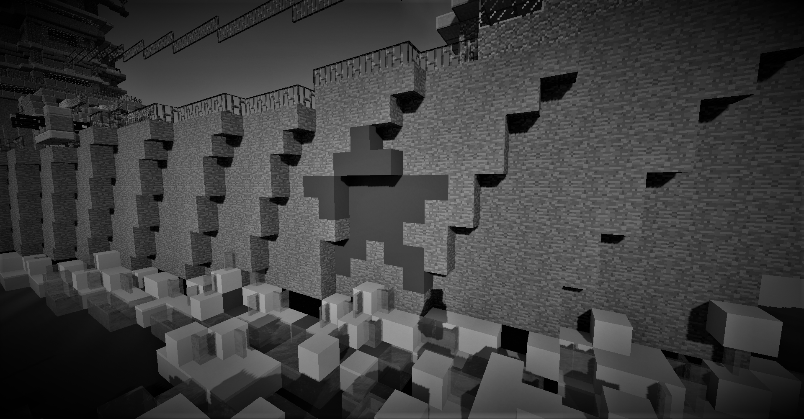  
赤星艦とはこれのことだ。では、これがあるとないとでは何が違うのだろうか。それは重要艦か、そうでないかである。赤星艦は主にミサイル艦、戦艦、作戦司令艦についており、それを味方に知らせるためのものである。無赤星艦は普通の巡洋艦、駆逐艦などに該当する。そのため、重要艦は造船時から決めなければならない。そしてこれはソ連特有のやり方なので、統合した日本帝国海軍とは違うこととなり、少し手間がかかる。

#### 軍艦紹介

さあお待ちかねの戦艦紹介だ。ここまで伸ばして申し訳ない。まずはこれを紹介しよう。

### 戦艦「Красная звезда」（日本語訳：赤い星）

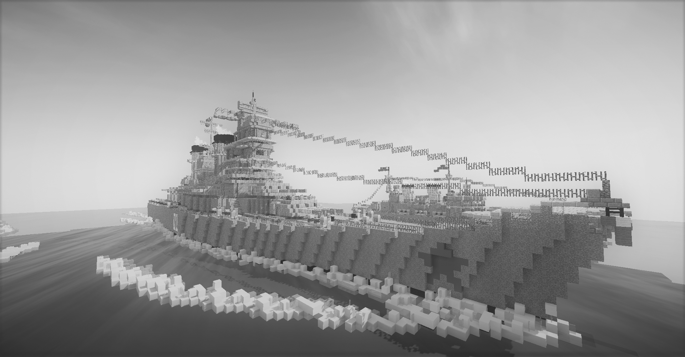  
まさにぴったりな名前だ。これはソ連で初めてできた海軍の船で、かなりの大きさである。  
全長210m 全幅39m 全高146m ソ連三連式主砲5門、ソ連二連式副砲18門、大型対空機銃14門、中型対空機銃10門、艦橋２．煙突２、救難ボート１２（120人輸送可能）、赤星艦

### 駆逐艦「Маленькая революция」（日本語訳：小さな革命）

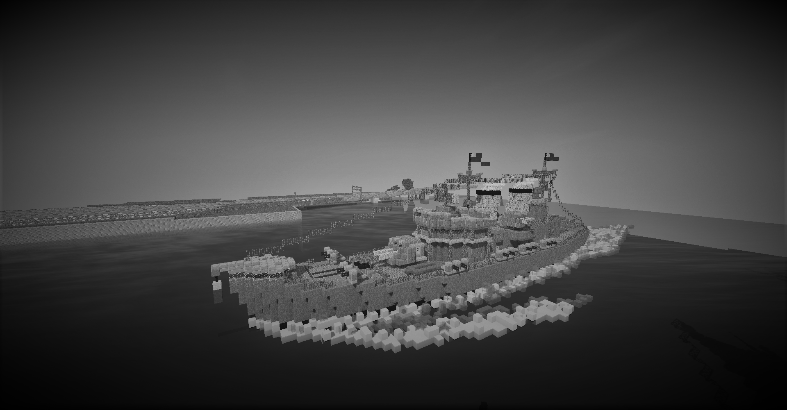  
ソ連は戦艦などの赤星艦の護衛を作りたかった。そこでできたのがこれだ。これは小さいながらも大きな革命を起こすカギになるとしてこの名がつけられた。武装の数は少ないものの、護衛としては丁度よくコストも低いため、大量生産が進められている。だいたいの赤星艦にはこの護衛1隻、2隻はついている。  
全長107m、全幅21m、全高37m ソ連二連式主砲2門、ソ連二連式副砲2門、小型対空機銃10門、大型対空機銃1門、艦橋2、煙突２、救難ボート２（20人輸送可能）

### 駆逐艦「птица」（日本語訳：鳥）

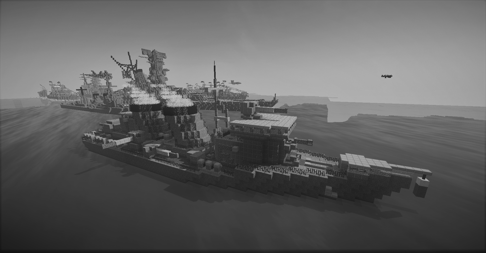  
ソ連海軍の中では最速といわれているこの駆逐艦。重要艦7の護衛というより制海権の取得、前線突破に使われることが多い。名前の由来は鳥のように素早く行動することができるとして名付けられた。  
全長97m 全幅21m 全高38m (船体のみ）ソ連2連式主砲1門、ソ連一連式副砲5門、中型対空機銃10門、魚雷砲2門、艦橋２、煙突2

### 駆逐艦「陽炎」

駆逐艦陽炎は、大日本帝国元所属で、駆逐艦の種類が少ないわが軍では、大きな役割を果たすだろう。  
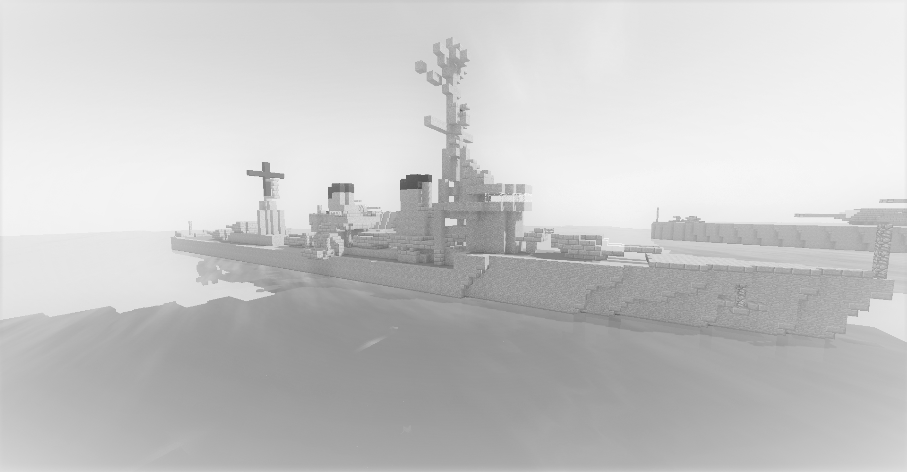  
全長124m 全高38m 全幅18m 50口径三年式12.7cm連装砲 3基6門 九六式25mm連装機銃 2基4門 九二式61cm四連装魚雷発射管 2基8門 九三式魚雷16本 九四式爆雷投射機 1基 爆雷投下台 6基 爆雷 18乃至36個

### 駆逐艦「雪風」

駆逐艦雪風は、大日本帝国元所属で、駆逐艦の種類が少ないわが軍では、大きな役割を果たすだろう。  
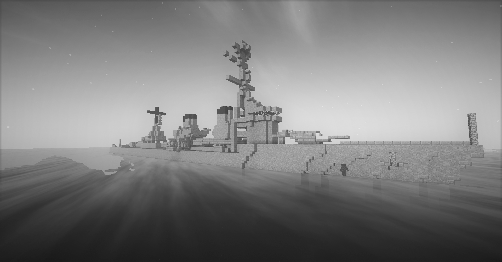  
全長134m 全高38m 全幅11m 50口径三年式12.7cm連装砲：3基 九六式25mm連装機銃：2基 九二式61cm四連装魚雷発射管：2基（九三式魚雷16本） 九四式爆雷投射機：1基 爆雷投下台：6基 爆雷：18乃至36個

### 駆逐艦「浜風」

駆逐艦浜風は、大日本帝国元所属で、駆逐艦の種類が少ないわが軍では、大きな役割を果たすだろう。  
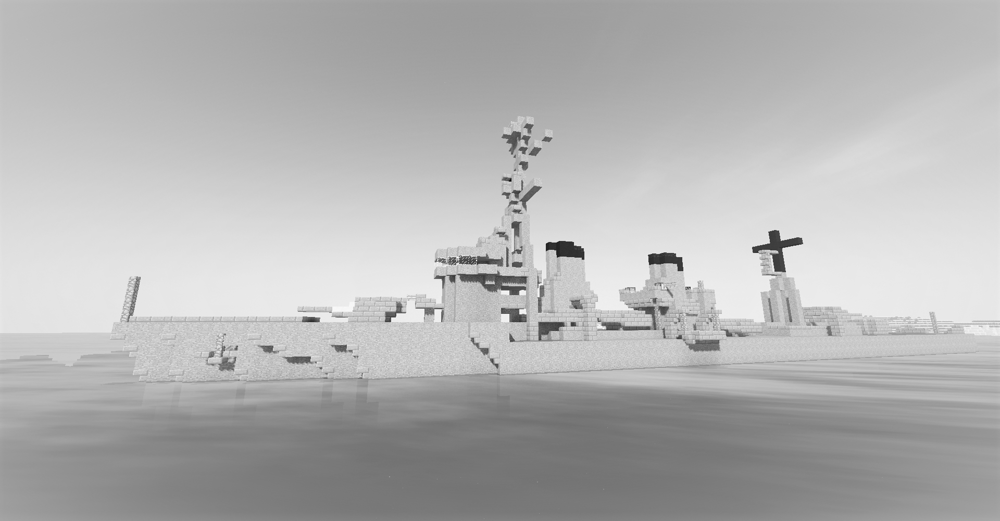  
全長134m 全高38m 全幅11m 40口径安式12cm単装砲 4門 三連式機砲 2挺 四四式18インチ(45cm)連装発射管 3基6門 魚雷12本

### 駆逐艦「親潮」

駆逐艦親潮は、大日本帝国元所属で、駆逐艦の種類が少ないわが軍では、大きな役割を果たすだろう。  
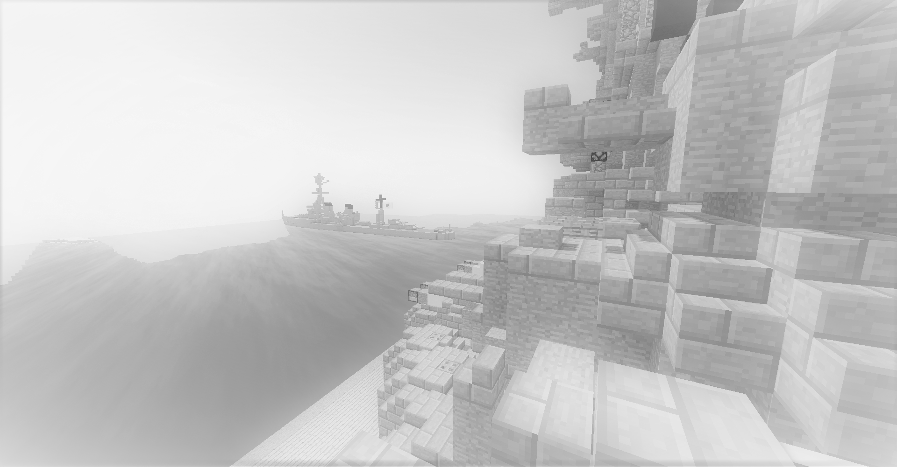  
全長124m 全高38m 全幅11m 50口径12.7cm連装砲×3 25mm連装機関砲（機銃）×2 61cm魚雷発射管4連装×2 対潜水艦用爆雷16個 他

### 駆逐艦「橋立」

駆逐艦橋立は、大日本帝国元所属で、駆逐艦の種類が少ないわが軍では、大きな役割を果たすだろう。  
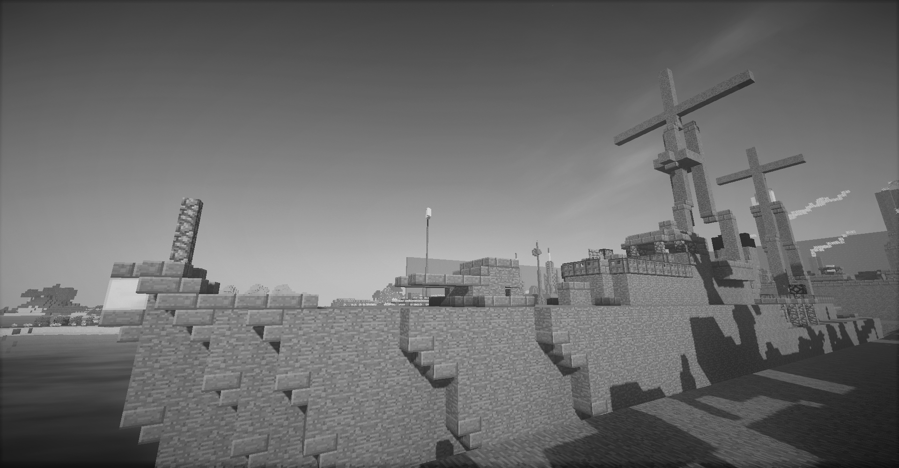  
全長81m 全高38m 全幅9m 32cm砲1門 12cm砲11門 47mm砲6門 35.6cm魚雷発射管4門

### 駆逐艦「島風」

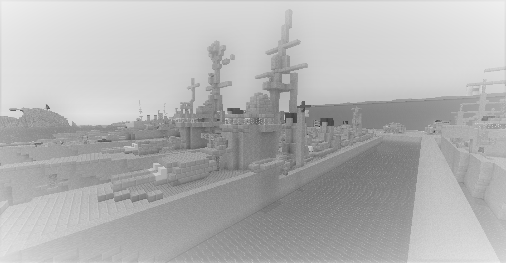  
駆逐艦島風は、大日本帝国元所属で、駆逐艦の種類が少ないわが軍では、大きな役割を果たすだろう。  
全長130m　全高39m 全幅9m 主砲3門、魚雷2門、機銃3門

### 巡洋艦「夕張」

唯一の普通の巡洋艦だ。ソ連の巡洋艦数0を少なくとも防いだ。  
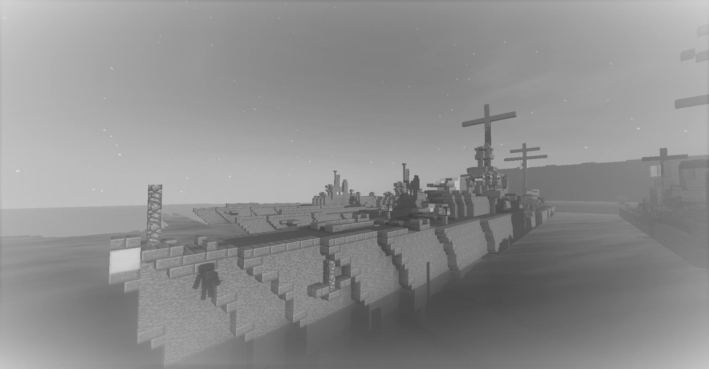  
全長139m 全高38m 全幅12m 50口径14cm連装砲2基4門 45口径12cm単装高角砲1門 25mm機銃3連装3基、同連装4基、同単装8挺、計25挺 61cm連装発射管2基 八年式(2号改2)魚雷10本 爆雷投下軌条2条 爆雷36個 探照灯1基

### ステルス巡洋艦「Красный дождь」（日本語訳：赤い雨）

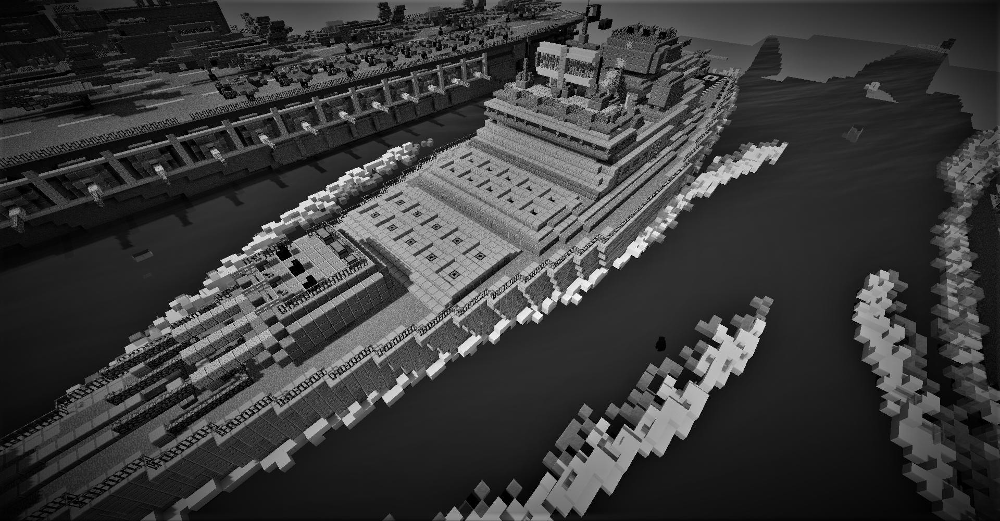  
大規模作戦が多くなった以上、ステルス性の船は必要だった。そこで研究に研究を重ね大量の予算を投資してできた船がこれだ。まさに、我が国の象徴といえよう。軍事武装の合計攻撃力はトップ、超重武装なのでデメリットも多いが、威力でその差を埋められるだろう。基本的には前線に立たず、後方でのミサイル攻撃を基本とし、よく作戦司令官がこの船に乗り艦隊の指揮を執る。なのでこの船は重要ということになり祖国2隻目の赤星艦となった。戦艦「Красная звезда」の駆逐艦2隻のような護衛とは違い駆逐艦2隻、戦艦1隻を必ず護衛にするようになっている。それは近距離攻撃に向いていないからだ。遠方攻撃が大半なため、近づかれればただの巡洋艦おろか、駆逐艦以下。しかもステルスレーダーを装備しているため、破壊されれば味方位置が敵にばれて、作戦が台無しになるのでこのような硬い護衛となった。  
全長161m 全高38m 全幅35m ソ連三連式主砲3門、ソ連1連式特別超重型砲2門、ソ連1連式超重型ステルスミサイル砲2門、ソ連10連式ステルスミサイル2機、艦橋２、煙突2、ヘリ専用滑走路１、SSH-100搭載、赤星艦、レーダー  
機銃も救難ボートもないため、近づかれたらおしまいというのがわかるだろう。でもこの武装、軍事予算でトップの資金が投資された。（お金が溶けてゆく...）ちなみにその軍事予算の投資合計金額は海軍がトップ、次いで陸、空軍となる。空軍はまだ2種しか開発が進んでいないので、あまり予算は使っていない。

### 重巡洋艦「古鷹」

  
少し現実のものと違うが、ソ日軍初の重巡洋艦として造船された。これ一隻で、小国一隻の戦艦の威力に匹敵するものとなるだろう。  
全長185m 全高45m 全幅17m 対空機銃6門、副砲4門、主砲4門、艦橋2?、煙突2

### 重巡洋艦「スターリン」

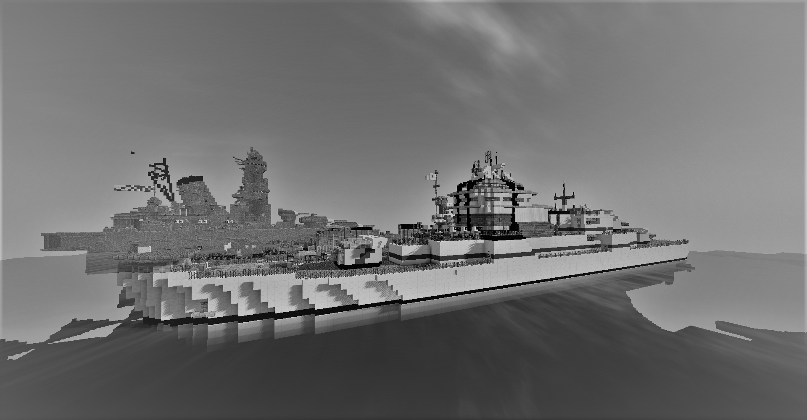  
ソ連軍事部はプププランドの宇宙進出、刃義国のイージスシステム搭載などによる近代化に遅れが出ていた。そこでソビエト議会では本格的なCIC、イージスシステムを搭載した艦を作る計画が出された。その書類の中に一つ、「自動反撃システムを搭載する。」と書かれていた。これはソ連トップ造船会社「ソビエツキー」の社員全員を驚かせた。自動反撃システムというものは作ったことも聞いたこともなく、このサーバー初でもあったからだ。そのせいか研究は苦戦し、この計画の一部を打ち切りすることまであった。そして多額の研究費、製作費をかけつくられたのがこの重巡洋艦だ。対艦自動反撃システム、CICを搭載し現代化に大きな一歩を踏み出せた。最低目標も達成し、これからはCIC、自動反撃装置のどちらかを搭載することを当たり前にしていく方針だ。しかし、やはり欠点も多くまだまだ研究は必要だ。  
全長183m 全高45m 全幅21m 主砲3門、対ミサイル機銃6門、対艦拡散砲4門、対空拡散砲4門、煙突2、艦橋2、対艦自動反撃装置、CIC

### 軽巡洋艦「天龍」

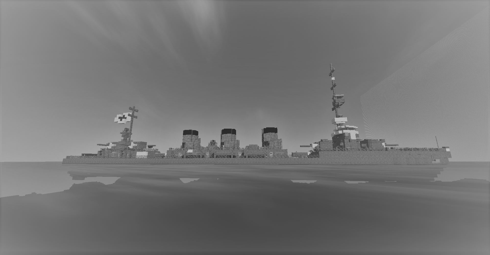  
巡洋艦の大量生産を目的で作られた天龍、ソ連領防衛を補助するのにちょうどいいものとなった。  
全長141m 全高43 全幅15m　主砲4門 魚雷2門 艦橋1 煙突3

### 戦艦「三笠」

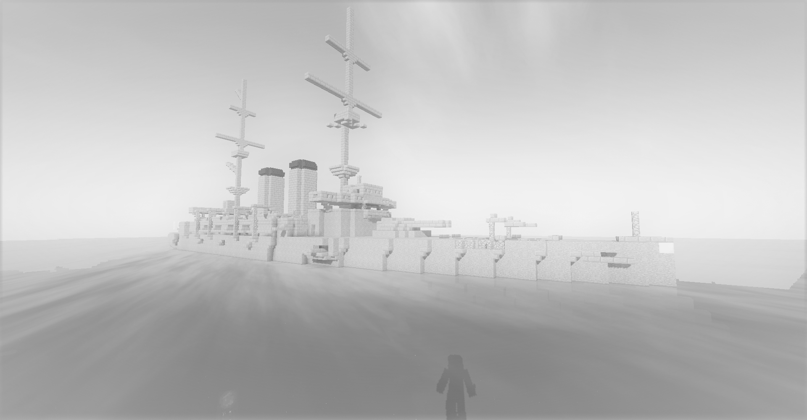  
全長131m 全高58m 全幅23m 主砲 40口径30.5センチ連装砲2基4門 副砲 40口径15.2センチ単装砲14門 対水雷艇砲 40口径7.6センチ単装砲20門 47ミリ単装砲16基 魚雷発射管 45センチ発射管4門

### 戦艦「大和」

戦艦と言ったらこれしかないだろう。戦艦大和！日本帝国軍との艦隊統合により新たに入ってきた船だ。  
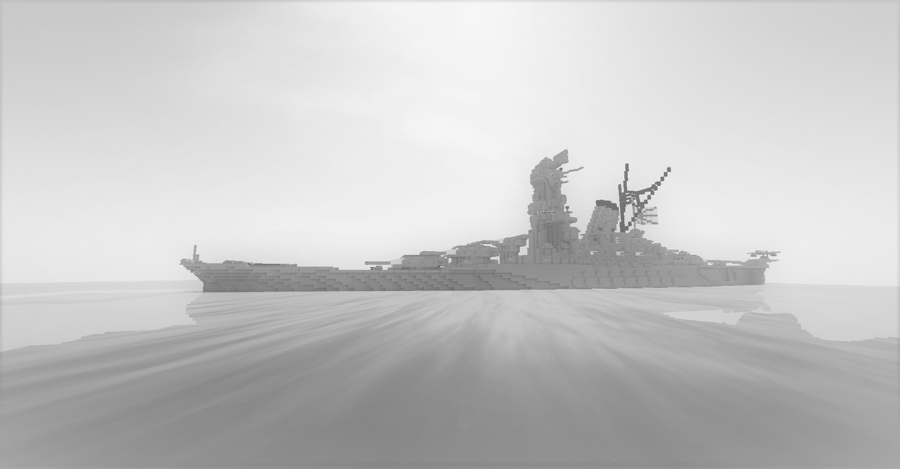  
全長263ｍ　全幅43m 全高（船底〜艦橋）74m 25mm三連装機銃、46㎝三連装砲、シールド付き25mm三連装機銃、シールド付き四十口径八九式十二糎七高角砲、25mm三連装機銃、カタパルト、二式水上戦闘機搭載

### 戦艦「赤星大和」

戦艦大和をソ連製に改造した戦艦「赤星戦艦」。1945年の大和沈没の反省を生かし機銃を所狭しと並べ、全長を大きくし、主砲を一つ加えた。耐久性を大幅に上げ、まさに最強の戦艦が出来上がった。しかし、戦艦大和よりも速力は落ちる。  
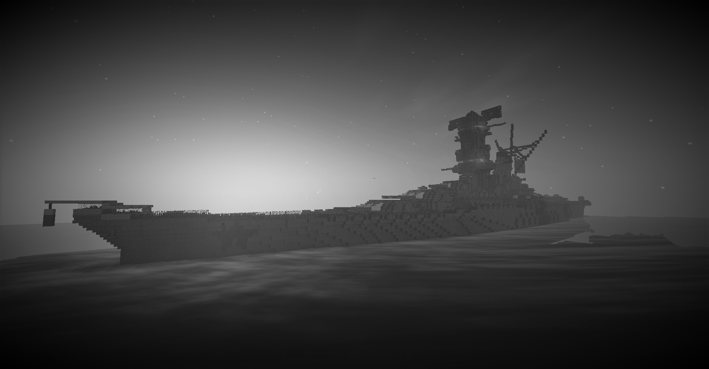  
全長291ｍ　全幅43m 全高（船底〜艦橋）74m 25mm三連装機銃、46㎝三連装砲、シールド付き25mm三連装機銃、シールド付き四十口径八九式十二糎七高角砲、25mm三連装機銃（ほか多数）

### 戦艦「武蔵」

皆さんご存じ戦艦武蔵だ。これは大和と共に主に南条河などの安全を守るためにつくられた。  
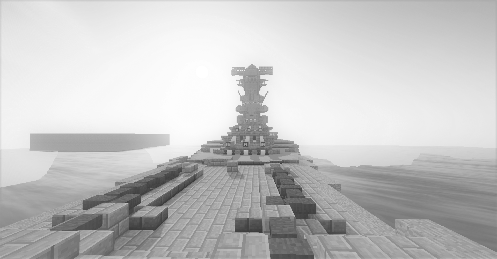  
全長263 全高69 全幅43 46cm(45口径)砲3連装3基9門 15.5cm(60口径)砲3連装2基6門 12.7cm(40口径)連装高角砲6基12門 25mm3連装機銃35基105門 25mm単装機銃25基25門 13mm連装機銃2基4門 12cm28連装噴進砲2基56門

### 戦艦「長門」「陸奥」

この二隻がそろえば大和以上の強さを発揮することが可能になるだろう。環境を支える柱、強く大きなその主砲は、まるで今のソビエト日本帝国海軍のようだ。  
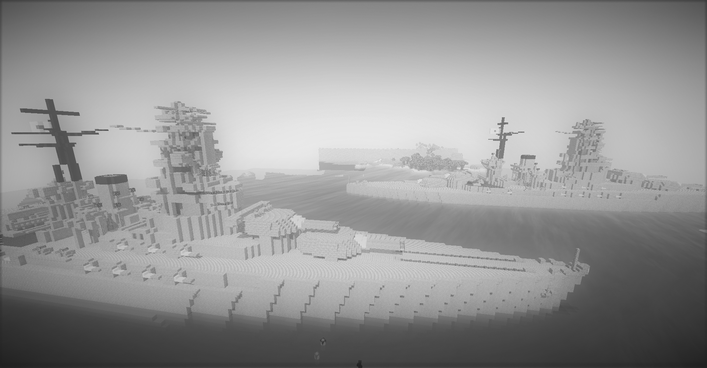  
全長255m 全幅35m 全高55.5m 41cm連装砲４基、14cm単装砲20基、7.6cm（40口径）単装高角砲 4基

### 潜水艦「伊400」

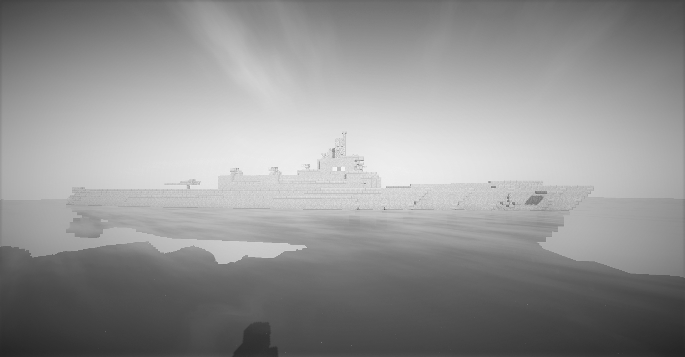  
全長122m 全高50m 全幅12m 40口径14cm単装砲1門 25mm3連装機銃3基 同単装1挺 53cm魚雷発射管 艦首8門 魚雷20本

### 潜水艦「伊401」

ソ連海軍には潜水艦がいまだない。なので頼もしい戦力となるだろう。  
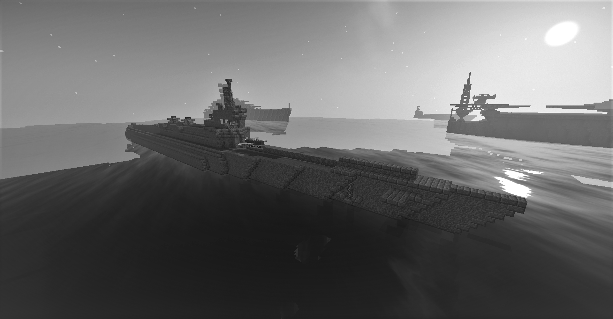  
0口径14cm単装砲 1門 25mm3連装機銃 3基9挺 25mm単装機銃 1挺 533mm艦首魚雷発射管艦首 8門 魚雷20本搭載 四式一号一〇型射出機 1基

### 空母「AKAZORA」

ソ連は空軍の軍事拡大を目指すべく、日本帝国軍の空母を改良して作った。そして初めてできたソ連製空母がこれだ。  
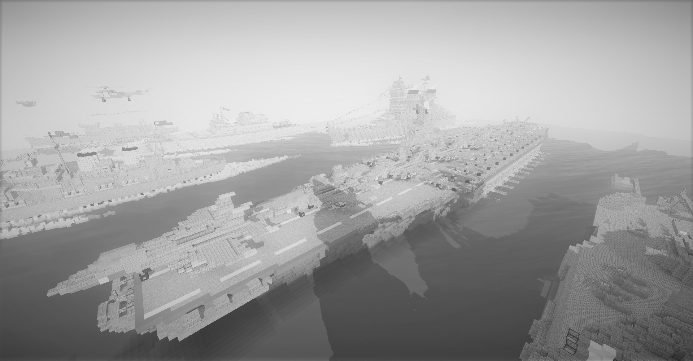  
ソ連空母用1連式主砲16門、25mm三連装機銃8門、大型対空機銃7門、艦橋1、煙突1、戦闘型無水上用戦闘機SSX-125 26基搭載可能、改良型ジェット機SSX-1300 8基搭載可能。

### 空母「信濃」

日本帝国海軍から入ってきた空母、AKAZORAやJSTANKなどのもととなったもので、旧式となってはいるが、今でも活躍している。  
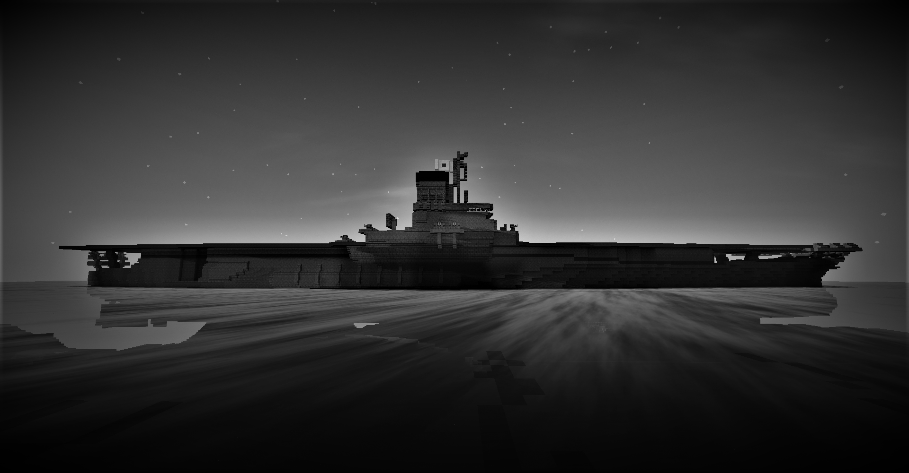  
12.7cm連装高角砲8基16門 25mm3連装機銃 37基[31]または35基 同単装機銃40基 12cm28連装噴進砲12基(後日装備)

### 空母「鳳翔」

日本帝国軍空母といったらこれだ。小さいながらも対空支援はトップクラスだ。  
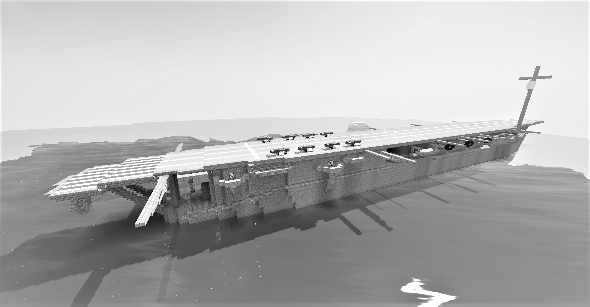  
全長198m 全高46m 全幅45m 14cm単装砲4門 13mm連装機銃6基12挺 山ノ内6cm礼砲4門

### 空母「Сила」（日本語訳：力）

空母なのに主砲を普通の戦艦よりも付けた接近戦闘用のこの空母は一見、空母戦艦にも見えるが空母ということになっている。ソ連初の正規空母で、対空砲火、主砲は戦艦3、4隻分という強さを誇っている。  
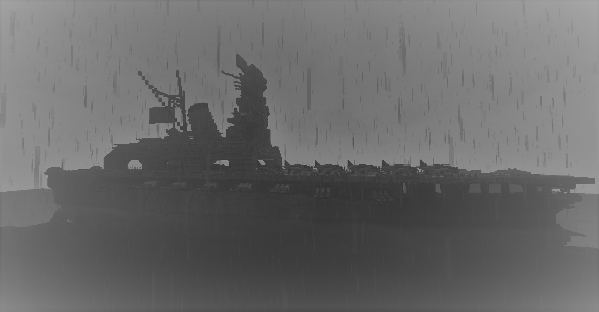  
全長263m 全高84m 全幅43m 主砲15門 対空砲火不明 対空戦闘機SSX-125を4機 レシプロ対艦攻撃機GFX-5000を20機 艦橋1 煙突1

### 空母戦艦「претендент」（日本語訳:挑戦者 チャレンジャー）

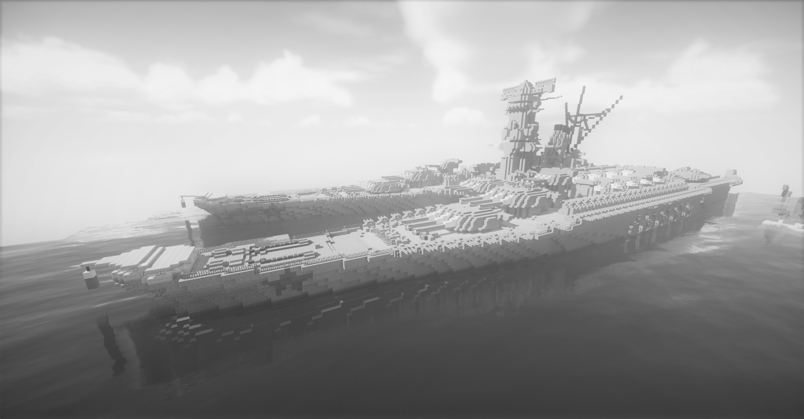  
我々は常に最強を追い求め続けた。そしてこれが完成した。名前は「チャレンジャー」まさに、この艦にふさわしい名だ。赤星大和2つくっつけ、その間に艦橋と滑走路、その周りに武装がつく形だ。副砲10門、そして主砲23門という化け物戦艦は一隻あれば確実に勝利を収めることができる。不沈の戦艦だ。  
  
空母戦艦「伊勢」  
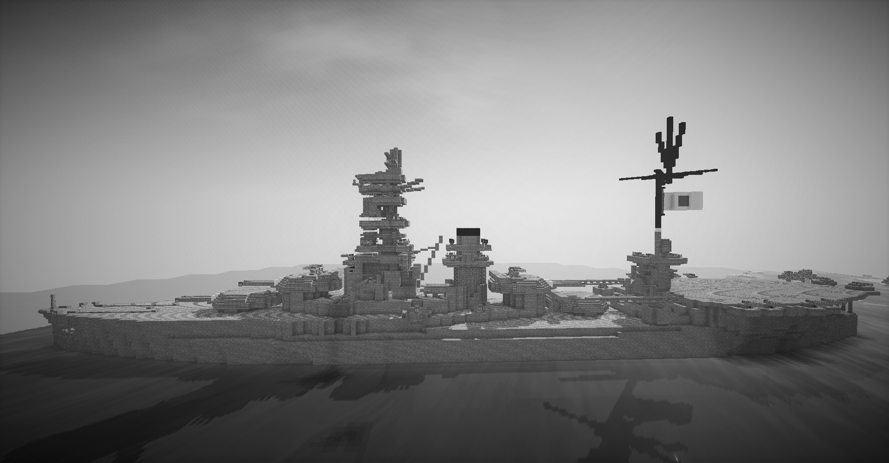  
一時期では駄作空母戦艦とまで言われていた「伊勢」であるが、それでも伊勢に残る強みを利用し、今でも退役を逃れている。  
全長219m 全幅39m 全高61.5m 三年式50口径単装速射砲20基 三年式40口径単装高角砲4基

### 大型輸送艦「信農」

  
大規模な上陸作戦を目的とし設計されたこの船は総重量トップクラスといえる大きさ、重さを誇っている。計12のクレーンが搭載車両を下ろし、戦場へ向かわせる形だ。おろした後の車両はまるでノルマンディー上陸作戦を思い出させるような光景となっている。  
全長532m 全幅62m 全高55m 主砲19門 ヘリポート2 艦橋1 煙突1 戦車、人員輸送車、爆撃機搭載可能

### レシプロ対艦攻撃機GFX-5000

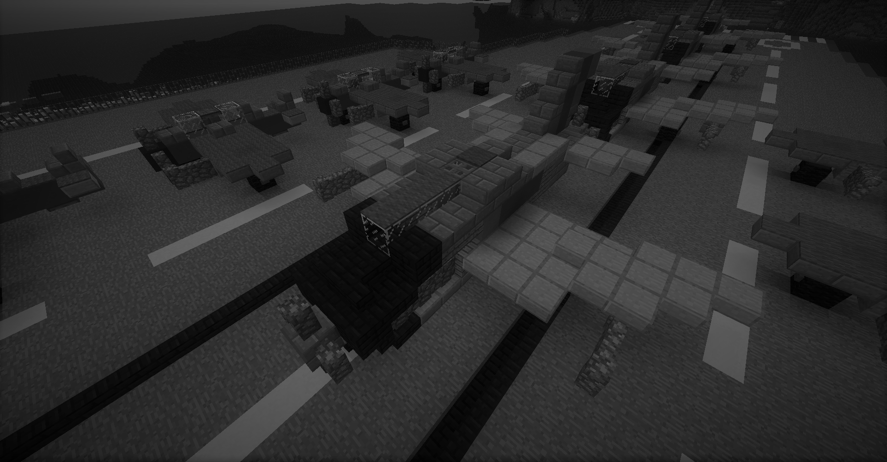  
海軍が設計した対艦攻撃機は、速力は遅く重量もあるが、攻撃性のはよくぶれることがほぼないため、命中確率は78％という高い確率を記録した。既に艦隊「революция」に運用している。

### ソ連第一艦隊「революция」（日本語訳：革命）001大隊

編成:戦艦「Красная звезда」2隻、戦艦「長門」1隻、戦艦「大和」1隻、戦艦「赤星大和」1隻、戦艦「チャレンジャー」1隻、ステルス巡洋艦「Красный дождь」1隻、駆逐艦「Маленькая революция」6隻、駆逐艦「птица」1隻、空母「AKAZORA」1隻、大型輸送艦「信農」1隻

### ソ連第二艦隊「南陸」002大隊

編成:戦艦「大和」1隻、戦艦「Красная звезда」1隻、駆逐艦「Маленькая революция」4隻、空母「AKAZORA」1隻

### ソ連第三艦隊「条河」003大隊

編成:戦艦「大和」、「武蔵」、「チャレンジャー」1隻 重巡洋艦「古鷹」2隻、軽巡洋艦「天龍」1隻、イージス巡洋艦「スターリン」1隻、駆逐艦「浜風」、「雪風」、「陽炎」、「橋立」1隻、空母「信濃」1隻

### ソ連第四艦隊「日尾」005大隊

編成：戦艦「長門」「陸奥」1隻、潜水艦「I-400」「I-401」1隻、駆逐艦「夕張」「島風」「親潮」1隻、空母「鳳翔」1隻、空母戦艦「伊勢」1隻

### ソ連第五艦隊「大和」006大体

編成:戦艦「大和」1隻、戦艦「武蔵」1隻、戦艦「赤星大和」1隻、空母戦艦「チャレンジャー」1隻、空母「信濃」、空母「Сила」1隻、（1隻入隊予定）

#### 「C」空軍

航空機を主な装備とし航空作戦・航空戦を遂行する軍隊の一種。 ソ連はいまだ空軍の研究はあまり進めていないが、空母ができてからどんどん戦闘機、爆撃機などを作っていく予定だ。  
空軍軍歌 googleドライブ↓  
[https://drive.google.com/open?id=1s-eLv-FMAQ6HtEWt...](https://drive.google.com/open?id=1s-eLv-FMAQ6HtEWtyz3duzDmVrh6WxsZ)

### 部隊編成

ここでは空軍部隊の編成制を説明しよう

##### 部隊分け方

1軍事空港で1大隊 1チームで1部隊

#### 階級

陸軍のような階級制度はないが、代わりに兵種が階級の役割を果たす。

### 点検員

機体の点検、修理、滑走路誘導などをし、基盤の役割を果たす。

### パイロット

機体を実際に動かし、戦地へ向かう。

### パイロット長

部隊の長で、部隊員に大隊長などの命令にもとずいて指示をする。

### 誘導司令官

機体が着陸する際、管制塔から滑走路への誘導指示を行う。

### 副軍事空港長

軍事空港長がいない場合、大隊指揮などを執る。

### 軍事空港長

作戦司令、軍事空港管理、大隊指揮などを執る。

### 作戦員

作戦員会議で空軍作戦会議。

### 作戦長

作戦員会議の長であり、作戦員会議時点での決定権はこの人にある。

### 空軍作戦大臣

空軍の作戦のすべてに決定権があり、勝敗は彼にかかっている。

### 空軍大臣

空軍作戦長の中から軍事長が1名指名し、作戦の決定権はないものの、戦闘許可、ソ連議会参加など難しい仕事をこなす。海軍の中でトップの人だ。（人気最高8年）

### 二式水上戦闘

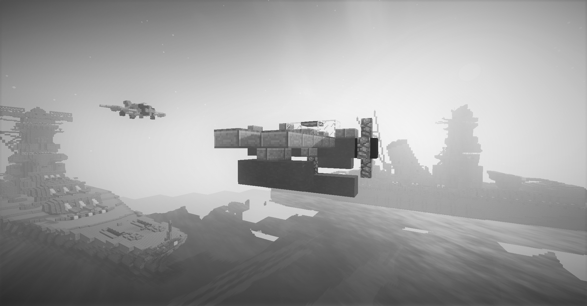  
日本帝国軍が提供してくれたソ連初の戦闘機である。

### 人員輸送用ヘリ　SSH-100

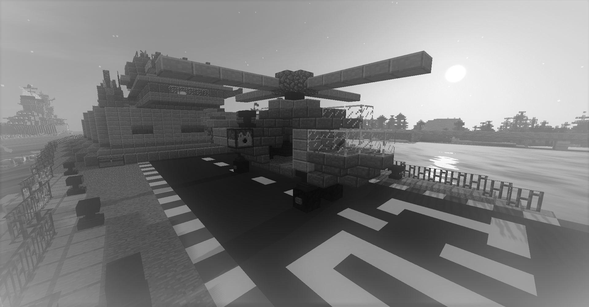  
初となるソ連製の空軍だ。攻撃用ではなく敵地の視察、人員輸送が目的とされている。武装はあるが強いわけではない。しかし、スピードは速く前線に増援を送るのにぴったりだ。耐久性もまあまああり、安全といえよう。ん？敵地視察したらすぐ居場所がばれるって？心配ない、基本的に海を渡っていき、乗せてもらう船はステルス巡洋艦だ。

### 対空戦闘機SSX-125

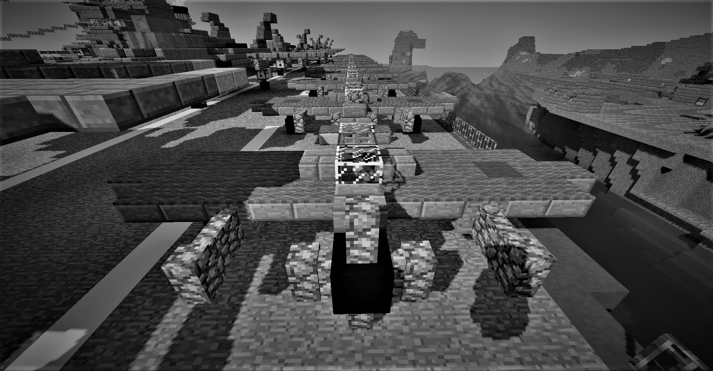  
日本帝国軍の二式水上戦闘機１おソ連製に改良した戦闘機である。水上式ではなくなったが、2つの機銃がかなりの威力を発揮する。我が国の主力戦闘機だ。

### 改良型ジェット機SSX-1300

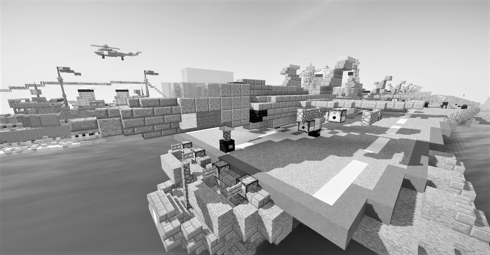  
他国のジェット機をソ連製に改良したものである。重ミサイル2機、機銃2機、超重ミサイル2機、超重機銃2機を搭載。すさまじい威力と速さは、他国と比べ物にならない。我が国の種戦闘機だ。

### B-29改良型ガンシップ兼爆撃機SBX-29

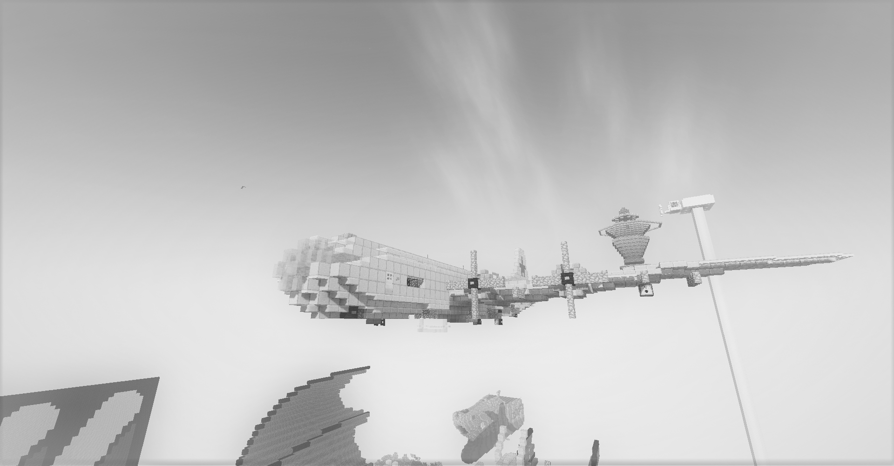  
ソ連は大型の人員輸送飛行船と爆撃機を必要としていた。そして何度もモデルの制作、実験を繰り返し最強に等しい爆撃機ができた。機銃1機、小型爆弾投下機1機、大型爆弾投下機24機、全長67m 全幅75m 全高17m（車輪を除く）その大きな生物兵器は、一つのレバーで一斉に爆弾を投下し街一つを焼き払う。人員輸送も可能で、最大28人輸送可能（歩兵のみ）出動時はハッチが開き、パラシュートで戦地へ向かう。

### VCX-100 CLASS-6

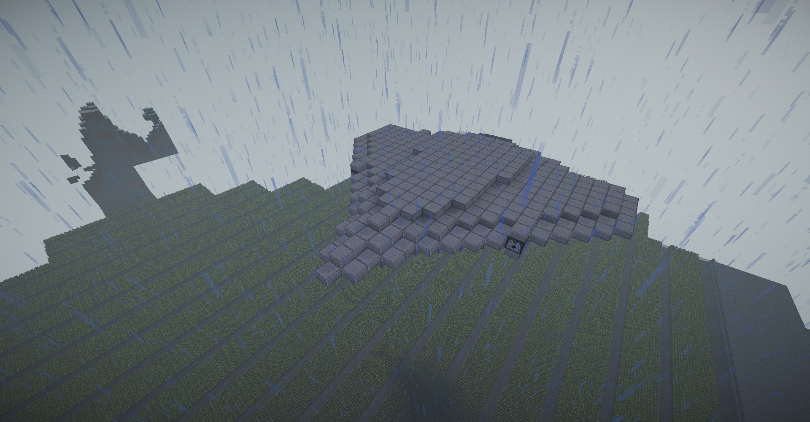  
刃義国と共同開発したこの爆撃機はソ連初の無人、そして高速、かつ隠蔽性の高さを従来の空軍用機とは比べ物にならないぐらいに上げられた。しかし、SBX-29には攻撃力は劣るので、さらに改良が必要だ。最終的にはVCXシリーズを主力化し、SBX-29を退役することまで検討している。

#### 「D」空間軍

空間軍とは、宇宙船が中心となった軍である。これからは銀河も赤く染まる時代になるだろう。  
空間軍軍歌 googleドライブ↓  
[https://drive.google.com/open?id=1NoA4-spWajkqK0mT...](https://drive.google.com/open?id=1NoA4-spWajkqK0mTyDAN4lKAM7fF2puw)

### 部隊編成

ここでは空間軍がどのような部隊編成制となっているか説明しよう。

##### 部隊の分け方

1隻で1大隊

### 階級

陸軍のような階級はないが、兵種がその役割を果たす。  
（兵種は海軍と同じなため、省略します。）

### 宇宙戦艦「Космическая революция」（直訳：宇宙革命）

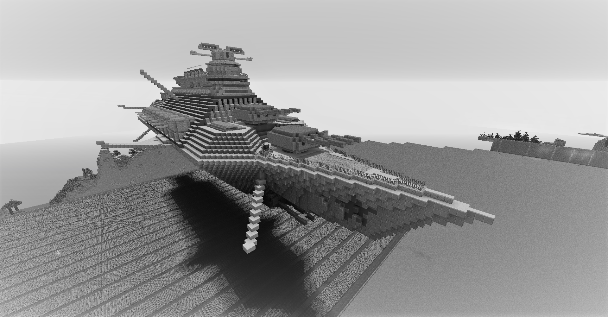  
南陸付近をパトロールしていた南陸艦隊に事件は起きた。第二番艦駆逐艦「Маленькая революция」の二番主砲から突如として弾が飛び出した。その弾は危うく戦艦大和の艦橋に当たるところだった。そして弾を発射した艦が敵だとみなされ警戒態勢がとられた。しかし、その後の応答で武装捜査員のミスと断定された。当時、陸海空軍力の競争によりにらみ合いが発生していた。そして陸空軍から大きく笑われ、海軍に大きな傷跡が残った。（もちろんその武装捜査員は粛清しといた★）そこで、祖国軍の安全を守るためCIC機能の導入を始めた。それと同時に、宇宙戦艦大和の詳細な情報を取得し、ついに宇宙戦艦が完成した。これは試験的なもので作られたが、世界征服いや、銀河制服に大きく貢献するだろう。  
全長215　全幅83m　全高52.5m　主砲6門、副砲16門、ロケットミサイル砲4門、対艦空拡散砲4門、爆撃機1門、中央対空拡散砲1門、対空レーザーガン16門、主エンジン1、副エンジン3、艦橋1、反重力装置6、CIC搭載

### 宇宙戦艦「ナガト」

ソ連初の宇宙戦艦が完成した。戦艦長門をそのまま宇宙戦艦に変えたものだ。強力な主砲、副砲、対空砲火が敵を圧倒させるだろう。  
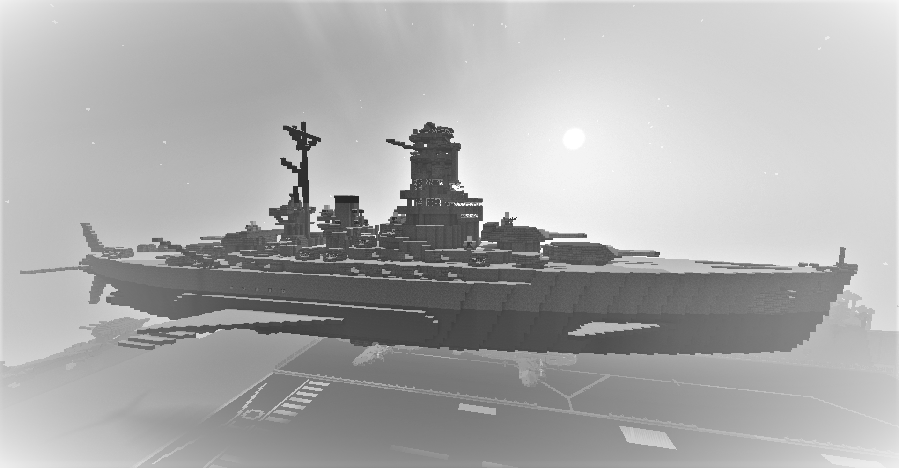  
全長228m 全高58.5m 全幅65m 主砲4門　他多数

### 宇宙戦艦「ムツ」

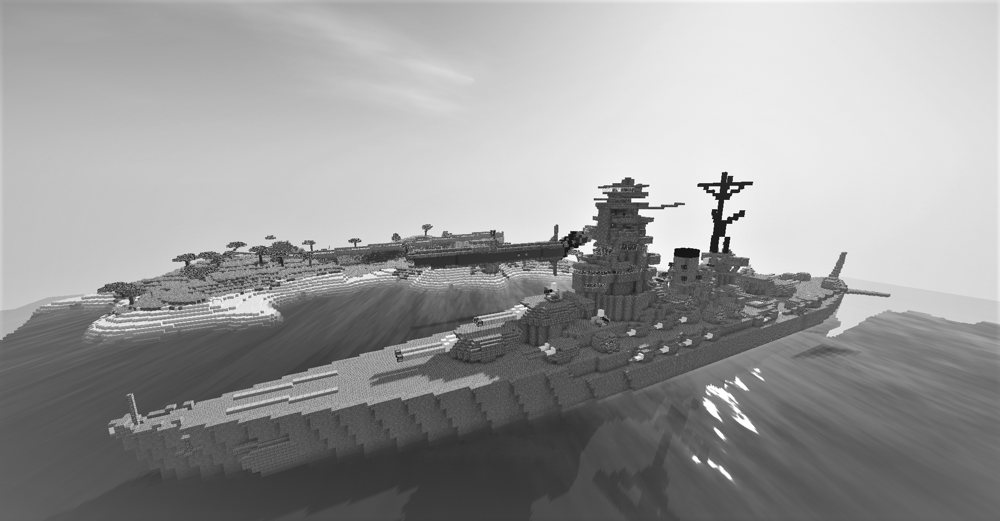  
全長230m 全高57.5m 全幅45m （長門と同じ武装）

### 護衛型宇宙潜水艦「B-500」

刃義国産の宇宙潜水艦を改良したものだ。主砲を加え、速力も大幅げ人員輸送用のものを見事に護衛用に変えることができた。しかし、エンジンは主砲を付け加えるほどの重さを想定しておらず、無理に速力を上げたことで高負荷がかかりそのエンジンから有害な煙が出てしまった。だが、船自体には影響を及ぼすことはなく、敵への視角を遮ることができ、改良されることはなかった。  
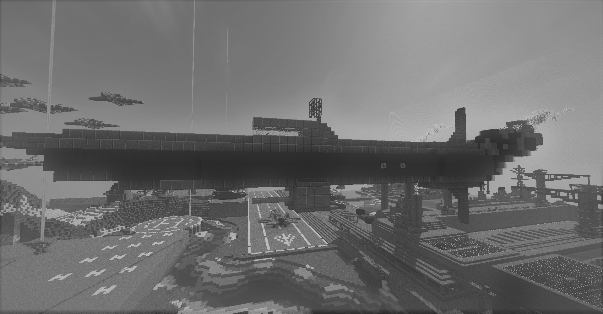  
寸法（無計測） 主砲1門、波動砲1門、機銃4門、艦橋1

### 宇宙次元潜水艦「I-58」

「次元の世界へ」を目標に作られたこの潜水艦は、潜水する時に空間に穴を開け異次元空間に入り潜航することができるというものだ。  
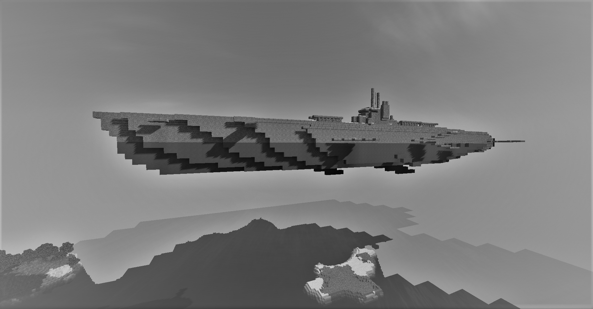  
全長113m 全高36m 全幅16m 宇宙酸素魚雷4門

### 宇宙型軍艦輸送艦「SIP-TANK-1000」

TORO serverの地形は海は多いがその海一つ一つが人工物によってふさがっているため、自由な海軍軍艦の移動ができなかった。そこで、軍艦を飛ばして移動させる宇宙艦を作る計画が始まった。船体は宇宙戦艦「Космическая революция」だが、武装と上の艦橋をなくし、できるだけ軽量化させた。22本のケーブルが伸びて、軍艦とつなげそのまま運ばれる。強力な反重力装置を搭載、小さなптица駆逐艦から、大きなチャレンジャー級戦艦や空母まで、どんな大きさ、重さでも運べるように設計された。  
  
全長228m 全高29m（ケーブルを除く)全幅65m ケーブル22本 主エンジン1、副エンジン3、艦橋1、強化型反重力装置10

### 宇宙空母戦艦「出雲」

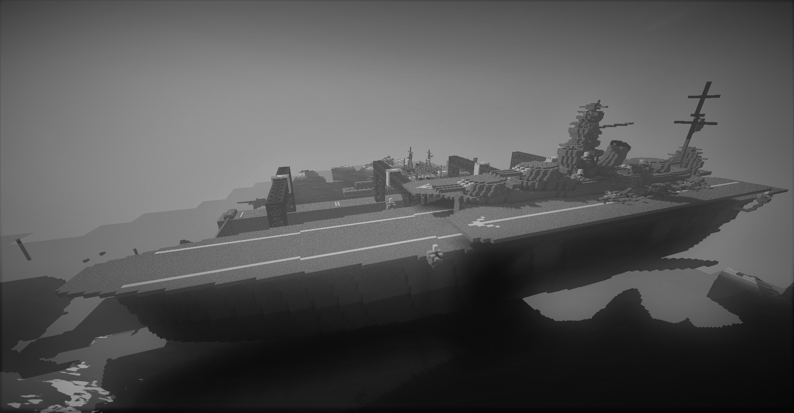  
空の時代に空間軍は欠かせないものとなりつつあった。そこで、その「空の時代」に特化した空母戦艦が完成した。  
全長272m 全高62m 全幅57m

#### あとがき

まず、ここまでこの記事を読んでくれたことに感謝します。我らソビエト日本帝国軍はこれからも軍事拡大を行い、世界征服を目標に頑張ってまいります。
