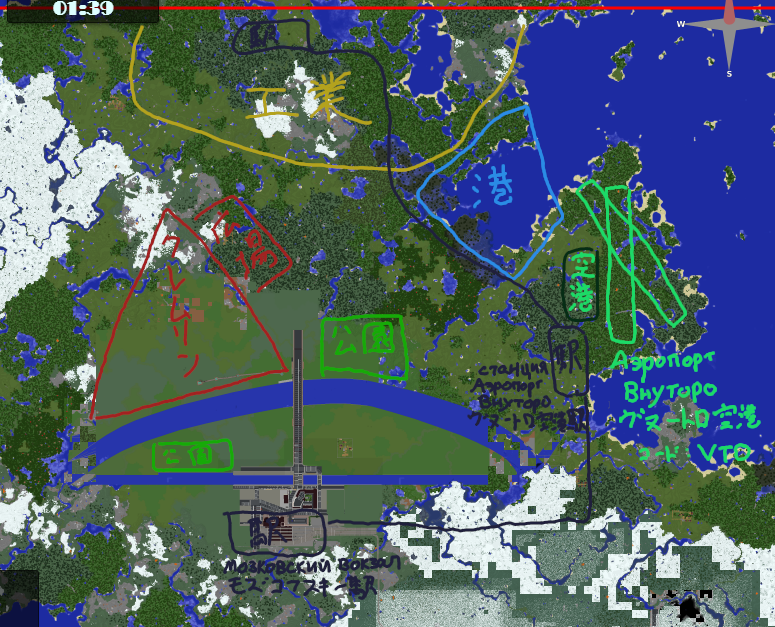
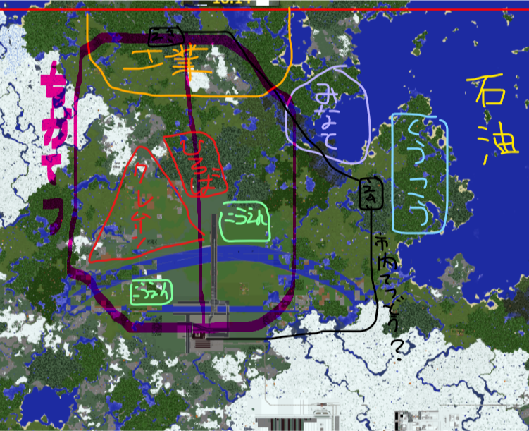
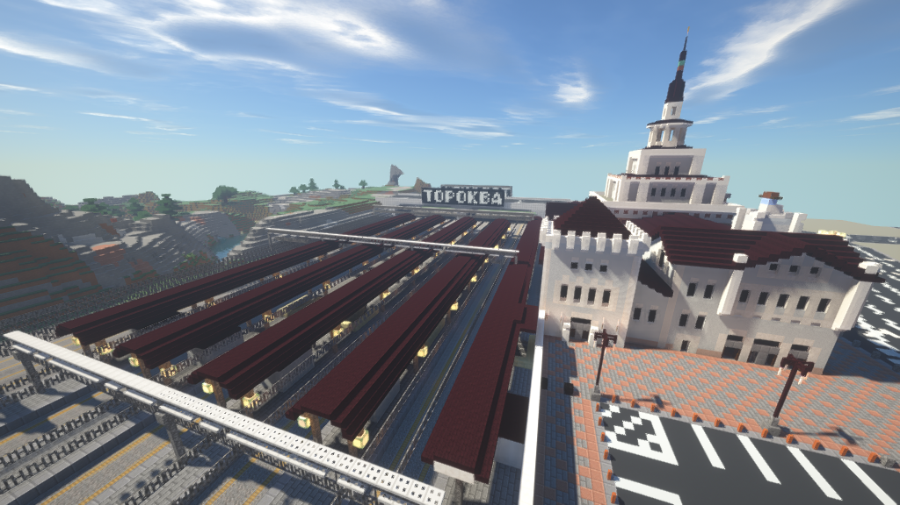
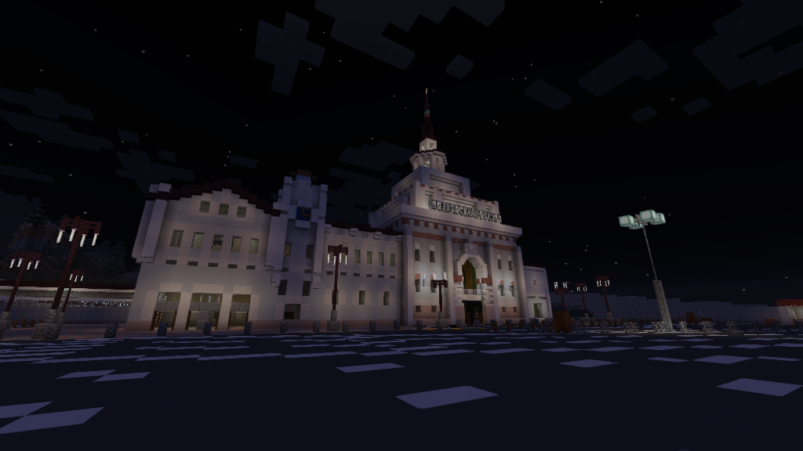

**目次**  
  

* [トロクワ(Тороква)市の概要](#content_1)
* [地図](#content_2)
  + [計画図](#content_2_1)
* [地区](#content_3)
  + [トロスコイ地区 Тороской район](#content_3_2)
  + [クリメンカ地区 район Крименка](#content_3_3)
  + [ザトロクヴォレチエ地区 район Заторокворечье](#content_3_4)
  + [ヴヌートロ地区 район Внуторо](#content_3_5)
  + [ペリレンスキー地区 Периленский район](#content_3_6)
  + [クラジャイリスキー地区 Кражайльский район](#content_3_7)
  + [スコリニキ地区 район Сукольники](#content_3_8)
* [交通](#content_4)
  + [道路](#content_4_9)
  + [鉄道](#content_4_10)
  + [地下鉄](#content_4_11)
  + [航空](#content_4_12)
  + [航海](#content_4_13)
* [市の組織](#content_5)
  + [市長](#content_5_14)
  + [トロクワ交通局](#content_5_15)
  + [産業局](#content_5_16)
  + [商務局](#content_5_17)

  
  

### トロクワ(Тороква)市の概要

西ツベリア北部に位置する市。  
2019年2月末〜3月始め頃に開発を開始。  
ロシアのモスクワ市にあるクレムリンや街並みなどを、再現したりアレンジしたりして開発中。

### 地図

#### 計画図

##### 2019年7月25日版

##### 2019‎年‎4‎月‎30‎日版

### 地区

#### トロスコイ地区 Тороской район

クレムリンや赤の広場がある市の中心地区。

#### クリメンカ地区 район Крименка

モズコフスキー駅がある南西の地区。

#### ザトロクヴォレチエ地区 район Заторокворечье

南東の地区。

#### ヴヌートロ地区 район Внуторо

空港や駅があり、運送業が盛んな東の地区。

#### ペリレンスキー地区 Периленский район

（計画中）  
工業が盛んな北西の地区。

#### クラジャイリスキー地区 Кражайльский район

（計画中）  
港がある北東の地区。

#### スコリニキ地区 район Сукольники

（計画中）  
クラジャイリスキー地区の北にある地区。

### 交通

#### 道路

右側通行。  
一方通行の箇所が多いので注意。

##### 鯖道十五号

  
市の南部を横断する道路。  
東はゆきとみらい市、西は高家村に続いている。  
市外は左側通行になるので注意。  
  
鯖道についてはこちら → [鯖道](../03_Transportation/%E9%AF%96%E9%81%93.md)

#### 鉄道

##### モズコフスキー駅 Мозковский вокзал

トロクワ市の主要な駅。  

写真

  
  

| 路線 | 行き先(西) | 行き先(東) |
| --- | --- | --- |
| トロクワ鉄道 | -- | ヴヌートロ空港駅(未) |
| 武蔵電気鉄道 | 高家駅 | 芥川駅 |
| 二取電鉄 |  |  |
| -- |  |  |
| 松野宮鉄道 | -- | シンサシニャ駅 |
| -- |  |  |
| 北海高速鉄道 | シンサシニャ東駅 | -- |

##### ヴヌートロ空港駅 станция Аэропорт Внуторо

（計画中）

| 路線 | 行き先(北) | 行き先(南) |
| --- | --- | --- |
| トロクワ鉄道 | (未定)駅 | モズコフスキー駅 |
|  |  |  |

##### (未定)駅

（計画中）

| 路線 | 行き先(西) | 行き先(東) |
| --- | --- | --- |
| トロクワ鉄道 | -- | ヴヌートロ空港駅 |
|  |  |  |

#### 地下鉄

（計画中）

##### トロクワメトロ Тороковский метрополитен (Тороковское метро)

* **スコリニチェスカヤ線 Сукольническая линия**

　クレムリン辺りを中心に北東・南西へ。

| 駅 | |
| --- | --- |
| ↑ 北 ｜ 南 ↓ |
|  |
|  |
|  |
|  |

* **ザトロクヴォレツカヤ線 Заторокворецкая линия**

　クレムリン辺りを中心に北西・南東へ。

| 駅 | |
| --- | --- |
| ↑ 北 ｜ 南 ↓ |
|  |
|  |
| モズコフスカヤ駅 |
|  |

* **環状線 Кольцевая линия**

　クレムリンを囲むように回る。

| 駅 | |
| --- | --- |
| ↑ 右回り ｜ 左回り ↓ |
| モズコフスカヤ駅 |
|  |
|  |
|  |
|  |
|  |

#### 航空

##### ヴヌートロ空港 Аэропорт Внуторо

（工事中）

| 空港データ | |
| --- | --- |
| 空港コード | VTO |
| 滑走路18/36 | 800m |
| 滑走路15/33 | 800m |

| 路線 | 行き先 |
| --- | --- |
|  |  |

#### 航海

（計画中）

### 市の組織

*現在は市長が全てを担っています。*

#### 市長

市の行政を担当。  
現市長：barusugan

#### トロクワ交通局

##### 総務部

市内の交通を管理。

##### 鉄道部

市内の駅・鉄道を管理。

##### 航空部

市の空港・航空を管理。

##### 海運部

市の港・海を管理

##### 建設部

主に交通関係の建設を担当。

#### 産業局

市内の産業を管理。

#### 商務局

市内の商業を管理。  
  

---