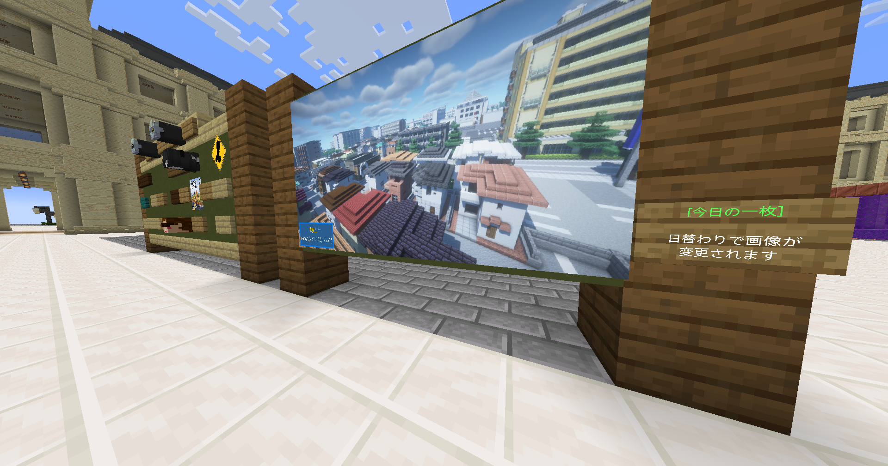
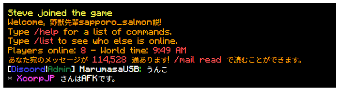
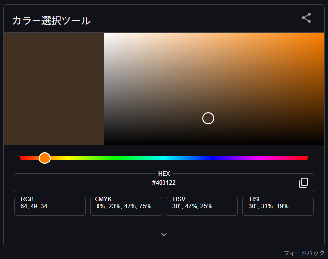
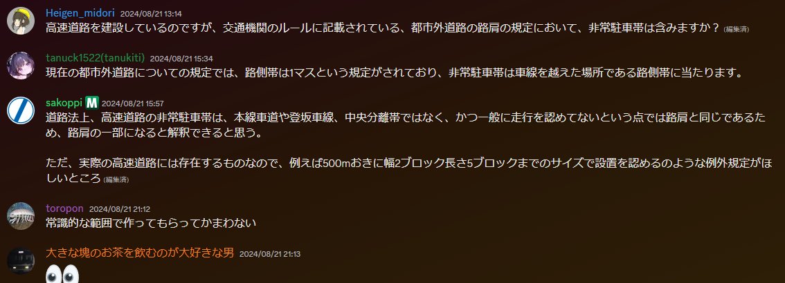

### 2025

#### 【非常にどうでも良い】私の地名の公式各言語訳 (12/17 Wed)

| 日本語 | 国際音声記号(多分) | 英語 | 韓国語 | 簡体中国語+拼音 |
| --- | --- | --- | --- | --- |
| 神奈崎 | [kanasakʲi] | Kanasaki | 가나사키 | 神奈崎(shén nài qí) |
| 京名岡 | [keːnaoka] | Kenaoka | 게나오카 | 京名冈(jīng míng gāng) |
| 第三運河 | [daɪsaɴɯɴɡa] | the 3rd Canal | 제3운하 | 第三运河(dì sān yùn hé) |
| 中海 | [tʃɯːkaɪ] | Chukai | 추카이 | 中海(zhōng hǎi) |
| 横倉 | [jokokɯɾa] | Yokokura | 요코쿠라 | 横仓(héng cāng) |
| 新北東空港 | [ɕiɴhokɯtoːkɯːkoː] | Shin-hokuto Airport | 신호쿠토 공항 | 新北东机场(xīn běi dōng jī cháng) |


古い

### 2025.6

#### 30(Mon) 役立ちコマンドTOP10

今回はWorldEdit系は除外させて頂きます。

##### 10. /spawn

スポーン地点に戻れます。  
...あるいは、スポーン地点に戻れます。

##### 9. /tpahere <ユーザー名>

他の人を呼べます。ほかの人は/tpacceptで移動できます。  
やりすぎるとjailされますよ。

##### 8. /stp <ユーザー名>

他の人のところに自動でスペクテイターで行けます。  
3秒で元のモードに戻れます。

##### 7. /skull [ユーザー名]

自分のヘッドを手に入れることができます。  
ユーザー名を入力するとその人のヘッドを手に入れることができます。

##### 6. /seen [ユーザー名]

その人の最後のログイン時間・場所、あるいはその人の過去の名前を表示できる。

##### 5. /mail read あるいは /mail send <ユーザー名> <メッセージ>

13歳未満でDiscordアカウントが作れなくても大丈夫です。  
mailを送ることでオフラインユーザーにもメッセージを送ることができます。

##### 4. /playertime <reset|時間> あるいは /playerweather <reset|storm|sun>

自分だけの時間と天気を変更できる。撮影などはコレで。

##### 3. /w <ユーザー名> <メッセージ>

プレイヤー個人のみにチャットを送ることができる。  
悪用したらjailされるので注意。業務連絡に使おう。

##### 2. /stats

自分の統計情報が表示される。今まで何時間をTOROに費やしてきたか...など。

##### 1. /sethome <ホーム名> あるいは /home <ホーム名>

自分だけのワープポイントを設定して移動できる。

### 2025.5

#### 31(Sat) MarumasaCarの車のクラスファイルを読んでJavaの用語を知ろう

Javaという言語は優秀で長年、多岐にわたる分野を担ってきましたがこの複雑化されたオブジェクト指向の中で迷い込む人間が多いことは明白でしょう(私もそうです！)  
Javaの用語をざっくり知って、ソースファイルをﾁｮｯﾄﾀﾞｹ読めるようになりませんか  
簡単な英単語が分かれば正直、ラクショーです。  
**※アホ長文で自分で反吐が出ます。覚悟して読んでください。**  
  
試しに[SalmonCarのソース](https://github.com/TORO-Server/MarumasaCar/blob/master/src/main/java/marumasa/marumasa_car/vehicle/machine/SalmonCar.java)を見てみましょう。  
  

```
package marumasa.marumasa_car.vehicle.machine;

import marumasa.marumasa_car.vehicle.Vehicle;
//...
```

このファイルのことを**クラスファイル**と呼びます。**クラス**というのはいわばオブジェクトの設計図で、**オブジェクト**というのは数字や文字、やること等が書いてあるものです。クラスが書いてあるファイルなのでクラスファイルです。  
*package marumasa.marumasa\_car.vehicle.machine;*はSalmonCarの住所です。「私はmarumasa.marumasacarというプロジェクトの中のvehicleパッケージの中のmachineパッケージに住んでます。」  
**パッケージ**というのは集合住宅とかだと思ってください。  
その後に狂ったように*import ...*っていうプログラムがつらつら並んでますね。これは「私を動かすにはこの方々が必要です。」という宣言です。先頭に置くのがJava界の常識です。  
つまり、この辺りはSalmonCarクラスさんの自己紹介です。今の所は飛ばして結構です。  
  

```
public class SalmonCar extends Vehicle {
  //...
}
```

その後、**public class SalmonCar extends Vehicle {**という行がありますね。ここがいよいよクラスさんの中身が書いてある場所です。  
publicは公開という意味ですね。このクラスさんはどこからでもアクセスできるワケです。これを**スコープ**と言います。特定のクラスさんからのみアクセスできるようにすることで改竄を防ぐことができます。  
ちなみに、スコープは他に**protected**(**子クラス**からのみアクセスできる)、**private**(自分からだけアクセスできる)があります。  
「子クラスってなんだよ！」はい。子クラスというのは親クラスを**継承**したクラスです。継承すると数字や文字が引き継がれます。ちなみに、実はこのクラスさんも子クラスなんです。実は何回でも継承できます。  
その継承というのがまさに*extends Vehicle*です。つまりこのクラスさんの親はVehicleパパです。Vehicleパパが持っていたものには**super**というものでアクセスできますが、一旦保留で。  
  

```
public SalmonCar(ArmorStand stand, JavaPlugin pl) {
  super(stand, pl);
}
```

そこから2行進むと出てきました。*public SalmonCar(ArmorStand stand, JavaPlugin pl) {*  
これがやることをまとめたもので、**関数**と言います。この場合、関数はクラスさんが持っているので**メソッド**に進化します※名前だけじゃないよ！  
「関数？関数って数学の？」ちょっと違いますが、元の数字や文字を受け取って結果を返す点では同じと言えます。返された結果は**戻り値**と言います。  
ただし、返さなくてもルール違反ではないんです。これを**戻り値がvoid**と言います。voidは虚無とかの意味です。納得。  
  
さて、話を戻しましょう。ここでもスコープが使われていますね。そうなんです、メソッドや値に細かくスコープを設定することもできるんですよ。  
そしてこのメソッドの名前はSalmonCar...ってクラス名と同じじゃん！これは**コンストラクター**と呼ばれ、クラスという設計図からオブジェクトを作る時に必ず呼ばれる特別なメソッドです。  
そして最後にカッコで囲われた地帯がありますね、これは「,」で区切って読んでください。これはメソッドさんが処理できる値を事前に宣言するものです。  
「1つめの値はArmorStandクラスから作られたオブジェクトだけ受け付けるよ！2つめの値はJavaPluginクラスから作られたオブジェクトだけ受け付けるよ！」  
これ以外の値を渡すとエラーを吐いちゃいます。かわいそう。  
  
おっと次の行でさっき保留したsuperが出てきました。これは「パパ代わりにやってメソッド」です。貰った値を全部パパに押し付けてますね。これでコンストラクタは終わりです。  
  
いやお前専門用語使いすぎな。ということで一旦まとめます。

| 名前 | 役割 |
| --- | --- |
| 関数 | 値を受け取って処理する |
| オブジェクト | 値やメソッドを持てる箱 |
| クラス | オブジェクトの設計図 |
| メソッド | クラスが持ってる関数 |
| コンストラクタ | クラスの初期化時に呼ばれるメソッド |
| スコープ | クラスやメソッド、値がどこからアクセスできるか |
| 継承 | クラスからクラスへメソッドや値を引き継ぐ動作 |
| 親クラス | 継承される側 |
| 子クラス | 継承する側 |
| パッケージ | クラスを入れる箱 |

ちなみに次が本番です。  
  

```
@Override
  public List<Part> generateParts() {
    return new ArrayList<>() {{ // x:左右 y:高さ z:前後
      add(new MainSeat(new Vector(-0.5, .85, -0.15), 0.8f, 1)); //1列目 右
      add(new Seat(new Vector(0.5, .85, -1.5), 0.8f, 1)); // 2列目
      add(new Seat(new Vector(0.4, .85, -2.45), 0.8f, 1)); //3列目
      add(new Seat(new Vector(0.5, .85, -0.15), 0.8f, 1)); //1列目 左
      add(new Seat(new Vector(-0.5, .85, -1.5), 0.8f, 1)); //2列目
      add(new Seat(new Vector(-0.4, .85, -2.45), 0.8f, 1)); //3列目
      add(new Body(
        Material.DISC_FRAGMENT_5,
        new Vector3f(0f, 0f, 0.65f),
        new Vector3f(2.6f),
        16
    ));
  }};
}
```

さっきと同じようにgeneratePartsメソッドがある...ってList<Part>って何？！@Overrideって何？！  
**@Override**から先に解説しましょう。あのボカロ曲のタイトルの意味と同じ意味です。これはパパから引き継いたメソッドを自分で書き直すモノです。  
実はパパもgeneratePartsメソッドは持っているものの、カラッポです。そこで子が自分で書いたものがコレです。  
ちなみにこれは「アットオーバーライド」と呼ぶことはあるものの、「オーバーライドアノテーション」と呼んであげた方が自然です。  
  
そして**List**<Part>。このListってクラス。他のクラスさん自体を受け取るのです。ここではPartクラスをListさんに直接渡しています。  
Listは意味通り特定のクラスから生まれたオブジェクトを順番に格納します。これは「順番を保証する」と言います。そのままの日本語です。  
で、なんでこんなとこでそんなクラスの名前を？これ、メソッドさんが返す値の形式を事前に宣言しないといけないんです。  
つまりこのgenertePartsメソッドは虚無を受け取ってList<Part>を返します。  
  
次の行は*return new ArrayList<>() {{*。「return」は返却という意味の英単語ですね。はい。戻り値です。ここで出てきました。  
new ArrayList<>()っての返してるみたいだけど、何？これはArrayListクラスという設計図からまさに新しいオブジェクトを作成している現場です。  
ここから追加していく訳です。  
  
*add(new MainSeat(new Vector(-0.5, .85, -0.15), 0.8f, 1));*  
そろそろ分かってきましたね。Vectorオブジェクトを新しく作ったMainSeatオブジェクトに渡してそれをリストに追加しています。  
ちなみにVectorってなんだよ。これはベクトルと呼ばれます。高校数学で出てくるヤツ。まだ出てきてない人はそのうち知るのでとりあえず名前だけ覚えていてください。  
  
そして最後のadd、  

```
add(new Body(
  Material.DISC_FRAGMENT_5,
  new Vector3f(0f, 0f, 0.65f),
  new Vector3f(2.6f),
  16
)
```

Bodyクラスを初期化していますが、Material.DISC\_FRAGENT\_5・ベクトル①・ベクトル②・数字が渡されています。  
まず最初がアイテムです。これは割れたディスクの破片5ですね。そして①は位置。②は方向?、最後の数字はCustomModelDataの値です。  
CustomModelData:16の割れたディスクの破片5を召喚してるだけです。  
  
以上です。

#### 26(Mon) Wikiの会社テンプレートと自治体テンプレートを作った

Mediawikiとかでよく使われるInfoboxを模倣した

##### 会社テンプレート


ソースを見る

```
{| style="text-wrap:nowrap"
|center|right:bgcolor(#eee):top|left|c
|&ref(https://image02.seesaawiki.jp/t/r/toro_server/99d48330b934eebb.png,200){ロゴ}~~''ロゴ''|>|center:bgcolor(#b342f5):color(#fff):トロ・コンピューターエンターテイメント~~&color(#bbb){TORO Computer Entertainment}|
|^|代表|ニコラス・ジョン・田中~~ルーズベルト・アレクサンドラ・森|
|^|>|center:bgcolor(#000):color(#fff):以下 架空の設定|
|^|法人名|株式会社TOROコンピューターエンターテイメント|
|^|業種|その他|
|^|本社所在地|京名岡市中海区京城19丁目8-10|
|^|主要株主|ディープステート:100%|
|^|主要子会社|TOROソフト:100%|
|^|銘柄コード|北鯖証券取引所 トパーズ 4545|
|}
```

|  |  |  |
| --- | --- | --- |
| [ロゴ](https://image02.seesaawiki.jp/t/r/toro_server/99d48330b934eebb.png) **ロゴ** | トロ・コンピューターエンターテイメント TORO Computer Entertainment | |
| 代表 | ニコラス・ジョン・田中 ルーズベルト・アレクサンドラ・森 |
| 以下 架空の設定 | |
| 法人名 | 株式会社TOROコンピューターエンターテイメント |
| 業種 | その他 |
| 本社所在地 | 京名岡市中海区京城19丁目8-10 |
| 主要株主 | ディープステート:100% |
| 主要子会社 | TOROソフト:100% |
| 銘柄コード | 北鯖証券取引所 トパーズ 4545 |

##### 自治体テンプレート


ソースを見る

```
{| style="text-wrap:nowrap"
|center|right:bgcolor(#eee):top|left|c
|&ref(https://cdn.discordapp.com/emojis/511521090854584320.png,200){市章}~~''市章''|>|center:bgcolor(#6d82e8):color(#fff):ペプ市~~&color(#bbb){Pepu City}|
|^|所在|ちばらき県|
|^|人口|11.4万人|
|^|面積|514km&#178;|
|^|人口密度|221.8人/km&#178;|
|^|市長|大畑 勇斗|
|^|市役所|ちばらき県ペプ市鹿山8丁目10|
|}
```

|  |  |  |
| --- | --- | --- |
| [市章](https://cdn.discordapp.com/emojis/511521090854584320.png) **市章** | ペプ市 Pepu City | |
| 所在 | ちばらき県 |
| 人口 | 11.4万人 |
| 面積 | 514km² |
| 人口密度 | 221.8人/km² |
| 市長 | 大畑 勇斗 |
| 市役所 | ちばらき県ペプ市鹿山8丁目10 |

#### 23(Fri) Dynmapライン、道路と鉄道で運用開始。

先日、見慣れないDynmapのレイヤーが追加されていたはずだ。「Raiways」「expwy」に「road」  
どうやらしゃけ氏がこのレイヤを作り鉄道路線・高速道路・一般道路の線引きが可能になったとのこと[\*1](#footer-footnote1 "https://discord.com/channels/337838758441517057/12...")。  
もし自分の作品にも追加したいならModに相談してみると良いだろう。  
ちなみに、1ケタナンバリングの高速道路とA'路線はMarkersレイヤーのままでOKだそう。

#### 16(Fri) TOROServerで運用されている技術を見る②スクリプト郡

TOROServerのリポジトリ一覧を見てもらえば分かる通り、まるまさ氏によって書かれたスクリプトが大量にある。  
一つずつ読みながら何に使われているのか理解していく。

##### DailyPicture

[リポジトリ](https://github.com/TORO-Server/DailyPicture) | 言語: JavaScript  
  
説明には「Googleドライブにある指定した画像ファイルを Google Apps Script を利用して日替わりで更新する。」とある。  
恐らくスポーンの日替わり写真板で使われていると推測される。コード内容としては画像一覧を取得し乱数から選んでいる。  
[](https://image02.seesaawiki.jp/t/r/toro_server/80d9a88b3f422635.png)

##### Util-Code-List

[リポジトリ](https://github.com/TORO-Server/Util-Code-List) | 言語: Python / シェルスクリプト  
  
こちらのリポジトリはサーバーで使われているコードが沢山含まれているようだ。  
分からないもの以外省いて紹介する。  
**getJarFile.py**
> 現在のディレクトリ内の.jar ファイルを検索し、ファイル名に指定した文字列 (第一引数) が含まれている最初にヒットしたファイルをコンソールに出力します。該当するファイルが見つからない場合は、エラーメッセージを出力します。

恐らくプラグインが大量に導入されているため、プラグイン探しを少しでも楽にするためのスクリプトだろう。  
ls+grepでは記述が長くなってしまうのでスクリプトにまとめられているものだと思われる。  
**getLatestPack.py**
> Github の API を利用して [https://github.com/TORO-Server/TORO-ResourcePack/r...](https://github.com/TORO-Server/TORO-ResourcePack/releases)の最新のリソースパックのダウンロード URL をコンソールに出力します。

こちらはserver.propertiesファイルのリソースパックのURLを更新する時のためのスクリプトだろう。  
リソースパックのリポジトリから最新リリースのURLを取得する。  
**editProperty.py**
> Minecraft のサーバーの設定ファイル server.properties のプロパティを変更します。

こちらもvimより手っ取り早いのでスクリプトにまとめられているのかもしれない。  
**getLatestGeyser.py & getLatestFloodgate.py & getLatestVelocity.py**
> 最新の GeyserMC, 安定版 Velocity, 安定版 Paper をダウンロードするスクリプト すでに最新版を導入している場合はダウンロードされない

これが再起動時に新しいバージョンがあった際に更新するスクリプトですね。

##### EssSetMails

[リポジトリ](https://github.com/TORO-Server/EssSetMails) | 言語: Ruby  
> Minecraftのプラグイン"Essentialsx"のメールの数を指定した数にするためのスクリプト

改竄されたYMLを生成するRubyスクリプトらしいですね。これはもちろんメール数を増やすものですがもちろん用途は...  
[](https://image02.seesaawiki.jp/t/r/toro_server/140afc7e7be8b024.png)

#### 15(Thi) TOROServerで運用されている技術を見る①データパックとリソースパック

##### 運湖バイオームは何が追加しているのか

[USJ-DataPack](https://github.com/TORO-Server/USJ-DataPack)はMarumasa氏が開発した**usj:unko**バイオームを追加するネタデータパックである。  
ページを開いても何がどれなのか分からない。ここで重要なのは**/data/usj/worldgen/biome/unko.json**ファイルだけである。  
拡張子の通りJSON形式で書かれている。とりあえず**"effects"**に目を移して欲しい。非常に大きな数字が並んでいるはずだ。  
**"water\_color"**(→バイオームにおける水の色)は4206882とあるが、これは10進数であり16進数に変換すると**403122**になる。  
[](https://image01.seesaawiki.jp/t/r/toro_server/328526a2d6e530fb.png)  
#403122はこの色だ。かなり💩  
このように、バイオームファイルには視覚効果・スポーンするモブ・生成される鉱石が書かれている。

##### カオスすぎるリソースパック

そして、[TOROResourcePack](https://github.com/TORO-Server/TORO-ResourcePack)は現在使用されているサーバーリソースパックである。  
このリソースパックの中にMinumaハムスターと化したエンダーマイト、MarumasaCarのモデル、カスタムサウンドが含まれている。  
重要なのは**/assets/minecraft**フォルダ。このフォルダの中のフォルダを見ていこう。  
  
まず[lang/ja\_jp.json](https://github.com/TORO-Server/TORO-ResourcePack/blob/main/assets/minecraft/lang/ja_jp.json)。これは日本語の翻訳ファイルを上書きするものである。  
エンダーマイト関連の字幕をハムスターに置き換えたり、先程のusj:unkoバイオームの名前をUSJ UNKO!!!としているのはこのファイルの仕業である。  
  
次に、[sounds](https://github.com/TORO-Server/TORO-ResourcePack/tree/main/assets/minecraft/sounds)フォルダ。名前の通りここにマイクラ内で実際に鳴らすための音声ファイルが沢山入っている。  
↓トイレを流す音  
[音声ファイルへのリンク](https://github.com/TORO-Server/TORO-ResourcePack/blob/main/assets/minecraft/sounds/custom/toilet.ogg?raw=true)  
↓お寺の鐘  
[音声ファイルへのリンク](https://github.com/TORO-Server/TORO-ResourcePack/blob/main/assets/minecraft/sounds/custom/temple_bell.ogg?raw=true)  
  
そして、[models](https://github.com/TORO-Server/TORO-ResourcePack/tree/main/assets/minecraft/models)と[textures](https://github.com/TORO-Server/TORO-ResourcePack/tree/main/assets/minecraft/textures)だ。  
modelsはblockbench等で作ったJE用json形式の3dモデルデータが含まれており、texturesはお馴染みのハムスター、しゃけスキン、ミヌマアーマーやToroPassが含まれている。  
[](https://image01.seesaawiki.jp/t/r/toro_server/vkXLOmUqK9.png)

##### 自動化されたリソースパックの更新

実はこのリソースパック、コントリビューター(ファイルを追加したり更新する人)がタグ(「この状態でとりあえず保存！」のような機能)を切ると再起動の時新しいリソパに自動で切り替わっているのだ。  
これはGithub Actionsという機能を用いて実現されていて、リポジトリにて特定の条件に合致した時等に自動で動いてくれるのだ。  
内容は[**.github/workflows/main.yml**](https://github.com/TORO-Server/TORO-ResourcePack/blob/main/.github/workflows/main.yml)に書いてあり、日本語化するならば  

```
もしプッシュ(更新)された時：
　(なおかつ)もしタグが切られた時：
　　(なおかつ)もしタグの名前が"v(任意の文字).(任意の文字).(任意の文字)"のパターンに一致していた時：
　　　Ubuntu(Linuxのディストロ、WindowsやMacと同じようなもの)の最新バージョンを使用する。
　　　ブランチをチェックアウトする。（他人の更新が反映されなくなる）
　　　Python(プログラミング言語 及びそれを動かすソフトウェア)を使用する。
　　　Pythonを使って「zip.py」を動かす：
　　　　結果を「.github」の中の「ReleaseBody.txt」に出力する。
　　　リリースする。
　　　完了。
```

と言ったところだろうか。[zip.py](https://github.com/TORO-Server/TORO-ResourcePack/blob/main/zip.py)は必要なファイルを選んでTORO-ResourcePack.zipに出力するスクリプトのようだ。

### 2025.4

#### 9(Wed) 【注意喚起】WorldEditは、容易く貫通できます。

WorldGuardを付けてても、相手がbuilder権限を所有してた時は貫通されてしまいます。保護と適切なフラッグの設定が大切です。  

```
/rg <リージョン名> worldedit -g nonmembers DENY
```

このコマンドを実行すると、メンバー以外によるWorldEditの編集を禁止できます。荒らされない良い建築ライフを。

### 2024.12

#### 31(Tue) 年末のサーバー停止、出来事をまとめる

年末にあった出来事をまとめたいと思います。

##### Bloxd.io(パクリゲー)が流行る 12/21

TORO Serverの民はサバイバルワールドのロビー「7777777」で主に遊んでいます  
後のサーバー停止がより流行るきっかけに

##### サーバーが止まる 12/24

TORO Serverが止まる。当初は24時間以内に終わる予定でした。

##### ディスコード荒らしが発生、めめおじも話題に上がる 12/24 同日

前者の中身は伏せておきます。  
それに関連して、めめおじ(TORO Serverに粘着している荒らし)が話題に上がりました。  
Adminの方々によればどうやらIPがModeratorのsapporo\_salmon氏と被っているとのこと（本人は勿論否定）  
私の意見だが彼はマンションの設備として付いているJ:COMというネットワークプロバイダを使用しており、それによる被害と考える

##### SalmonServer 12/26

Moderatorのsapporo\_salmon氏がTORO Serverが閉まっている代わりとしSalmonServerを稼働させていました  
TPSは不安定でした。ただし鯖民にとってはありがたかったです

##### サーバー、動く 12/31

サーバーが復活しました。大晦日です。今日です。

#### 21(Sat) ルールに沿った高速道路、どうすればいいの？

TORO Serverでは、大きな敷地を要する高速道路にルールが設けられています。  
ルールを守りつつリアルな高速道路を実現するには、どうすればよいのか？  
※都市外を前提に書いていきます。独自研究が含まれすぎています。

##### 車線別

**2車線道路**  

```
路側帯は1マス、車線幅は3マスもしくは4マス。中央分離帯ありの場合は中央の路側帯を設けない。
```

  
路肩帯は1マス・中央分離帯ありの場合は中央に路肩帯を設けない。  
中央分離帯の明確な定義がないのでなんとも言えませんが、恐らくこの形であれば安心です。  


[車両幅について]  
片側1車線道路では幅4ブロックが許容されていますが、片側2車線道路では幅3ブロック固定となっております。  
もし拡張を見据えるならば3ブロックにしておきましょう。

  
**4・6車線道路**  

```
路側帯は1マス、車線幅は3マス。中央分離帯ありの場合は中央の路側帯を設けない。
```

  
こんな感じですかね...  
中央分離帯の明確な定義がないのでなんとも言えませんが、恐らくこの形であれば安心です。(2)

##### 拡張を見据えた設計をする

色々考えたので載せる  
**2（1>2, 中央分離帯へ変身させる）**  
1車線を埋めてしまう形です。  
  
**3（1>2, 片側を作らない）**  
A型に似てます。  
  
**6（1>2>3, 柔軟性最強型）**  
3,1の間隔を繰り返すことでフレキシブルに改築できます。  


##### その他のルール

順次追記します  
**非常駐車帯について**  
常識の範囲内で建築可能。  
  
[https://discord.com/channels/337838758441517057/53...](https://discord.com/channels/337838758441517057/533137571652435968/1275669271120187445)

#### 20(Fri) TOROServer地名ユーザー辞書を作りました。

TOROServer内の地名を100個詰め合わせたユーザー辞書です。改変や再配布もご自由にどうぞ。インストールは各日本語入力ソフトに従ってください。  
[https://drive.google.com/file/d/16DZ5FLvYLbCpZ-XIK...](https://drive.google.com/file/d/16DZ5FLvYLbCpZ-XIKzMfjFrb6IG1c16d/view?usp=sharing)

#### 20(Fri) first post

ブログを書いても良いとのことなのでページを作ってみました。

---

* [\*1](#footnote1)  : [https://discord.com/channels/337838758441517057/12...](https://discord.com/channels/337838758441517057/1264264554880172032/1375132125778415679)