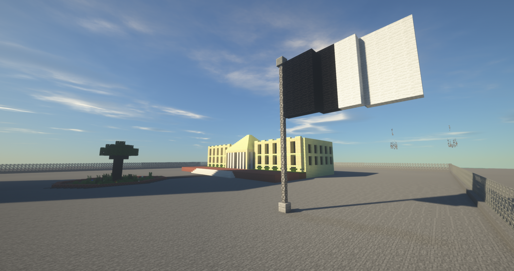
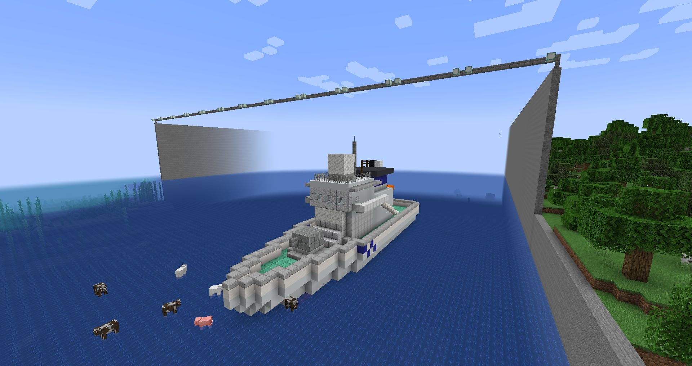
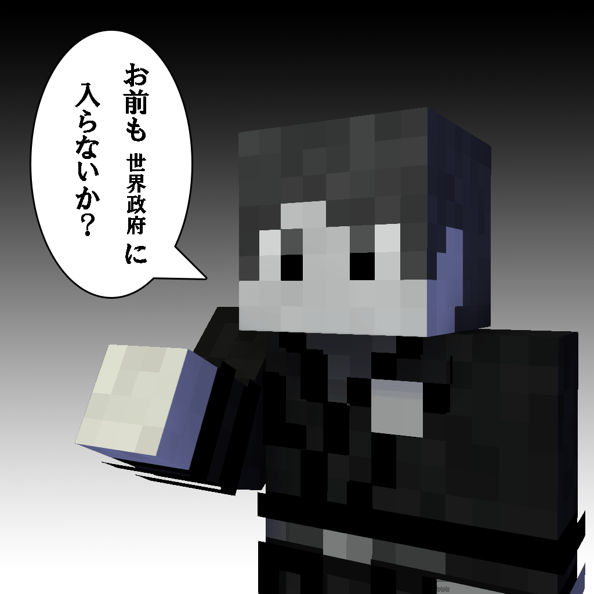

### **世界政府 WFG(World federal government)**

このサーバー内の自治体や国をまとめることで平和と安定を保つために設立された組織。独自の陸軍、海軍、空軍を持ち、世界政府加盟地域に駐屯している。本部をスポーンに置く。旗の色は黒と白である。  

#### 憲章

国、都道府県またはそれに準ずる地域の加盟が認められる。  
加盟は世界政府側から求めることがある。その際、国、都道府県またはそれに準ずる地域は、参加を強制されない。  
また世界政府はサーバーの権力を持たない（サーバールール範囲内に於いて活動をする）。  
加盟地域の首都に世界政府の支部を置く。場合により世界政府軍の駐屯を求める場合がある（軍に関しては加盟地域全体）。

#### 加盟地域

| 国名・地名 | 首長 | 政府機関 | 首都 |
| --- | --- | --- | --- |
| 神聖L帝国(神聖ルアタニア帝国） | bagiruki | 世界政府全空軍、世界政府全海軍、世界政府全陸軍 |  |
| 骨董品帝国 | MarumasaUSB | 世界政府陸軍骨董品駐屯地第十二旅団 |  |
| 東麗県 | sapporo\_salmon | 世界政府札幌支部（札幌市）世界政府陸軍T村駐屯地第二師団 | 札幌市 |
| 武蔵県 | Shiro11\_ | 世界政府彩都支部(彩都市) | 彩都市 |
| 緑島共和国 | Konnichiha5729 | 世界政府緑島支部(緑島市) | 緑島市 |
| 東北県 | toumorokoshi1222 |  | 富山市 |
| 新形県 | KENTO |  | 新形市 |
| 南方ソヴィエト社会主義共和国連邦 | Rul1starll |  | ムスカワ |
| 北海県 | anthurum84 |  | 海原市 |
| 雪花県 | yuma0214yuma | 世界政府西雪原方面防衛基地兼駐雪花ルアタニア西方前線陸軍基地 | 雪花市 |
| ズデーテンランド | \_yakitoro23 |  | ハルシンキ |
| 広足県 | Seibu\_Yellow |  | 広足市 |
| 山川県 | StudiedSign2230 |  | 山川市 |
| 大福合衆国 | bagiruki |  | クリキントンDC |
| 南蛮県 | Studiedsign2230 |  | 南蛮市 |

### 軍備

#### 陸軍総隊

| 部隊名 | 駐屯地名 | 兵種 | 所在地 | 備考 |
| --- | --- | --- | --- | --- |
| 近衛旅団 | スポーン駐屯地(司令部) | 近衛団 | スポーン | スポーンの近衛 |
| 水陸機動団 | 松牛駐屯地(司令部) | 離島奪還 | 松牛市 | 完全奪還 |

#### 陸軍

| 部隊名 | 駐屯地名 | 兵種 | 所在地 | 備考 |
| --- | --- | --- | --- | --- |
| 第一師団 | スポーン駐屯地(司令部) | 第一偵察戦闘大隊,第一普通科連隊 | スポーン | 世界政府最後の砦 |
| 第一師団 | 緑島駐屯地 | 第五普通科連隊、第101後方支援隊,第１０２通信隊,第１施設科大隊 | 緑島共和国緑島市 |  |
| 第二師団 | T村駐屯地(司令部) | 第三普通科連隊,第二戦車中隊,第一対戦車大隊 | 東麗県T村 | 不屈の第二師団 |
| 第三師団 | 彩都駐屯地(司令部) | 第四普通科連隊,第一高射特科連隊 | 武蔵県彩都市 | 北鎮の第三師団 |
| 第十二旅団 | 骨董品駐屯地(司令部) | 第一特科連隊,第一航空隊,第二普通科連隊 | 骨董品帝国 | 古都の第三旅団 |
| 第十二旅団 | 石北分屯地 | 第二航空隊 | 東麗県石北市 |  |

#### 海軍

| 部隊名 | 駐屯地名 | 兵種 | 所在地 | 備考 |
| --- | --- | --- | --- | --- |
| 海軍航空隊第一航空群 | 世界政府南洋空軍基地 | 第11飛行隊(哨戒機部隊) | 神聖L帝国 |  |
| 第一掃海群、第二掃海群 | 汐浜基地 | 掃海部隊 | 神聖L帝国 |  |

#### 空軍

| 部隊名 | 駐屯地名 | 兵種 | 所在地 | 備考 |
| --- | --- | --- | --- | --- |
| 第一航空団飛行群 | 世界政府南洋空軍基地 | 第101飛行隊(戦闘機部隊　運用機種F-15-W-A) | 神聖L帝国 |  |
| 第二航空団飛行群 | 世界政府南洋空軍基地 | 第201飛行隊　(戦闘爆撃機部隊　運用機種　F-15-W-E) | 神聖L帝国 |  |
| 豊海方面救助隊 | 豊海運河分屯地 | 第１救難隊　（救助ヘリ　運用機種UH-60W） |  |  |

#### 沿岸警備隊

| 部隊名 | 基地名 | 兵種 | 所在地 | 備考 |
| --- | --- | --- | --- | --- |
| 豊海運河警備部 | 第一管区豊海保安部 | 南海東側、豊海運河の警備 |  |  |

### 支部

| 支部名 | 所在地 | 首長 |
| --- | --- | --- |
| 札幌支部 | 東麗県札幌市 | sapporo\_salmon |
| 彩都支部 | 武蔵県彩都市 | Kasutera2009 |

### 管理施設

| 施設名 | 所在地 | 首長 | 備考 |
| --- | --- | --- | --- |
| 豊海運河 |  | AKAGI185 | 豊海運河はすべての船舶が世界政府の管理下の元、安全に航行することができる |

  
  
