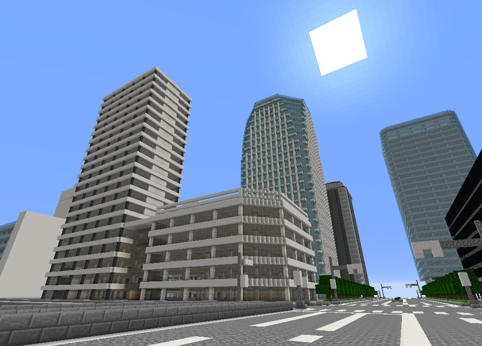

### 概要

高層ビルが多く立ち並ぶTORO Serverの中心的都市。また、港湾都市や行政都市としての側面も併せ持つ。  
  

### 地区

#### 暁町

東部の運河に囲まれた地域。都市内最大のターミナル駅、十呂駅がある。

#### 幕張

南の海に面した地域。交通機関関連の事業所を集積した[交通ビル](../03_Transportation/%E4%BA%A4%E9%80%9A%E3%83%93%E3%83%AB.md)がある。

#### 森園

都市中央部にある地域。市役所をはじめとした行政区。

#### 北十呂

中心部からは少し離れた場所に位置する。北十呂駅を中心に中小規模の建築物が並ぶ。

### 交通

#### 道路交通

#### 鉄道交通

##### 十呂市営地下鉄

##### 二取鉄道

##### Nines南海鉄道

##### 幸麓鉄道

##### 東占鉄道

##### 敷手鉄道

##### レイス連合総合交通局