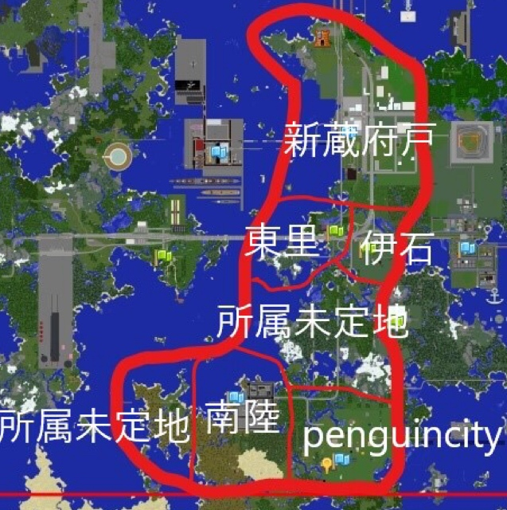

##### 南十県

南十県(なんとけん)は、7月にできた県です。  

+ 首長：T\_AGamingsTAPO

#### 所属自治体

| 名称 | 読み方 | 首長 | 備考 |
| --- | --- | --- | --- |
| 新蔵府戸市 | しんくらふとし | T\_AGamingsTAPO | 県庁所在地 たぽ首長によって設立された、都市である。　道路と建物の大きな市内変更があってから、発展している |
| 南陸市 | なんりくし | kareraisu | kareraisu市長が設立した、南側最大都市といっても過言ではない、都市である |
| 伊石町 | いいしちょう | Keita0222 | Keita町長が設立した町 |
| 東里村 | とうさとむら | Nitori\_Choco | 開発者募集中 |
| 辺銀市 | ぺんぎんし | Penguinsirokuma | 道路がない田舎です！建築者カモン！ |

  
  
南十県地図(2019/07/28現在)

##### 南十県委員会一覧

| 委員会名 | 読み方 | 委員長 | やること |
| --- | --- | --- | --- |
| 南十活動部 | なんとかつどうぶ |  | 南十県ビル雑草プロジェクトの主催部 |
| 南十警察部 | なんとけいさつぶ |  | 南十の警察の中心の人。南中の法律を決めることができます。 |
| 南十消防部 | なんとしょうぼうぶ |  | 南中の消防の中心の人。消防に関わることを決められます。 |
| 南十自衛部 | なんとじえいぶ |  | 軍艦などを所有し、南十を守ります。 |
| 南十県道委員会 | なんとけんどういいんかい |  | 南十の大きな道を管理、道について決めることができます。(鉄道を除く。) |