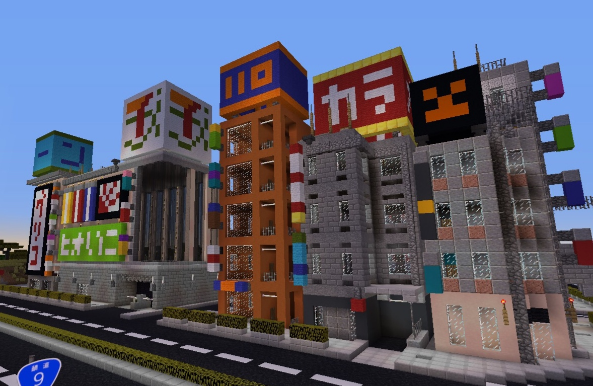
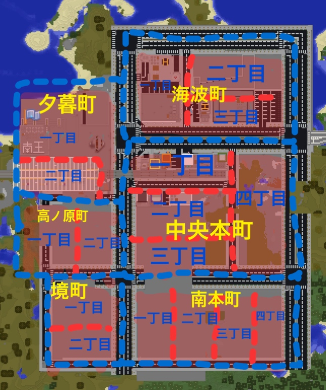

三月、南の島の方に新しい街が設立されました！！！  
街の画像  
  
  
「南陸市」  
  
南陸資料集⬇  
  
鉄道一覧

|  |  |
| --- | --- |
| 南王鉄道会社 | 南西線 |

  
国道一覧

|  |  |
| --- | --- |
| sakoppi | 鯖道9号線 |

  
所属県  
「南十県」  
  
市のマーク  
  
  
市の木  
アカシアの木  
  
市の花  
フランスギク  
  
市の歌、市のキャッチコピー  
忘れてしましました、、、すいません。  
  
市長kareraisu  
  
南陸市法律  
  
第一章　「基本的法律」  
第一条　市民は、運営法律（鯖のルール）を守らなければならない。  
第二条　市は、運営法律を変えてはならない。  
第三条　市民は、殺人、窃盗、基本的な人間の生き方をそむいてはいけない。  
  
第二章　「市の政治の尊重、市民の生活」  
第一条　市、または市民は共産党を尊重し、汚すような発言、思想をしてはならない。  
第二条　総選挙は行ってはならない。  
第三条　共産党を永久に続かせなければならない。  
第四条　市民は、定期的に市に税を納めなければならない。  
第五条　市長にはすべての命令を決める権利がある。（一部を除く）  
第六条　市民は、市長の決定づけた命令に従わなければならない。  
第七条　引っ越しする際は、5年以上市に住み、市に１億３０００円支払ったもののみ住居のいてんをみとめる。  
  
第三章　「労働」  
第一条　南陸市に住む市民全員は市内の職場で働かなければならない。（小、中学生含む）  
第二条　市に許可もなく働く場所を決めてはならない。  
第三条　市は、市民の職場を決める権利がある。  
  
第四章　「平和」  
第一条　他の県道もしくは市、町、村との戦争は行わない。  
第二条　すべての問題は言論で解決させる。  
第三条　他の県道、市、町、村からの攻撃があった場合のみ戦争を認める。  
  
第五章　「道路交通法」  
第一条　基本的には市内全域の歩道は歩行者及び自転車専用道とする。  
第二条　基本的には市内全域は追い越し禁止とする。  
第三条　日本的には市内全域を道路駐車禁止とする。  
第四条　道路標識は従わなければならない。  
第五条　飲酒６時間以内の運転はしてはならない。  
第六条　免許証があるもののみ運転を認める。  
  
第六章　「建築法」  
第一条　建築はすべて２０階までとする。（大きさにもよります）  
第二条　市の許可がなしに建築をしてはならない。  
第三条　現代的な建築にする。  
  
※あくまでもこれは設定です。（一部を除く）  
  
  
  
2019/07/27現在の開発状況  
※生成が追いついていない可能性があります。  
  
区域地図  
  

|  |
| --- |
| 海波町 |
| 中央本町 |
| 南本町 |
| 境町 |
| 夕暮町 |

  
また、ディスコードの方では、できない時もありますが、「週間南陸ニュース」をします。  
その出してきた情報、他の情報を出します。⬇⬇⬇

|  |  |
| --- | --- |
| 4月12日 | 鯖道9号線が南陸市に入った。 |
| 4月14日 | 南陸市wikiができた。 |
| 4月18日 | 主な道が完成した。 |
| 4月19日 | 新市役所ができた。 |
| 4月20日 | 南陸市内の区域の名前が決まった。 |
| 4月23日 | 警察、病院、消防署ができた。 |
| 4月26日 | 南陸テレビ塔が完成。 |
| 4月26日 | 海波町が完成。 |
| 4月27日 | 新武蔵戸駅まで南陸駅が入る路線が繋がることが決定。 |
| 4月27日 | toro server最大級のショッピングモール作成決定。名前は投票で決める。 |
| 5月11日 | 中央本町に中華商店街の作成を予定。(作成の決定はしていません。) |
| 5月11日 | 只今、南陸シネマ巨大映画館作成中 |
| 5月11日 | 中央本町に昭和風商店街の作成を予定。(作成の決定はしていません) |
| 5月11日 | 新巨大ショッピングモールの名前が「101」に決定。 |
| 5月25日 | シネマ巨大映画館完成。 |
| 5月30日 | 江戸中華風商店街完成。 |
| 6月1日 | 頭見つけキャンペーンを正式に公表。 |
| 6月1日 | 南陸市内住所を本格的に決定。 |
| 6月22日 | hirotontownと南陸市が路線で繋がることが決定。 |
| 7月24日 | 中央本町が完成。 |
| 7月27日 | 南十県所属決定を公表。 |
| 7月27日 | ３つの市から路線をつなげることを公表。 |

そのほかもろもろ...  
  
南陸市が完成しました！