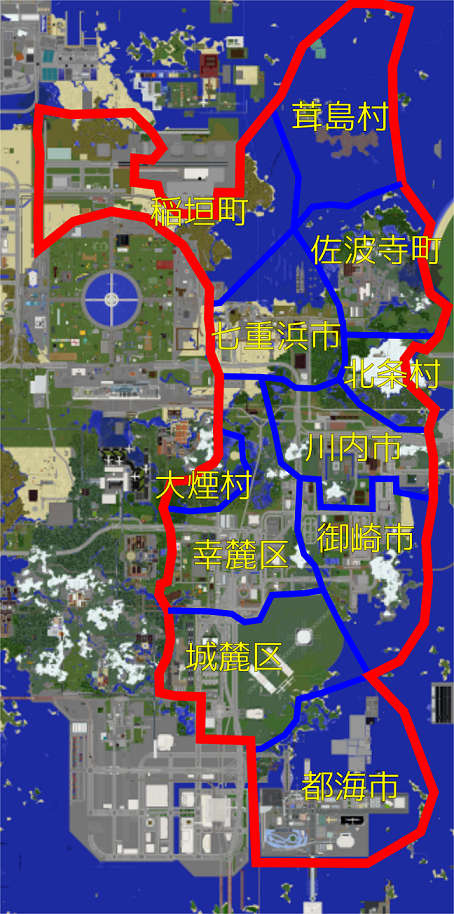
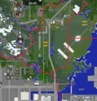

**幸麓府**（こうろくふ）は、鯖中部に位置する府。南部から東部にかけては十呂都市圏、北西部はスポーン都市圏、北部は牧港都市圏に含まれる。  
  
府庁所在地は特別区が設置されている。2020年7月10日に幸麓県が府となった。  
  
**目次**  

* [府域の地図](#content_1)
* [沿革](#content_2)
* [組織](#content_3)
* [所属自治体](#content_4)
* [条例](#content_5)

  
  

### 府域の地図

### 沿革

* 2017年
  + 7月 : TORO鯖の開設5日以内に幸麓市の設立を宣言。
  + 8月 : 自治法の規定による市になれなかったため、幸麓市を幸麓町に改称。
  + 10月：御崎の開拓により、村が造成され御崎村が設立される。
* 2018年
  + 3月 : 幸麓町と御崎村の境界を確定。
  + 6月 : 十呂幸麓開発整理事業着手（事業主体：十呂市長、幸麓町長、二取電鉄）
  + 7月 : 十呂市との間の所属未定地を幸麓町へ編入。同時に十呂市の境界を確定。
  + 8月 : 水上村、御崎村大字台伯を幸麓町へ編入。蛸嵐村のうち刑務所建設予定地を一時的に幸麓町へ編入。
  + 10月：幸麓町、御崎村及び北幸麓村の一部が合併し幸麓市となる。同時に大字蛸嵐（蛸嵐刑務所）の区域を燕谷市に編入。
  + 12月：北条村が設置される。
* 2019年
  + 3月：幸麓県を設置。幸麓市が区設置条例を制定。城麓区、幸麓区、御崎区を設置。占都市との間の所属未定地を幸麓市に編入。
  + 5月：幸麓市御崎区の区域をもって御崎市を設置。ES特別街区を幸麓市に編入し北方町を設置する。
  + 6月：大煙村が設置される。
  + 9月：創吠道阿佐ヶ谷市稲垣区を幸麓県に編入。その区域をもって稲垣町を設置。
  + 12月：幸麓郡北幸麓村が名称変更し湖東村となる。
* 2020年
  + 2月：七重浜町が幸麓府に編入される。
  + 3月：御崎市の一部及び幸麓郡湖東村が合併し川内市が設置される。
  + 4月：七重浜町のうち大字佐波寺が分離されて佐波寺町が設置され、残部は市制施行し、七重浜市となる。
  + 5月：茸島諸島及び都海市を幸麓府に編入。茸島諸島の区域に茸島村を設置。
  + 7月：幸麓県を幸麓府に改め、幸麓市幸麓区、城麓区が特別区となる。

### 組織

* 府知事
  + 府知事官房
  + 総務部
    - 市町村課
    - 企画課
    - 人事課
    - 茸島村役場職務代行機関
  + 土木交通部
    - 交通政策課
    - 航空管制課
    - 空港維持課
    - 道路維持課
    - 都市計画課
  + 財務部
    - 税務課
    - 経理課
  + 教育部
    - 学校施設管理課
    - 教育指導課
  + 農政部
    - 農地整備課
    - 森林課
    - 湖東農政派出所
    - 北条営農政派出所
  + 幸麓県警察本部
    - 幸麓空港特別警察隊
    - 高速道路交通警察隊
    - 幸麓警察署
    - 御崎警察署
    - スポーン警察署
  + 幸麓県消防本部
* 公安委員会

### 所属自治体

#### 幸麓区（特別区）

2020年7月1日に幸麓市特別区化により幸麓市幸麓区の区域が特別区として設置された区である。  
自治体の運営は、幸麓府が行う。

#### 城麓区（特別区）

2020年7月1日に幸麓市特別区化により幸麓市城麓区の区域が特別区として設置された区である。  
自治体の運営は、幸麓府が行う。

#### 御崎市

2019年3月に幸麓市から分離して設置された市である。

#### 川内市

2019年3月に御崎市の一部及び幸麓郡湖東村が合併し設置された市である。

#### 都海市

2020年5月に[都海市](%E9%83%BD%E6%B5%B7%E9%83%BD%E5%B8%82%E7%BE%A4.md)の区域を幸麓県に編入。

#### 七重浜市

2020年2月にhidezou3によって建設されていた七重浜町を幸麓県に編入。同年4月に市制施行。

#### 七重浜郡佐波寺町

2020年4月に七重浜町より分割され設置された町。

#### 空海郡稲垣町

2019年9月に創吠道阿佐ヶ谷市稲垣区を幸麓県に編入されその区域に設置された町。

#### 幸麓郡北条村

2018年12月に設置された村。

#### 幸麓郡大煙村

2019年6月に設置された村。

#### 茸島村

2020年5月に茸島諸島（二宅島、茸島、北茸島）の編入に伴い設置された村。大字は二宅島、茸島がある。

### 条例

前身の幸麓県、幸麓市、幸麓町の条例を含む。

#### 幸麓市告示第1号

幸麓市の設置  
  
北緯204度、東経1,945度に幸麓市を設置することを宣言する。  
  
2017年7月

#### 幸麓市告示第2号

市を町に変更する件  
  
自治法の施行により、市制施行基準に幸麓市が合致しないため、幸麓市を幸麓町と改称する。

#### 幸麓町告示第1号

字の区域の設定  
  
自治法の規定に基づき、以下の通り幸麓町に字を設置する。  
  

#### 幸麓町告示第2号

字の区域の変更及び廃止  
  
自治法の規定に基づき、以下の通り字の区域を変更し及び字を廃止する。  
  
大字池原及び大字北山の区域を廃し、その区域を大字麓に編入する。  
大字山谷及び大字燃山の区域を廃し、その区域を大字幸山に編入する。

#### 幸麓町告示第3号

所属未定地の所属の編入及び市町の境界確定  
  
自治法の規定に基づき、以下の通り所属未定地を幸麓町に編入する。  
  
編入により近接することとなった十呂市との境界線については、十呂市長と協議の結果、以下の図のとおり十呂市と幸麓郡幸麓町の境界を確定することを協定した。  
  
所属未定地の所属の編入及び市町の境界確定は、2018年7月22日よりその効力を有する。  
  

#### 幸麓町告示第4号

字の区域の設定  
  
自治法の規定に基づき、幸麓町告示第3号により幸麓町に編入された区域のうち南緯160度以北の区域に「大字城麓」（じょうろく）、南緯160度以南の区域に「大字入山」（いりやま）を設置する。  
  
字の区域の設定は、幸麓町告示第3号の施行日よりその効力を有する。

#### 幸麓町告示第5号

町村の廃置分合  
  
自治法の規定に基づき、幸麓郡水上村を廃し、幸麓郡幸麓町に編入する。  
  
町村の廃置分合は、2018年8月1日よりその効力を有するものとする。

#### 幸麓町告示第6号

町村の境界変更  
  
自治法の規定に基づき、2018年8月1日より幸麓郡御崎村のうち大字台伯を幸麓郡幸麓町に編入する。

#### 幸麓町告示第7号

市町の境界変更  
  
自治法の規定に基づき、十呂市長との協議により十呂市と幸麓郡幸麓町の境界を、南緯400度東経1,580度から南緯400度東経1,730度を経て、南緯645度東経1,730度に至る線に変更する。  
また、変更する境界上に位置する二取電鉄線は十呂市、鯖道14号暁町幸麓線は幸麓郡幸麓町の所属とする。  
  
この市町の境界変更は、2018年8月5日よりその効力を有するものとする。

#### 幸麓町告示第8号

開発特別区の設置  
第1条 幸麓郡幸麓町大字城麓及び幸麓郡幸麓町大字入山の全域、十呂市北十呂の一部の区域をもって、開発特別区を設置し、その名称を「十呂幸麓開発事業特区」と命名する。  
第2条 十呂幸麓開発事業特区の開発監督部署として十呂幸麓開発事業庁を置き、十呂幸麓開発事業特区の開発に関する監督業務を行う。十呂幸麓開発事業庁は幸麓郡幸麓町大字城麓3番地に本庁を置く。  
第3条 十呂幸麓開発事業庁の長は幸麓町長が兼任し、副長を二取電鉄社長及び十呂市長が兼任する。  
第4条 十呂幸麓開発事業特区の対象事業は、以下のとおりとする。

* 鉄道会社関係
  + 二取電鉄線鉄道立体交差事業
  + 十呂緑地駅再開発事業
  + 南幸麓駅設置事業
  + 都海鉄道路線整理事業
  + 幸麓鉄道幸麓本線建設事業（幸麓駅〜十呂緑地駅に限る）
* 道路公団関係
  + 十呂自動車道幸麓地区改良事業
  + 鯖道14号暁町幸麓線整備事業
  + 鯖道37号十呂緑地停車場線整備事業
* 幸麓町直轄事業
  + 幸麓南部地区区画開発事業
  + 幸麓町合同庁舎建設事業

#### 幸麓町告示第9号

市町の廃置分合及び幸麓町を幸麓市とする件  
  
幸麓郡幸麓町のうち大字蛸嵐を燕谷市に編入し、幸麓町の残部及び同郡御崎村、北幸麓村の一部(幸麓向峡PA敷地)をもって幸麓市を置く。  
また、この告示が施行された日をもって幸麓郡を廃止する。  
この告示は2018年10月1日より施行する。

#### 幸麓市役所を定める条例（幸麓市条例第1号）

幸麓市役所の位置を城麓一丁目3番1号に置く条例。

#### 幸麓市の町の区域を定める条例（幸麓市条例第2号）

上記町名にあるとおり町を設置する条例。

#### 幸麓市雛津町景観保護条例（幸麓市条例第3号）

幸麓市雛津町の周辺20ブロックの区域に鯖主又は市長の許可なく建物等の建設を禁止する条例。

#### 幸麓市地域開発特例条例（幸麓市条例第4号）

幸麓市の御崎町、台伯町（台伯湖周辺を除く）、城麓一丁目から城麓三丁目までの開発について幸麓市長以外の者が開発に参加することを認める特例条例。  
そのほかに特例会社である十呂緑地開発事業団の設立を定める。

#### 幸麓市土地分譲条例（幸麓市条例第5号）

幸麓市の土地を分譲することを認め、分譲の方法を定める条例。

#### 幸麓駅再開発条例（幸麓市条例第6号）

幸麓駅の駅舎、在来線・新幹線ホームを再開発し、周辺の建物の立ち退きを行う区域を定める条例。

#### 幸麓市学校設置条例（幸麓市条例第7号）

幸麓市立幸麓高等学校及び幸麓市立幸麓小中学校を設置することを定める条例。  
幸麓市外の生徒等の通学を認める条文もある。

#### 幸麓市公有水面埋立条例（幸麓市条例第8号）

幸麓市の区域周辺の公有水面を埋立てる場合に市長の許可を得なければならないことを定めた条例。原則として幸麓市雛津町景観保護条例の適用区域については原則として認めないことも定められている。

#### 幸麓市株式保有条例（幸麓市条例第9号）

以下の会社の株式を保有することを定める条例。

* 幸麓鉄道株式会社（主要株主）
* 幸麓電力株式会社（市有特例会社）
* 鯖道路公団（一部株主）

#### 幸麓地方警察設置条例（幸麓市条例第10号）

幸麓市に警察を置く条例。市長の下に幸麓市警察本部を置く。  
幸麓市警察本部の下に幸麓警察地方隊、御崎警察地方隊、十呂緑地警察地方隊、高速道路警察隊を置く。  
鯖公安委員会の指揮下に置かれる。  
2019年3月に改正され、幸麓市警察設置条例から幸麓地方警察設置条例に名称を変更した。

#### 区を設置する条例（幸麓市条例第11号）

城麓区、幸麓区、御崎区を置く条例。

#### 幸麓県条例第1号（県庁の所在地を定める条例）

幸麓県庁を幸麓県幸麓市幸麓本町一丁目1番1号に置く。

#### 幸麓県条例第2号（幸麓県の県道を定める条例）

幸麓県が管理する道路を以下のとおり定める。

| 路線番号 | 路線名 | 起点 | 終点 | 主な経過地 |
| --- | --- | --- | --- | --- |
| 1 | エズナ空港幸麓線 | エズナ空港 | 幸麓市 |  |
| 2 | スポーン占都線 | 幸麓県境（スポーン） | 幸麓県境（占都市） |  |
| 3 | 御崎北方線 | 川内市大字湖東中山 | 幸麓市北方町 |  |
| 4 | 幸麓空港線 | 幸麓市城麓区 | 幸麓空港 |  |
| 5 | 十呂都海線 | 十呂市 | 都海市 |  |
| 6 | 邪入瑠稲垣線 | 七重浜市邪入瑠町 | 空海郡稲垣町 | 七重浜市 |
| 10 | 幸麓停車場線 | 幸麓市 | 幸麓停車場 |  |
| 11 | 御崎港線 | 御崎市本町 | 御崎港 |  |
| 12 | 水上台停車場線 | 幸麓市城麓区 | 水上台停車場 |  |
| 13 | 十呂緑地停車場線 | 幸麓市城麓区 | 十呂緑地停車場 |  |
| 14 | 北条高原停車場線 | 幸麓郡北条村 | 北条高原停車場 |  |
| 15 | スポーン大煙城麓線 | スポーン港 | 幸麓市城麓区 | 幸麓郡大煙村 |
| 16 | 川内停車場線 | 御崎市川内町 | 川内停車場 |  |
| 17 | 七重浜湖東線 | 七重浜市 | 川内市大字湖東中山 |  |
| 18 | 湖東御崎線 | 川内市湖東中山 | 御崎市 |  |
| 19 | 七重浜港線 | 七重浜郡佐波寺町 | 七重浜漁港 |  |
| 20 | 七重浜停車場線 | 七重浜市 | 七重浜停車場 |  |
| 21 | 加沼停車場線 | 都海市 | 加沼停車場 |  |
| 22 | 七重浜最澄停車場線 | 七重浜市 | 最澄停車場 |  |
| 30 | 幸麓北十呂自転車道線 | 幸麓停車場 | 十呂市北十呂 | 幸麓市城麓区 |

#### 幸麓県条例第3号（幸麓県警察設置条例）

第一条 幸麓市警察の業務は幸麓県警察がこれを継承する。  
第二条 幸麓県警察の本部を幸麓市幸麓区幸麓本町二丁目5番街区に設置する。  
第三条 幸麓県警察の管轄区域は幸麓県とし、スポーン特別区、十呂市の区域を当面の間管轄区域に含む。  
第四条 幸麓県警察の出先機関として以下を置く。  
幸麓警察署、七重浜警察署、都海警察署  
第五条 当面の間鯖全域の高速道路の交通警察として、高速警察隊を設置する。

#### 幸麓県条例第4号（町又は字の改廃に関する条例）

第一条　市町村又は区の区域に町又は字を設置し、廃止し、区画を変更するときは予めその市町村の長は公示をしなければならない。  
第二条　第三条の公示を以てその町又は字の区域の設置、廃止、区画の変更の効力を有する。

#### 幸麓県条例第5号（茸島村職務代行機関条例）

第一条　茸島村の役場は当面の間設置しない。  
第二条　茸島村の行政については当面の間幸麓県がこれを代行する。  
第三条　幸麓県庁総務課に茸島村役場職務代行機関を設置する。  
第四条　茸島村の村長については当面の間幸麓県知事が定めたものがこれを代行する。

#### 幸麓県条例第6号（幸麓県を府とする条例）

第一条　幸麓県を幸麓府に改める。  
第二条　この条例は2020年7月10日より施行する。

#### 幸麓県条例第7号（幸麓市を廃しその区域に特別区を設置する条例）

第一条　幸麓市を廃し、幸麓市城麓区、幸麓市幸麓区を特別区とする。  
第二条　この条例は幸麓県条例第6号の施行日より施行する。

#### 幸麓府条例第8号（幸麓府の府道を定める条例）

幸麓県の県道を定める条例（幸麓県条例第2号）を改正する。  
  
第一条　表題を幸麓県の県道を定める条例から幸麓府の府道を定める条例に改める。  
第二条　幸麓県を幸麓府に改める。  
第三条　府道の一覧を以下のとおり全面改正する。

##### 主要地方道

| 路線番号 | 路線名 | 起点 | 終点 | 主な経過地 |
| --- | --- | --- | --- | --- |
| 1 | エズナ空港都海線 | エズナ空港 | 都海市 | 幸麓区 |
| 2 | 七重浜占都線 | 七重浜市 | 占都市 | 七重浜郡佐波寺町 |
| 3 | 雛津川内北方線 | 城麓区雛津町 | 幸麓区北方町 | 川内市 |
| 4 | 幸麓空港線 | 城麓区雛津町 | 幸麓空港 |  |
| 5 | 城麓大煙七重浜線 | 城麓区 | 七重浜市 | 幸麓郡大煙村 |
| 6 | 邪入瑠稲垣線 | 七重浜市邪入瑠町 | 幸麓郡稲垣町 | 七重浜市 |
| 7 | 幸麓空港川内線 | 幸麓空港 | 川内市 | 御崎市 |

##### 一般府道

幸麓区・御崎市・川内市・城麓区・都海市（南部地方）については100番台  
大煙村・七重浜市・佐波寺町・北条村・稲垣町・スポーン・茸島群島（北部地方）については200番台  
自転車道については300番台を割り当てる。複数の地域を通る場合は、一番若い番台を使用する。  

| 路線番号 | 路線名 | 起点 | 終点 | 主な経過地 |
| --- | --- | --- | --- | --- |
| 101 | 幸麓停車場線 | 幸麓区 | 幸麓停車場 |  |
| 102 | 川内停車場線 | 川内市 | 川内停車場 |  |
| 103 | 幸麓本町停車場線 | 幸麓区本町 | 幸麓本町停車場 |  |
| 104 | 御崎停車場線 | 御崎市 | 御崎停車場 |  |
| 104 | 幸麓インター線 | 幸麓区 | 幸麓インター |  |
| 105 | 御崎インター線 | 幸麓区 | 御崎インター |  |
| 106 | 水上台停車場線 | 城麓区 | 水上台停車場 |  |
| 107 | 十呂緑地停車場線 | 城麓区 | 十呂緑地停車場 |  |
| 108 | 加沼停車場線 | 都海市 | 加沼停車場 |  |
| 109 | 十呂都海線 | 十呂市 | 都海市 |  |
| 110 | 川内幸麓線 | 川内市 | 幸麓区 | 川内市蔵屋敷町 |
| 111 | 雛津停車場線 | 城麓区雛津町 | 雛津停車場 |  |
| 201 | 北条高原停車場線 | 幸麓郡北条村 | 北条高原停車場 |  |
| 202 | 七重浜港線 | 七重浜郡佐波寺町 | 七重浜漁港 |  |
| 203 | 七重浜停車場線 | 七重浜市 | 七重浜停車場 |  |
| 204 | 七重浜最澄停車場線 | 七重浜市 | 最澄停車場 |  |
| 205 | 南七重浜停車場線 | 七重浜市 | 南七重浜停車場 |  |
| 206 | 稲垣空海線 | 幸麓郡稲垣町 | 空海市 |  |
| 207 | 二宅島環状線 | 茸島村大字二宅島 | 二宅島港 |  |
| 208 | 茸島線 | 茸島村大字北茸島 | 茸島村大字茸島 |  |
| 209 | 白樺河停車場線 | 幸麓郡大煙村 | 白樺河停車場 |  |
| 210 | スポーン南停車場北方線 | スポーン南停車場 | 幸麓区北方町 |  |
| 211 | 稲垣停車場線 | 幸麓郡稲垣町 | 稲垣停車場 |  |
| 212 | 湖東北条停車場線 | 七重浜市 | 湖東北条停車場 |  |
| 301 | 幸麓北十呂自転車道線 | 幸麓停車場 | 十呂市北十呂 | 幸麓市城麓区 |

  
第四条　この条例は2020年9月1日から施行する。