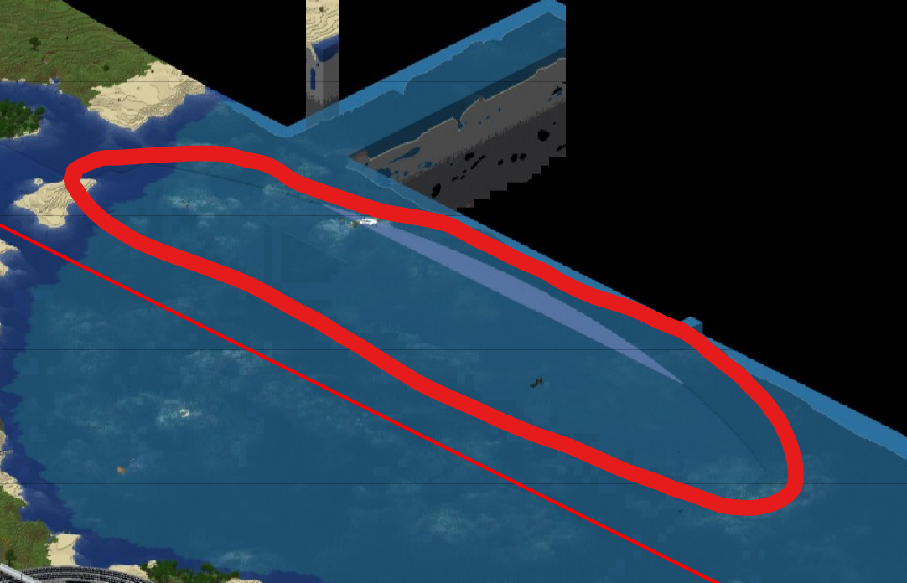
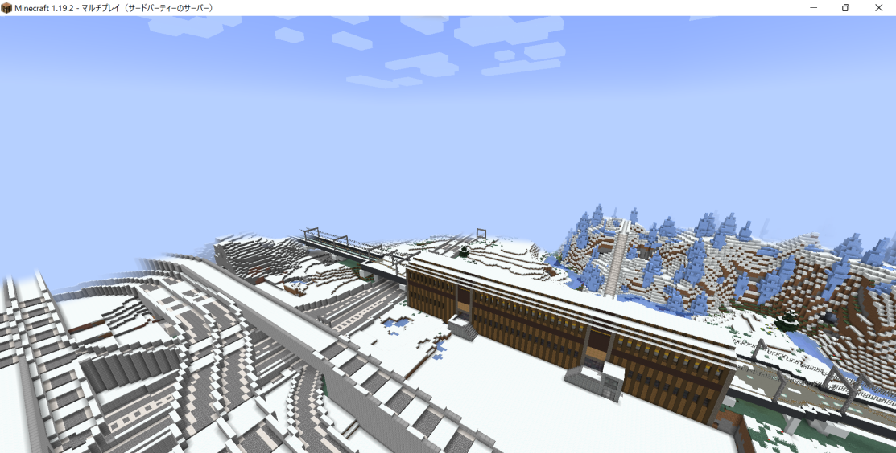

ようこそ  
  
この項目は、常連の皆様方が蓄積された鯖に関する内輪ネタを拡張する場所、いわゆる情報集積地です。  
ニュースを書いたり、個人的な探索を発表したり、Discordに書くには少し憚られる長文を書くなど、用途は自由です。  
書くときは名乗りましょう　「例の人」とかはダメです　発言には責任が伴うんです  
また、事実記事と冗談記事が混合しています。後者の類についてはあまり真に受けないようにお願いします。  
画像を投稿するときはサイズに注意しましょう　あまりに巨大だと記事が見づらくなります。  
  

**目次**

* [2023年](#content_1)
  * [9月](#content_1_1)
    * [(2023/09/24)300日前のWE事故 ワールド拡張により解決（登里市より...yhu84）](#content_1_1_1)
  * [4月](#content_1_2)
    * [(2023/4/9) 鉄道不文律の崩壊による利点（Gazette（フランス語で官報））](#content_1_2_2)
  * [2月](#content_1_3)
    * [(2023/02/14) 鉄道不文律の崩壊と浮遊する都市建築(ぎろんタイムとろろMAX)](#content_1_3_3)
    * [(2023/02/13) 拡張先が旧メイン 前ワールドの都市続々 皆困惑(sushi times)](#content_1_3_4)
    * [(2023/02/11) 白氏が五日市市長辞任 次期市長は選挙で決定 登里市は解体説が浮上(武蔵新聞)](#content_1_3_5)
    * [(2023/02/06)　登里市に突然火山が出現 建設中の高速道路つぶれる(武蔵新聞)](#content_1_3_6)
    * [(2023/02/06) 嫌すぎるWE事故(寿司鉄道)](#content_1_3_7)
    * [(2023/02/05)端田新幹線をめぐる問題 緑市長「厳しい条件を設ける」(武蔵新聞)](#content_1_3_8)
    * [(2023/02/05)武蔵新聞創設(武蔵新聞)](#content_1_3_9)
    * [(2023/02/01)黒十字を鯖wikiに復帰 X6Z](#content_1_3_10)
* [2022年](#content_2)
  * [6月](#content_2_4)
    * [(2022/6/5)誤jail事件](#content_2_4_11)
  * [4月](#content_2_5)
    * [(2022/4/10)鵜の浜の急速発展　(しんぶん赤城)](#content_2_5_12)
  * [3月](#content_2_6)
    * [(2022/3/5)サーバーの荒らし問題　（しんぶん赤城）](#content_2_6_13)
  * [1月](#content_2_7)
    * [(2022/01/29)赤城急行鉄道高麗へ延伸　（しんぶん赤城）](#content_2_7_14)
    * [(2022/01/16)赤城急行鉄道合理化を発表　（しんぶん赤城）](#content_2_7_15)
    * [(2022/01/15)しんぶん赤城発足　（しんぶん赤城）](#content_2_7_16)
* [2020年](#content_3)
  * [８月](#content_3_8)
    * [(2020/08/22) SignPicture普及率71% 導入しない人の理由は (sushi times)](#content_3_8_17)
    * [(2020/08/15) 「太宰府」参拝の是非　常連が次々に参拝　中央政府は反発 (sushi times)](#content_3_8_18)
    * [(2020/08/15)旧ナメコ連邦最後の一人、コビーヲ・ウルシチョフ氏没。享年98歳。（プラウダ・ニュースポスト・ナメコ）](#content_3_8_19)
    * [(2020/08/05)燕谷県、県内の鉄道改革を近日行う可能性(名鉄ニュース)](#content_3_8_20)
  * [７月](#content_3_9)
    * [(2020/07/30)第三次鯖大戦、終戦(月夜通信)](#content_3_9_21)
    * [(2020/07/30)ソビエト連邦とThe NIGHTSの間で戦争勃発 第三次鯖大戦勃発か(月夜通信)](#content_3_9_22)
    * [(2020/07/20)神埼線急行電車に座席指定車を導入　寿司鉄道 特急化も視野か(sushi times)](#content_3_9_23)
    * [(2020/07/17) 検証報道: 自由と責任の両立、そして外部圧力 (帯広新聞社)](#content_3_9_24)
    * [(2020/07/14) 中指重工航空宇宙開発部が秒速6万メートルを実現（中指書売新聞）](#content_3_9_25)
    * [(2020/07/12) 先の報道に関する見解（sushi times：X6Z）](#content_3_9_26)
    * [(2020/07/09) 東京市、今日午前に感染者を発表（プラウダ・ニュースポスト・ナメコ）](#content_3_9_27)
  * [6月](#content_3_10)
    * [(2020/06/15)　「パトリクスHD」創業、代表取締役社長はなめこ氏。（プラウダ・ニュースポスト・ナメコ）](#content_3_10_28)
    * [(2020/06/15)　えちえち過ぎたるは及ばざるが如し（X6Z）](#content_3_10_29)
    * [(2020/06/11) 工事終了のお知らせ・ほか（寿司鉄道広報）](#content_3_10_30)
    * [(2020/06/10)国連解散とこれから（kareraisu）](#content_3_10_31)
    * [(2020/06/03) 新通貨「ツベリア・クソ」7か月遅れ流通開始へ。(中指書売新聞)](#content_3_10_32)
    * [(2020/06/02) 国土の東西問題 (sushi times)](#content_3_10_33)
    * [(2020/06/02) 中指電機の伝説的パーソナルコンピューター、小さくなって帰ってくる。(中指電機広報)](#content_3_10_34)
  * [5月](#content_3_11)
    * [(2020/05/27) 燕子花駅、駅舎建て直し計画浮上(燕谷県情報局)](#content_3_11_35)
    * [(2020/05/23) 線路配置変更工事に伴う列車停車駅の一時変更について(寿司鉄道)](#content_3_11_36)
    * [(2020/05/21) 社説: 鉄道氷河期 (帯広新聞)](#content_3_11_37)
    * [(2020/5/21)ソ連のコロナウィルス封じ込めは失敗した。（反ソビエト情報通達局)※自作自演です。](#content_3_11_38)
    * [(2020/5/21)ソビエト社会主義共和国連邦、新型コロナウィルス封じ込め成功か。（ソビエト新聞)※自作自演です。](#content_3_11_39)
    * [(2020/05/17)神崎・滑子・東京各市総合市長Nameko氏、きょう未明意識不明より回復。（しんぶん滑旗）](#content_3_11_40)
    * [(2020/05/15)とろさば歴史探求 #3: 神埼市の乱　交通政策のぶつかり (sushi times)](#content_3_11_41)
    * [(2020/05/15) 微変更 (X6Z)](#content_3_11_42)
    * [(2020/05/12) お知らせ: レイアウトの変更 (barusugan)](#content_3_11_43)
    * [(2020/05/12) 社説: 鉄道勢力図の大きな書き換え(帯広新聞社)](#content_3_11_44)
    * [(2020/05/12) C6氏、NTN退職 (帯広新聞社)](#content_3_11_45)
    * [(2020/05/10) 敷手鉄道、空海トンネルの改修を発表 (帯広新聞社)](#content_3_11_46)
    * [(2020/05/10) 関係者全員地名を勘違い　古文書調査で発覚 (sushi times)](#content_3_11_47)
    * [(2020/05/09) 過去に学ぶべきこと (にとり)](#content_3_11_48)
    * [(2020/05/06) 敷手HD、今後の3ヵ年計画を発表 (帯広新聞社)](#content_3_11_49)
    * [(2020/05/06) 川原を偲ぶ。川原に学ぶ。(sushi)](#content_3_11_50)
    * [(2020/05/05)鉄道の存在意義の転換(くだ)](#content_3_11_51)
    * [(2020/05/05)大トロ電鉄紗弥川線開業延期(大トロ電鉄)](#content_3_11_52)
    * [(2020/05/05)七重浜大学について (Hidezou3)](#content_3_11_53)
    * [(2020/05/05)とろさば歴史探求 #2: 鯖一短命な都市、蔵府戸 (帯広新聞社)](#content_3_11_54)
    * [(2020/05/01)燕谷県知事、学園都市と都市計画をめぐって意見対立(tanukiti)](#content_3_11_55)
    * [(2020/05/01)社説: 軍事と定住民の衝突 (帯広新聞社)](#content_3_11_56)
    * [(2020/05/01)FimaryMart、新型コロナで営業時間短縮 (帯広新聞社)](#content_3_11_57)
  * [4月](#content_3_12)
    * [(2020/04/30)セレブイレルン、新型コロナで営業時間短縮へ(tanukiti)](#content_3_12_58)
    * [(2020/04/30)十六夜県に緊急事態宣言(十六夜県)](#content_3_12_59)
    * [(2020/04/29)鯖会議事官報発行　新型コロナウィルス感染症対応について(しんぶん滑旗　発行者:Nameko\_2020)](#content_3_12_60)
    * [(2020/04/29) 社説: 保護の使い方 (帯広新聞社)](#content_3_12_61)
    * [(2020/04/29) 新型コロナにより一部列車運休へ　寿司鉄道 (X6Z)](#content_3_12_62)
    * [(2020/04/28)コラム、他人の建築物は面白い（Sakoppi）](#content_3_12_63)
    * [(2020/04/27)滑子市共産党、「人民条例」発布。効果は”滑子市全域”(Nameko\_2020)](#content_3_12_64)
    * [(2020/04/27)新参鉄道会社の低規格問題(keita\_yamatozi)](#content_3_12_65)
    * [(2020/04/27) 中央鐡道七重浜〜佐波寺間のＬＲＴとしての運行を開始(中央鐵道)](#content_3_12_66)
    * [(2020/04/26) 敷手鉄道が新線建設の一時凍結を発表 (帯広新聞社)](#content_3_12_67)
    * [(2020/04/26) 各鉄道毎に異なる性質 (X6Z)](#content_3_12_68)

### 2023年

#### 9月

##### (2023/09/24)300日前のWE事故 ワールド拡張により解決（登里市より...yhu84）

およそ300日前の2022年11月17日18時00分頃、現緑県登里市（当時は都道府県無所属の緑の丘市）にて、WE事故が発生。//snow 1000を誤って実行してしまい、サーバーが落ちてしまった。そんな大事故の影響により、登里市周辺の海面が1m下がってしまうなどの影響が出た。このWE事故は当時のワールドボーダーを超えて読み込めない範囲にまで広がっており、暫く復旧ができない状態が続いていた。  
　時が経ち9月14日、ワールドボーダーが北西方向に拡張され、ついにWE事故の復旧が可能となった。9月22日、登里市長のyhu84氏によって復旧作業が開始され、当該部分に残っていた氷と1m下がっていた海面が//thawと無限水源を使用して復旧。もちろんWEの使用は安全な範囲に限られた。これによって登里市悲願のWE事故の残骸が復旧され、市長及び市民は喜びに包まれた。  
　市長のyhu84氏は、今回の件にあたって、  
「ようやくWE事故が解決して良かった。WEは確実に安全な範囲で、事故を起こさないようにして欲しい。本当に気を付けて使うべき。1年以上かかってしまったが、このことは大変喜ばしい出来事である。」  
とコメントしている。  
　今回のワールド拡張によって、ワールドボーダー外に出てしまっていたWE事故の残骸が解決した例が他にもあったようだ。皆さんもWE事故には気を付けて、良きTOROライフを。  
  
　左: WE事故の残骸（赤い丸の部分。その下の赤い直線は事故当時のワールドボーダー。）  
↓右:ログ...2023/09/14 00:20頃撮影（310.26/d agoと310.27/d agoのものがWE事故時、 1.43/d agoのものが復旧事業によるもの。）  

#### 4月

##### (2023/4/9) 鉄道不文律の崩壊による利点（Gazette（フランス語で官報））

下説に対する反論である。  
鉄道不文律の崩壊は、ある意味利点をもたらした。  
インフラの規制がないということは、それぞれの鉄道ができることは言わなくてもわかるであろう。そして、個々の鉄道を作成することで、お互いの競争、そしてその間にコミュニティが生まれる。また、お互いと争ううえで、いかにして相手に勝つかという点で自分たちで設定を加えたり（本来はそんなものないのだが）、線形やクオリティを向上させることができる。また、ある1つの鉄道に個々の地点の移動を任せると、地点間の都市開発も難しく、結局は鯖自体の発展も難しくなってしまうわけである。  
このような点が見受けられるからこそ、鉄道競争は致し方ないことであり、かつ鉄道の規制撤廃は、このサーバーに恩恵をもたらしたものといえる。

#### 2月

##### (2023/02/14) 鉄道不文律の崩壊と浮遊する都市建築(ぎろんタイムとろろMAX)

最近鉄道関連の争いがたびたび起こっているようで、最近INしてない老害としても心配である。  
　その理由の一つとしてまず挙げられるのは、身内鯖時代から前ワールド時代まで続いて来た、インフラ建設における不文律(過度な並走の禁止や、新幹線の乱立の防止など)が崩壊したことがあると考える。新ワールド開設以降、新規ユーザーが多く定着し、所謂古参勢に人数、建築量で大きく差をつけた。このことが⑨的なインフラ建設の増加、つまりインフラ不文律の崩壊を招いたのである。  
　次の理由として、前述の不文律が崩壊したにも関わらず、都市建築などにクオリティを求める雰囲気が強いという状況があると考える。結局のところ、都市建築勢(新参古参問わず存在する)の求めるクオリティに、鉄道のそれが間に合っていないのである。全ての価値観をリセットして更地になるならいいところを、高層ビルを半分壊してバラックで支えているような、不安定さがあるのである。  
　もはやTOROは「身内鯖」ではない。新規の流入量は増加し、身内時代の系譜を引く古参勢の影響力は弱まった。不文律の復活は不可能に近い。インフラ関係のルール整備によって安定を取り戻すことが必要ではないだろうか。(文・東京特許許可局)

##### (2023/02/13) 拡張先が旧メイン 前ワールドの都市続々 皆困惑(sushi times)

本日午後8時頃鯖主の現メイン拡張の為ワールドボーダーを南へ幾千東へ幾千拡げた際拡張先のワールドが之旧ワールドの物也て居合す鯖民共々困惑せり。  
探索の折南陸新丑寅等旧ワールドの都市複数見え懐古なるも鯖主之を良く思はざりて現メイン再び縮小せり。ひでぞう氏之酷く惜しむ。夫れアップデートでワールドの移転さる鯖也て旧来の建築の残る事之れ宜しからず也。鯖民共々未来志向が望ましき。  

##### (2023/02/11) 白氏が五日市市長辞任 次期市長は選挙で決定 登里市は解体説が浮上(武蔵新聞)

本日20時頃、武蔵県五日市市の白市長は市長辞任の方針を発表した。白氏は今後五日市を自身では開発せず、選挙後の市長に開発等を委託するとのことだ。時期市長選の候補者は現・緑市市長の平原 みどり氏　現登里市長のnamebe氏が出馬を表明している。  
また、namebe氏は登里市の解体または壌土するかもしれないとのことだ。今後の動向にさらに注目だ。

##### (2023/02/06)　登里市に突然火山が出現 建設中の高速道路つぶれる(武蔵新聞)

本日19時ごろ、登里市東部に突然火山と思われる石の山が出現した。市長のnamebe氏は「現在も火山活動を続けているため、今後の動向にも注視する必要がある。また、調査の結果、新たな噴火口が発見され、マグマだまりは拡大を続けている」とコメント。住民に注意を呼び掛けた。  
専門家の分析によると、この火山は地盤が隆起してできた可能性が高いとのことで、建設中だった端田方面への高速道路も工事中断・迂回を余儀なくされた。  

##### (2023/02/06) 嫌すぎるWE事故(寿司鉄道)

本日14時ごろ、寿司鉄道が建設中の京巽線・汐浜駅の移転作業において、駅舎が不可逆に破壊される事態が発生した。  
事態は、完成済みの汐浜駅舎を反転させる作業で発生した。駅舎を「回転」させ、ホームだけ「反転」させる難工事で、ホームに駅舎を近づけた際に、moveコマンドが行き過ぎたため慌てて差し戻したところ、駅舎のホーム側が大規模にわたって損傷し、redoを実行しても戻らなかった。  
損壊した駅舎は、手動で外見のみ体を保つよう修復した。WEは慎重に行うことが望ましい。

##### (2023/02/05)端田新幹線をめぐる問題 緑市長「厳しい条件を設ける」(武蔵新聞)

今日15時ごろ、端田新幹線をめぐる問題で、緑市長　平原 みどり市長は「緑市乗り入れ拒否します」と発言。またその後「めっちゃきつい条件で許可してもいいけどね」と端田新幹線側に発言。  
その条件とは1.森林高速鉄道と並走しないこと 2.緑市のY=-32以下の地下を通すなど発言した。これに対し新幹線停車予定駅の平原(ヘイゲン)駅にのりいれる高槻電鉄のしゃけ氏からは称賛の声が上がった。また隣の登里市長のnamebe市長は「ないとは思うが登里市も新幹線の乗り入れを拒否する」と発言した。緑市と端田新幹線の間ではいわゆる「冷戦」が発生していることについて世界政府代表の赤城氏は「世界政府の意味が...」と発言した。

##### (2023/02/05)武蔵新聞創設(武蔵新聞)

当新聞社では主に武蔵県内の情勢についての記事を取り上げていきます。編集長:Kasutera2009  
※更新は結構気まぐれなのでお許しください。

##### (2023/02/01)黒十字を鯖wikiに復帰 X6Z

新聞黒十字は、昔に全記述を外部wikiに移していました。「サーバールールに関係のない項目は切り離すべき」という風潮があったからです。しかし、今はその風潮も失せ（鉄道wikiが無くなりましたから）、大丈夫だろうということで復帰させました。正直、この風潮の意味は最後まで良く分かりませんでした。好きに書いてもらって大丈夫です。

### 2022年

#### 6月

##### (2022/6/5)誤jail事件

6月3日頃運営の手違いにより関係ない人をjailしてしまう事態が発生した。当時運営は別の案件で対応に当たっていた際、当の本人と同時に無関係の人をjailしてしまった。数分後、誤jailに気づき解放したという。無関係の人が入れられたjailはミュートがかかる施設である。このことが発見の遅れにつながった。運営は、「最初はミュートのかからない施設に入れる」として再発防止に努めるとしている。

#### 4月

##### (2022/4/10)鵜の浜の急速発展　(しんぶん赤城)

4月3日鵜の浜臨海鉄道が鵜の浜の地まで延伸した。僅か一か月前までにはこの鵜の浜の地には鉄道どころか町すらなかった。ただこの一か月で参入者が増え鵜の浜周辺は公共施設、住宅、インフラが整った。なぜこの鵜の浜の地はここまで参入者が多いのだろうか。何か人を引き付けるものを秘めているのだろうか。今後の動向に注目だ。

#### 3月

##### (2022/3/5)サーバーの荒らし問題　（しんぶん赤城）

前年から推進しているサーバの投票（Japan　Minecraft　Servers）この活動のおかげによりスコア順でサーバーリストの2ページ目に載ることができた。ただ残念なことに有名になると不届きな者が来ることも多くなる。前から荒らしは多かったが最近は以前より頻度が上がった。運営は対処に追われる。だが幸いなことに荒らしはスポーンの近くを荒らすので発見、対処がまだしやすいのである。  
荒らしを見つけたら無駄に反応せず運営に速やかに通報してください

#### 1月

##### (2022/01/29)赤城急行鉄道高麗へ延伸　（しんぶん赤城）

赤城急行鉄道は昨年の9月に高麗への新線延伸計画を凍結していたが責任者との連絡が取れたため再開する。すでに線路は石北〜南尾居ヶ浜で建設されており残るは高麗までの海峡を越えるのみとなった。

##### (2022/01/16)赤城急行鉄道合理化を発表　（しんぶん赤城）

赤城急行鉄道は昨今の利用者減少、除雪作業の増大により開業から2期連続での赤字決算になる模様だ。これまで赤城急行鉄道は駅の完全無人化、早朝深夜の一時無人化をしてきた。今度３月に行われるダイヤ改正で車両の減車、本数の削減が行われる。路線の廃止についいてAKAGI社長は「現時点では考えていない。」と語った。各自治体の顔色を見た発言と思われる。

##### (2022/01/15)しんぶん赤城発足　（しんぶん赤城）

この新聞黒十字では約一年半ほど更新が途絶えてしまった為新聞黒十字を再興させるためにしんぶん赤城を創設した。今後記事を更新するのでよろしくお願いします。

### 2020年

#### ８月

##### (2020/08/22) SignPicture普及率71% 導入しない人の理由は (sushi times)

21日、十呂中央政府は2020年3月に行った鯖勢調査の結果を発表した。今回の鯖勢調査では、新たに「『SignPicture』を導入しているか」という質問が追加されている。今回、それに「はい」と答えた人が71.2%であったことが発表でわかった。  
『SignPicture』とは、看板にURLを書き込むことで画像を表示するクライアントMODであり、道路公団はこの仕組みを利用した看板を随所に配置し、特に高速道路の看板はSignPicture化が進んでいる。sushi timesは独自で、上都府強羅湖町の白上運転免許センターにおいて取材を行ったところ、SignPictureを導入していない人の理由として「鯖にログインできなくなる」や、「親にロックをかけられている」などが挙げられた。SignPictureはクライアントMODであり、鯖が導入しているわけではなく、SignPictureを導入したからといってログインできなくなるわけではない(日本語MODと同様の理屈)。道路交通法では後者の存在も想定し、SignPictureの導入義務を設けていないが、十呂中央政府は今後、さらなる周知に向けて広告を多く掲載することを検討している。

##### (2020/08/15) 「太宰府」参拝の是非　常連が次々に参拝　中央政府は反発 (sushi times)

初島に鎮座していない神社、太宰府。TORO Serverの起源であり、統合の象徴であるため、TORO Server建立記念日の周辺には多くの参拝客で賑わう。しかし、この神社の存在を、十呂中央政府は良しとしていない。神社建立の起源が、特定ユーザと結びついているためだ。  
十呂中央政府は古くから、特定ユーザをおちょくるような表現を嫌い、それらが確認されれば「鯖主大権」を発動し、解体を行ってきた。「太宰府」も厳密な出自は「特定ユーザをおちょくるような表現」であり、十呂中央政府は同様に解体を要求し、有力者には参拝の自粛を求めている。  
燕谷県知事・名頃鉄道代表tanukiti氏は、「この神社の存在はルール違反であり、運営はルールを破らない姿勢を見せるべきである。」とし、参拝を取りやめることを表明。2018年9月以降、参拝は行なっていない。前身鯖の歴史を理解している故の行動だ。  
ところが、寿司鉄道社長X6Z氏は、「今日も安寧を享受できることの感謝を伝えにきている。名称の出自が如何なものであろうが、象徴性は揺らぐことはない。」とし、参拝を継続。X6Z氏は前身鯖に出自を持たない外部勢力であるため、同じ傾向を持ったユーザも同様に参拝を継続する意思を見せている。  
当の太宰府本庁は、「太宰府という名称は日本国福岡県に存在する同名の神社名をかっこいいので使用しただけで、悪意はなく、十呂中央政府の方針は断固受け入れない。」としている。  
信仰の自由は万人に保障された恒久の権利であるが、自身が信仰しているものの持つ歴史・出自も振り返り、明日を見ることも大切だ。歴史を忘れる人が増えると、人は同じことを繰り返す。そうならないように、鯖民には十分な意識が必要ではないだろうか。

##### (2020/08/15)旧ナメコ連邦最後の一人、コビーヲ・ウルシチョフ氏没。享年98歳。（プラウダ・ニュースポスト・ナメコ）

8月1日、旧ナメコ連邦の最後の首脳陣であり生き残りの最後の一人であった会社役員　コビーヲ・ウルシチョフ氏が死去されました。  
彼は生前、かつて君臨した旧ナメコ連邦の初代書記長補佐であり、次期書記長ともてはやされた時代の寵児でした。  
それがかの「12月革命」により国が滅び、武装した革命集団による弾圧から逃れひとり発展途上の神埼市へと逃れてきました。  
その後彼はダマスカスTVに入社し、旧連邦で培ったプロパガンダ技術を応用し「神埼市テレビ界CMの神」という地位まで上り詰めました。  
その後、ダマスカスTVを退社し滑子人民広司の会社役員へ就任、余生を過ごされたのち数年前にガンにむしばまれ、闘病生活を送りました。  
そして今年の8月1日、コビーヲ・ウルシチョフ氏の邸宅を訪れた社員によって遺体が発見され帰らぬ人へとなりました。  
この記事はかつての栄光を支え、また勇敢に戦い、そして華やかなる死を迎えた氏を憩います。コビーヲ・ウルシチョフ氏のご冥福をお祈りいたします。

##### (2020/08/05)燕谷県、県内の鉄道改革を近日行う可能性(名鉄ニュース)

燕谷県が今後の鉄道乗り入れについて改革を行うことがわかりました。燕谷県関係者によりますと、燕谷県設置1周年にあたる9月1日に新規の鉄道乗り入れの申請方法、審議方法、そして鉄道の飽和状態を防ぐための申請制限を新たに設けるとのことです。燕谷県では主要駅である燕谷駅、燕子花駅を中心に鉄道網が広がっており、もうすでに新規の鉄道乗り入れの余裕がなくなりかけていることから、今後は新たな主要駅を設けることが鍵になりそうです。

#### ７月

##### (2020/07/30)第三次鯖大戦、終戦(月夜通信)

ソビエト連邦とThe NIGHTSは、第三次鯖大戦の集結を発表し、  
同盟を結んだ。お互いの痛み分けで終わりを迎え、これを復旧するには、かなりの国力が試されることとなるだろう。  
今回の戦争は、次元間ワープなどを利用することにより、数時間で集結した。

##### (2020/07/30)ソビエト連邦とThe NIGHTSの間で戦争勃発 第三次鯖大戦勃発か(月夜通信)

The NIGHTSは、30日、ソビエト連邦との間で戦闘状態に入ったことを発表した。  
ソビエト連邦も戦闘状態に入ったことを発表した。平和を守ろうとする鯖保守派からの反発は非常に強く、  
国際連合は解散し、戦争を止めることはより一層困難になるだろう。

##### (2020/07/20)神埼線急行電車に座席指定車を導入　寿司鉄道 特急化も視野か(sushi times)

寿司鉄道は16日、自社の神埼線急行電車に座席指定車両を導入すると発表した。座席指定車両は4、5号車に挿入される予定となり、製造は同社の長島工場で行い、10月上旬から順次運行開始となる。  
指定席券は寿司鉄道窓口のほか、幸麓鉄道の窓口でも買うことができ、値段は事前購入で780円、当日購入(車内購入含)で1030円となる。  
これまで寿司鉄道は「住み分け」を名目とし神埼線急行の特急昇格を行ってこなかった。今回の座席指定車導入によって住み分けが緩まれば、その壁はますます小さくなるだろう。

##### (2020/07/17) 検証報道: 自由と責任の両立、そして外部圧力 (帯広新聞社)

▽自由。それはこの国家の基本ルールであり、権利である。そして権利とそれに付随する責任。もしも互いに対立するときは、どうすれば良いのだろうか。例えば今の燕子花 (かきつばた) に当たるT氏が設立したT町。これは「本人の異議申し立て」により、庶民の記憶には残っているが表立って書面は残っていない。さらにR氏が設立したK鉄道に関する騒動。これも、業界で話題となった。争点は、「クォリティが低いことと公認鉄道に認定されることは、関係あるか？」結局、大統領令により、明確に「関係ない」との声明が出てとりあえずは鎮火した。しかし弊社が記事をパブリッシュした翌日、「リハ゛一フィールド氵去律事務戸斤」などと名乗る団体から、記事の公開をとりやめない場合訴訟を起こすと警告された。結局、弊社の関連会社、「帯広アーカイブ公社」にのみ記事が現存している。そして、"j-Country"及び、T氏に言及した、現時点ではコメントアウトされている本文と、2つ下にあるその記事に対する謝罪。これらの記事に対する抗議には呆れるばかりだ。野菜 (やさい)に野郎 (やろう)をつけた言葉が誰を指すかなど、客観的な事実を用いた推論では一意に特定しようがない。それでも、「野郎という表現が不和を生む」として、取り下げられた。この声明文の証明は簡単だ。存在しない人物に対して不和を生みようがない。当たり前である。不和を生みようがないということは抗議しようがない。当たり前である。"j-Country"から抗議文が送られてきた、ということはあの記事で"j-Country"の「誰か」が不利益を被ったと考えたから。では、「誰か」とは誰だろうか。今ここで、「誰か」を仮にXとしよう。Xは、「某■■■野郎 (編注: この社説が出版停止となることを防ぐために、伏せ字。参照をお望みの読者は、お手数だが「帯広アーカイブ公社　閲覧係　25-332」まで。)の制作したシステムによって、所持の判明以後一動でもした瞬間に投獄措置となる」という一文に抗議をしたかったと仮定する。この仮定は妥当である。伏せ字となっている部分の、末尾２文字は「野郎」であるから、この文であることが推察される。さて、問題は「■」に入る中身である。"j-Country"の開発を一手 (いって) に担う「j-Country Management Service」という国営会社が存在する。jMSの開発課に所属する社員は、会社のHPによれば、渦中のT氏、及びE氏、そしてH氏である。H氏は、~~渦中の[ピー]カチュウ！ｗ~~国民的クリーチャーに類似したアバターである。到底、「■■■」などと、３文字に入りそうにはない。次はE氏。E氏は、青鳥業界で度々話題に上がる某氏制作のアバターを利用している。やはり、「■■■」に入る要素はない。そして、火中の渦中にいるかもしれない、T氏。ある有力筋によれば、「**トマト**や、チーズが好きである」という。  
▽「全ての不可能を除外して最後に残ったものが如何に奇妙なことであってもそれが真実となる。」よって、T氏と推論される可能性が非常に高い。当然、この事案については、T氏の自意識過剰、及びエコー・チェンバーに入り浸ったが故の内政干渉であると考えられてもおかしくない。今回の抗議が認められたため、誰も口にしないが。この無意味な抗議のせいで、実質この国家における「自由」の範囲がいくらか狭まることとなった。抗議文を真に受ける代理人も代理人である。有力筋の証言によれば、「トローポン大統領は、自身に責任が降りかかるのを恐れて、『sushi timesの責任であるので、訴訟を提起するのは勘弁してほしい。私からは、よく行政指導しておく。』」  
▽自由。それは、文字通り「自分の責任で、いかなることも許される」という意味ではないだろうか。責任。それは、乱雑だが「自分のケツは自分で拭く」ということではないだろうか。自分の意見を表明するとともに、それに関係する他者からの批判のリスクを受容する。一般化すると、自分の行動に対して、自分に降りかかる利益、不利益、及び作用を受容する。しかし、ここで、自由と責任のスライダーをどこに置くかという頭の痛い悩みが生まれる。自由を最大限尊重して、責任が重たくなるか。責任が軽くなる代わりに、自由が制限されるか。自由と責任は表裏一体である。どちらかがもう一方より軽かったり、重かったりすることはない。TORO国は、後者を採用している。ある意味利用できる考え方である。自分で糞を垂れ流しながら、人におしめを取り替えてもらえる。だが、この事案はそういう問題ではない。子供の言動が腹立たしいから「ちゃんと教育しろ！」とその子供の親に怒鳴りつけるならまだしも、「子供のおもちゃが腹立たしいから没収しろ！」と怒鳴りつけるようなものである。要約すると、私は外部からの**正当でない**抗議には一切対応しない。TORO国による、それらの抗議への不対応として強制措置が執行されるならば、回避策を以て最大限、該当する措置及び抗議に対して抗議する。

##### (2020/07/14) 中指重工航空宇宙開発部が秒速6万メートルを実現（中指書売新聞）

中指重工は、今日昼頃に発射されたロケット「BOAT-X」が秒速6万メートルに到達したことを明らかにした。  
「BOAT-X」はボートに超高寿命ロケット花火を装着しただけの非常にシンプルな構造ながらロケット花火が無限に加速することによりこの速度が実現できたとされている。  
今回の実験は有人で行われ、乗組員のとかわは無事帰還した。現在実験参加者は募集しているので気になった方はKL\_LV280L1に連絡するといいだろう。  
  
↓秒速60キロもの速度を実現したロケット「BOAT-X」  

##### (2020/07/12) 先の報道に関する見解（sushi times：X6Z）

先日投稿した「遅報・プレイヤー権限の穴をjaoiumで解決　史上初の平和利用へ」について、当該関係者から抗議文書が通達されました。  
記事を書くにあたりjao鯖への誹謗中傷の意図は一切なかったことを表明しますが、「野郎」などの攻撃的な記述から不和を生み、抗議通達に及んだことは事実ですので、不適切な表現が誤解を招いたことを謝罪いたします。

##### (2020/07/09) 東京市、今日午前に感染者を発表（プラウダ・ニュースポスト・ナメコ）

今日、東京市が初めてメディアの取材に応じた。近頃また感染が広がる新型コロナウィルスの感染状況についてだ。  
同市の発表によると、トロ人の発症が確認されてから約2ヶ月は感染者0、それ以降から今月7月に至るまでの感染者は10人とした。  
いずれも高齢者の市民層であり、メディア露出が一番多いとされるなめこ氏ですら感染が確認されていないことを見るに封じ込めは成功しているようだ。  
だが、東京市や滑子市、神埼市の経済状況を見ると、まったくと言っていいほど自粛等の行動が見られない。  
内閣府からの要請もあるようで、今後の動きに注目が集まる。

#### 6月

##### (2020/06/15)　「パトリクスHD」創業、代表取締役社長はなめこ氏。（プラウダ・ニュースポスト・ナメコ）

今日の昼頃、なめこ氏は記者会見を開き新企業「パトリクス・ホールディングス」創立を発表。系列会社には現在、P・モーターサイクル、バンクオブP、P・エレクトロニクス、P・ビルディング・ファスター、P・マーチャンダイジングが参列している。  
新興企業創設にあたる資金について氏は「滑子市商工会、東京国際技術団、神埼鉄道の出資があった」と発言。また、個人的支援としては「滑子市議会」、「株式会社ドクロゲームズ」、「アリス・コーポレーション」が関わっているともされた。  
市議会による出資があることについて氏は「金銭的支援ではなく、滑子市経済支援の形で関わるためである」とし、そこに違法な関係はないと言い切った。  
強大な資金力を持ち、いずれは鯖を代表する企業になるだろうとの予想も目立つ。  
今後の展開に目が離せない。

##### (2020/06/15)　えちえち過ぎたるは及ばざるが如し（X6Z）

toro鯖鉄道はカーブ大国である。コピペカーブの方が主流であるが、一部には人力でカーブを作る有志も存在する(すしは下手くそでもいいので人力カーブが見たいんですわよ)。しかし、ここでは自分の経験を踏まえて、「多すぎるカーブも考えものである」と言いたい。我が寿司鉄道では、比較的に初期に作った本線において急カーブが多くあって直線もしくはなだらかなカーブが少なく、のちに線形変更、新線建設などに苦労し、そして玲環以南の布賀区間は今でもイキって作りまくったカーブだらけだ。こんなカーブだらけの鉄道では~~スピードが出せず、高速道路にシェアを取られてしまうし、地形は平坦なのにカーブがバカに多いと、カーブに対応した小型車両の導入など、多くの点で苦労させられるし、実際に肯から布賀に向かう急行列車はわずか数本で、よほどのことがない限り鶴見で分断するか、海鳴に乗り入れてもらっている。~~見た目が悪く、しつこい味わいになってしまい「えちえち」とは呼べなくなるかもしれない。すしはそう思う。  
いま、神埼線の線形改良を粛々と行っている。移動ルートを止めるわけにはいかないので、その間は旧線と新線で二倍土地を取り、かつ両者の間が中途半端であれば、周辺の土地利用にも影響が出てしまう。切り替え後も旧線の処遇をどうするか非常に悩ましい。マニアであれば廃線跡のようにしたいところだが、先述の布賀区間のように平地にイキって作ってしまった線路である場合は、貴重な土地を無駄にしていることになってしまう為難しい。どうか、鉄道建設は地形をよく観察して、よく考えて、計画的に行なってほしい。以上しがない先人のほんのぼやきでございました。

##### (2020/06/11) 工事終了のお知らせ・ほか（寿司鉄道広報）

遅れてのお知らせとなりましたが、『(2020/05/23) 線路配置変更工事に伴う列車停車駅の一時変更について(寿司鉄道)』の記事について、当該工事が終了しましたことをお知らせいたします。  
同時に、肯 - 山王寺間の公認鉄道申請も行い、その審査に通過しましたことも告示いたします。

##### (2020/06/10)国連解散とこれから（kareraisu）

第二次鯖対戦、企業対戦と名乗り、二つの造船会社が武力使い戦争が起こった。kokeishiとpresidentの国だ。これに対して私は、実際に迷惑をかけた第一次鯖対戦を連想させるようなことを起こせば、運営ではなく鯖民からのヘイトがたまり、またそのヘイトによる鯖民からのコメントの処理、運営へ報告に追われることを考え、（いつも私とbagirukiさんがやっている）ソ連の脱退と、国連の強制解散を決めた。国連の強制解散の理由として「無機能である」「一国がトラブルを起こすと国連全体が巻き込まれる」などがあげられる。一つ目の「無機能である」については、知っていると通り国連ディスコードはシーンとした状態で、かつ「平和」のために作ったものなのにもかかわらず参加国が武力行使をしようとしたということは、もはや国連の目的というものは忘れ去られたということになってしまう。そうなれば国連がある意味はなくなり、本当にただの邪魔な団体になってしまう。だとしたら消えたほうがいいだろう。もう一つの「一国がトラブルを起こすと国連全体が巻き込まれる」というものについて、第一次鯖対戦の参加国はソ連、刃義、七重、ぷぷぷである。しかし、国連の参加国はこれだけではなく、プ二ルート、フルーツ帝国なども参加している。そのような戦争に一切関係がない国であるのにもかかわらず、「国連は最悪」「国連大丈夫か？」と、国連全体を指摘しているような声が出ている。こうなれば、実際は迷惑をかけていない国も巻き込まれてしまう危険性があると判断し、国連解散へ至った。また、これからは私は軍事はやりつつも国も作らず、団体にも入らず、ただ一つの趣味としてその軍事をやることを決めた。そしてソ連の軍事兵器に関しては、私が作ったものはすべてソ連のものではなく、私のものとして扱うことになった。

##### (2020/06/03) 新通貨「ツベリア・クソ」7か月遅れ流通開始へ。(中指書売新聞)

昨年11月に発表され12月から流通開始予定だった「トロ・ツベリア・クソ(₭)」が7月1日より流通開始と大便市中央銀行から発表された。  
大便市中央銀行は流通が遅れた原因は「デザインの遅れ」「製造の遅れ」「新型コロナウイルス」の蔓延などが絡み合った結果だと説明している。  
↓流通する₭50000札  

##### (2020/06/02) 国土の東西問題 (sushi times)

toro鯖においては、日々多くのユーザーが自ずから都市を開墾し、自ずから鉄道を建設している。道路はsakoppi氏主導で戦略的に整備されている面はあるが、都市内の道路に目を移せば、各氏の個性的な道路が乾いたDynmapを潤わせている。  
　しかし、休む間も無く西部で都市開発・インフラ開発が行われているのに対して、占都以東、東ツベリアの都市開発は乏しい。縦に伸びている武蔵電鉄・北方鉄路・寿司鉄道の線路がさながら三重の壁のように聳え立ち、以東の大規模な開拓があまり行われないのだ。もちろん、上都デルタ(斗蔭・高麗・肯)や神埼市などの都市は点在する。しかし上都デルタでも斗蔭・高麗は管理者が長期不在、武蔵電鉄も同様であり(いずれも同じ理由・プライバシー保護のため非記述)、東ツベリアは今まさに氷河期時代である。それに比べると、海峡を隔てた西部には多くの小規模な都市が今も散発的に誕生し、それに誘発され新鉄道が建設されている。今回はなぜこのような問題が起こってしまうのかについて、sushi timesが考察する。  
　かつて私もキッズだった時代に、某鯖の前身鯖で自治体建設を行ったことがある。しかし、当時の筆者は土地の有り余った場所ではなく、近隣に都市が存在し、インフラが整っている場所を選んだ。  
近隣の都市からインフラを整備してもらえれば、自身の手間を大幅に省略することができるからだ。また…

|  |
| --- |
| この記事は会員限定記事です。続きを読む場合はログインしてください。 (残り文字数: 821文字) |

##### (2020/06/02) 中指電機の伝説的パーソナルコンピューター、小さくなって帰ってくる。(中指電機広報)

1988年に発売し、659万台を売り上げた中指電機の礎となった16ビットパソコンPCX350Xシリーズ。  
ゲームも「ミツデス」「イーヌ」をはじめとした人気ゲームが数多く発売され事務用だけでなくホビーパソコンも担っていた。  
当時にしては高額ながら珍しくノートタイプも存在し、外出先でも使用することが出来た。しかし、2000年台に入ると次第に32ビットパソコンが普及し急速に姿を消していった。  
DVDドライブがついた最終モデル「PCX3501F」が2003年に生産が完全終了し、対応していた最後のOSであるWindows2000が2010年にサポート終了するとともに中指電機での修理等の対応も終了し幕を閉じた。  
ただ、現在もマニアには非常に人気な機種で鹿島市には修理・販売専門店が存在するほどである。  
そんな中指PCX350Xシリーズのゲームなどを40本収録した「PCX35MINI」が2021年3月発売することになった。この「PCX35MINI」はフロッピーディスクを読み込むことで収録した物のみならず収録していないゲームなども遊ぶことが可能だ。  
発売は2021年3月13日、価格は16000円(税別)を予定している。tomazonにて9月より予約開始。

#### 5月

##### (2020/05/27) 燕子花駅、駅舎建て直し計画浮上(燕谷県情報局)

燕谷県総合本局は、既存の燕子花駅において駅舎の老朽化や利便性の向上、新幹線対応ホームの新設などの理由から交通局に対して年内に燕子花駅の建て直しを検討するよう要請した。これに対して交通局は要請に従うとの旨を主張しており、早ければ6月には工事準備に入ることが分かった。  
二代目の駅舎では全路線の配置を変更し、それぞれの路線の乗り換えをスムーズに行える配置になる。他にも駅ビルが新設され、燕谷県内第二の中心地としての機能を強化する。また、長年計画されている都市間高速鉄道による燕谷新幹線計画を促進されるために新幹線に対応したホームを新設する。  
バリアフリーや一部路線のホームドアの設置も計画に盛り込まれており、非常に大規模な計画になる。

##### (2020/05/23) 線路配置変更工事に伴う列車停車駅の一時変更について(寿司鉄道)

寿司鉄道は、線路容量を最大限活用できるようにするために、本線・白上線の線路配置を変更する工事を行います。  
現状両線は肯駅において各線で独立したホームに乗り入れていますが、この工事によって現在の列車別複々線から方向別複々線に変更されより効率のいい列車運用が可能となり、列車本数の増加などの副次的効果も見込めます。  
現在元町駅のホーム移設は完了しており、つきましては当分の間、**元町駅には本線の肯方面列車と、白上線の白上方面電車のみの停車**となり、それ以外は通過となります(高麗線については変化なし)。  
久我以南から白上線をご利用のお客様は、長島駅で高麗線にお乗り換えの上、元町駅にお参りください。また工事の合間の暫定的な処置となるため、発車機構などに不自然な点もありますが、気にせずにwキーを押して通過してください。

##### (2020/05/21) 社説: 鉄道氷河期 (帯広新聞)

はじめに、東占は失踪した。Ninesは寿司 Co, LTD.に完全委託した。続いて、二取が鯖営になった。毎王は凍結し、NTNは経営者が辞職。都海は敷手の傘下になったし、その敷手だって新規計画を凍結しようとしている。中央高速は失踪した。一方で、北方高速や寿司、赤城などは営業を続けている。これらの企業の違いはどこにあり、私達はどのような未来を見るのだ…

|  |
| --- |
| 残りの記事を読むためには有料会員への登録が必要です。 (残り文字数: 1965文字) |

##### (2020/5/21)ソ連のコロナウィルス封じ込めは失敗した。（反ソビエト情報通達局)※自作自演です

ソビエト議会本部からある情報を入手した。それは、新型コロナウィルス感染症の封じ込めは失敗した。という情報であった。  
また、実際の感染人数もその情報と共に送られ、その人数は1632人という数字であった。これは異常事態だ。  
ソ連は国境封鎖していたことは事実ではあるが、それをしていたのにもかかわらずこれほどの感染者数を出すということは、  
ソ連政府の政策がどれほど最悪かがわかるだろう。

##### (2020/5/21)ソビエト社会主義共和国連邦、新型コロナウィルス封じ込め成功か。（ソビエト新聞)※自作自演です

ソビエト連邦国民のコロナウィルス感染者合計人数は5月21日現在14名という比較的低い人数であった。  
これには、ソ連国境をあらかじめ封鎖していたことが感染拡大防止につながっていると専門家は述べている  
これにソビエト政府は「実に素晴らしい。我々の政策がどれほど良いか証明された形だ。」とコメントしている。

##### (2020/05/17)神崎・滑子・東京各市総合市長Nameko氏、きょう未明意識不明より回復。（しんぶん滑旗）

滑子市共産党党首であり、３市の市長であるNameko氏が２週間前の事件より意識不明の重体でしたがきょう未明に意識が回復したとの公式発表があった。  
同党関係者によると、Nameko氏の協力者として名高いT氏による献身的なサポートにより意識を回復したという。  
これより凍結されていた開発計画も徐々に始動し、元の活発さをまた取り戻すだろう。

##### (2020/05/15)とろさば歴史探求 #3: 神埼市の乱　交通政策のぶつかり (sushi times)

寿鉄神埼線を進むと、用賀宮崎駅で武蔵線と分岐し、路線の由来となった神埼市駅に到着する。進行左手に見えるのは武蔵電鉄のホームだ。未完成の複々線や豪勢な3面6線から供給過剰ではないか？と思うところだろう(少なくともぼくはそう思います)。ここには少し「歴史」が存在する。今回はそうなった経緯を、帯広新聞社の商標を無断で使用し書かせていただく。  
最初に武蔵電鉄がツベリア本線を建設していくにあたり、高麗から南の神埼市へ伸ばす計画をとった。この時神埼市から東へ伸ばす路線と、南に下り海鳴に向かう路線も同時に進行した。つまり、本来武蔵電鉄はスポーンに向けた路線ではなく、ツベリア大陸を掠め取る路線を建設しようとしていたのである。そこにninesが興味を示した結果、神埼市〜海鳴をninesが主導することとなり、同時に高麗〜神埼市の所有についても、緩急分離の複々線を武蔵電鉄が建設し、そして快速線を武蔵、緩行線をnines管理とすることで計画が進んだ。  
2019年晩夏、突如現れた寿司鉄道が高麗の東側に逗子駅(現存しない)を設け、そこからnines山王寺駅に南下する路線を建設したことで少しずつ変化が生じる。ここで起こった変化は、山王寺付近の構造が複雑になるかもしれないことと、それまでは「東に目指す」としか計画されていなかった路線計画についても、「鶴見駅を経由する」という明確な「点」が誕生したこと、この二つだった。当時の神埼市駅は新宿駅を模した形となっていて、武蔵・ninesでそれぞれ2面4線、合計4面8線の主要駅の予定であり、まだ駅舎に手をつけ始めた段階であったのだが…。  
寿司鉄道は山王寺からnines線に連絡することで、首都連絡を可能としていたが、そこは鉄道マンである。都心進出への野望が収まる気配はなく、神埼市を経由して、スポーン港駅への新路線の建設を表明したのである。まさに神埼市から東へ路線を建設しようとした武蔵電鉄にとっては寝耳に水(この辺ちょっと創作)。そして新宿駅を模す予定だった神埼市駅も、寿司鉄道の手によって作りかえられ3面4線となり、その南に寿司鉄道が2面4線を設けた。尤もこの時点で快速線・緩行線の計画に変化はなかったが、ninesの管理者が自主謹慎となり、新規計画がストップ。武蔵電鉄は神埼市から東への進出を諦め、nines線の権利を委譲された寿司鉄道から海鳴方面の建設権を引き受けることになった。結果複々線である必要も特になくなり、すでに複々線を前提として建設が進んでいた神埼市〜鹿附間以外は複線へ計画変更して工事が進行されていき、神埼市駅周辺の過剰設備は徒花となってしまったのである。  
そのあと、鹿附駅から徒花になりかけた複々線設備の一部を流用し、用賀宮崎駅に下って寿司鉄道線に直通する路線が建設され、寿司鉄道を経由してスポーン港から高麗に向かえるようになった。そして神埼市から海鳴への建設が少し進んだところで、武蔵電鉄の管理者の受験が近づいてきたため、権利をNameko氏に委任して長期活動休止に入った。今でも神埼市周辺の「徒花」は、特に修繕もされず、その痕跡をとどめ続けている。

##### (2020/05/15) 微変更 (X6Z)

記事間の横棒線を削除。BUBUBUBUBUBU!!!!!!!!表現の自由に乾杯

##### (2020/05/12) お知らせ: レイアウトの変更 (barusugan)

記事がかなりの量になってきましたので、レイアウトに変更を加えました。  
変更点は以下の通りです。

* 目次の追加
  * 目的の記事を探しやすくするため
* 年・月の見出しの追加
  * 目次を見やすくするため
  * アーカイブ化などの将来的な作業のため
* 記事間に水平線の追加
  * 記事間の境をわかりやすくするため

記事を除く、不都合な部分がございましたら変更して頂いても構いません。

##### (2020/05/12) 社説: 鉄道勢力図の大きな書き換え(帯広新聞社)

▷1月4日にninesが寿司傘下に入ったことを皮切りに、都海が敷手に、二取が一時的に鯖営に、NTNがSp(株)にそれぞれ渡った。  
▷従来の大手が再編される一方で、北方高速鉄道や毎王といった勢力が独立を保ち続けているのは興味深い。  
▷今後も鉄道業界から目が離せない。 (立日 当)

##### (2020/05/12) C6氏、NTN退職 (帯広新聞社)

NTNは12日の記者会見で、共同設立者であったC6氏が同社を退職したことを発表した。これにより、NTNはSp氏が単独で管理することとなる。

##### (2020/05/10) 敷手鉄道、空海トンネルの改修を発表 (帯広新聞社)

敷手鉄道は10日、定例記者会見で空海トンネルを改修することを発表した。実現されれば、15ヶ月越しで落盤する可能性のあるトンネルがゼロになる。

##### (2020/05/10) 関係者全員地名を勘違い　古文書調査で発覚 (sushi times)

2020年5月8日、ふとしたきっかけでDiscordの過去ログをさかのぼったsakkopi氏により、寿司鉄道蘭州西駅や東北自動車道蘭州IC一帯の地域名は制定されておらず、本来の蘭州では無かったことが判明した。もともと占都市蘭州区という行政区分は存在していたが、蘭州がどこであるかの確定作業(過去ログ検索)はこれまで行われず、前述のsakoppi氏による調査の結果、実際の蘭州は「蘭州とされていた場所」の南にある球場のある人工島ということが発覚、道路公団、寿司鉄道共に蘭州の場所を誤解していたという格好だ。sakoppi氏はこれにあたって「蘭州とされていた場所」の新しい名前を公募し、最終的に自分のセンスに基づいて「宮崎市」へ変更した。

##### (2020/05/09) 過去に学ぶべきこと (にとり)

以下に記されるものは全て実話です。  
＊＊＊  
あるマイクラサーバーがあった。サーバーでは皆カオスに、好きなようにブロックを積み上げて建築を楽しんでいた。中には鉄道を建設する者も居り、その数は次第に増えていった。そこで鉄道建設者間の交流を図り連帯感を高めるためにために「鉄連」と呼ばれる組織が設立された。「鉄連」は目的通りに作用し、サーバー内の鉄道関連の活動は隆盛を極めた。  
しかしこの活動の影の部分で、低規格とされる鉄道を矯正するという流れができ始めていた。それだけなら聞こえが良いのだが、低規格鉄道建設者に圧力をかけて建築の改良を迫るという実態があった。今となっては信じられないことだが、鉄連から営業停止などを突きつけられた鉄道も存在した。  
あろうことかこのような行動はエスカレートしていき、鉄連とは全く関係のない鉄道建設者にも「指導」を行うなど干渉行為が行われ始めた。まるで鉄連に何らかの特権があるかのような立ち振る舞いが当然のように行われていたのである。  
結局、鉄連にはヘイトが溜まり内部でも意見が分裂するなどして、淀んだ雰囲気のまま活動は次第に萎縮し事実上の解散に至った。  
＊＊＊  
自分の発言を火種にここ最近の騒ぎが起きていると感じています。この記事は自戒の念を込めて投稿させていただきました。今回の件で多数の人からの非難の対象になってしまった方(名前は伏せます)や気分を害された方々へ、非難する側に回った者としてお詫び申し上げます。

##### (2020/05/06) 敷手HD、今後の3ヵ年計画を発表 (帯広新聞社)

6日、敷手HDは定例記者会見にて2020-2022年度の計画を示した。  

続きを読む...

配布された資料によれば以下の通り:

* 2020年度: 東方連絡線の全線開業
* 駅名標や各種案内の整備
* エスカレーター・エレベーターの整備
* 2021年度: 東西線複々線化の竣工、急勾配区間や急カーブ区間の改良
* 2022年度: 全線公認鉄道化
* メンテナンスフェーズへ移行＝新規路線を凍結
* OpenTC発進装置リプレース計画の完了

##### (2020/05/06) 川原を偲ぶ。川原に学ぶ。(sushi)

あまりこの手の談義には与してこなかったが、今回このように言論のテーマとしてある程度の隆起を見せていることから、私も自らの所見をここに述べておくことにする。  
先日、諸常連からの批判に心を病んで自暴自棄になり、権利を全て放棄してしまった川原高速鉄道の管理者R氏。当時私も批判の渦の中に属していたが、この論説を書くにあたり謝罪をしたい。  
さてこの川原高速鉄道は、周囲の鉄道会社が続々と従来のあり方を転換し建築物的な方向性を強めていった中で「低クオリティ」と評せざるを得ないような独自のスタイルで鯖中心部に居を構えた。直角カーブに直線区間が全部パワードレールであるなど、私がtoroに移住する前にいたコミュニティで主流だった鉄道様式を想起させる鉄道で、私は懐かしさを覚えたが、彼が公認鉄道に意欲を持つことが明らかになるにつれ、川原への鉄道マン各氏からの批判は強まっていった。「公認鉄道にそぐわない」と民意に判断されてしまったからである。  
公認鉄道になる条件は以下の通り、
> 交通機関として利用できること。  
> すべての駅に出入口があること。  
> 駅名がすべての駅入り口及びプラットホームに掲示されていること。（プラットホームの駅名標はひらがな表記を含む。バニラ状態で駅名が確認可能であること。）  
> 発車・停止機構がすべて正しく機能すること。  
> 直通運転や分岐、合流があればそれらがすべて正しく機能すること。  
> すべてのプラットホームで行き先を掲示すること。（路線の終点は必ず掲示すること。バニラ状態で行き先が確認可能であること。）  
> 路盤やトンネルが崩落するおそれがないこと。

ここで公認鉄道制度の欠陥が浮き彫りになった。「鉄道として機能するものであること」を重点とした結果、クオリティ面に関する要項を整備しなかったのである。厄介なことに、川原は律儀にも公認になるため「これらの要件を十分に満たした鉄道」を建設し、公認請願へ動いたのだ。その時点での認可例には武蔵電鉄などクオリティ面で優勢である鉄道が連なり、そこに川原が加わってしまうことへの鉄道マンの反発は大きかった。結局川原は審査の際に要件の一部見落としが確認され、公認鉄道とはならなかったが、これ以降彼は心を病み、ログアウトとログインを繰り返した末に自らの鉄道の所有権を放棄して鯖を去ってしまった。  
「クオリティ」という概念は主観的な面が強く、公正な試験に導入するには適さない。いくら高架橋が魅力的であろうが、カーブが下手くそであればクオリティが高いとは言えない。しかしいくらカーブがえちえちであろうと、道床の中身が空洞であれば高クオリティではなく手抜き鉄道であり、フラットワールドにメインワールドの鉄道に酷似したカーブ模型が転がっていればコピペした手抜き鉄道だ。それを許容できるのか、できないのかで、審査をする人の目も鯖民の客観的評価も揺れ動くだろう。クオリティ面での最適解は何であるのか、誰も正解を示すことはできないのだ。その点では、「鉄道として機能すること」を中心としたこの制度は合理的であるかもしれない。しかし、クオリティ絶対正義という風潮と、この制度は相性が悪かったのだ。  
今回の諸議論においては、「クオリティ」が「高い」ことを是とする動きが見られる。確かに上手な鉄道がたくさんあればワールドの見栄えは良くなるが、本質を捉えている動きではない。「誰でも最初は下手」という基礎認識が抜けているからだ。建築物としての趣向を強めて行こうという動きは、上手い人だけさらにうまくなり、下手な人は下手なままコミュニティから排斥されていく。紛れもなく選民思想だ。まずは鉄道マン側の寛容を持って新規鉄道を受け入れ、成長を見届けるのが常連のあるべき姿ではないだろうか。どんな鉄道でも、まずは存在を保証することが鉄道マンの発展に繋がるだろう。誰が認めなくても、私は寛容を持って接したいと思う(当然、ルール違反には毅然に対処するべき)。

##### (2020/05/05)鉄道の存在意義の転換(くだ)

先月、鉄道のクオリティについての議論が過熱したことは記憶に新しいが、この時槍玉に挙がった「川原高速鉄道」からこれからのサーバーに求められるものが見えるのではないか。  
川原高速鉄道が槍玉に挙がった原因の一つに「余りにも規格が低い」ことがあげられた。しかしそれ以上に「沿線建築物より見劣りする」というのが問題になった。  
これは低クオリティの鉄道と建築が共存していた⑨Server[\*1](#footer-footnote1 "TOROの前身といえるサーバー。2017年2月をもって閉鎖、幻黒サーバーに移行した")時代に比べて鉄道の「建築物」という側面が「交通手段」という側面より重視されてきていることを意味している。  
現在のTOROでは依然「交通手段」としての鉄道が主流であるが、「交通手段」として鉄道が稼働しているのは週末の試乗会程度しかなく、移動はクリエ飛行と/warp,/tpで事足りている。  
「交通手段」としてあまり使われていないのであれば、カーブ半径の拡大やホームと線路の間の隙間設置、ホーム高の1.5m化など「交通手段」としての使い勝手を多少削ってでも「建築物」としてのリアリティをもっと強めるべきではないか。

|  |
| --- |
| 参考:ホームと線路の間の隙間設置、ホーム高の1.5m化の実践例。車両も置いてある。字島電鉄北鹿島駅にて |
|  |

##### (2020/05/05)大トロ電鉄紗弥川線開業延期(大トロ電鉄)

大トロ電鉄は紗弥川線東新蔵府戸〜薫奈間の開業を延期することを発表した。大トロ電鉄によると、「駅設備の工事が間に合っておらず開業までにはまだ時間がかかる」と述べている。

##### (2020/05/05)七重浜大学について (Hidezou3)

とろさばの中の唯一の総合大学として佐波寺町に建設中の七重浜大学。  
現在川内キャンパスの建設は確定しており、そのほかにも、燕谷の学園お品土井キャンパスを作る計画もある…

##### (2020/05/05)とろさば歴史探求 #2: 鯖一短命な都市、蔵府戸 (帯広新聞社)

悲しい都市、蔵府戸市。今の阿佐ヶ谷市である。  

続きを読む...

蔵府戸市はTa氏 (当時)のCrafter株式会社 (以下、Crafter)によって18.12.8に建設され始めた。  
しかし滑り出しが良いとは言えなかった。直前にDemensPlaysが「ddos simasu」と叫び[\*2](#footer-footnote2 "ピン留めされている")、鯖を落としたためだ。

|  |
| --- |
|  |
| 蔵府戸市のビル。＝ッセイ本社が見える・・・？ |

Ta氏はto氏と提携を結んでいたにも関わらず、Se氏とも交渉を図った。そして、Se側はSe重工の航空機を無制限、蔵府戸側は6,000平米+Crafter株22%+駅の土地を提供するという覚書を結んだ。  
さらに、蔵府戸を都会たらしめる要素としてNi社からnines+東占+蔵府戸私営地下鉄 (以下、地下鉄)で駅舎を共有する「蔵府戸中央駅」を建設する構想が打ち出された。しかし、2020年になっても実現し　て　い　な　い。なんてこった。  
12.14: Ta氏は「株」の概念をよく理解していなかったらしく、42%[\*3](#footer-footnote3 "20%+22%")の株を持つSe氏にたいして「直々に画像に市内の写真を貼るときは声をかけるようにと注意」していた。  
同: Ta氏がka氏の土地を整地してしまう。:ka\_wobble: この事案がターニング・ポイントとなり、Taの首を絞めることとなる。  
12.16: Crafter株式会社が緊急の記者会見を開く。内容は毎王 (当時) 以外との取引を停止、及び蔵府戸市をCrafter株式会社からパージすることであった。しかし、Crafter株式会社は毎王の子会社化は選択せず、1株あたり35億C$での払い戻しを発表したため、大蔵府戸銀行、地下鉄、Crafterの株価までもが連動して暴落。アナリストの予想の斜め上を征くチャートが描かれ、後に蔵府戸恐慌、または悪夢の16日と呼ばれるようになる。  
同: 毎王のto氏がCrafter株式会社の会見を受け、会見を開く。毎王の株価もCrafterに釣られ、半値まで下落。Ta氏が地下鉄を埋め戻すと脅迫すると、to氏は契約不履行として賠償請求を出す意向を示した。Ta氏は取引停止の取り消し[\*4](#footer-footnote4 "すなわち取引の再開")を発表したが、to氏は損害賠償請求の意向を取り消さなかった。  
同: 東占も連動して会見を開く。損害賠償としてCrafter株22%の無償譲渡を求めた。しかしCrafter側が応じなかったため、東占は8%に変更。過半数を狙ったが、Crafterは応じず、裁判にもつれ込んだ。  
同: 幸麓裁判所蔵府戸出張所で裁判が開かれる。
> 被告: Crafter株式会社  
> 原告: 毎王HD  
> 判決: 被告の鉄道事業に対して1年間の事業停止を命じる。

12.19: sp氏とpo氏が共同で声明を出す。要約すると以下の通り:

* 蔵府戸市の全てをSpalits00に渡すこと
* Spalits00は半年間はCrafterに居続ける
* nines南海鉄道は防護措置を取りやめる

\<拒否場合\>

* Spalits00はCrafterを退社する
* nines南海鉄道の防護措置の続行
* いかなる場合でもnines南海鉄道はCrafterに協力しない

結局、ta氏はsp氏に蔵府戸市の全権限を与えた。  
12.20: 蔵府戸市が阿佐ヶ谷市に改称する。  
12.20: 蔵府戸私営地下鉄が解散、車両やトンネルなどの固定資産は放棄された。  
rip 蔵府戸市 '18.12.8 - '18.12.20 (12日)  
...  
1.4: 新蔵府戸市ができる。  

|  |
| --- |
| 残りの記事を読むためには有料会員への登録が必要です。 (残り文字数: 965文字) |

##### (2020/05/01)燕谷県知事、学園都市と都市計画をめぐって意見対立(tanukiti)

昨日、tokyock1522燕谷県知事が学園都市の開発を開始する意思を表明した。  
それに対し、tanukiti学園都市長は「新型コロナウイルスの影響を受けてそれどころではないとし、建設時期を少なくとも2021年まで延期する」と述べた。  
学園都市の都市計画をめぐっては長年にわたって凍結しており、今回の県知事の意思表明は非常に大きなものと考えられる。

##### (2020/05/01)社説: 軍事と定住民の衝突 (帯広新聞社)

▷1日、国際連合[?](https://seesaawiki.jp/toro_server/e/add?pagename=TORO%20server%20%b9%f1%ba%dd%cf%a2%b9%e7)が軍縮要請を停止したことを発表した。私はそのニュースを見てめまいがした。軍拡はたびたびオーバーヒートして世界情勢に悪影響を与えるためだ。  
鉄道新聞の3月25日の記事を思い出す：
> ▷二鉄南王直通停止  
> 二取電鉄は25日、南王電気鉄道との相互直通を2021年3月まで1年間停止することを発表した。  
> 同電鉄によれば、南王電気鉄道の主要株主であるソビエト連邦の軍事施設が鉄道施設に悪影響を与える恐れがあるため。

▷軍拡は世界の一つの楽しみ方であることは疑いようが無い。しかしながら、"軍拡"とは"軍事拡張"の略語であり、"軍事拡張"とは何らかの敵と戦うために行うものである。何らかの敵とは、すなわち他国を指す。国際連合が正常に機能していれば、軍拡など起こらないのである。  
▷この状況はジレンマだが、全国が足並みを揃えて軍事をゼロにすれば必ずクリアできる。統括者トローポンの言葉を借りれば、「ここは軍事鯖ではない」。(立日 当)

##### (2020/05/01)FimaryMart、新型コロナで営業時間短縮 (帯広新聞社)

帯広市に本社を置く敷手HDのコンビニチェーン、FimaryMart株式会社は1日、全店舗の営業時間短縮を当分の間許可する方針を示した。

#### 4月

##### (2020/04/30)セレブイレルン、新型コロナで営業時間短縮へ(tanukiti)

燕谷県を中心に展開する毎王グループのコンビニチェーン、セレブイレルン株式会社は本日、全店舗に営業時間を短縮するようオーナーに要請することを表明した。  
セレブイレルンによると、新型コロナウイルス感染症の拡大を受けた外出自粛の影響で需要が低下しており、営業時間の短縮をせざる負えないとのこと。  
これにより要請に従う店舗は営業時間を現在の24時間営業から午前４時〜深夜３時までの23時間営業となる。  
要請の対象の店舗は全店舗で、期間は早ければ明日より実施とし、終了は未定としている。

##### (2020/04/30)十六夜県に緊急事態宣言(十六夜県)

令和2年4月30日、新型コロナウイルス感染症の急速な拡大を踏まえ、新型インフルエンザ等対策特別措置法に基づく緊急事態宣言が発令されました。  
緊急事態宣言は、新型コロナウイルスの感染拡大防止対策の強化を図るためのものです。これを受けて十六夜県知事が緊急事態措置を行うことになります。  
これにより、外出自粛の要請や公共施設などの休業のように、皆様の日常生活に制約が生じることとなります。
> 一方で、生活必需品（食料品や医薬品など）の購入や通院のような生活の維持に必要な外出は制限されず、また、公共交通機関も通常どおり運行される予定です。(※布賀空港国際線の便は貨物輸送を除き全て運休となります。)
> 不要な買いだめなどはお控えいただき、冷静な行動をおとりくださいますよう、お願いいたします。

##### (2020/04/29)鯖会議事官報発行　新型コロナウィルス感染症対応について(しんぶん滑旗　発行者:Nameko\_2020)

議事堂は今日未明、新型コロナウィルス感染症に関する対策を官報形式で発表。全世帯に配布し、通達する流れとなったことを明らかにした。  
首相官邸関係者は「これにより一斉給付等問題を一挙に完遂することが可能となった」としており、今後の政府の対応に注目が集まる。  
また鯖会議事堂はこれを機に集会形式の国会開催を1か月後に延長し、1ヵ月後になるまで党代表による評議会が開催されることとし、対応に前向きな姿勢を見せる。  
「同志首相の対応に我々も一致団結して答えなければならない」と共産党幹部は語る。  
今後の対応に期待が高まる。

##### (2020/04/29) 社説: 保護の使い方 (帯広新聞社)

保護は強いものである。荒らしや無断建築から守ることもできるし、トラップのように仕掛けてWEで改竄されたら報告するという運用もできる。そして、進路を妨害したり、一坪地主のように使ったり。  
オオカミ少年になると、後で痛いしっぺ返しが待っているからおすすめしない。  
ところで、保護は作成者とMod+以外消すことができない。加えてMod+が消す場合は本人の代理依頼・不適切と判断した保護に限られてきた。「保護すればなんでも守れるわけではない」ため、保護のご利用は計画的に。(立日 当)

##### (2020/04/29) 新型コロナにより一部列車運休へ　寿司鉄道 (X6Z)

同社広報より、TORO鯖においての新型コロナウイルスの感染拡大の危機に際して、肯駅乗務員詰所でのクラスター発生が確認されたことから、5月1日より一部列車の運休および減車をすることがわかった。  
運休の対象となるのは、寿鉄本線・神埼線の列車のうちの肯 - 神埼市・肯 - 山王寺間の区間列車。また残存する列車でも、外出自粛の影響により混雑が見込めないことから、一部列車において減車を行うとのこと。nines線や二取線、武蔵線や幸麓鉄道線に直通する列車は、他社間との協議が十分ではないため、当分は運行する。  
混雑による感染リスクについては、「窓を開けていただき、換気をしてください。寿司鉄道の全車両には窓を開けるつまみがついています。」として、利用者に定期的な換気を呼びかける方針だ。また「接触感染についても、定期的な消毒を行っている。」として、電車内での感染リスクは少ないことを強調した。  
寿司鉄道は現時点でも移動自粛により大幅な収益減見込みとなっており、社長のX6Z氏は「民衆のパニックが行きすぎている」と民意の暴走について懸念を示していた。

##### (2020/04/28)コラム、他人の建築物は面白い（Sakoppi）

この頃人の作ったものに何かと干渉する者が多く見受けられる。この鯖は自由なクリエ鯖であって何を作るのも自由である。  
当然自由をはき違えて人の作ったものを破壊したり改変するなどは言語道断であるが、ルールに則って作っている場合はその人が作ったものについてそれを他人があーだこーだいう権利はないのである。  
年齢差や経験、住んでいる地域も違う人の集まりである。当然に違いが出るのは当然であろう。  
一度原点に立ち返って、人の作ったものを面白いものとみてみるのもよいのではなかろうか。

##### (2020/04/27)滑子市共産党、「人民条例」発布。効果は”滑子市全域”(Nameko\_2020)

同市市営メディアの発表によると、4月27日18時頃滑子市共産党が会見を開き、今回の新型コロナウイルス感染症対策として自治条例が委員会で可決されたとした。市外に強制力はないとしてはいるが、今後の協調が見込まれるとの予想が立っている。  
内容は未だに明らかにはなっておらず、内外から条例の暴走を訝しむ声が相次いでいる。同市共産党書記長補佐のぬめこ氏は「委員長が市内人民の生命を保護するためのものであり、極めて民主的な条例である」と、共産党暴走論を否定。  
今後の動向に目が向けられる。  
また同時に、滑子市内への外部からの立ち入りが制限され、市営鉄道やNinesの走行制限がかけられることとなる。

##### (2020/04/27)新参鉄道会社の低規格問題(keita\_yamatozi)

新参鉄道会社の全てが低規格では無いのだが、お世辞にも良い規格とは言えない鉄道が増えつつある。しかし、「それぐらい多めに見ればいい」と思う方もいるだろうが、一番の問題は他人の建築などの景観を台無しにしてしまうことだ。川原の場合並走している鉄道や沿線の都市などに影響が出ている。そのような事を防ぐために、規格が宜しく無い鉄道会社にアドバイスや技術協力などをして頂きたい。

##### (2020/04/27) 中央鐡道七重浜〜佐波寺間のＬＲＴとしての運行を開始(中央鐵道)

駅間が短いことから、中央鐡道は２６日、七重浜から佐波寺間のあいだに、新駅を一つ設け、併用軌道とし、ＬＲＴとしての運行を開始した。

##### (2020/04/26) 敷手鉄道が新線建設の一時凍結を発表 (帯広新聞社)

敷手鉄道は26日、新型コロナウイルス感染症による人員不足のため、着工されていない路線の建設を凍結すると発表した。

##### (2020/04/26) 各鉄道毎に異なる性質 (X6Z)

toro鯖の鉄道は大きく発展を見せている。ここ最近では、二強であったNitori\_Choco氏の一時復帰や、多数の新興鉄道が誕生するなどでこれまで空白地帯であったエリアに鉄道が建設され、世はまさに鉄道バブルといったところである。  
バブルなのでいずれは崩壊もやむなしなのだが、土地の飽和にはまだ程遠く、現在では開発された都市同士を結ぶ都市間鉄道会社の方が多勢である為、私としてもこのバブルという長い物に巻かれる事大主義者として甘を享受して行きたいと思う。  
さて、ワールド内には多数の鉄道会社がガラパゴス的にひしめき合っている状況であるが、鉄道マンの一人として諸鉄道を観察しているうちに、いくつかのカテゴリに分類できるのではないかと考えた為、ここに共有しておく。  
> **1 既存の都市を結ぶ鉄道**  
> 管理者は自分の都市を持ってはいるが規模が小さく、中央部に設けた自分の都市から放射状に鉄道を建設する幸麓鉄道や、郊外に自治体を設けこそするが、基本的には都市間輸送に徹し自治体とは全く関係のない区域にも鉄道を広げているnines南海鉄道がここに含まれる。幸麓鉄道はサーバー中央部の大動脈性質に目をつけ、要衝駅の強化や複々線化などで輸送力を増強し、他社線区からの都市間列車を受け入れることで力を蓄える鯖では異質な会社と言える。また最近誕生した北海高速鉄道の管理者はスポーン近隣に土地を有するが、近頃は北海高速鉄道の拡大を行なっている為、広義のnines的鉄道に含まれると思う。

> **2 自分の自治体から拡大する鉄道**  
> 遠方に自治体を設け、そこから各地に都市間鉄道を建設する鉄道会社のこと。十六夜・練馬に挙を構える大トロ電鉄や、肯から高麗・スポーンなどに延伸する寿司鉄道、極北から鉄道を一直線に中央部に下る北方鉄道などが当てはまる。toropon氏も現在ではカーブにお熱であるようだが、前身鯖時代に遠方に自治体を設け、そこから中央部に延伸していく鉄道を建設していったことがあるようだ。武蔵電鉄は1に区分しようかと思ったが、百舌桑という土地がターミナルであるためこちらに区分されるだろう。

乱筆である為実態とは少し異なるかもしれず、今後各鉄道会社がこのカテゴリから抜け出せなくなる事態を避けたい為、これ以上の執筆はやめておく。鉄道に関してより深い議論がなされることを望む。

---

* [\*1](#footnote1)  : TOROの前身といえるサーバー。2017年2月をもって閉鎖、幻黒サーバーに移行した
* [\*2](#footnote2)  : ピン留めされている
* [\*3](#footnote3)  : 20%+22%
* [\*4](#footnote4)  : すなわち取引の再開
