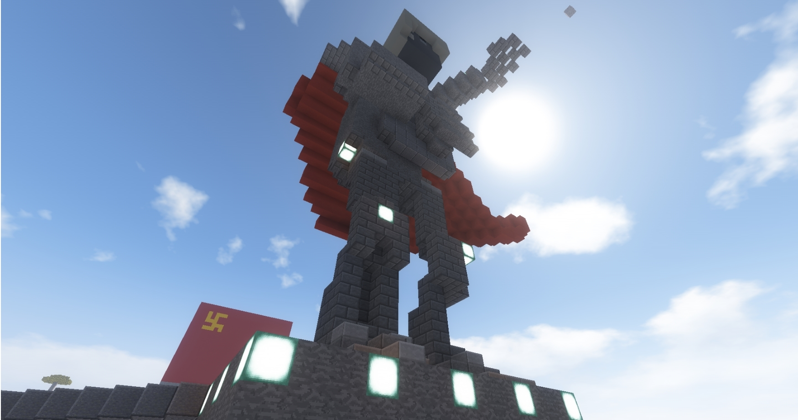
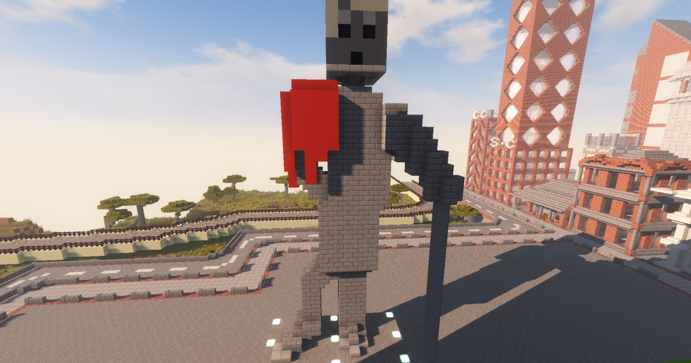
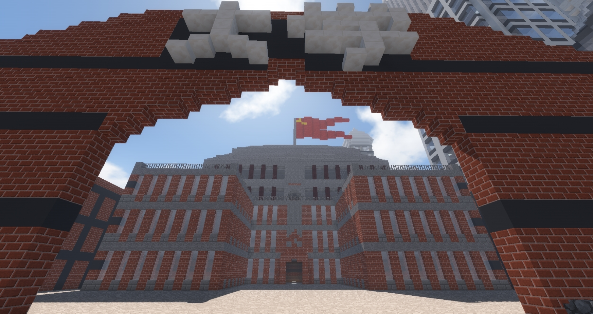
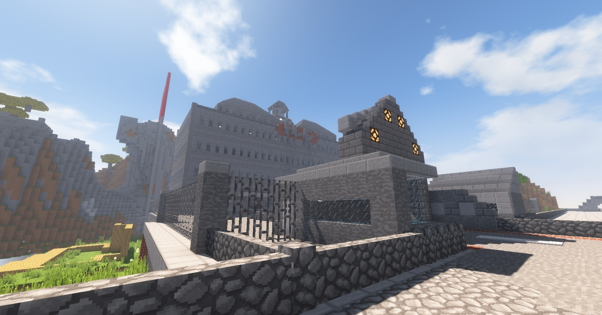

### ようこそ、滑子経済圏へ

このページは作成中です  
滑子経済圏とは、主にNameko\_2020によって作られた創造物群の総称です。  
主要都市である滑子市並びに東京市、神埼市の設定についてと、その他付属設定について表記しています。

#### 滑子市概要

> 1890年代、廃藩置県の一環で設置された「北滑子町」と「南滑子町」が合併し「滑子市」として誕生。その後紆余曲折在りながらも、2010年政令指定都市に指定され、その後の市議選による滑子市共産党が第一党へ。
> また、2017年に経済特別自治区として独立、現在まで共産党政権下で活動している。

##### 滑子市経済概要

> 経済特別自治区となっているように、経済的成長が著しく、数々の企業が旗揚げをしている。中には共産党フロント企業も参加しており、2009年には滑子工業同盟を設立している。

企業一覧

| 企業名 | 活動地域 | 業務内容 |
| --- | --- | --- |
| 溶離鉄工所 | 滑子市 | 製鉄業務 |
| ソラノミソラ学会 | 滑子市 | 慈善事業 |
| 僕宅李製麺 | 滑子市 燕谷県 二取県 | 製麺事業 |
| E-BenS | 滑子市 | エンターテイメント事業 |
| ダイオー建設 | 滑子市 | 不動産事業 |
| N-hardware/software | 滑子市 | ゲーム事業 |
| ヴァルカン建設 | 滑子市 | 建設業務 |
| ひいらぎ喫茶店 | 滑子市 | 飲食業 |
| SocialCompanion | 滑子市 | サービス業 |
| Clark Colosseum | 滑子市 | 建設業 |
| Gering Motors | 滑子市 | 製造業 |
| ロザリオ観光 | 滑子市 | 観光業 |
| 市場自由連盟 | 滑子市 | 市場管理業務 |
| メソッドMarryGold | 滑子市 | マンション管理業 |
| Skull Gaming | 滑子市 | エンターテイメント事業 |
| バーナード運輸 | 滑子市 | 運送業 |
| ホワイトリッツ | 滑子市 | 菓子業 |
| Cherry software | 滑子市 | ゲーム事業 |
| アラビア運送会社 | 滑子市 | 観光業 |
| Alice Corp. | 滑子市 | 総合事業 |
| 共産日報 | 滑子市 | メディア事業 |
| Asteroid Freedom | 滑子市 | 総合事業 |
| L.G.A Lab | 滑子市 | 研究事業 |
| Low World Lab | 滑子市 | 研究事業 |
| Logical Company | 滑子市 | 総合事業 |
| 滑子市立鉄道 | 滑子市、旧滑子村 | 鉄道業 |
| グランドホテルナメコスタ | 滑子市 | 接客業 |

  
※滑子市共産党管理となるものは全て赤文字で表記されます

##### 滑子市観光概要

> 滑子市は主に銅像が多く点在しており、またそれは党の宣伝にも使われている。造形は多岐にわたるものの、一般的に人をかたどった像が多い。

  
トローポン像（別称:永遠の革命像)  
  
  
ナメコ像(別称:革命の旗手像)  
  
  
伯爵像(別称:革命伯爵像)  

##### 滑子市政治概要

> 主に共産党が市政を動かしており、時折二取県職員と対話を交わしながら自治区として活動している。共産党直轄学校があり、市内唯一の教育機関でもある。

  
滑子市立政経大学  

| 偏差値 | 学部 | 過去の業績など |
| --- | --- | --- |
| 74 | 経済学部/政治学部/士官学部 | 第52回"十呂経済サミット"「経済の在り方」大学・一般の部 金賞/第100回党大会 100周年記念討論会出場/戦争文学 大学・一般の部 入賞 |

  
滑子市立政治局  

* 滑子市の行政を担う行政局

> 主に自治府の役割を持ち、滑子市共産党員は必ずここに入局する。上記大学卒業者の半数もここに入局する。
> 党大会は別所で行われるが、指示系統は全てここに集中する。

  
役職一覧

| 役職 | 登録名 | 勲章等 |
| --- | --- | --- |
| 滑子市共産党書記長/人民武力部最高顧問 | Nameko\_2020 | 第一級労働英雄勲章 |
| 滑子市共産党副書記長/経済管理部最高顧問 | (not found) | no data |
| 滑子市共産党人民委員会委員 | (not found) | no data |

#### 東京市概要

> 1900年代序盤に、合併に次ぐ合併で出来た都市。1936〜1945年の国粋主義思想が色濃く残されており、現在も観光兼行政地として大政翼賛会東京本部が残されている。
> 1945年以降はGHQによる占領政策で観光都市として残され、現在も多くの観光客がここを訪れる。

##### 東京市経済概要

> かつて大政翼賛会が設置されていた名残により、歴史を持つ企業が多数在籍している。が、占領政策による他方へと移った企業も多く又観光都市政策を進めているため利潤もあまり発生しないので長くいる企業は少ない。