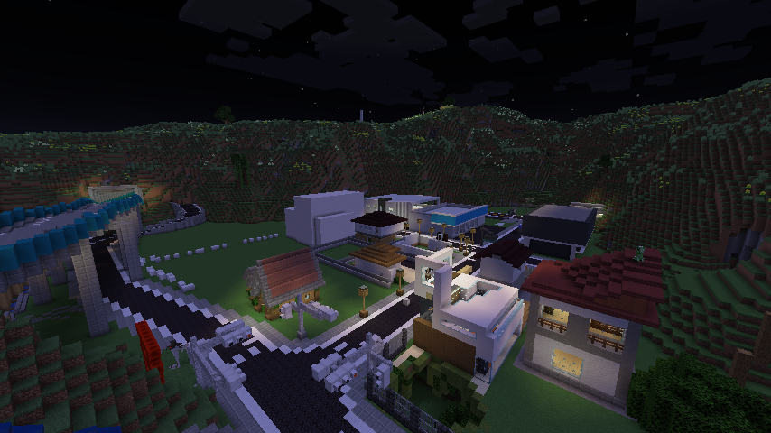
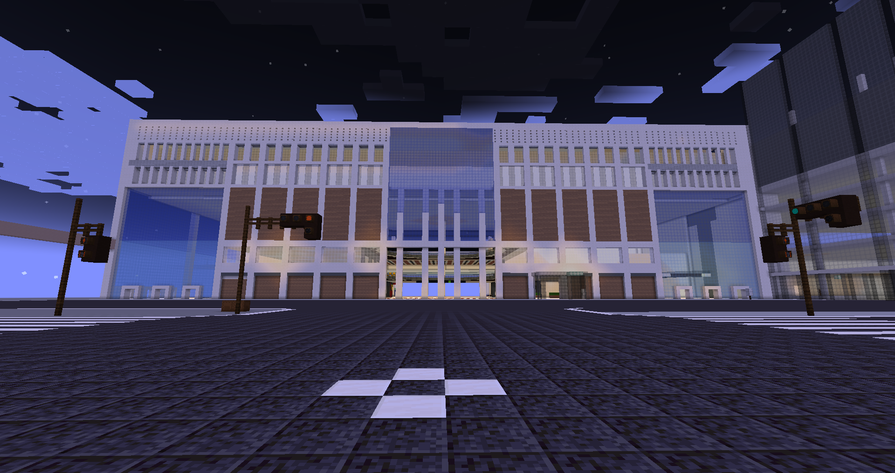

**自治体**とは・・・TOROサーバー内にある自治体と称するエリアのことをいいます。  
  

**目次**

* [スポーン特別区](#content_1)
* [**東麗県（とうれいけん)**](#content_2)
  * [札幌市](#content_2_1)
  * [輪山市](#content_2_2)
  * [石北市](#content_2_3)
  * [羅威刃町](#content_2_4)
* [武蔵県(むさしけん)](#content_3)
  * [五日市市(いつかいちし)](#content_3_5)
  * [津山市(つやまし)](#content_3_6)
  * [彩都市(さいとし)](#content_3_7)
  * [西京都(さいきょうと)](#content_3_8)
  * [大塚市(おおつかし)](#content_3_9)
  * [松牛市(まつうしし)](#content_3_10)
  * [緑市(みどりし)](#content_3_11)
* [**寒西県（かんさいけん)**](#content_4)
  * [寒州市　(かんしゅうし)](#content_4_12)
  * [寒神川市　(かんがみがわし)](#content_4_13)
  * [西都市　(さいとし)](#content_4_14)
  * [北寒州市　(きたかんしゅうし)](#content_4_15)
  * [杜阪市　(もりさかし)](#content_4_16)
  * [鶴駕市　(つるがし)](#content_4_17)
  * [西寒市　(さいかんし)](#content_4_18)
  * [中洲市　(なかすし)](#content_4_19)
  * [白路市　(しらじし)](#content_4_20)
  * [瀞倉市　(とろくらし)](#content_4_21)
  * [防塞町　(ぼうさいちょう)](#content_4_22)
  * [大鶴町　(はくとちょう)](#content_4_23)
  * [南寒州町　(みなみかんしゅうちょう)](#content_4_24)
* [春座県(はるざけん)](#content_5)
  * [春座市(はるざし)](#content_5_25)
  * [青野原市(あおのはらし)](#content_5_26)
* [新形県](#content_6)
  * [新形市](#content_6_27)
  * [霰坂市](#content_6_28)
  * [**澤津市**](#content_6_29)
  * [登里市](#content_6_30)
  * [南大路町](#content_6_31)
  * [トイレニュータウン](#content_6_32)
* [東北県](#content_7)
  * [富山市](#content_7_33)
  * [赤羽市](#content_7_34)
  * [小宮市](#content_7_35)
  * [西前](#content_7_36)
  * [酒田市](#content_7_37)
* [**丑寅県（うしとらけん)**](#content_8)
  * [丑寅市](#content_8_38)
    * [錯葉区](#content_8_38_1)
    * [海南区](#content_8_38_2)
    * [永田区](#content_8_38_3)
    * [廿津川区](#content_8_38_4)
  * [栄州市](#content_8_39)
  * [豊海市](#content_8_40)
  * [大浜市](#content_8_41)
  * [丸津市](#content_8_42)
  * [栄州郡華本村](#content_8_43)
  * [栄州郡みぬま海岸町](#content_8_44)
* [高槻市](#content_9)
* [巴里市](#content_10)
* [籟流市](#content_11)
* [秋葉原（改名検討）](#content_12)
* [平原](#content_13)
* [桜ヶ丘市](#content_14)
* [霰坂](#content_15)
* [エリア86 (見沼)](#content_16)
* [和菓子国](#content_17)
* [北海県](#content_18)
  * [海原市](#content_18_45)
  * [竹瑚町](#content_18_46)
  * [桃仲平市](#content_18_47)
  * [川島市](#content_18_48)
  * [賀東市](#content_18_49)
  * [りうら区](#content_18_50)
  * [京名岡市](#content_18_51)
  * [神奈崎市](#content_18_52)
  * [大洲町](#content_18_53)
* [名葉府 Meiyo Pref.](#content_19)
  * [安呑葛飾市 Andon-Katsushika City.](#content_19_54)
* [磯崎町](#content_20)
* [**広足県（ひろたりけん)**](#content_21)
  * [広足市](#content_21_55)
    * [城西地区](#content_21_55_5)
    * [大手地区](#content_21_55_6)
    * [新占都地区](#content_21_55_7)
    * [後広浜地区](#content_21_55_8)
    * [金浜地区](#content_21_55_9)
  * [綺布良(きめら)市](#content_21_56)
  * [鼬ヶ浜市](#content_21_57)
  * [七浜町](#content_21_58)
  * [大滝村](#content_21_59)
* [**雪花県（ゆきはなけん)**](#content_22)
  * [雪花市（ゆきはなし）](#content_22_60)
  * [南村（みなみむら）](#content_22_61)
  * [南石谷村（みなみいしだにむら）](#content_22_62)
  * [氷南村（ひょうなんむら）](#content_22_63)
  * [手真利町（てまりちょう）](#content_22_64)
* [神聖ルアタニア(L）帝国 (しんせいるあたにあていこく）](#content_23)
* [大福合衆国 (だいふくがっしゅうこく）](#content_24)

### スポーン特別区

スポーン周辺地域。  
基本的に自由に建築が可能。ただし、街を作ったり許可なく鉄道や道路を通すことは推奨されません。

### **東麗県（とうれいけん)**

* 【基本データ】
  * 首長：sapporo\_salmon
  * 県庁所在地：東麗県札幌市
  * **[世界政府（WFG）](%E4%B8%96%E7%95%8C%E6%94%BF%E5%BA%9C%EF%BC%88WFG%EF%BC%89.md)加盟県**

#### 札幌市

sapporo\_salmon領

#### 輪山市

輪山市はx=2500, z=-2600らへんにある都市で、lesssrが管理している。他の街に比べて起伏が多いのが特徴である。

#### 石北市

| 読み方 | 首長 | 備考 |
| --- | --- | --- |
| いしほくし | AKAGI185 | 石北市とは２０２２年１０月２０日にできた都市である。（それ以前は町制だった）石北駅を中心に街が発展している。市内には大規模イベントを行うことができる石北文化会館がある。 |

#### 羅威刃町

| 読み方 | 首長 | 備考 |
| --- | --- | --- |
| らいじんちょう | rhodesmk80 | 半グレ組織が暴れまわる町 |

### 武蔵県(むさしけん)

【基本的なデータ】  
　　県知事:Shiro11\_ 副知事:Nanashi2009
> 県庁所在地:五日市

* **[世界政府（WFG）](%E4%B8%96%E7%95%8C%E6%94%BF%E5%BA%9C%EF%BC%88WFG%EF%BC%89.md)加盟県**

#### 五日市市(いつかいちし)

【基本データ】
> 市長 Shiro11\_ 副市長　準備中

**県庁所在地**  
  
お知らせ:特になし  
  
▼五日市の写真  
準備中

#### 津山市(つやまし)

市長 Shiro11\_　副市長　Tumori\_0981  
  
お知らせ:山の工事中  
  
これが津山の写真▼  

#### 彩都市(さいとし)

市長　Kasutera2009  
彩都駅を中心に開発中の町。鉄道や高速道路の乗り入れ募集中。  
彩都駅▼  

#### 西京都(さいきょうと)

都知事　moyanomoyashi
空港・ビル群・市街地などがある都市 現在開発真っ最中。 一緒に建築してくれる人募集中

#### 大塚市(おおつかし)

市長　moyanomoyashi 副市長 Shiro11\_ 大塚市浅草区長 Kento1121 名市野区 Kashiwato0803  
大塚市は中央区と浅草区に分かれており、中央区は大塚駅を始めとしたビル群があり、浅草区は歴史的建造物などが歴史的建造物などが所在する。  
2022/1/26にmoyanomoyashi領となり武蔵県へ編入  
現在も絶賛開発中。 メンバー募集中。

#### 松牛市(まつうしし)

Kokeishi001領  
林業と漁業で発展した小さな田舎町 約30近くの島がある。

#### 緑市(みどりし)

* 市長(首長):Heigen\_midori
* [ホームページ](Midori%20City.md)

**概要**  
緑市はスポーンより森鉄森本線・平原道ですぐアクセスでき、平原区・新平原区・森区の3区より構成される市です。  
森区は住宅街から果樹園が広がるのに対し、平原区・新平原区はビルが多く立ち並んでいます。また、平原区にはサーバー内に大きな路線網を持つ鉄道、平原鉄道(森鉄)の本拠地を構えています。  

**アクセス**

* 鉄道で行く場合

スポーン中央駅より、森鉄森本線に乗車し、森駅(森区)・平原駅(平原区)・新平原区(新平原区)で降車してください。詳細な利用方法は→[Moritetsu](../06_Community/Moritetsu.md)  

* 高速道路で行く場合

スポーン北ICよりスポーン外環道を北上し、スポーン北JCTをE4 平原道方面へ進んで、森IC(森区)・緑市都市高速各出口(平原区・新平原区)・新平原IC(新平原区)で降りてください。

### **寒西県（かんさいけん)**

* 【基本データ】
  * 首長：rhodesmk80
  * 人口 : 878万人
  * 県庁所在地：寒西県寒州市
  * **最重要都市圏[?](https://seesaawiki.jp/toro_server/e/add?pagename=%ba%c7%bd%c5%cd%d7%c5%d4%bb%d4%b7%f7)指定県**

#### 寒州市　(かんしゅうし)

**西鯖最大級の現代都市**  
  
⬛︎中央区　(ちゅうおうく)  
西鯖経済の中心地  
  
⬛︎北千区　(きたせんく)  
西鯖商業の中心地

#### 寒神川市　(かんがみがわし)

⬛︎列津区　(れっつく)  
高層マンションが立ち並び迷宮のような都市構造が特徴的な寒神川の中心地。中華街や商業施設を中心に不朽の輝きを魅せるまさに寒西のNo.2都市  
  
⬛︎原戸区　(はらとく)  
寒州の副都心としての役割をもつこの区はオシャレな港湾都市として栄えボートレースなどの集客がおおく賑やかな港

#### 西都市　(さいとし)

寒西の西を統治している三大都市のひとつ。ビル群の街並みに調和するように溶け込む絶影山脈の背景が印象的

#### 北寒州市　(きたかんしゅうし)

⬛︎端田区　(たんだく)  
寒西の北を統括している寒西第4の都市。オフィスの他、大手企業のサーバーが密集している西鯖情報社会の拠点  
  
⬛︎神崎区　(かんざきく)  
端田区と密接に関わり巨大なベットタウンとして連立するマンション群が特徴的な都市

#### 杜阪市　(もりさかし)

寒西最南端の大都市。寒州とは山一つ挟んだ広大な雪原に位置する。西部に杜阪自然公園を有し絶景や独自の生態系を見られるなど大自然をテーマとした名前にもある通り杜の街となっている。また、東部には杜阪凍港を有し漁業だけでなく湾岸ラインを中心とした工業、物流の拠点となっている。そして南端に位置することによりさいべりあ、雪花との交易の中心地としても栄え、南地進出の最重要拠点となっている

#### 鶴駕市　(つるがし)

最重要軍事拠点および物流、貿易の拠点としてその役割を担う鶴駕港を筆頭に栄えた上品な湊町。寒西5本の指の一つとして数えられる経済力が特徴的な都市

#### 西寒市　(さいかんし)

西都市とともに大きく発展した寒西屈指の現代都市

#### 中洲市　(なかすし)

大塚・頼流に隣接する郊外都市。人口の多くが集中し、寒西都市圏だけでなくスポーン都市圏へのアクセスが良好

#### 白路市　(しらじし)

白路城を中心に寒州温泉街などの名所が点在する寒西一の観光都市。大手川を挟んで鶴駕のベッドタウンとしての役割も果たす。檸檬岬のレモンが名物

#### 瀞倉市　(とろくらし)

寒西の東と西を繋ぐ交通の要所。物流が盛んな地域故に工業団地や化学施設が密集する

#### 防塞町　(ぼうさいちょう)

現時点寒西最西端に位置する集落。軍事的重要拠点を有する

#### 大鶴町　(はくとちょう)

鶴駕市に隣接する自治体。清水寺などの歴史的建造物がある

#### 南寒州町　(みなみかんしゅうちょう)

寒州市に隣接する自治体。最南端に位置し、鯖南部のさいべりあや松牛との交流の一拠点としても機能している。スキー場など寒西唯一のアウトドアスポーツが楽しめる場所

### 春座県(はるざけん)

* 首長:hosiharu
* 県庁所在地:春座市

#### 春座市(はるざし)

市長　hosiharu  
開発中  
春座区と緑区に分かれている  
鉄道とか高速道路とか接続募集中

#### 青野原市(あおのはらし)

東麗県に隣接した都市。lesssrが管理している。

### 新形県

* 首長:KENTO1121
* 県庁所在地:新形市
* **[世界政府（WFG）](%E4%B8%96%E7%95%8C%E6%94%BF%E5%BA%9C%EF%BC%88WFG%EF%BC%89.md)加盟県**

#### 新形市

* 市長 KENTO1121

新形県のほぼ中央に位置しておりおよそ42万人の  
人口を抱える都市。  
RRのお膝元でもあり近隣自治体からの  
通勤通学者が多くなっている。  
各種行政区  
中央区 東区　西区　柳川区

#### 霰坂市

* 市長 HiroTon\_katsudon

#### **澤津市**

> 市長 : rhodesmk80 副市長 : 空席

* 人口 7万8290人
* 面積 250000ブロック
* GDP 6億2491万鯖ドル

新形−春座の間に栄えた環影都市。レッツイレブン本社などある程度の企業が集まり、清水寺などの観光にも力を入れている  
現在はツルガ重工を中心とした軍事重要拠点を有し、独自の軍事都市としての一面もある(ドーナツ化現象が激しい)  
ちなみに市内の道路の渋滞や軍事面の問題から、澤津を一周する澤津鉄道(鯖非公式)が通っている

#### 登里市

* 市長 yhu84
* 副市長 Mikan\_daihuku

なめ急電鉄のお膝元。市長はタスクを抱えているうえ、建築も遅い。（=発展がすごく遅い）  
一応、籟流市と姉妹都市提携をしている。  
新形市や澤津市・彩都市のベッドタウンとして発展させるつもりです。
> ※現在行政区画見直し中……です。

#### 南大路町

* 町長 rhodesmk80

新形県南部に位置し、新形や澤津と山一つ挟んだ小規模な町。澤津を環状する澤津鉄道も通っており、ベッドタウンとして機能している

#### トイレニュータウン

* 市長 \_woodtoilet

新形県の北西に位置する小規模な都市。今も開発工事が行われている。

### 東北県

首長:toumorokoshi1222  
県庁所在地:富山市
**[世界政府（WFG）](%E4%B8%96%E7%95%8C%E6%94%BF%E5%BA%9C%EF%BC%88WFG%EF%BC%89.md)加盟県**

#### 富山市

東北県内で一番最初にできた街で、富山区 府松区 桜区 磯原区 に分かれている。  
富山区や桜区ではタワーマンションやオフィスビル等の高層ビルの建設が計画されている。  
一方、府松区では温泉街が開発されている。

#### 赤羽市

開発が進んでいる都市。ビルが多く立ち並ぶ予定。

#### 小宮市

tetuota\_glass221領
まだあんまり発展してない町 小宮市です。にんじんが名物で小宮駅の近くににんじん畑あります。(にんじん畑が撤去されるかもといううわさがある)

#### 西前

Lhachirizm280123領  
サーバー東側の海に沿うように形成された海岸都市。  
西前開発計画を中心に開発が進んでおり、トップクラスの人口密度を誇る。

#### 酒田市

サーバー東の海に面した街。  
海側の芝浦は軍港や貨物港で発展した街であるのに対し、  
内陸の仁賀保はニュータウンの開発が進んでいる。

### **丑寅県（うしとらけん)**

* 【基本データ】
  * 首長：TsukaKaju (共同管理：Kibana262)
  * 県庁所在地：丑寅県丑寅市

#### 丑寅市

TsukaKajuとKibana262、HiroTon\_katsudonが共同管理している自治体。  
湾岸部の海南区や中北部の錯葉区は中指ホールディングスをはじめとする大企業のビルが並び、東部の永田区には高級ショッピング街が存在。西部の廿津川区には閑静な住宅街が広がる。  
廿津川区はかつてHiroTon\_katsudonの廿津川町だったが市町合併により丑寅市廿津川区となった。

##### 錯葉区

区長: Kibana262,TsukaKaju(共同)  
オフィス街や博物館、住宅街など様々な施設が存在する、丑寅市中北部に位置する中心地。  
丑寅駅、丑寅市駅が位置し、交通の要衝でもある。  
南部の錯葉地域はオフィス街としての顔を持ちつつ、北部の栗原地域は住宅街となっている。

##### 海南区

区長: TsukaKaju  
オフィス街や港湾施設が存在する湾岸エリア。  
南部では丑寅港旅客ターミナルが建設中。  
丑寅県庁はこの海南区に建設予定。

##### 永田区

区長: Kibana262  
高級店が並ぶ、丑寅市東部の「銀座的存在」。  
区名の由来はKibana262やTsukaKajuのPCに搭載するプロ向けGPU「RTX 4000 Ada」のAda(エーダ)から。  
丑寅永田ICや栄州鉄道栗原転車区も存在し、交通面でも重要な地域となっている。

##### 廿津川区

区長: HiroTon\_katsudon  
旧・廿津川町。丑寅県設立に伴う市町村合併により丑寅市に編入された。  
丑寅市西部に位置し、他の地区とは異なり閑静な住宅街が広がる。

#### 栄州市

TsukaKajuとKibana262が共同管理している自治体。  
栄州鉄道の本社や車両基地があり、丑寅市のベッドタウン(となる予定)である。

#### 豊海市

TsukaKaju管理。

#### 大浜市

nukonuko\_221管理。

#### 丸津市

sakoppi管理。  
奥木地区には平原鉄道の実験都市「奥木みらいタウン」が存在。  

**アクセス**

* 鉄道で行く場合

スポーン中央駅より、森鉄森本線に乗車し、奥木町駅で降車してください。詳細な利用方法は→[Moritetsu](../06_Community/Moritetsu.md)  

* 高速道路で行く場合

高槻ICより、東横断道を東に進み、奥木SICで降りてください。

#### 栄州郡華本村

Kibana262管理。

#### 栄州郡みぬま海岸町

Kibana262管理。

### 高槻市

sapporo\_salmon領 自称首都

### 巴里市

Hidezou\_mania領 フランス･パリを模した都市。旧鯖時代に予め作っていたため、一番はやく完成度の高い都市作ったとも言える。ズルい。  
「はり、ともえさと」、ではなく「パリ」のまま読む。昔の日本には外国の地名にも漢字を当てる習慣があったため（ベルリン⇒伯林　ロンドン⇒倫敦）。  
ホームページはこちっち〜→　[https://seesaawiki.jp/toro\_server/d/%c7%c3%ce%a4%b...](%E5%B7%B4%E9%87%8C%E5%B8%82.md)

### 籟流市

SOM\_0527領

### 秋葉原（改名検討）

X6Zが管理している。立体交差の駅を作ったのでこの名前になった。  
高槻と道路でつながる計画がある。

### 平原

Crafters\_craft領

### 桜ヶ丘市

市長(首長):Heigen\_midori

### 霰坂

HiroTon\_katsudon領

### エリア86 (見沼)

Miclub領 鯖では珍しく芸術建築をする人。プロピザ。  

### 和菓子国

Kashiwako0803が大統領の国。木のない珍しい赤福山が有名、軍事施設がある。

### 北海県

|  |  |
| --- | --- |
| 知事 | anthurum84 |
| 各市長 | anthurum84 fhrk\_ \_chocoball0907 Heigen\_midori Awful1316 |

#### 海原市

市長: anthurum84  
県庁所在地候補の都市  
高速道路を中心に道路交通関連が発展している  
尚最近は市長が忙しいためあまり動きは見られない

#### 竹瑚町

町長:Heigen\_midori  
北海県田園都市計画より始まった緑が豊かな都市を目指して開発中。

#### 桃仲平市

市長:fhrk\_

#### 川島市

市長:Heigen\_midori

#### 賀東市

市長: \_chocoball0907  
チョコ不動産が多くの建物を管理している

#### りうら区

市長：Awful1316

#### 京名岡市

|  |  |
| --- | --- |
| 京名岡市 Kehnaoka City | |
| 市長 | fhrk\_ |
| 市役所 | (なし) |

最近、北海県へ再編入された。  
市長自信も読みがKyonaokaかKenaokaかで悩んでいるほどである  
  

割とどうでもいい事

##### 港区

|  |  |
| --- | --- |
| 港区 Minato Ward | |
| 区長 | (市長直管) |
| 開発メンバー | k\_1121 anthurum84 |
| 区役所 | (なし) |
| 保護名 | minatocity |

広大な旧空港跡地が残る埋立地  
現在は工業地帯化計画が進んでいる

##### 横倉区

|  |  |
| --- | --- |
| 横倉区 Minato Ward | |
| 区長 | (市長直管) |
| 開発メンバー | Heigen\_midori k\_1121 anthurum84 womenwoman |
| 区役所 | (なし) |
| 保護名 | yokokuracity |

湾西大学のキャンパスとそれに付属する巨大図書館や森鉄により運営されている鉄道博物館がある  
学術と運輸を統べる都市としての開発を計画している

##### 中海区

|  |  |
| --- | --- |
| 中海区 Chukai Ward | |
| 区長 | (市長直管) |
| 開発メンバー | Heigen\_midori k\_1121 womenwoman Awful1316 \_woodtoilet |
| 区役所 | (なし) |
| 保護名 | chukaicity |

観光タワー、城、中華街が集う中心都市  
南にオフィス街と観光地、北に商業地帯がある  
「なかうみ」呼びを許可した

##### 中央区

|  |  |
| --- | --- |
| 中央区 Chuoh Ward | |
| 区長 | (市長直管) |
| 開発メンバー | Heigen\_midori k\_1121 |
| 区役所 | (なし) |
| 保護名 | chuocity |

官庁街になる予定の都市  
南には証券取引所がある

##### 西区

|  |  |
| --- | --- |
| 西区 Nishi Ward | |
| 区長 | (市長直管) |
| 開発メンバー | Heigen\_midori |
| 区役所 | (なし) |
| 保護名 | nishicity |

西というか北である  
未完成のジャンクションと廃墟ターミナル駅が残る

#### 神奈崎市

|  |  |  |
| --- | --- | --- |
| 神奈崎市章 | 神奈崎市 Kanasaki City | |
| 所在 | 北海県 |
| 市長 | fhrk\_ |
| 市役所 | 北海県神奈崎市三段坂7丁目2-1 |

#### 大洲町

町長︰fhrk\_

### 名葉府 Meiyo Pref

知事: pzh7

#### 安呑葛飾市 Andon-Katsushika City

市長: pzh7  
磯崎電鉄安吞駅から北東にかけて広がる中規模都市

### 磯崎町

市長:Mauski\_Ucola  
乾燥大陸最南西端に位置する田舎町。乾燥大陸では数少ない緑が生い茂る地域で、磯崎電鉄本社がある。

### **広足県（ひろたりけん)**

* 【基本データ】
  * 首長：Seibu\_Yellow
  * 県庁所在地：広足県広足市

廣足湖を中心とした比較的新しい都市圏。  
スポーンから離れているためアクセスは悪いが独自の文化圏を形成している。

#### 広足市

市長:Seibu\_Yellow  
サーバー東北端、廣足湖北湖畔に位置する市。  
広足県の県庁が存在しており、空路・道路が発達している。

##### 城西地区

広足駅を中心として高層ビルが立ち並ぶ。  
観光地として広浜海岸がある。

##### 大手地区

廣足城や官庁が集中している。広足空港に隣接している。

##### 新占都地区

区名は旧メインワールドから。広足球場等のエンタメ施設に富んでいる。

##### 後広浜地区

空港利用者向けの宿泊施設などが立ち並ぶ。

##### 金浜地区

広足球技場の他、金浜温泉などの観光需要を見込む。

#### 綺布良(きめら)市

市長:cyatarow  
UZ\_Trainの旗艦駅がある交通の要所

#### 鼬ヶ浜市

市長:tetsuota\_221  
鯖東海東北湾に面する中核都市。神奈崎に並ぶ東北地域の交通の要衝。

#### 七浜町

朱嶺山東麓に位置する農村である。

#### 大滝村

朱嶺山西麓の観光拠点であり、大型SA、道の駅などがある。

### **雪花県（ゆきはなけん)**

-【基本データ】

* 首長：yukihana\_yuma
* 県庁所在地：雪花県雪花市
* **[世界政府（WFG）](%E4%B8%96%E7%95%8C%E6%94%BF%E5%BA%9C%EF%BC%88WFG%EF%BC%89.md)加盟県**

ワールドの東側にある、雪原地帯の県で、雪花市を中心にどんどん発展している。

#### 雪花市（ゆきはなし）

市長:yukihana\_yuma  
雪花県県庁所在地だが、**県庁が作られる気はない。**

#### 南村（みなみむら）

村長:yukihana\_yuma  
雪花市の南の村。温泉がある。

#### 南石谷村（みなみいしだにむら）

村長:yukihana\_yuma  
特に何もない村。道の駅がある。

#### 氷南村（ひょうなんむら）

村長:yukihana\_yuma  
現在最南端の村。家が少ない。

#### 手真利町（てまりちょう）

村長:yukihana\_yuma  
車庫と駅しかない町。

### 神聖ルアタニア(L）帝国 (しんせいるあたにあていこく）

首相:bagiruki  
旧鯖時代の刃義国、旧桔梗国を前進とする汐浜に主要拠点を構える帝政国家。帝政と名乗っているが、象徴としての皇帝L（ルア）を崇めているという設定で内政は議会制民主主義である。  
現在、食料自給率0%で全てを軍事に費やしている謎国家である。また、その巨大な軍事力で世界政府軍の戦力の９割以上を賄っている。そのため、鯖内で争いが起きた場合、世界政府軍として即時展開可能な艦隊を５つ保有しており各鯖内の海に基地がある。  
旧鯖時代にあったTORO鯖8か国軍事同盟に参加していた現存する最後の国である。ちなみに大福合衆国は、この国の傀儡国家である。  
**[世界政府（WFG）](%E4%B8%96%E7%95%8C%E6%94%BF%E5%BA%9C%EF%BC%88WFG%EF%BC%89.md)加盟国**

### 大福合衆国 (だいふくがっしゅうこく）

大統領:bagiruki  
旧和菓子国の領土をbagirukiが割譲されてから2年間放置されていた土地を丸ごと開発するために建国された国。  
国土の1/2が神聖ルアタニア帝国の軍事基地になっている。  
**[世界政府（WFG）](%E4%B8%96%E7%95%8C%E6%94%BF%E5%BA%9C%EF%BC%88WFG%EF%BC%89.md)加盟国**  
  
---

**以下古い情報**  

1.19鯖アップデート前

### スポーン特別区

* 【基本データ】
  * 所有者：toropon
  * 備考：スポーン周辺地域。基本的に自由に建築が可能。

### 直轄市

都道府県に属さない直轄の市。首都や大規模な都市で単独の市だけで都道府県レベルの面積又は経済能力を持つ市~~という設定~~。

| 名称 | 読み方 | 首長 | 備考 |
| --- | --- | --- | --- |
| [十呂市](%E5%8D%81%E5%91%82%E5%B8%82.md) | とろし | toropon | 首都的役割を持つ都市。 |
| [トロクワ市](%E3%83%88%E3%83%AD%E3%82%AF%E3%83%AF%E5%B8%82.md) | とろくわし | barusugan | ロシアのモスクワ市をモデルとして開発中。 |
| [占都市](%E5%8D%A0%E9%83%BD%E5%B8%82.md) | せんとし | Seibu\_Yellow | 区：蘭州区、迎戸区 |
| 日尾市 | ひおし | Nitori\_Choco | 開発中 |

### 幸麓府（こうろくふ）

* 【基本データ】
  * 首長：Sakoppi
  * 県庁所在地：幸麓府幸麓区幸麓本町一丁目1番1号

**[Wikiの記事はこちら](%E5%B9%B8%E9%BA%93%E5%BA%9C.md)**

#### 所属自治体

| 名称 | 読み方 | 首長 | 備考 |
| --- | --- | --- | --- |
| 幸麓区 | こうろくく | Sakoppi | 県庁所在地 特別区 |
| 城麓区 | じょうろくく | Sakoppi | 特別区 |
| 御崎市 | みさきし | Sakoppi | 旧：幸麓市御崎区 |
| 川内市 | せんだいし | Sakoppi |  |
| [都海市](%E9%83%BD%E6%B5%B7%E9%83%BD%E5%B8%82%E7%BE%A4.md) | どはいし | H1ts0umd | 都海都市群、区：加沼区、日出区、湾葉区 |
| 七重浜市 | ななえはまし | Hidezou3 |  |
| 空海郡稲垣町 | いながきちょう | Sakoppi | 旧：創吠道阿佐ヶ谷市稲垣区 |
| 七重浜郡佐波寺町 | さばでらまち | Hidezou3 |  |
| 幸麓郡北条村 | ほうじょうむら | KL\_LV280L1 | 占都郡→幸麓郡 |
| 幸麓郡大煙村 | だいえんそん | Osamurai\_Rabbit |  |
| 茸島村 | きのこじまむら | KL\_LV280L1 （指定職務執行者） | 茸島群島（北茸島、茸島、二宅島、双子島） 茸島村職務代行機関条例により府知事に指定された者が村政を執行 村役場は幸麓区の幸麓府庁に置く。 |

### 二取県（にとりけん）

* 【基本データ】
  * 首長：Nitori\_Choco

#### 所属自治体

| 名称 | 読み方 | 首長 | 備考 |
| --- | --- | --- | --- |
| 二取市[?](https://seesaawiki.jp/toro_server/e/add?pagename=%c6%f3%bc%e8%bb%d4) | にとりし | Nitori\_Choco | 県庁所在地 |
| 鹿島市 | かしまし | KL\_LV280L1 |  |
| 帯広市 | おびひろし | H1tS0umd |  |
| 滑子市 | なめこし | Nameko\_2020 |  |
| 志摩市 | しまし | ーーー |  |
| 字島郡夕浜町 | ゆうはまちょう | PVC\_tube | 旧上字町・下字町を含む |
| 二取郡寝屋川町 | ねやがわちょう | ーーー |  |
| 志摩郡伏見村 | ふしみむら | ーーー |  |

### 北央県（ほくおうけん）

* 【基本データ】
  * 首長：C6H5O2N

#### 所属自治体

| 名称 | 読み方 | 首長 | 備考 |
| --- | --- | --- | --- |
| ゆきとみらい市 | ゆきとみらいし | C6H5O2N | 県庁所在地 雪国にある高層ビルが雑草のように生えてる町 一軒家？　知らない子ですね。一軒家を建ててはいけません |
| シンサシニャ | しんさしにゃ | kemono117 |  |
| 尾居ヶ浜市 | おいがはまし | hirotoooon |  |
| 一羅町 | いとらちょう | C6H5O2N |  |

### 奥地県（おくちけん）

[Wikiの記事はこちら](%E5%A5%A5%E5%9C%B0%E7%9C%8C.md)

* 【基本データ】
  * 首長：musashi299（県知事職務代理者：Sakoppi 2020/04/01〜当面の間）
  * 県庁所在地：奥地県百舌桑郡谷間町大字湖西字神前街2番地
  * 2019年10月15日、北央県より百舌桑県として分離独立
  * 2020年4月1日、奥地県に名称を変更。大便市を編入。

| 名称 | 読み方 | 首長 | 備考 |
| --- | --- | --- | --- |
| 百舌桑市 | もずくわし | musashi299 | KL\_LV280L1所有→幸麓県預地→北央県→百舌桑県 |
| 大便市 | おおだよりし | KL\_LV280L1 | クソブリスタン市より改称 |
| 百舌桑郡谷間町 | やまちょう | Sakoppi | 県庁所在地 |
| 百舌桑郡月見台町 | つきみだいちょう | akpc\_0504 |  |
| 御厨郡藍原町 | あいはらちょう | keita\_yamatozi |  |
| 御厨郡横走町 | よこはしりちょう | musashi299 |  |
| 御厨郡高家村 | たきべむら | musashi299 |  |
| 走水郡北碕村 | きたのさきむら | Sakoppi |  |

### 創吠道（そうはいどう）

* 【基本データ】
  * 首長：Laythe\_777

#### 所属自治体

| 名称 | 読み方 | 首長 | 備考 |
| --- | --- | --- | --- |
| [牧港市（牧港経済圏）](%E7%89%A7%E6%B8%AF%E5%B8%82.md) | まきみなとし | Laythe\_777 | 道庁所在地。旧”牧港市第一区”市として完全独立。創吠道”牧港経済圏”の中心地。 |
| 小湾市 | こわんし | Laythe\_777 | ”牧港市第二区”から独立した都市。 |
| 西洲市 | いりじまし | Laythe\_777 | 牧港市の新規開発計画に合わせ新たに創立された。 |
| 城間市 | ぐすくまし | Laythe\_777 | ”牧港市第三区”から独立した都市。 |
| 城北空港区 | しろきたくうこうく | Laythe\_777 |  |
| 具志川市 | ぐしかわし | Laythe\_777 | 牧港経済圏の生産力を支える大規模工場地帯。 |
| [阿佐ヶ谷市](https://spalits00developer.wixsite.com/asagaya) | あさがやし | Spalits00 | 旧：蔵府戸市 |
| マリア・リフレモント | 読同じ | Laythe\_777 | 王国時代中世の街並みを色濃く残す古都。 |
| 松野宮市 | まつのみやし | kemono117 |  |

### 上都府 (じょうとふ）

* 【基本データ】
  * 首長：C6H5O2N

#### 所属自治体

| 名称 | 読み方 | 首長 | 備考 |
| --- | --- | --- | --- |
| 斗蔭市 | とかげし | C6H5O2N | 県庁所在地 あひぃ〜〜www。 |
| 高麗市 | こうらいし | Spalits00 | あひぃ www． |
| 肯市 | うべなし | X6Z | 高麗の東にある小都市。寿司鉄道のお膝元。 |
| 強羅市 | ごうらし | Spalits00 |  |
| 水牧市 | みずまきし | Mizu\_tawara |  |
| 於府箱町 | おふはこちょう | C6H5O2N | 斗蔭市の北にある町 斗蔭半島に位置する。 |
| 強羅湖町 | ごうらこちょう | Spalits00 | 田舎 |

### 南十県 (なんとけん）

* 【基本データ】
  * 首長：Taposan\_inu
  * WEBサイト：[https://seesaawiki.jp/toro\_server/d/%c6%ee%bd%bd%b...](%E5%8D%97%E5%8D%81%E7%9C%8C.md)

#### 所属自治体

| 名称 | 読み方 | 首長 | 備考 |
| --- | --- | --- | --- |
| 新蔵府戸市 | しんくらふとし | Taposan\_inu | 県庁所在地 たぽ首長によって設立された、都市である。　道路と建物の大きな市内変更があってから、発展している |
| 東里村 | とうさとむら | Nitori\_Choco | 開発者募集中 |
| 辺銀市 | ペンギン市 | tapioca\_drink | 道路がない田舎です！建築者カモン！ |

### 燕谷県（つばめだにけん）

【基本データ】

* 首長:tokyock1522
* WEBサイト：[https://seesaawiki.jp/tsubametani/](https://seesaawiki.jp/tsubametani/)

#### 所属自治体

| 名称 | 読み方 | 首長 | 備考 |
| --- | --- | --- | --- |
| 燕谷市 | つばめだにし | tokyock1522 | 燕谷県南部に位置する県庁所在地、燕谷県内最大規模の大きさを誇る燕谷駅を中心に燕谷県の行政を担う施設がある。住宅等はなく、ビルが多い。 |
| 燕子花市 | かきつばたし | tanukiti | 燕谷県の二番手を担う都市、燕子花駅を中心に広がる。現在は北部の燕子花町、名頃町と南部の落葉松町に大きく別れている。燕子花球場があるのも特徴。 |
| 山中川市 | やまながわかし | tokyock1522 |  |
| 北燕谷市 | きたつばめだにし | tanukiti | 燕谷県の中心部に位置する北燕ヶ島の自治体。他の燕谷県内の市と道路の規格が若干違う。 |
| 松前市 | まつまえし | tokyock1522 | 燕谷県北部に位置する。長洲町を中心に広がる。現在発展途上都市。 |
| 雪見市 | ゆきみし | tokyock1522 |  |
| 学園都市 | がくえんとし | tanukiti | 燕谷県南東部に位置する人工島。燕谷県立高度教育高等学校の建設計画があるが、完成時期は未定。 |

### 十六夜県（いざよいけん）

【基本データ】

* 首長:Otoro\_keita

#### 所属自治体

| 名称 | 読み方 | 首長 | 備考 |
| --- | --- | --- | --- |
| 十六夜市 | いざよいし | Otoro\_keita | 十六夜県の中心です |
| 練馬市 | ねりまし | Otoro\_keita | スカイツリーがシンボルの市です。 |
| 杭全市 | くまたし | Otoro\_keita | 市の中心駅はまさかの新練馬 |
| 南陸市 | なんりくし | kareraisu | kareraisu市長が設立した、南側最大都市といっても過言ではない、都市である。ホームページ→[https://seesaawiki.jp/toro\_server/d/%c6%ee%ce%a6%b...](%E5%8D%97%E9%99%B8%E5%B8%82.md) |
| 伊石市 | いいしし | keita\_yamatozi | 絶賛再開発中(๑´ڡ`๑) |
| 布賀市 | ふがし | naonaoki | 布賀空港所在地。ホームページ→[https://seesaawiki.jp/toro\_server/d/%c9%db%b2%ec%b...](%E5%B8%83%E8%B3%80%E5%B8%82.md) |
| 梅美町 | うめみまち | Otoro\_keita | 港町 |
| 氷川町 | ひかわまち | Otoro\_keita | 大トロ電鉄車両センター所在地 |
| 薫奈村 | くんなむら | tokyock1522 |  |

### 丑寅県（うしとらけん）

【基本データ】

* 首長:T5ukasah

#### 所属自治体

| 名称 | 読み方 | 首長 | 備考 |
| --- | --- | --- | --- |
| 丑寅市 | うしとらし | T5ukasah | 県庁所在地 |
| 幸麓郡丑寅町 | うしとらちょう | T5ukasah | 飛び地 |

### 月夜・谷津城連合国家

【基礎データ】

* 最高指導者：Yuduki\_Developer
* 谷津城と超巨大統合企業であるThe NIGHTSの提携により生まれた国家。

#### 所属自治体

| 名称 | 読み方 | 首長 | 備考 |
| --- | --- | --- | --- |
| 谷津城市 | やつしろし | Yuduki\_Developer | 直轄市であり、今の所の都市らしい唯一の都市。 |

### 白都県（はくとけん）

【基本データ】

* 首長:AkaneJPN

#### 所属自治体

| 名称 | 読み方 | 首長 | 備考 |
| --- | --- | --- | --- |
| 白都特別区 | はくととくべつく | AkaneJPN | 白都駅がある中心地、海に面している。白都市内の区 |
| 城湾特別区 | じょうわんとくべつく | AkaneJPN | 海軍基地などがある。白都市内の区 |
| 白都市 | はくとし | AkaneJPN | 二つの特別区を含めたあのあたりの地域。なんかでかい |
| 白鷺市 | しらさぎし | AkaneJPN | 森が多め。なぞの洋風建築も含まれる。 |
| 湾郷市 | わんきょうし | AkaneJPN | 未開拓の平原が広がる海エリア。 |
| 鴉宮市 | からみやし | AkaneJPN | すごく小さい。他国の軍事船を管理するところ。 |
| 古雪市 | こゆきし | AkaneJPN | 面積の９割が雪原という過酷な街。 |
| 白鷺市 | しらさぎし | AkaneJPN | 森が多め。なぞの洋風建築も含まれる。 |
| 爪洲市 | つめしまし | AkaneJPN | 爪のような半島を持つ。地味に小麦が取れる |
| 房陀亜市 | ぼおだあし | AkaneJPN | ワールドボーダーに隣接する町。 |
| 野側町 | のがわちょう | AkaneJPN | 山が多めの田舎 |

### 都道府県未設置エリアの自治体

#### 市

| 名称 | 読み方 | 首長 | 備考 |
| --- | --- | --- | --- |
| 新草ヶ丘市 | しんくさがおかし | kusa\_ningen | 別名：怒辺山 |
| 空海市 | くうかいし | nostex |  |
| 西瓜市 | すいかし | H1tS0umd |  |
| [紗弥川市](%E7%B4%97%E5%BC%A5%E5%B7%9D%E5%B8%82.md) | さやかわし | Osamurai\_Rabbit | 緑豊かな街です。建築者歓迎! |
| 伊逗海市 | いずみし | C6H5O2N | 東伊逗町に市庁を置く |
| 赤丘市[?](https://seesaawiki.jp/toro_server/e/add?pagename=%c0%d6%b5%d6%bb%d4) | あかおかし | AkaneJPN | 壁があるだけ |
| 雪市 | ゆきし | miyasoku |  |
| 洲崎市 | すざきし | musashi299 |  |
| 宝徳市 | ほうとくし | toropon | 博物館等を集積した文化都市として計画中。 |
| 白木市 | しろきし | kemono117 |  |
| 海鳴市 | うみなりし | ーーー |  |
| 東京市 | とうきょうし | Nameko\_2020 | 1920年代東京をモデルに制作中。明治・大正モダンを主に建築中 |
| 神埼市 | かんざきし | Nameko\_2020 | 計画都市 |

#### 町村

| 名称 | 読み方 | 首長 | 備考 |
| --- | --- | --- | --- |
| 十呂郡初島町 | はつしまちょう | toropon | 旧・スポーン |
| 睦月郡北睦月町 | きたむつづき | PVC\_tube |  |
| 睦月郡南睦月町 | みなみむつづき | PVC\_tube | 深島を含む |
| 日尾郡瀬谷町 | せやちょう | yamazaki4321 |  |
| 小山郡大森町 | おおもりちょう | Nitori\_Choco |  |
| 東紗弥川郡条河町 | じょうがまち | Takochu\_ |  |
| 西紗弥川郡hirotown | ひろたうん | hiroto821 |  |
| 木音町 | もくねまち | punipuni\_ |  |
| 石北町 | いしほくまち | AKAGI185 | 石北町　霜塚地区　澤部地区 |
