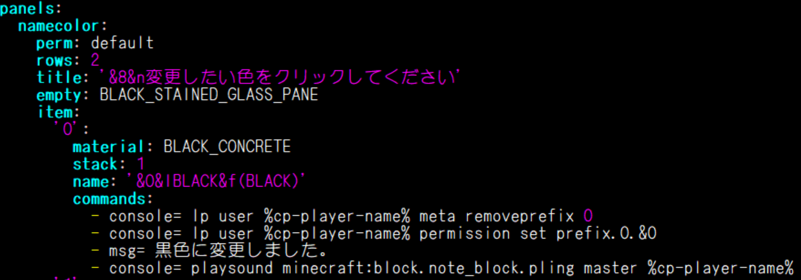
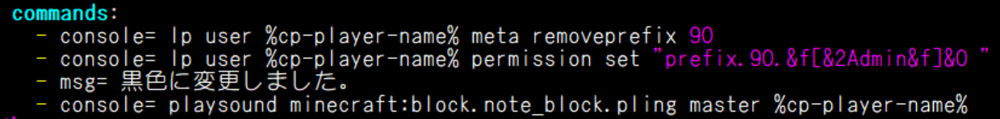

**ようこそ、サーバー開発記へ**  
ここではOwnerやAdminが普段どんな感じにサーバーの開発をしているかをテキトーに綴っていくブログです。  
ゆっくりしていってね  
  

* [サーバーのバージョンアップを行いました [2023/05/14 03:53]](#content_1)
* [WE範囲可視化機能、スコアボード機能、stats機能を実装しました！あとdriver権限について！！ [2023/02/10 11:07]](#content_2)
* [ネームカラー機能を実装しました！！ [2023/02/01 22:42]](#content_3)

  
  

---

### サーバーのバージョンアップを行いました [2023/05/14 03:53]

花粉も落ち着いてきてティッシュを常備しなくても大丈夫な季節になってきました。お久しぶりです。たぬきちです  
さてさて、マイクラのサーバーのバージョンは1.19.4なのになぜかTOROは1.19.2で運営していましたが  
実はこれには深い理由があった......わけではなく、運営がサボってただけですね...まったく何をしているんだか（他人事  
  
特に面白くもない前振りは置いときまして、事の発端は実は別の場所で動いていた臨時鯖をメインに持ってきたところ、メインのバージョンが若干古いせいで起動しませんでした！  
なので、サーバーを動かしているPaperMCとかwaterfallとかのバージョンを上げたところ今度はプラグインが機能しなくなったようで...  
WorldEdit使えないはクリエ鯖にとって深刻な事態ですからね、さすがにﾀﾞｲｵｳｸﾞｿｸﾑｼがすぐに対応してくれたっぽいです  
しかしWEだけでなくdynmapとかmypetとか使えないとのことだったので、**久しぶりに全部プラグインのバージョン更新をしました**  
（discordでまるまさが「さすがに40以上あるプラグインを一つ一つチェックするのは過労dedする」とのことだったので私がやりました）  
プラグインはmodと違う特徴として、将来のバージョンでも動作するように設計されているというのがあります（まぁ今回みたいにそうもいかない場合もありますが  
なので一通りチェックはしましたが、中には数年前から更新が途絶えてるプラグインとかもありましたね  
WorldEditをはじめとして、dynmapやTraincartsなど、結構メジャーなものはよく更新してくれます  
更新してて気づいたけどまるまさ作のプラグインって結構あったんですね...  
  
いろんな人からdynmap見れないやらworldedit使えないやらいろいろ言われたんですけど、  
プラグインの更新ってバージョン確認して、ダウンロードして、私のパソコン経由で鯖機にぶち込んで、万が一のためにバックアップを取ったりして、記録をしておくためにdiscordに報告上げたりして、鯖再起動して...と、そこそこ面倒なんですよ、しかも鯖機のOSはCUIのLinuxですし、  
なのであんまり急かさないでほしいなぁと私は思っておりますので、もしこれを読んでくれていたら頭の片隅にでも置いといてください  
  
話は戻しまして、実は今回バージョンを上げるついでに新たに１つプラグインを追加しました  
**Holographic Displays** です  
  
正確には追加ではなく復活ですね、⑨のころからあったのにいつぞやかひっそりと消えてたので  
簡単に言うと文字を浮かして表示させるやつです。使い方とかは各自ググってください。  
  
とまぁ長くなりましたが今回はこれだけです。私も大学生になり、講義やバイトで忙しいので、荒らし対応や不具合に対応するのが遅れるかもしれませんが、ご理解とご協力をお願いいたします  
アデノウイルスが流行ってるらしいのでお気をつけて、ノシ

### WE範囲可視化機能、スコアボード機能、stats機能を実装しました！あとdriver権限について！！ [2023/02/10 11:07]

どうもこんにちは。本日(2023/02/10)関東ではそこそこちゃんと雪が降っています。たぬきちです  
ということでここ最近増えた機能について簡単に書いていきます（私にもわからないことがあるので）  
  
まずは**WE範囲可視化機能**  
これはまるまさがプラグイン見つけて導入してくれました^^  
1.12時代は緑と赤のエフェクトのやつだったと思うんですけど、1.19版は小さい火のエフェクトになってますね  
けっこう見やすくて助かります  
  
続いて**スコアボード機能**  
みなさん気になってませんでしたか...謎の状態で止まったままの画面右のやつ  
これは私がやったんですけど、どんな感じで動いてたか全く記憶になかったです  
まさかこんなとこでトローポンが昔やってたYouTube配信（とそのアーカイブ）が役に立つとは思わなかった  
何気にあの文字の色が変わってたり、ぐるぐるするやつのスピード調整するのが~~面倒だった~~  
  
最後に**stats機能**  
これはネームカラー変更した時に導入したやつの応用です  
本当はブロック設置量とかログイン回数とかも表示できるようにできればよかったんですが、サーバーが蓄積されたデータには限りがあるので...  
作りながら自分のデータも見てたんですが、ログイン時間が1か月超えてるのを見たときは流石にびっくりしました  
  
あと追記程度にですが、driver権限について  
本来はvehicleの乗り物用権限なんですが、便利なんで今後はちょっと新規さんに渡すには微妙な権限だとかも含んでいくかもしれないです  
sup以上の方は優しく使い方を教えるようにしてくれればと思います！  
  
まだまだ風邪やインフルは油断できないのでみなさん気を付けてくださいね！ノシ

### ネームカラー機能を実装しました！！ [2023/02/01 22:42]

こんにちは、相変わらず寒くて布団から出るのに時間がかかるたぬきちです  
Adminとして復帰してからまず何をしようかなって思ってたんですが、1.19になってからチャット欄がだいぶ寂しくなっていたのでまずこれからやるかぁってなってやりました(過去形)  
  
というわけでまず必要なものを準備します  
今回はコマンドを実行した時にGUIを表示して、そこから色を選択して変更するっていう感じにするので、まずはGUIを作成・表示するプラグインを導入します  
  
[Command Panels](https://www.spigotmc.org/resources/command-panels-custom-guis.67788/)   
  
1.16へのサーバー移行時代から知ってました。（正直）  
詳しいことは日本人有志の紹介サイトがあったのでググってみてください  
あとは名前の色を変える方法としてLuckPermsを使います  
LuckPermsにはprefix（直訳で接頭辞）という設定項目がありまして、そこにカラーコードを仕込むことでネームカラーを変えることができます  
  
  
  
３分クッキングもビックリな完成品紹介です  
これが今回作ったGUIのymlデータの一部なんですが、超ざっくり説明するとGUIで表示された選択画面から選択すると自動でコンソールに今のprefixの設定を消して、そして新しく設定して、メッセージを流す、といった感じでやってくれます。音も設定してみましたがうまくできませんでしたorz  
でこれをサーバーに読み込ませてみたんですが、残念ながら役職付きの人はうまくいきませんでした  
実は役職付きの人がチャットで表示されてる**[Sup]**や**[Admin]**っていうのはprefixで設定されています  
うまく説明するのが難しいのですが、これを全員同じパネルでやると、役職の部分が外れてしまいます(´・ω・`)  
いろいろ考えましたが解決する方法が見つからず、結局役職ごとにコマンドパネルを作って、設定画面を分けるという方法になってしまいました。これがコマンドが分かれてる理由です  
  
そしてもう一つ躓いたのは  
**[Admin]** tanukiti: test  
みたいな感じで表示される際の役職と名前のあいだの空白です  
  
  
  
これがadmin版のymlデータの一部なんですが、1枚目の画像と比べて2個目のprefixを新しく設定するコマンドがちょっと違うんです  
これ最初に書いた時に 〜permission set prefix.90.&f[&2Admin&f] &0 っていう感じで作ったんですが、これだと&0の部分がコンテキストというLuckPermsの別の設定部分に入ってしまい、色を変えることが出来ませんでした。  
今度は空白と色コードを逆にやってみたんですが、そうすると今度は空白が無かったことにされてうまくいきません  
LuckPermsの記法に空白文字（NBSP=ノーブレイクスペース）があるのかなぁって調べてみても見つからず  
...といろいろ模索していましたが、答えは簡単なもので "←こいつで囲むことで範囲が指定されるので空白が文字として判定されるようになりました  
２時間くらい調べてたのにこれかよ！！！！！  
  
というわけで今回はネームカラー変更機能について綴ってみました  
Modのみくにさんが HEXコードも使えるようにならないかなぁって言ってたんですけど本人が検証したところDiscordにカラーコードが反映されてしまうようでうまくいかなかったらしいです  
個人的にはもうちょっと調整したらいけそうではあるのでやってみたいです