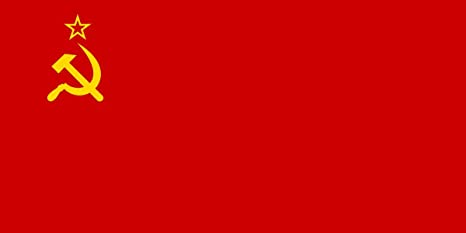
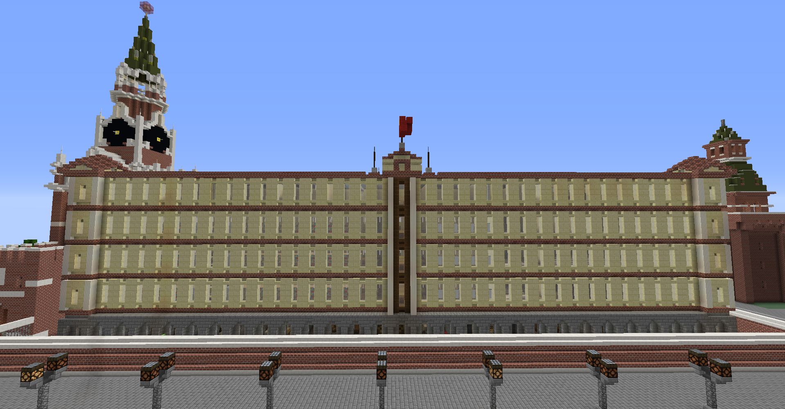
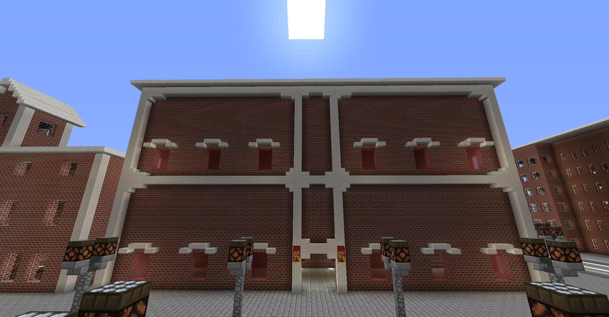

※ここに記載されてあることはほぼすべてが有効化はされないただの設定として記載させていただくものがあります  

### ソビエト社会主義共和国連邦

ソビエト社会主義共和国連邦は、TOROserver有数の軍事大国である。民主、労働、軍事を基本とした思想であり、いまだ増強し続けている。  
  
所属：なし  
主義：社会主義  
緊急事態コード:[https://d.kuku.lu/53ec8a0237](https://d.kuku.lu/53ec8a0237)

#### 政治

##### 一党民主労働制

党は永遠に共産党のみとされている。構成は主に民主、労働、軍事とされている。祖国民の信頼によりこの制度の有効性はいまだ保たれている。

##### 裁判制度

裁判は政治、軍事などに関わるもののみに行われる。判決はソビエト議会で行われた会議で決まる。ソビエト連邦は裁判は政治の最高機関が判決を言い渡すものとみなされており、この制度が有効になった以上、被告人は証拠などを提出する権限がなくなる。

##### ソビエト議会

  
ソビエト議会はソ連の最高機関であり、すべての国家決定権がこの機関にある。最高指導者（議長）、副最高指導者、軍事大臣（陸海空間大臣含む）、産業大臣、民間大臣、外交大臣、財務大臣、の計11人に構成されている。議会の決定権はすべて最高指導者にある。また、基本的に省はわかれておらず、すべてソビエト最高機関の施設に備わっている。（軍事省を除く）  
「最高指導者」  
我らがpresident\_enderが務める最高指導者は、国のすべての権限を持っている。（一党民主労働制を除く）  
「副最高指導者」  
haruto\_wastが務めている。最高指導者が国務を務められない場合に最高指導者となる。  
「軍事大臣」  
軍事関連の細かい決定権を握っており、軍需企業への依頼、交渉なども行う。  
「陸軍大臣」  
陸軍の細かい決定権を握っており、陸軍作戦の許可などを行う。  
「海軍大臣」  
陸軍大臣とほぼ同じ  
「空軍大臣」  
陸軍大臣とほぼ同じ  
「空間大臣」  
陸軍大臣とほぼ同じ  
「産業大臣」  
軍需工場を除くすべての工場、漁業、農業、企業などを管理する。また、国家の方針に合わせ、各企業に対して指示をし、調整する。  
「民間大臣」  
国民への政治状況報告文の作成、民間施設の管理を行う。また、民間の交通機関、消防、警察、病院なども管理を行う。  
「外交大臣」  
他国の外交関連についてを担当する。各国の言語を学び、講和会議などにも参加する。  
「財務大臣」  
ソ連の銀行などを管理する。また、資金がなくなったときの民間強制資金制度などの実施権をもつ。

##### ソ連国家安保委員会

これは最高指導者、副最高指導者、軍事大臣、民間大臣、外交大臣、財務大臣で構成されており、他国への戦争危機や財政赤字、そのほか国家の存亡にかかわる事態が起きた場合の緊急事態宣言を出す議会です。  
「緊急戦争宣言」  
戦争が起きる場合、起きた場合に宣言される。民間への徴兵令、軍事大規模拡大などが行われる。  
「緊急災害宣言」  
自然災害が起きた場合に民間労働などを強化するなどが行われる。  
「緊急財務宣言」  
これが発令されると、民間強制資金制度が確定的に有効となる。これは民間から資金を強制的に収集する制度である。これは人によって金額が変わる。（18歳以下の場合は無効）また、施設を強制閉鎖する可能性が高まる。  
「緊急事態宣言」  
上に含めれていないものが起きた場合に発令される。時と場合によって内容は異なる。

#### 国会

ソ連国会は、ソビエト議会員含む祖国議員等が集まり、国の在り方について協議する場だ。これも、議長の最高指導者に決定権はあり、議長に対して会議中どう説得するかがカギになる。一党民主労働制なので、当然議員は全員共産派議員である。  

#### 法律

ソビエト社会主義共和国連邦の法律。※これらはサーバーで有効化されないただの設定です。

##### ソビエト憲法

ソビエト憲法は、日本国憲法と同じような役割を果たすものです。  
「第一章 政党」  
第一条：ソ連は永遠に一党民主労働制の下で行政、生活などを行う。また、これに第五章憲法改正法は有効化されない。  
第二条：一党民主労働制は最も強い権利を持つものであり、祖国民、最高指導者を含む政治機関はこれを侵してはならない。  
「第二章 権利」  
第一条：一党民主労働制を除き、最高指導者は祖国すべての権限を持つ。  
第二条：大臣階級などは、それ専門のもののみの権限を持つ。  
第三条：ソビエト議会は、ソビエト連邦の最高政治機関であり、祖国の行政会議を行う。  
第四条：裁判は祖国の政治などにかかわる場合のみに行われ、実施された場合、判決はソビエト議会が決め、被告人は一切の権利を失う。また裁判実施権もソビエト議会にある。  
第五条：ソ連国家安保委員会の宣言は第一章第二条に反する場合以外で絶対とされている。  
第六条：一般国民は上五つの法に基づき生活を行う。従って、一般国民の権利に反する行為をしてはならない。  
第七条：一般国民は一番低い権限である。  
第八条：企業においては貴族、政治家の中から企業社長が選ばれ、その作られる企業はすべてソビエト議会が決議し、管理しなければならない。  
第九条：企業はソビエト議会で決められたもののみを行う。これをそむいてはならない。  
第十条：選ばれた社長の後継ぎは自分の息子が行わなければならない。いない場合は貴族、政治家から再選される。  
第十一条：貴族は、前世紀にできたもののみとし、その財産など引継ぎは息子が行う。いない場合はその貴族は一般国民となり、財産の4/3をソ連に給付する。  
「第三章 民間」  
第一条：18歳未満の人を除くすべての一般国民は必ず、財務省が決めた一定量の金額給付で働かなくてはならない。  
第二条：一般国民は政治に参加、反発してはならない。  
第三条：一般国民は一人一人が監視下に置かなければならない。  
第四条：一般国民はそのほかソビエト議会のいかなる命令にも従わなければならない。（一党民主労働制をそむく令を除く）  
第五条：一般国民は民間省からきた命令で、職業、在宅場所などが決まる。その命令にそむいてはならない。  
「第四章　軍事」  
第一条：軍事は、祖国を物理的に防衛、もしくは他国を攻撃するために作られた機関である。  
第二条：兵は基本的に一般国民希望制となっている。  
第三条：軍拡や緊急戦争宣言が発令された場合など、人的資源が必要な場合は第四章第二条は無効化され、強制的に徴兵させることが可能になる。  
第四条：軍事拡大は、すべてソビエト議会が決めるものとする。  
「第五章　憲法」  
第一条：憲法改正案は、すべてソビエト議会員が提出し否決するものとする。  
第二条：一般国民、貴族、政治家すべての祖国国民において、憲法は従わなければならない。  
第三条：一党民主労働制を侵す憲法を作ってはならない。  
「第六章　他」  
第一条：そのほかの記載されていない憲法を違反したとしても、それは政治、一党民主労働制などを侵す行為とする。

### 歴史

ソビエト社会主義共和国連邦ができる前、できた後についての歴史（時系列）  

| 鯖歴 | 国家名 | 時代・出来事の名前（ソビエト内） | 統治者（皇帝等） | 内容 |
| --- | --- | --- | --- | --- |
| 鯖歴 -7世紀 | なし（トロシア民族） | トロシア移民 | なし | 今の十呂大陸から新天地を求め北へ向い、今のソビエト連邦の地に行きついた。 |
| 同世紀 | なし（ロッシァー村） | トロシア開拓時代 | なし | 今のソビエト連邦の場所にロッシァー村ができる。（ロッシァー開拓時代 |
| 鯖歴 -6世紀 | なし（ロッシァー村） | 異民族対立時代 | なし | 異民族によるロッシァー村付近の開拓がはじまる。 |
| 同世紀 | なし（ロッシァー村） | 異民族対立時代 | なし | 両族間での領土、食料による対立がおこる。 |
| 同世紀 | なし（ロッシァー村） | ロッシァー戦争 | なし | 両族間で戦争が起こる。 |
| 同世紀 | なし（ロッシァー村） | トロツキア勝利 | なし | ロッシァー族が勝利する。 |
| 同世紀 | なし（ロッシァー村） | ロッシァー統治 | トロツキア | ロッシァー族が勝利により、その戦争の英雄であるトロツキアが村長となる。 |
| 鯖歴 -5世紀 | なし（ロッシァー村） | トロシア大開拓時代 | トロツキア | 次の異民族が来ることを恐れ早急に領土を拡大、急成長を遂げる。 |
| 同世紀 | なし（ロッシァー村 | トロツキア死去 | トロツキア | トロツキアが病死する。その後息子（トロツキア1世）が村を統治する。 |
| 同世紀 | トロシア国 | ソヴィエティアン宣言 | トロツキア1世 | トロシアは国単位に発展を遂げ、トロツキア1世がトロシア国建国を宣言する。 |
| 鯖歴 -4世紀 | トロシア帝国 | 民主帝国化 | トロツキア3世 | トロツキア3世はさらなる領土拡大を目指すため、民主主義帝国を建国する。そしてトロツキア3世は皇帝となる。 |
| 鯖歴 同世紀〜-2世紀 | トロシア帝国 | トロシア帝国時代 | トロツキア3世 | トロシア帝国は民衆の支持により絶大な発展を遂げる。 |
| 鯖歴 -2世紀 | トロシア帝国 | トロシア帝国末期 | トロツキア6世 | 国家の現代化を目指すため、政権を皇帝から中央議会へ移す。 |
| 鯖歴 -1世紀 | トロシア帝国 | トロシア帝国末期 | トロツキア8世 | 今のソ連の党の祖先であるトロシア共産党が発足する。 |
| 鯖歴 -43年 | トロシア帝国 | トロシア帝国末期 | トロツキア9世 | トロシア革命の指導者であり、ソ連第一代最高指導者であるpresident\_ender氏が生まれる。（父は共産党大臣） |
| 鯖歴 -16年 | トロシア帝国 | トロシア帝国末期 | トロツキア9世 | president\_ender氏は27歳という若さで共産党議員となる。 |
| 鯖歴 -11年 | トロシア帝国 | トロシア帝国末期 | トロツキア9世 | president\_ender氏がトロシア共産党大臣となる。 |
| 鯖歴 -7年 | トロシア帝国 | トロシア帝国末期 | トロツキア9世 | トロシア共産党の政策により徐々に支持率が高まる。 |
| 同年 | トロシア帝国 | トロシア帝国末期 | トロツキア9世 | 民主党の支持が下がり、不満を持つ国民が次々に共産党派になる。 |
| 鯖歴 -3年 | トロシア帝国 | 九世暗殺事件 | トロツキア9世 | トロツキア9世がpresident氏の指示により暗殺される。 |
| 同年 | トロシア帝国・トロシア共産派 | トロシア革命 | なし | トロシア共産派による内戦がおこる。指導者はpresident氏。 |
| 同年 | トロシア帝国・トロシア共産派 | 共産党革命 | president最高指導者 | 見事共産派が勝利する。 |
| 同年 | トロシア連邦 | トロシア宣言 | president最高指導者 | トロシア社会主義共和国連邦が建国される。 |
| 同年 | トロシア連邦 | クレムリン建設 | president最高指導者 | 建国記念としてクレムリンが建てられる。 |
| 鯖歴 -2年 | トロシア連邦 | 副書記長就任 | president最高指導者 | haruto氏が副最高指導者に就任。 |
| 同年 | トロシア連邦 | 省庁建設 | president最高指導者 | 9つの省庁ができる。 |
| 同年 | トロシア連邦 | 国家方針決定 | president最高指導者 | 軍事拡大という明確な国家方針が決まる。 |
| 同年 | トロシア連邦 | トロシア政策 | president最高指導者 | そのほか、国を成り立たせる政策を行う。 |
| 鯖歴元年 | ソビエト連邦 | コミューン宣言 | president最高指導者 | トロシア共産党から一党民主労働党へ党名を変更。同時にトロシア社会主義共和国連邦からソビエト社会主義共和国連邦へ国名を変更（由来は-5世紀のトロシア国建国宣言名、ソヴィエティアン宣言から） |
| 同年 | ソビエト連邦 | 憲法大改正 | president最高指導者 | 憲法を大幅に改正、一党民主労働党以外の思想を持つ国民、議員を禁止とする。 |
| 鯖歴1年 | ソビエト連邦 | 革命危機 | president最高指導者 | 民主派、独裁派、中道派により国が不安定になる。 |
| 同年 | ソビエト連邦 | 第一次大粛清 | president最高指導者 | 最高指導者による与党以外の人間に対する粛清を開始。 |
| 同年 | ソビエト連邦 | 第二次大粛清 | president最高指導者 | 続いて第二次大粛清を開始。 |
| 同年 | ソビエト連邦 | 民間大臣事件 | president最高指導者 | ウィルムトゥフ民間大臣が暗殺される。 |
| 同年 | ソビエト連邦 | 軍事大臣暗殺未遂事件 | president最高指導者 | 軍事大臣が暗殺未遂にあう。 |
| 鯖歴3年 | ソビエト連邦 | 軍事統合 | president最高指導者 | さらなる軍事拡大のため大日本帝国軍と軍を統合、ソビエト日本帝国軍を発足。 |
| 同年 | ソビエト連邦 | 次元研究プロジェクト | president最高指導者 | 次元に関する研究が開始される。 |
| 同年 | ソビエト連邦 | 大和事件 | president最高指導者 | 別次元から来たと思われる大和が発見される。 |
| 同年 | ソビエト連邦 | 第一次鯖大戦 | president最高指導者 | 第一次鯖大戦が勃発。 |
| 同年 | ソビエト連邦 | プソ休戦宣言 | president最高指導者 | 第一次鯖大戦が休戦する、 |
| 同年 | ソビエト連邦 | 空間進出 | president最高指導者 | 空間軍が発足。 |
| 同年 | ソビエト連邦 | 国連加盟宣言 | president最高指導者 | ソ連が国際連合に加盟。 |
| 同年 | ソビエト連邦 | 世界遺産登録 | president最高指導者 | クレムリン時計塔、大和要塞が世界遺産に登録。 |
